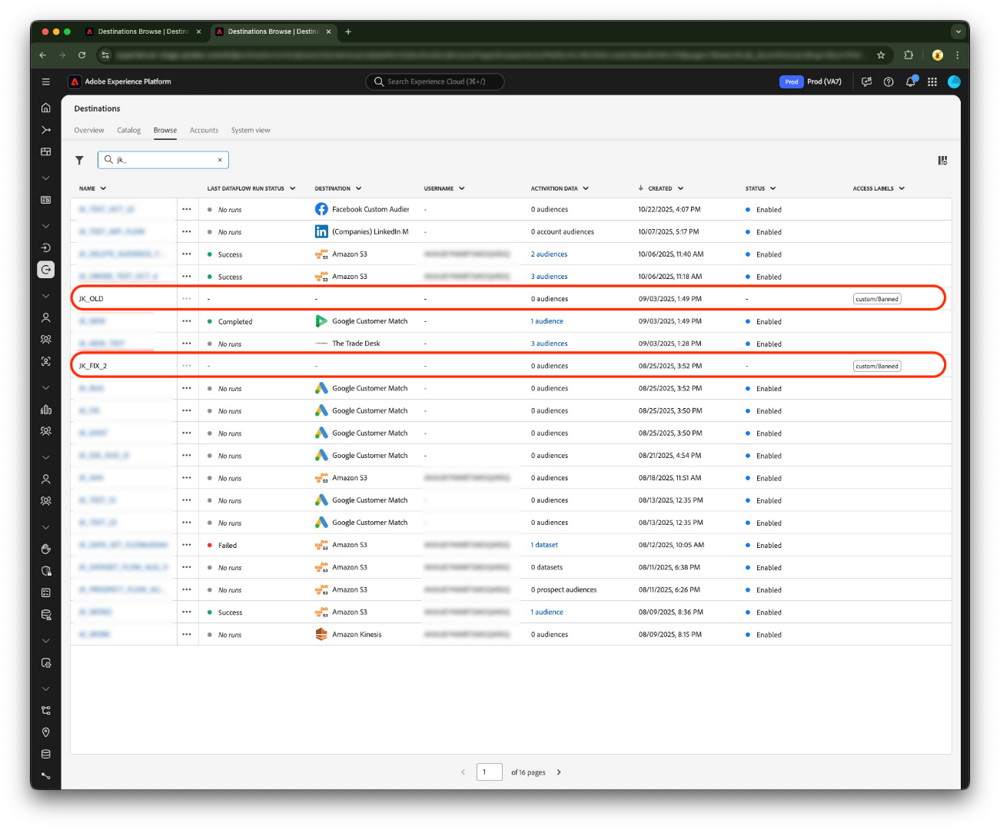

# アクセスラベルを使用した宛先データフローへのユーザーアクセスの管理

Real-Time CDPの [[!UICONTROL attribute-based access control]](overview.md) 機能の一部として、[ 宛先データフロー ](../../dataflows/ui/monitor-destinations.md) にアクセスラベルを適用できるようになりました。 この方法により、組織内のユーザーのサブセットのみが特定の宛先データフローにアクセスできるようになります。

アクセスラベルを特定の宛先に追加すると、そのラベルが割り当てられている役割へのアクセス権を持つユーザーのみが、その宛先データフローを表示および編集できます。 宛先データフローがラベルでマークされていない場合、組織に属するすべてのユーザーに表示されます。

このページでは、サンプルのユースケース、宛先データフローにアクセスラベルを適用する前の前提条件、この機能を使用する際のその他の重要な引き出しについて説明します。

## 前提条件 {#prerequisites}

この機能の使用を開始する前に、完了すべき次の前提条件に注意してください。 [!UICONTROL attribute-based access control] について理解を深めるために、Adobeでは次の記事も読むことをお勧めします。

* [属性ベースのアクセス制御の概要](/help/access-control/abac/overview.md)
* [属性ベースのアクセス制御エンドツーエンドガイド](/help/access-control/abac/end-to-end-guide.md)

### 権限 UI へのアクセス {#access-permissions-ui}

[!UICONTROL Permissions] は、管理者がユーザーロールとポリシーを定義して、製品アプリケーション内の機能とオブジェクトの権限を管理できる、Experience Cloudの領域です。 開始するには、[ 権限の節 ](/help/access-control/abac/end-to-end-guide.md#permissions) を参照してください。

### 役割、ラベルの作成、ユーザーの割り当て {#create-roles-labels-assign-users}

[!UICONTROL permissions] UI へのアクセス権を取得したら、ユーザーまたはチームのメンバーは、役割を設定し、それらの役割に必要なラベルを追加する必要があります。 最後に、特定のラベルでラベル付けされたリソースにアクセスする必要があるユーザーを役割に追加する必要があります。 以下のドキュメントの節を参照してください。

* [新しい役割の作成](/help/access-control/abac/ui/roles.md)
* [役割へのラベルの追加](/help/access-control/abac/end-to-end-guide.md#label-roles)
* [役割にユーザーを追加](/help/access-control/ui/users.md)

### 宛先データフローの作成 {#create-dataflow}

データフローにアクセスラベルを適用するには、まず目的の宛先に接続し、データを書き出すデータフローを作成する必要があります。

[ 宛先への接続 ](/help/destinations/ui/connect-destination.md) および [ 宛先へのデータのアクティベート ](/help/destinations/ui/activation-overview.md) に関するガイドを参照してください。 次に、[ 使用可能なコネクタのカタログ ](/help/destinations/catalog/overview.md) から目的の宛先を選択します。

## 既に使用可能です：他のExperience Platform リソースにアクセスラベルを適用してください {#apply-labels-other-resources}

このリリースでは、ユーザーに対して特定の宛先データフローへのオブジェクトレベルのアクセス権を付与できますが、オブジェクトレベルでアクセス制御を付与する機能は、[audiences](/help/access-control/abac/end-to-end-guide.md#apply-labels-to-segments) など、他のExperience Platform リソースで既に一般公開されています。

## 使用例 {#use-case-example}

宛先に対するオブジェクトレベルのアクセス制御を使用して、マーケターの特定のチームが特定の宛先にのみアクセスできるように制限します。 例えば、組織が米国と英国などの複数の地理的な場所に顧客データを持っている場合、マーケティングチームが米国の場所のみのデータフローを表示および編集するように制限し、別のマーケティングチームが英国の場所のデータフローを表示および編集するように制限できます。

## 宛先データフローへのアクセスラベルの適用 {#apply-labels-to-destination-dataflow}

特定のデータフローにアクセスラベルを適用するには：

1. **[!UICONTROL Destinations]**/**[!UICONTROL Browse]** に移動し、ユーザーアクセスを制限する宛先データフローを見つけます。
1. `...` 列の省略記号（[!UICONTROL Name]）を選択し、**[!UICONTROL Apply access labels]** コントロールを使用して、新しいラベルを追加し、データフローの既存のラベルを管理します。
   
1. 宛先データフローに追加するラベルを選択し、「**[!UICONTROL Save]**」を選択します。
   
1. データフローに、UI にアクセスラベルが表示されていることに注意してください。
   

宛先データフローがラベルでマークされていない場合は、すべてのユーザーに対して表示されます。 データフローが 1 つ以上のアクセスラベルでマークされている場合、そのデータフローは、同じラベルまたはラベルの組み合わせを持つ役割に属するユーザーに対してのみ表示されます。

宛先データフローには、標準ラベルとカスタムラベルを追加できます。 宛先データフローにラベルを追加した後、次の操作を行います。

* 同じラベルへのアクセス権を持つ役割に割り当てられたユーザーは、UI で新しいラベルを持つデータフローを表示できます。 宛先データフローは、ユーザーインターフェイスまたは API を使用して表示および編集できます。

* 同じラベルへのアクセス権を持つ役割に割り当てられている *割り当てられていない* ユーザーは、ユーザーインターフェイスまたは API を介して表示または編集する宛先データフローにアクセスできません。

## 重要なコールアウトと知っておくべき項目 {#important-callouts}

* 現在、アクセスラベルを適用できるのは既存のデータフローのみです。 つまり、アクセスラベルを適用する前に、宛先へのデータフローを作成する必要があります。
* アクセスラベルにアクセスできない場合、宛先データフローにアクセスラベルを適用することはできません。
* 宛先データフローに複数のラベルを追加する場合、データフローを表示および編集できるユーザーは、少なくとも同じラベルの組み合わせで役割に追加される必要があります。 例えば、ラベル C1、I2、別のカスタムラベルを宛先データフローに適用する場合、これら 3 つのラベルの組み合わせにアクセスできる役割に追加されたユーザーのみが、この特定の宛先データフローを表示および編集できます。
* ラベル設定へのアクセスが原因でユーザーがアクセス権を持たない宛先データフローは、UI にグレー表示になる場合があります。ユーザーはこれらのデータフローに対してアクションを実行できません。

>[!NOTE]
>
> Experience Platform ユーザーインターフェイスの上部にある検索ボックスを使用して宛先データフローを検索する場合、結果には、ユーザーアクセスラベルが表示を制限する宛先データフローが含まれる場合があります。 この動作は、今後のアップデートで修正される予定です。

## 次の手順 {#next-steps}

このドキュメントの手順に従うことで、組織のユーザーのサブセットのみが特定の宛先データフローにアクセスできるように、宛先データフローにアクセスラベルを適用する方法を理解できました。

次に、宛先に対してデータをアクティブ化する際に、[!UICONTROL attribute-based access control] でサポートされる他の機能について詳しく説明します。 例えば、ユーザーのアクセスを [ 特定のフィールドのみを表示およびアクティブ化 ](/help/access-control/abac/overview.md#destinations) に制限できます。
