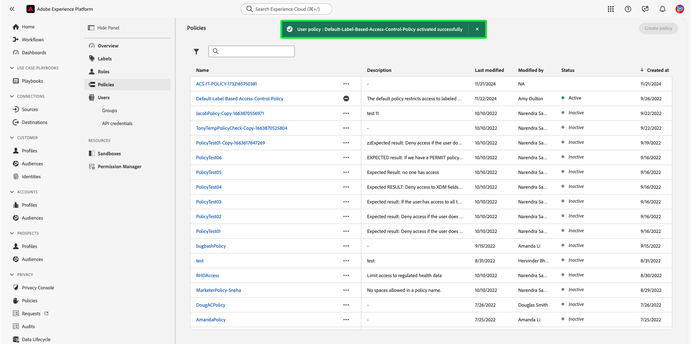

# 属性ベースのアクセス制御エンドツーエンドガイド

属性ベースのアクセス制御は、Adobe Experience Platformの機能で、マルチブランドやプライバシーを意識するお客様が、ユーザーアクセスを柔軟に管理できるようにします。 スキーマフィールドやセグメントなどの個々のオブジェクトへのアクセスは、オブジェクトの属性と役割に基づくポリシーを使用して許可/拒否できます。 この機能を使用すると、組織内の特定の Platform ユーザーに対する個々のオブジェクトへのアクセスを許可または取り消すことができます。

この機能を使用すると、スキーマフィールドやセグメントなどを、組織やデータの使用範囲を定義するラベルで分類できます。 これらの同じラベルを、Adobe Journey Optimizerのジャーニー、オファー、その他のオブジェクトに適用できます。 同時に、管理者は、Experience Data Model(XDM) スキーマフィールドに関するアクセスポリシーを定義し、それらのフィールドにアクセスできるユーザーやグループ（内部、外部、サードパーティのユーザー）をより詳細に管理できます。

>[!NOTE]
>
>このドキュメントでは、アクセス制御ポリシーの使用例に焦点を当てます。 を制御するポリシーを設定する場合は、 **use** を参照してください。 [データガバナンス](../../data-governance/e2e.md) 代わりに、

## はじめに

このチュートリアルでは、次の Platform コンポーネントに関する十分な知識が必要です。

* [[!DNL Experience Data Model (XDM)] システム](../../xdm/home.md)：Experience Platform が顧客体験データの整理に使用する標準化されたフレームワーク。
   * [スキーマ構成の基本](../../xdm/schema/composition.md)：スキーマ構成の主要な原則やベストプラクティスなど、XDM スキーマの基本的な構成要素について学びます。
   * [スキーマエディターのチュートリアル](../../xdm/tutorials/create-schema-ui.md)：スキーマエディター UI を使用してカスタムスキーマを作成する方法を説明します。
* [Adobe Experience Platform セグメント化サービス](../../segmentation/home.md)：[!DNL Platform] 内のセグメント化エンジンで、顧客の行動と属性に基づいて顧客プロファイルからオーディエンスセグメントを作成するのに使用されます。

### 使用例の概要

属性ベースのアクセス制御ワークフローの例を使用して、ロール、ラベル、ポリシーを作成および割り当て、ユーザーが組織内の特定のリソースにアクセスできるかどうかを設定します。 このガイドでは、機密データへのアクセスを制限する例を使用して、ワークフローを示します。 この使用例を次に示します。

医療機関であり、組織内のリソースへのアクセスを設定する場合。

* 社内のマーケティングチームが **[!UICONTROL PHI/規制対象の健康データ]** データ。
* 外部の代理店がにアクセスできない **[!UICONTROL PHI/規制対象の健康データ]** データ。

これをおこなうには、役割、リソース、ポリシーを設定する必要があります。

以下をおこないます。

* [ユーザーの役割のラベル付け](#label-roles):外部の代理店と連携するマーケティンググループを持つ医療プロバイダー（ACME ビジネスグループ）の例を使用します。
* [リソース（スキーマフィールドとセグメント）のラベル付け](#label-resources):を **[!UICONTROL PHI/規制対象の健康データ]** スキーマのリソースおよびセグメントに対するラベル
* 
   * [リンクするポリシーをアクティブ化します。 ](#policy):デフォルトのポリシーを有効にして、リソースのラベルを役割のラベルに接続することで、スキーマフィールドやセグメントにアクセスできないようにします。 一致するラベルを持つユーザーは、すべてのサンドボックスのスキーマフィールドとセグメントにアクセスできます。

## 権限

[!UICONTROL 権限] は、管理者がExperience Cloudの領域で、製品アプリケーション内の機能とオブジェクトに対する権限を管理するためのユーザーの役割とポリシーを定義できます。

～ [!UICONTROL 権限]を使用すると、役割を作成および管理し、これらの役割に対する必要なリソース権限を割り当てることができます。 [!UICONTROL また、権限では、特定の役割に関連付けられたラベル、サンドボックス、ユーザーを管理することもできます。]

管理者権限がない場合は、システム管理者に問い合わせてアクセス権を取得してください。

管理者権限を取得したら、に移動します。 [Adobe Experience Cloud](https://experience.adobe.com/) にログインし、Adobeの資格情報を使用してログインします。 ログイン後、 **[!UICONTROL 概要]** ページが表示されます。 このページには、組織が購読している製品と、組織にユーザーおよび管理者を追加するためのその他のコントロールが表示されます。 選択 **[!UICONTROL 権限]** をクリックして、Platform 統合用のワークスペースを開きます。

Platform UI の権限ワークスペースが表示され、 **[!UICONTROL 役割]** ページ。

## ロールへのラベルの適用 {#label-roles}

>[!CONTEXTUALHELP]
>id="platform_permissions_labels_about"
>title="ラベルとは"
>abstract="ラベルを使用すると、データに適用される使用ポリシーに従ってデータセットとフィールドを分類できます。Platform には、アドビ定義の「コア」データ使用状況ラベルがいくつか用意されています。これらは、データガバナンスに適用できる様々な一般的制限に対応しています。例えば、RHD（規制医療データ）などの機密ラベルを意味する「S」ラベルを使用すると、保護された医療情報（PHI）を参照するデータを分類できます。また、組織のニーズに合わせて独自のカスタムラベルを定義することもできます。"
>additional-url="https://experienceleague.adobe.com/docs/experience-platform/data-governance/labels/overview.html?lang=ja#understanding-data-usage-labels" text="データ使用ラベルの概要"

>[!CONTEXTUALHELP]
>id="platform_permissions_labels_about_create"
>title="新しいラベルの作成"
>abstract="組織のニーズに合わせて独自のカスタムラベルを作成できます。カスタムラベルを使用して、データガバナンスとアクセス制御の両方の設定をデータに適用することができます。"
>additional-url="https://experienceleague.adobe.com/docs/experience-platform/data-governance/labels/overview.html?lang=ja#manage-labels" text="カスタムラベルの管理"

>[!CONTEXTUALHELP]
>id="platform_permissions_roles_about"
>title="役割とは"
>abstract="役割は、Platform インスタンスとやり取りするユーザーのタイプを分類する方法で、アクセス制御ポリシーの構成要素です。 役割には特定の権限セットがあり、必要な表示または書き込みアクセスの範囲に応じて、組織のメンバーを 1 つ以上の役割に割り当てることができます。"
>additional-url="https://experienceleague.adobe.com/docs/experience-platform/access-control/abac/permissions-ui/roles.html?lang=ja" text="役割の管理"

>[!CONTEXTUALHELP]
>id="platform_permissions_roles_about_create"
>title="新しい役割の作成"
>abstract="新しい役割を作成して、お使いの Platform インスタンスにアクセスするユーザーをより適切に分類することができます。例えば、社内マーケティングチームの役割を作成し、その役割に RHD ラベルを適用して、社内マーケティングチームが保護された医療情報（PHI）にアクセスできるようにすることができます。または、外部エージェンシーの役割を作成したうえで、その役割に RHD ラベルを適用しないことにより、その役割の PHI データへのアクセスを拒否することもできます。"
>additional-url="https://experienceleague.adobe.com/docs/experience-platform/access-control/abac/permissions-ui/roles.html?lang=ja#create-a-new-role" text="新しい役割の作成"

>[!CONTEXTUALHELP]
>id="platform_permissions_roles_details"
>title="役割の概要"
>abstract="役割の概要ダイアログには、特定の役割がアクセスできるリソースとサンドボックスが表示されます。"

役割は、Platform インスタンスとやり取りするユーザーのタイプを分類する方法で、アクセス制御ポリシーの構成要素です。 ロールには特定の権限セットがあり、組織のメンバーは、必要なアクセス範囲に応じて、1 つ以上のロールに割り当てることができます。

利用を開始するには、「 **[!UICONTROL ACME ビジネスグループ]** から **[!UICONTROL 役割]** ページ。

次に、 **[!UICONTROL ラベル]** 次に、 **[!UICONTROL ラベルを追加]**.

組織内のすべてのラベルのリストが表示されます。 選択 **[!UICONTROL RHD]** ラベルを追加するには **[!UICONTROL PHI/規制対象の健康データ]**. ラベルの横に青いチェックマークが表示されるまでしばらく待ってから、を選択します。 **[!UICONTROL 保存]**.

>[!NOTE]
>
>組織グループを役割に追加する場合、そのグループ内のすべてのユーザーが役割に追加されます。 組織グループに対する変更（削除または追加されたユーザー）は、ロール内で自動的に更新されます。

## スキーマフィールドへのラベルの適用 {#label-resources}

これで、 [!UICONTROL RHD] ラベルを設定する場合は、次に、そのロールに対して制御するリソースに同じラベルを追加します。

選択 **[!UICONTROL スキーマ]** 左のナビゲーションから、 **[!UICONTROL ACME Healthcare]** 表示されるスキーマのリストから。

次に、 **[!UICONTROL ラベル]** をクリックすると、スキーマに関連付けられたフィールドを表示するリストが表示されます。 ここから、1 つまたは複数のフィールドに一度にラベルを割り当てることができます。 を選択します。 **[!UICONTROL 血糖]** および **[!UICONTROL InsulinLevel]** フィールドを選択し、 **[!UICONTROL アクセスおよびデータガバナンスラベルの適用]**.

この **[!UICONTROL ラベルを編集]** ダイアログが表示され、スキーマフィールドに適用するラベルを選択できます。 この使用例では、 **[!UICONTROL PHI/規制対象の健康データ]** ラベルを選択し、「 **[!UICONTROL 保存]**.

>[!NOTE]
>
>フィールドにラベルを追加すると、そのラベルがそのフィールドの親リソース（クラスまたはフィールドグループ）に適用されます。 親クラスまたはフィールドグループが他のスキーマで使用されている場合、これらのスキーマは同じラベルを継承します。

## セグメントへのラベルの適用

スキーマフィールドのラベル付けが完了したら、セグメントのラベル付けを開始できます。

選択 **[!UICONTROL セグメント]** をクリックします。 組織で使用可能なセグメントのリストが表示されます。 この例では、次の 2 つのセグメントに、機密性の高いヘルスデータが含まれるので、ラベルが付けられます。

* 血糖 > 100
* インスリン &lt;50

選択 **[!UICONTROL 血糖 > 100]** をクリックして、セグメントのラベル付けを開始します。

![[ セグメント ] タブから選択された血糖値が 100 を超えている画像](../images/abac-end-to-end-user-guide/abac-select-segment.png)

セグメント **[!UICONTROL 詳細]** 画面が表示されます。 選択 **[!UICONTROL アクセスを管理]**.

この **[!UICONTROL ラベルを編集]** ダイアログが表示され、セグメントに適用するラベルを選択できます。 この使用例では、 **[!UICONTROL PHI/規制対象の健康データ]** ラベルを選択し、「 **[!UICONTROL 保存]**.

上記の手順を **[!UICONTROL インスリン &lt;50]**.

## アクセス制御ポリシーを有効にする {#policy}

デフォルトのアクセス制御ポリシーでは、ラベルを使用して、特定の Platform リソースに対するアクセス権を持つユーザーロールを定義します。 この例では、スキーマフィールドに対応するラベルを持つ役割を持たないユーザーの場合、すべてのサンドボックスで、スキーマフィールドとセグメントへのアクセスが拒否されます。

アクセス制御ポリシーを有効にするには、 [!UICONTROL 権限] 左のナビゲーションから、 **[!UICONTROL ポリシー]**.

次に、省略記号 (`...`) をクリックします。ドロップダウンに、役割を編集、アクティブ化、削除または複製するためのコントロールが表示されます。 選択 **[!UICONTROL 有効化]** をドロップダウンから選択します。

ポリシーのアクティベートダイアログが表示され、アクティベートを確認するプロンプトが表示されます。 選択 **[!UICONTROL 確認]**.

ポリシーのアクティベーションの確認を受け取り、 [!UICONTROL ポリシー] ページ。

<!-- ## Create an access control policy {#policy}

>[!CONTEXTUALHELP]
>id="platform_permissions_policies_about"
>title="What are policies?"
>abstract="Policies are statements that bring attributes together to establish permissible and impermissible actions. Every organization comes with a default policy that you must activate to define rules for resources like segments and schema fields. Default policies can neither be edited nor deleted. However, default policies can be activated or deactivated."
>additional-url="https://experienceleague.adobe.com/docs/experience-platform/access-control/abac/permissions-ui/policies.html?lang=en" text="Manage policies"

>[!CONTEXTUALHELP]
>id="platform_permissions_policies_about_create"
>title="Create a policy"
>abstract="Create a policy to define the actions that your users can and cannot take against your segments and schema fields."
>additional-url="https://experienceleague.adobe.com/docs/experience-platform/access-control/abac/permissions-ui/policies.html?lang=en#create-a-new-policy" text="Create a policy"

>[!CONTEXTUALHELP]
>id="platform_permissions_policies_edit_permitdeny"
>title="Configure permissible and impermissible actions for a policy"
>abstract="A <b>deny access to</b> policy will deny users access when the criteria is met. Combined with <b>The following being false</b> - all users will be denied access unless they meet the matching criteria set. This type of policy allows you to protect a sensitive resource and only allow access to users with matching labels.  A <b>permit access to</b> policy will permit users access when the criteria are met. When combined with <b>The following being true</b> - users will be given access if they meet the matching criteria set. This does not explicitly deny access to users, but adds a permit access. This type of policy allows you to give additional access to resource and in addition to those users who might already have access through role permissions." 
>additional-url="https://experienceleague.adobe.com/docs/experience-platform/access-control/abac/permissions-ui/policies.html?lang=en#edit-a-policy" text="Edit a policy"

>[!CONTEXTUALHELP]
>id="platform_permissions_policies_edit_resource"
>title="Configure permissions for a resource"
>abstract="A resource is the asset or object that a user can or cannot access. Resources can be segments or schemas fields. You can configure write, read, or delete permissions for segments and schema fields."

>[!CONTEXTUALHELP]
>id="platform_permissions_policies_edit_condition"
>title="Edit conditions"
>abstract="Apply conditional statements to your policy to configure user access to certain resources. Select match all to require users to have roles with the same labels as a resource to be permitted access. Select match any to require users to have a role with just one label matching a label on a resource. Labels can either be defined as core or custom labels, with core labels representing labels created and provided by Adobe and custom labels representing labels that you created for your organization."

Access control policies leverage labels to define which user roles have access to specific Platform resources. Policies can either be local or global and can override other policies. In this example, access to schema fields and segments will be denied in all sandboxes for users who don't have the corresponding labels in the schema field.

>[!NOTE]
>
>A "deny policy" is created to grant access to sensitive resources because the role grants permission to the subjects. The written policy in this example **denies** you access if you are missing the required labels.

To create an access control policy, select **[!UICONTROL Permissions]** from the left navigation and then select **[!UICONTROL Policies]**. Next, select **[!UICONTROL Create policy]**.

The **[!UICONTROL Create new policy]** dialog appears, prompting you to enter a name and an optional description. Select **[!UICONTROL Confirm]** when finished.

To deny access to the schema fields, use the dropdown arrow and select **[!UICONTROL Deny access to]** and then select **[!UICONTROL No resource selected]**. Next, select **[!UICONTROL Schema Field]** and then select **[!UICONTROL All]**.

The table below shows the conditions available when creating a policy:

| Conditions | Description |
| --- | --- |
| The following being false| When 'Deny access to' is set, access will be restricted if the user does not meet the criteria selected. |
| The following being true| When 'Permit access to' is set, access will be permitted if the user meets the selected criteria. |
| Matches any| The user has a label that matches any label applied to a resource. |
| Matches all| The user has all labels that matches all labels applied to a resource. |
| Core label| A core label is an Adobe-defined label that is available in all Platform instances.|
| Custom label| A custom label is a label that has been created by your organization.|

Select **[!UICONTROL The following being false]** and then select **[!UICONTROL No attribute selected]**. Next, select the user **[!UICONTROL Core label]**, then select **[!UICONTROL Matches all]**. Select the resource **[!UICONTROL Core label]** and finally select **[!UICONTROL Add resource]**.

>[!TIP]
>
>A resource is the asset or object that a subject can or cannot access. Resources can be segments or schemas.

To deny access to the segments, use the dropdown arrow and select **[!UICONTROL Deny access to]** and then select **[!UICONTROL No resource selected]**. Next, select **[!UICONTROL Segment]** and then select **[!UICONTROL All]**.

Select **[!UICONTROL The following being false]** and then select **[!UICONTROL No attribute selected]**. Next, select the user **[!UICONTROL Core label]**, then select **[!UICONTROL Matches all]**. Select the resource **[!UICONTROL Core label]** and finally select **[!UICONTROL Save]**.

Select **[!UICONTROL Activate]** to activate the policy, and a dialog appears which prompts you to confirm activation. Select **[!UICONTROL Confirm]** and then select **[!UICONTROL Close]**.

 -->

## 次の手順

ロール、スキーマフィールド、セグメントへのラベルの適用が完了している。 これらの役割に割り当てられた外部エージェントでは、スキーマ、データセット、プロファイル表示で、これらのラベルとその値の表示が制限されます。 また、セグメントビルダーを使用する際、これらのフィールドは、セグメント定義で使用できません。

属性ベースのアクセス制御の詳細については、[属性ベースのアクセス制御の概要](./overview.md)を参照してください。
