# 属性ベースのアクセス制御エンドツーエンドガイド

Adobe Experience Platformでは、属性ベースのアクセス制御を使用して、自社やマルチブランドのプライバシーを重視する顧客に、ユーザーアクセスをより柔軟に管理してもらうことができます。 スキーマフィールドやオーディエンスなどの個々のオブジェクトへのアクセスは、オブジェクトの属性と役割に基づくポリシーで付与できます。 この機能を使用すると、組織内の特定のExperience Platform ユーザーに対する個々のオブジェクトへのアクセス権を付与または取り消すことができます。

この機能により、組織またはデータの使用範囲を定義するラベルを使用して、スキーマフィールドやオーディエンスなどを分類できます。 Adobe Journey Optimizerのジャーニー、オファー、その他のオブジェクトに同じラベルを適用できます。 また、管理者は、Experience Data Model （XDM）スキーマフィールドに関するアクセスポリシーを定義し、それらのフィールドにアクセスできるユーザーまたはグループ（内部、外部、サードパーティユーザー）をより適切に管理できます。

>[!NOTE]
>
>このドキュメントでは、アクセス制御ポリシーの使用例に焦点を当てます。 どのExperience Platform ユーザーがアクセス権を持つかではなく、データの&#x200B;**use**&#x200B;を管理するポリシーを設定する場合は、代わりに[data governance](../../data-governance/e2e.md)に関するエンドツーエンドのガイドを参照してください。

## はじめに

このチュートリアルでは、次のExperience Platform コンポーネントについて理解する必要があります。

* [[!DNL Experience Data Model (XDM)] システム](../../xdm/home.md)：Experience Platform が顧客体験データの整理に使用する標準化されたフレームワーク。
   * [スキーマ構成の基本](../../xdm/schema/composition.md)：スキーマ構成の主要な原則やベストプラクティスなど、XDM スキーマの基本的な構成要素について学びます。
   * [スキーマエディターのチュートリアル](../../xdm/tutorials/create-schema-ui.md)：スキーマエディター UI を使用してカスタムスキーマを作成する方法を説明します。
* [Adobe Experience Platform セグメント化サービス](../../segmentation/home.md)：[!DNL Experience Platform] 内のセグメント化エンジンで、顧客の行動と属性に基づいて顧客プロファイルからオーディエンスセグメントを作成するのに使用されます。

### ユースケースの概要

属性ベースのアクセス制御ワークフローの例では、役割、ラベル、ポリシーを作成して割り当て、ユーザーが組織内の特定のリソースにアクセスできるかどうかを設定します。 このガイドでは、機密データへのアクセス制限の例を使用して、ワークフローを示します。 そのユースケースの概要を以下に示します。

ヘルスケアプロバイダーは、組織内のリソースへのアクセスを設定する必要があります。

* 社内のマーケティング チームが&#x200B;**[!UICONTROL PHI/ Regulated Health Data]** データにアクセスできる必要があります。
* 外部代理店は&#x200B;**[!UICONTROL PHI/ Regulated Health Data]** データにアクセスできません。

これを行うには、役割、リソース、ポリシーを設定する必要があります。

次のことをおこないます。

* [ ユーザーの役割にラベルを付ける](#label-roles): マーケティンググループが外部代理店と連携するヘルスケアプロバイダー（ACME ビジネスグループ）の例を使用します。
* [ リソースにラベルを付ける（スキーマフィールドとオーディエンス） ](#label-resources): **[!UICONTROL PHI/ Regulated Health Data]** ラベルをスキーマリソースとオーディエンスに割り当てます。
* [それらをリンクするポリシーをアクティブ化します](#policy): リソースのラベルを役割のラベルに接続することで、スキーマフィールドとオーディエンスへのアクセスを禁止するデフォルトのポリシーを有効にします。 その後、一致するラベルを持つユーザーには、すべてのサンドボックスをまたいでスキーマフィールドとセグメントへのアクセス権が与えられます。

## 権限

[!UICONTROL Permissions]は、管理者が製品アプリケーション内の機能とオブジェクトに対する権限を管理するためのユーザーの役割とポリシーを定義できるExperience Cloudの領域です。

[!UICONTROL Permissions]を通じて、役割を作成および管理し、これらの役割に必要なリソース権限を割り当てることができます。 [!UICONTROL Permissions]では、特定の役割に関連付けられているラベル、サンドボックス、ユーザーを管理することもできます。

管理者権限がない場合は、システム管理者に連絡してアクセス権を取得してください。

管理者権限を取得したら、[Adobe Experience Cloud](https://experience.adobe.com/)に移動し、Adobe資格情報を使用してログインします。 ログインすると、管理者権限を持つ組織の&#x200B;**[!UICONTROL Overview]** ページが表示されます。 このページには、組織が購読している製品と、組織にユーザーと管理者を追加するためのその他のコントロールが表示されます。 **[!UICONTROL Permissions]**&#x200B;を選択して、Experience Platform統合のワークスペースを開きます。

Experience Platform UIの権限ワークスペースが表示され、**[!UICONTROL Overview]** ページが開きます。

## 役割へのラベルの適用 {#label-roles}

>[!CONTEXTUALHELP]
>id="platform_permissions_labels_about"
>title="ラベルとは？"
>abstract="ラベルを使用すると、そのデータに適用される使用状況ポリシーおよびアクセスポリシーに従ってデータセットとフィールドを分類できます。Adobe Experience Platform には、アドビ定義の<strong>コア</strong>データ使用状況ラベルがいくつか用意されています。これらは、データガバナンスに適用できる様々な一般的制限に対応しています。例えば、RHD（規制医療データ）などの機密ラベルを意味する <strong>S</strong> ラベルを使用すると、保護された医療情報（PHI）を参照するデータを分類できます。また、組織のニーズに合わせて独自のカスタムラベルを定義することもできます。"
>additional-url="https://experienceleague.adobe.com/docs/experience-platform/data-governance/labels/overview.html?lang=ja#understanding-data-usage-labels" text="データ使用ラベルの概要"

役割とは、Experience Platform インスタンスを操作するユーザーのタイプを分類する方法であり、アクセス制御ポリシーのブロックを構築する方法です。 役割には特定の権限があり、組織のメンバーは、必要なアクセスの範囲に応じて、1つ以上の役割に割り当てることができます。

開始するには、左側のナビゲーションから「**[!UICONTROL Roles]**」を選択し、「**[!UICONTROL ACME Business Group]**」を選択します。

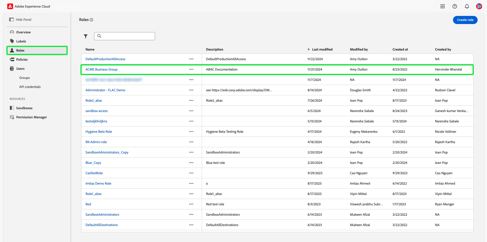

次に、**[!UICONTROL Labels]**&#x200B;を選択し、**[!UICONTROL Add Labels]**&#x200B;を選択します。

「ラベル」タブでラベルを追加を選択していることを示す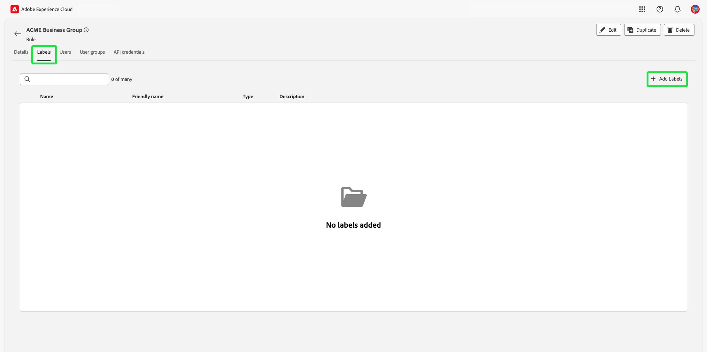

組織内のすべてのラベルのリストが表示されます。 **[!UICONTROL RHD]**&#x200B;を選択して&#x200B;**[!UICONTROL PHI/Regulated Health Data]**&#x200B;のラベルを追加し、**[!UICONTROL Save]**&#x200B;を選択します。

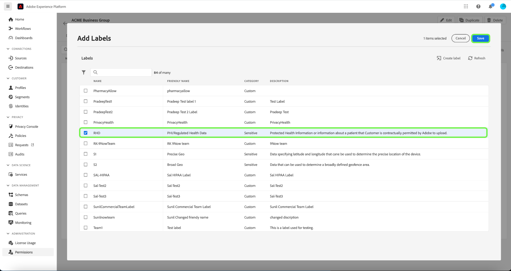

>[!NOTE]
>
>組織グループを役割に追加すると、そのグループのすべてのユーザーが役割に追加されます。 組織グループに対する変更（ユーザーが削除または追加された場合）は、ロール内で自動的に更新されます。

## スキーマフィールドへのラベルの適用 {#label-resources}

[!UICONTROL RHD] ラベルを持つユーザー役割を設定したので、次の手順は、その役割に対して制御するリソースに同じラベルを追加することです。

上部のナビゲーションから、**アプリケーションスイッチャー** アイコンで表されるを選択し、**[!UICONTROL Experience Platform]**&#x200B;を選択します。

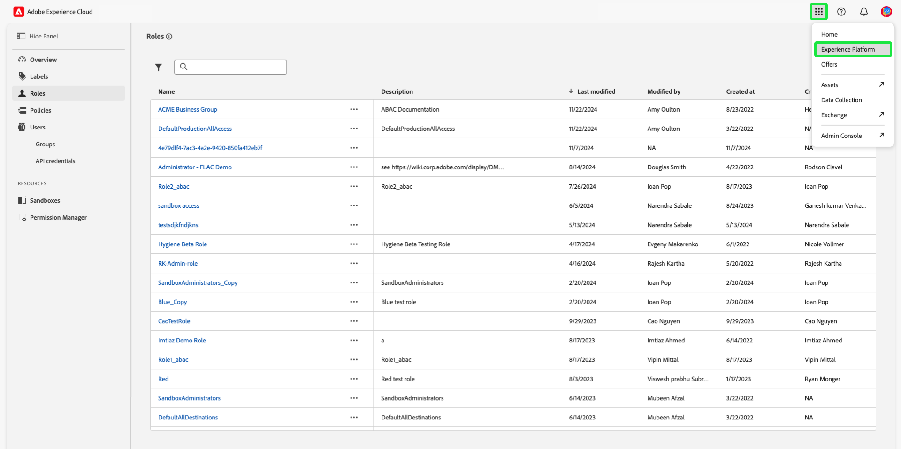

左側のナビゲーションから「**[!UICONTROL Schemas]**」を選択し、表示されるスキーマのリストから「**[!UICONTROL ACME Healthcare]**」を選択します。

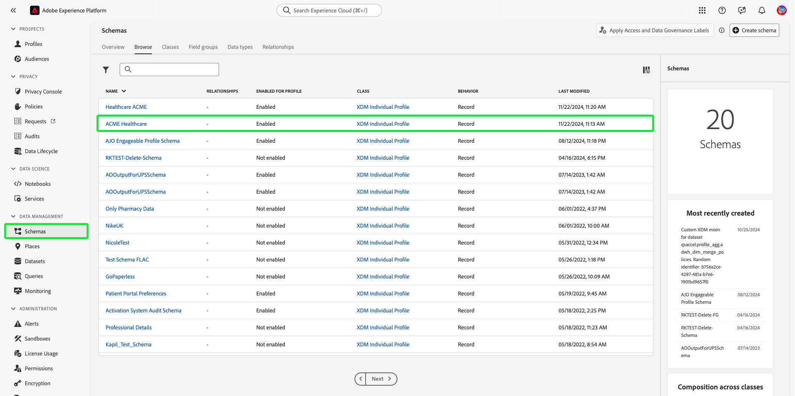

次に、**[!UICONTROL Labels]**&#x200B;を選択して、スキーマに関連付けられているフィールドを表示するリストを表示します。 ここから、一度に1つまたは複数のフィールドにラベルを割り当てることができます。 **[!UICONTROL BloodGlucose]**&#x200B;と&#x200B;**[!UICONTROL InsulinLevel]**&#x200B;のフィールドを選択し、**[!UICONTROL Apply access and data governance labels]**&#x200B;を選択します。

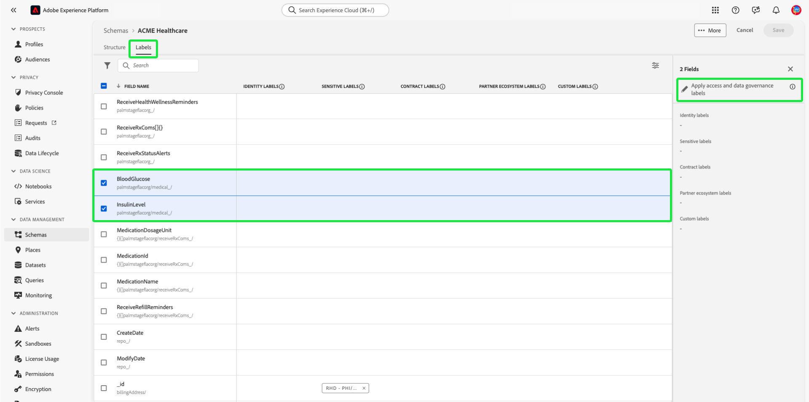

**[!UICONTROL Edit labels]** ダイアログが表示され、スキーマフィールドに適用するラベルを選択できます。 この使用例では、**[!UICONTROL PHI/ Regulated Health Data]** ラベルを選択してから、**[!UICONTROL Save]**&#x200B;を選択します。

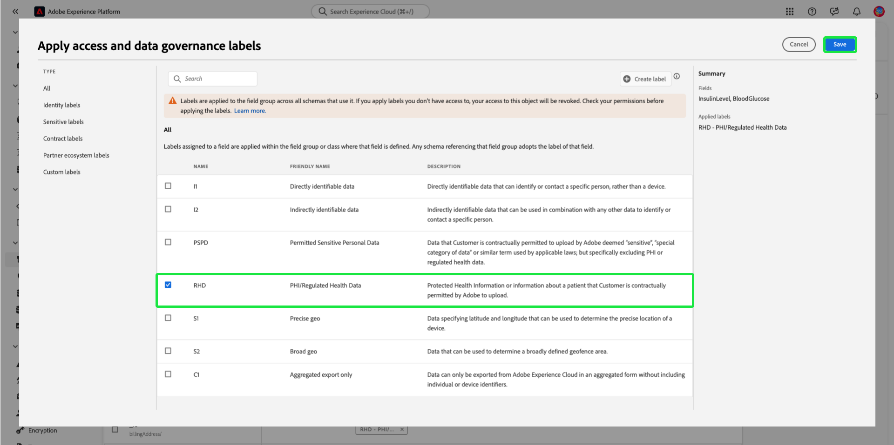

>[!NOTE]
>
>ラベルがフィールドに追加されると、そのラベルはそのフィールドの親リソース（クラスまたはフィールドグループ）に適用されます。 親クラスまたはフィールドグループが他のスキーマで使用されている場合、それらのスキーマは同じラベルを継承します。

## オーディエンスへのラベルの適用

>[!NOTE]
>
>ラベル付き属性を使用するオーディエンスも、同じアクセス制限を適用する場合は、同様にラベル付けする必要があります。

スキーマフィールドのラベル付けを完了したら、オーディエンスのラベル付けを開始できます。

**[!UICONTROL Audiences]** セクションの左側のナビゲーションから&#x200B;**[!UICONTROL Customers]**&#x200B;を選択します。 組織で使用可能なオーディエンスのリストが表示されます。 この例では、以下の2つのオーディエンスには、機密性の高いヘルスデータが含まれているため、ラベルを付ける必要があります。

* 血中ブドウ糖> 100
* インスリン &lt;50

「**[!UICONTROL Blood Glucose >100]**」を（チェックボックスではなくオーディエンス名で）選択して、オーディエンスのラベル付けを開始します。

「オーディエンス」タブから選択されている血糖値>100を示す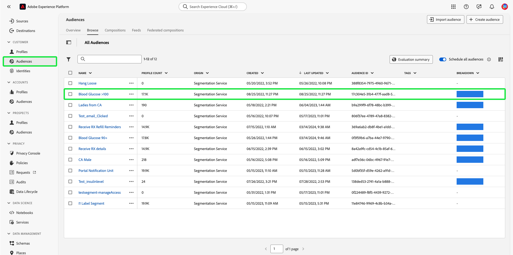

セグメント **[!UICONTROL Details]**&#x200B;の画面が表示されます。 **[!UICONTROL Manage Access]** を選択します。

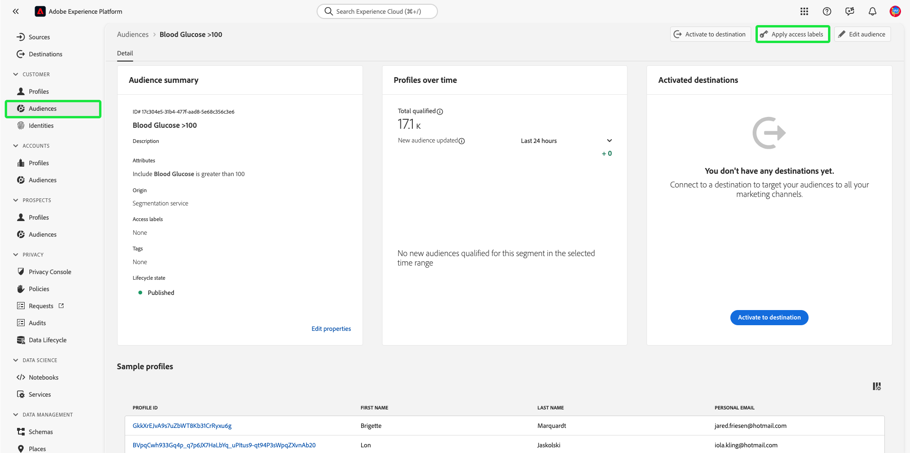

**[!UICONTROL Apply access and data governance labels]** ダイアログが表示され、オーディエンスに適用するラベルを選択できます。 この使用例では、**[!UICONTROL PHI/ Regulated Health Data]** ラベルを選択してから、**[!UICONTROL Save]**&#x200B;を選択します。

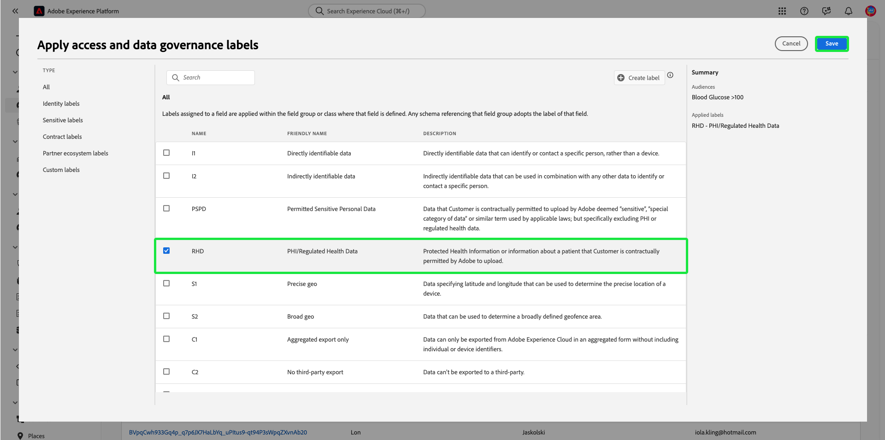

**[!UICONTROL Insulin <50]**&#x200B;で上記の手順を繰り返します。

>[!NOTE]
>
> [!UICONTROL Permissions] オブジェクトレベルのアクセス制御[を使用して、Adobe Journey Optimizerの様々なオブジェクトに](https://experienceleague.adobe.com/en/docs/journey-optimizer/using/access-control/object-based-access) ワークスペースで作成されたラベル（上記のセグメントラベルなど）を割り当てます。」

## アクセス制御ポリシーのアクティブ化 {#policy}

デフォルトのアクセス制御ポリシーでは、ラベルを活用して、特定のExperience Platform リソースに対するアクセス権を持つユーザーロールを定義します。 この例では、スキーマフィールドとオーディエンスへのアクセスは、スキーマフィールドに対応するラベルを持つ役割にないユーザーのすべてのサンドボックスで拒否されます。

アクセス制御ポリシーを有効にするには、左側のナビゲーションから「[!UICONTROL Permissions]」を選択し、「**[!UICONTROL Policies]**」を選択します。

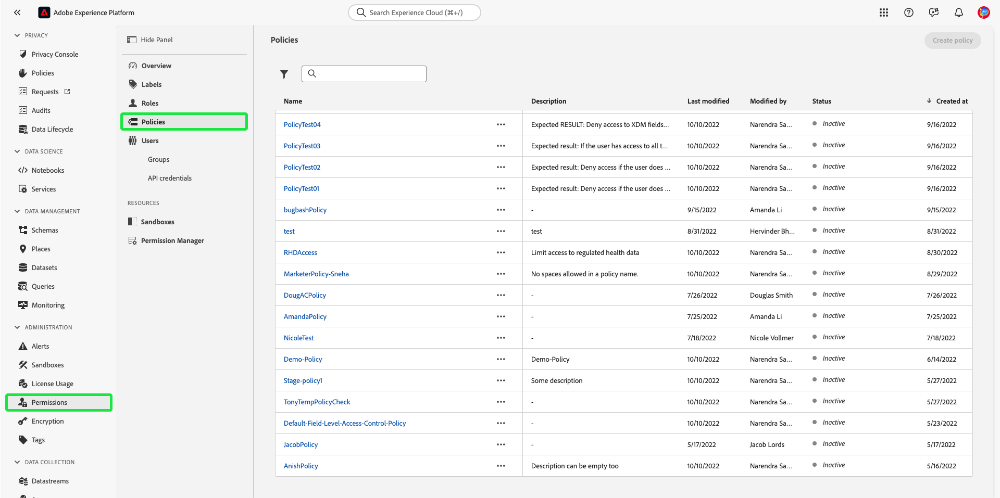

次に、`...`の横にある省略記号（**[!UICONTROL Default-Field-Level-Access-Control-Policy]**）を選択すると、役割を編集、アクティブ化、削除、または複製するためのコントロールがドロップダウンに表示されます。 ドロップダウンから「**[!UICONTROL Activate]**」を選択します。

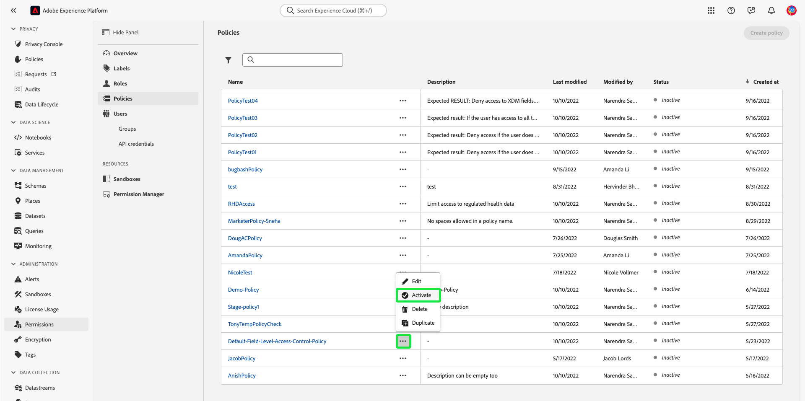

アクティベーションポリシーのダイアログが表示され、アクティベーションの確認を求めるメッセージが表示されます。 **[!UICONTROL Confirm]** を選択します。

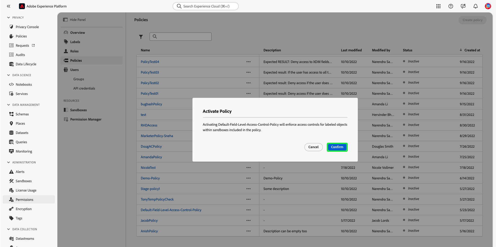

ポリシーのアクティベーションの確認が受信され、[!UICONTROL Policies] ページに戻ります。

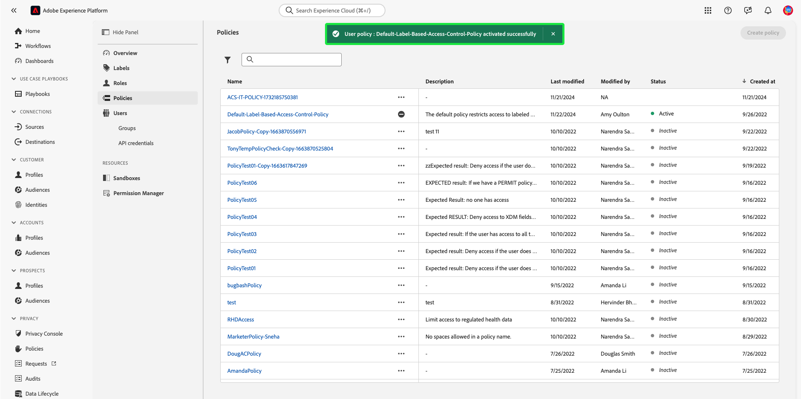

<!-- 
## Create an access control policy {#policy}

>[!CONTEXTUALHELP]
>id="platform_permissions_policies_about"
>title="What are policies?"
>abstract="Policies are statements that bring attributes together to establish permissible and impermissible actions. Every organization comes with a default policy that you must activate to define rules for resources like segments and schema fields. Default policies can neither be edited nor deleted. However, default policies can be activated or deactivated."
>additional-url="https://experienceleague.adobe.com/docs/experience-platform/access-control/abac/permissions-ui/policies.html" text="Manage policies"

>[!CONTEXTUALHELP]
>id="platform_permissions_policies_about_create"
>title="Create a policy"
>abstract="Create a policy to define the actions that your users can and cannot take against your segments and schema fields."
>additional-url="https://experienceleague.adobe.com/docs/experience-platform/access-control/abac/permissions-ui/policies.html#create-a-new-policy" text="Create a policy"

>[!CONTEXTUALHELP]
>id="platform_permissions_policies_edit_permitdeny"
>title="Configure permissible and impermissible actions for a policy"
>abstract="A <b>deny access to</b> policy will deny users access when the criteria is met. Combined with <b>The following being false</b> - all users will be denied access unless they meet the matching criteria set. This type of policy allows you to protect a sensitive resource and only allow access to users with matching labels.  A <b>permit access to</b> policy will permit users access when the criteria are met. When combined with <b>The following being true</b> - users will be given access if they meet the matching criteria set. This does not explicitly deny access to users, but adds a permit access. This type of policy allows you to give additional access to resource and in addition to those users who might already have access through role permissions."
>additional-url="https://experienceleague.adobe.com/docs/experience-platform/access-control/abac/permissions-ui/policies.html#edit-a-policy" text="Edit a policy"

>[!CONTEXTUALHELP]
>id="platform_permissions_policies_edit_resource"
>title="Configure permissions for a resource"
>abstract="A resource is the asset or object that a user can or cannot access. Resources can be segments or schemas fields. You can configure write, read, or delete permissions for segments and schema fields."

>[!CONTEXTUALHELP]
>id="platform_permissions_policies_edit_condition"
>title="Edit conditions"
>abstract="Apply conditional statements to your policy to configure user access to certain resources. Select match all to require users to have roles with the same labels as a resource to be permitted access. Select match any to require users to have a role with just one label matching a label on a resource. Labels can either be defined as core or custom labels, with core labels representing labels created and provided by Adobe and custom labels representing labels that you created for your organization."

Access control policies leverage labels to define which user roles have access to specific Experience Platform resources. Policies can either be local or global and can override other policies. In this example, access to schema fields and segments will be denied in all sandboxes for users who don't have the corresponding labels in the schema field.

>[!NOTE]
>
>A "deny policy" is created to grant access to sensitive resources because the role grants permission to the subjects. The written policy in this example **denies** you access if you are missing the required labels.
a
To create an access control policy, select **[!UICONTROL Permissions]** from the left navigation and then select **[!UICONTROL Policies]**. Next, select **[!UICONTROL Create policy]**.

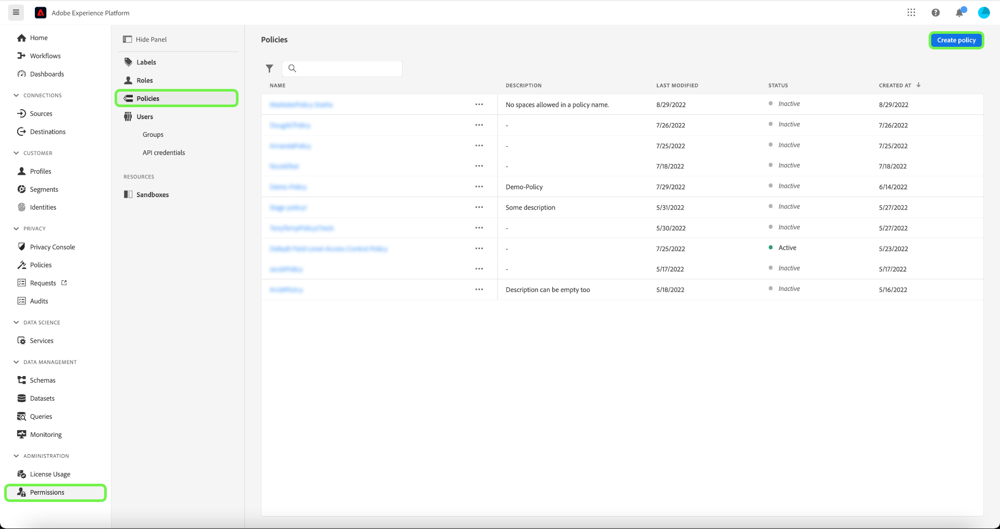

The **[!UICONTROL Create new policy]** dialog appears, prompting you to enter a name and an optional description. Select **[!UICONTROL Confirm]** when finished.

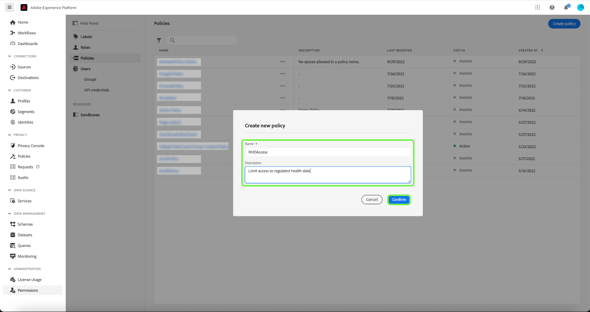

To deny access to the schema fields, use the dropdown arrow and select **[!UICONTROL Deny access to]** and then select **[!UICONTROL No resource selected]**. Next, select **[!UICONTROL Schema Field]** and then select **[!UICONTROL All]**.

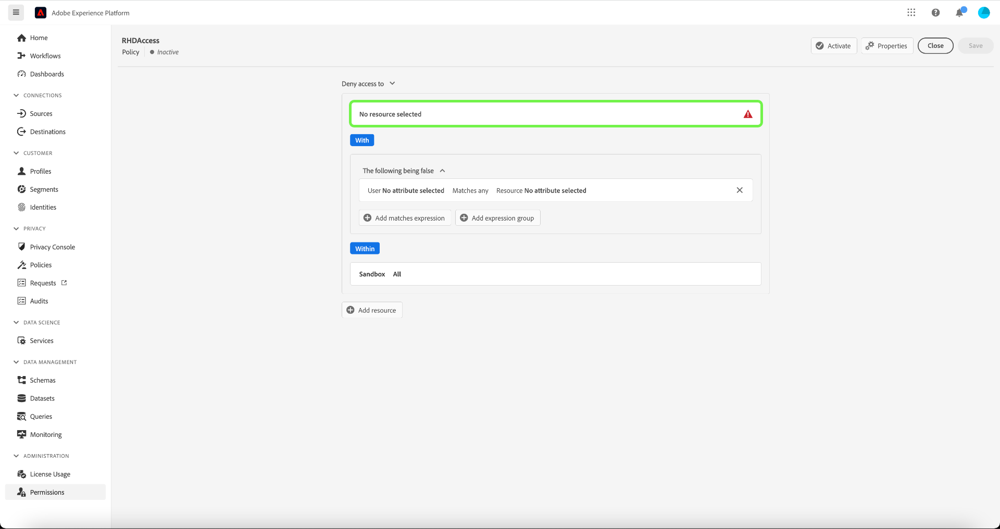

The table below shows the conditions available when creating a policy:

| Conditions | Description |
| --- | --- |
| The following being false| When 'Deny access to' is set, access will be restricted if the user does not meet the criteria selected. |
| The following being true| When 'Permit access to' is set, access will be permitted if the user meets the selected criteria. |
| Matches any| The user has a label that matches any label applied to a resource. |
| Matches all| The user has all labels that matches all labels applied to a resource. |
| Core label| A core label is an Adobe-defined label that is available in all Experience Platform instances.|
| Custom label| A custom label is a label that has been created by your organization.|

Select **[!UICONTROL The following being false]** and then select **[!UICONTROL No attribute selected]**. Next, select the user **[!UICONTROL Core label]**, then select **[!UICONTROL Matches all]**. Select the resource **[!UICONTROL Core label]** and finally select **[!UICONTROL Add resource]**.

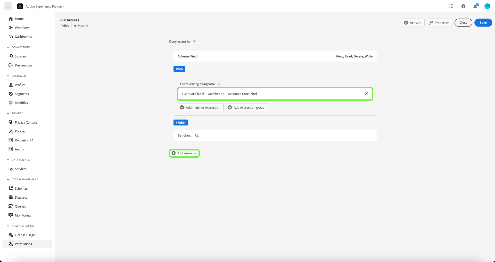

>[!TIP]
>
>A resource is the asset or object that a subject can or cannot access. Resources can be segments or schemas.

To deny access to the segments, use the dropdown arrow and select **[!UICONTROL Deny access to]** and then select **[!UICONTROL No resource selected]**. Next, select **[!UICONTROL Segment]** and then select **[!UICONTROL All]**.

Select **[!UICONTROL The following being false]** and then select **[!UICONTROL No attribute selected]**. Next, select the user **[!UICONTROL Core label]**, then select **[!UICONTROL Matches all]**. Select the resource **[!UICONTROL Core label]** and finally select **[!UICONTROL Save]**.

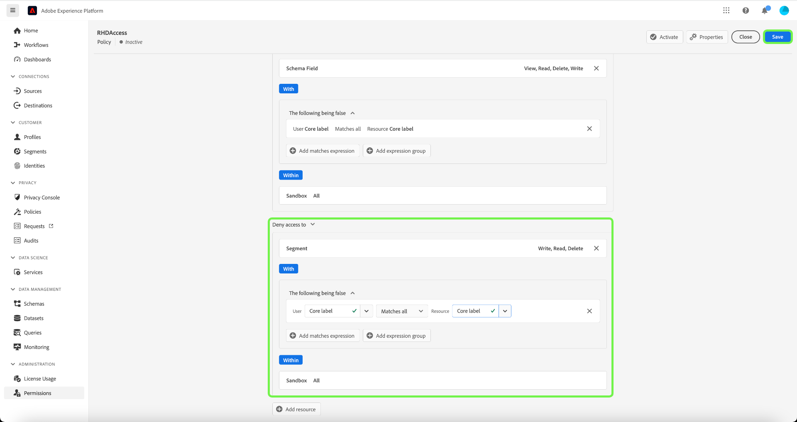

Select **[!UICONTROL Activate]** to activate the policy, and a dialog appears which prompts you to confirm activation. Select **[!UICONTROL Confirm]** and then select **[!UICONTROL Close]**.

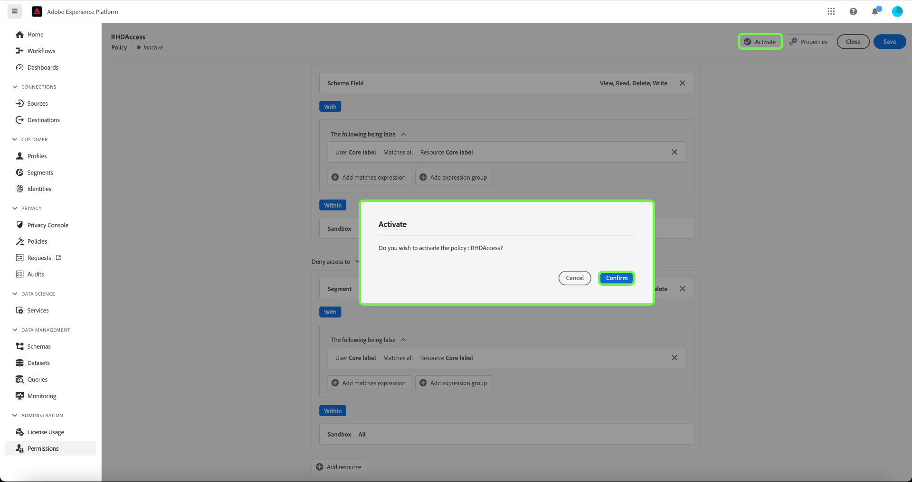 
-->

## 次の手順

役割、スキーマフィールド、オーディエンスへのラベルの適用が完了しました。 これらの役割に割り当てられた外部代理店は、これらのラベルとその値をスキーマ、データセット、プロファイルビューで表示することを制限されています。 これらのフィールドは、セグメントビルダーを使用する際に、セグメント定義で使用することも制限されています。

属性ベースのアクセス制御の詳細については、[属性ベースのアクセス制御の概要](./overview.md)を参照してください。

次のビデオは、属性ベースのアクセス制御に関する理解を深めることを目的とし、役割、リソース、ポリシーの設定方法の概要を示しています。

>[!VIDEO](https://video.tv.adobe.com/v/345641?learn=on)
