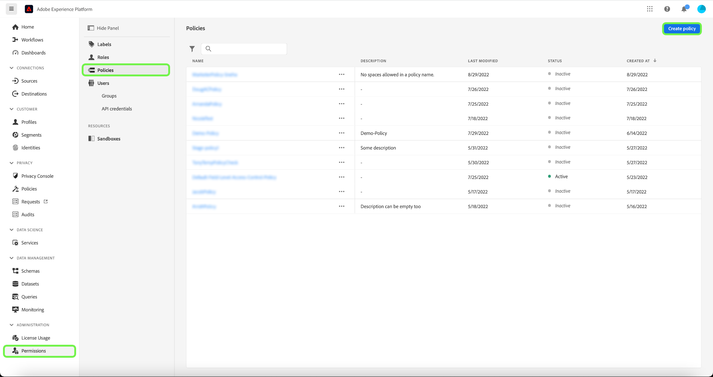

# 属性ベースのアクセス制御エンドツーエンドガイド

属性ベースのアクセス制御は、プライバシーを意識するブランドがユーザーアクセスを柔軟に管理できるAdobe Experience Platformの機能です。 スキーマフィールドやセグメントなどの個々のオブジェクトを、ユーザーの役割に割り当てることができます。 この機能を使用すると、組織内の特定の Platform ユーザーに対する個々のオブジェクトへのアクセスを許可または取り消すことができます。

この機能を使用すると、スキーマフィールドやセグメントなどを、組織やデータの使用範囲を定義するラベルで分類できます。 Adobe Journey Optimizerでは、ジャーニーとオファーに同じラベルを適用できます。 同時に、管理者は、XDM スキーマフィールドに関するアクセスポリシーを定義し、それらのフィールドにアクセスできるユーザーやグループ（内部、外部、サードパーティのユーザー）をより適切に管理できます。

## はじめに

このチュートリアルでは、次の Platform コンポーネントに関する十分な知識が必要です。

* [[!DNL Experience Data Model (XDM)] システム](../../xdm/home.md):Experience Platformが顧客体験データを整理する際に使用する標準化されたフレームワーク。
   * [スキーマ構成の基本](../../xdm/schema/composition.md)：スキーマ構成の主要な原則やベストプラクティスなど、XDM スキーマの基本的な構成要素について学びます。
   * [スキーマエディターのチュートリアル](../../xdm/tutorials/create-schema-ui.md)：スキーマエディター UI を使用してカスタムスキーマを作成する方法を説明します。
* [Adobe Experience Platform セグメント化サービス](../../segmentation/home.md)：[!DNL Platform] 内のセグメントエンジンは、顧客の行動と属性に基づいて、顧客プロファイルからオーディエンスセグメントを作成するのに使用されます。

### 使用例の概要

このガイドでは、機密データへのアクセスを制限してワークフローを示す使用例を使用します。 属性ベースのアクセス制御ワークフローの例を使用して、ロール、ラベル、ポリシーを作成および割り当て、ユーザーが組織内の特定のリソースにアクセスできるかどうかを設定します。 この使用例を次に示します。

医療機関であり、組織内のリソースへのアクセスを設定する場合。

* 社内のマーケティングチームが **[!UICONTROL PHI/規制対象の健康データ]** データ。
* 外部の代理店がにアクセスできない **[!UICONTROL PHI/規制対象の健康データ]** データ。

これをおこなうには、役割、リソース、ポリシーを設定する必要があります。

以下をおこないます。

* [ユーザーの役割のラベル付け]{#label-roles}:外部の代理店と連携するマーケティンググループを持つ医療プロバイダー（ACME ビジネスグループ）の例を使用します。
* [リソース（スキーマフィールドとセグメント）のラベル付け]{#label-resources}:を **[!UICONTROL PHI/規制対象の健康データ]** スキーマのリソースおよびセグメントに対するラベル
* [両者をリンクさせるポリシーを作成する]{#policy}:ポリシーを作成して、リソースのラベルを、スキーマフィールドおよびセグメントへのアクセスを拒否する役割のラベルにリンクします。 これにより、一致するラベルを持たないユーザーのすべてのサンドボックスのスキーマフィールドおよびセグメントへのアクセスが拒否されます。

## 権限

[!UICONTROL 権限は、管理者がユーザーの役割およびアクセスポリシーを定義し、製品アプリケーション内の機能およびオブジェクトのアクセス権限を管理できる、Experience Cloud の領域です。]

～ [!UICONTROL 権限]では、役割を作成および管理し、それらの役割に対する必要なリソース権限を割り当てることができます。 [!UICONTROL また、権限では、特定の役割に関連付けられたラベル、サンドボックス、ユーザーを管理することもできます。]

管理者権限がない場合は、システム管理者に問い合わせてアクセス権を取得してください。

管理者権限を取得したら、に移動します。 [Adobe Experience Cloud](https://experience.adobe.com/) にログインし、Adobeの資格情報を使用してログインします。 ログイン後、 **[!UICONTROL 概要]** ページが表示されます。 このページには、組織が購読している製品と、組織全体にユーザーおよび管理者を追加するためのその他のコントロールが表示されます。 選択 **[!UICONTROL 権限]** をクリックして、Platform 統合用のワークスペースを開きます。

Platform UI の権限ワークスペースが表示され、 **[!UICONTROL 役割]** ページ。

## ロールへのラベルの適用 {#label-roles}

役割は、Platform インスタンスとやり取りするユーザーのタイプを分類する方法で、アクセス制御ポリシーの構成要素です。 ロールには特定の権限のセットがあり、組織のメンバーは、必要なアクセスの範囲に応じて、1 つ以上のロールに割り当てることができます。

利用を開始するには、「 **[!UICONTROL ACME ビジネスグループ]** から **[!UICONTROL 役割]** ページ。

次に、 **[!UICONTROL ラベル]** 次に、 **[!UICONTROL ラベルを追加]**.

組織内のすべてのラベルのリストが表示されます。 選択 **[!UICONTROL RHD]** ラベルを追加するには **[!UICONTROL PHI/規制対象の健康データ]**. ラベルの横に青いチェックマークが表示されるまでしばらく待ってから、を選択します。 **[!UICONTROL 保存]**.

## スキーマフィールドへのラベルの適用 {#label-resources}

これで、 [!UICONTROL RHD] ラベルを設定する場合は、次に、そのロールに対して制御するリソースに同じラベルを追加します。

選択 **[!UICONTROL スキーマ]** 左のナビゲーションから、 **[!UICONTROL ACME Healthcare]** 表示されるスキーマのリストから。

次に、 **[!UICONTROL ラベル]** をクリックすると、スキーマに関連付けられたフィールドを表示するリストが表示されます。 ここから、1 つまたは複数のフィールドに一度にラベルを割り当てることができます。 を選択します。 **[!UICONTROL 血糖]** および **[!UICONTROL InsulinLevel]** フィールドを選択し、 **[!UICONTROL ガバナンスラベルを編集]**.

この **[!UICONTROL ラベルを編集]** ダイアログが表示され、スキーマフィールドに適用するラベルを選択できます。 この使用例では、 **[!UICONTROL PHI/規制対象の健康データ]** ラベルを選択し、「 **[!UICONTROL 保存]**.

>[!NOTE]
>
>フィールドにラベルを追加すると、そのラベルがそのフィールドの親リソース（クラスまたはフィールドグループ）に適用されます。 親クラスまたはフィールドグループが他のスキーマで使用されている場合、これらのスキーマは同じラベルを継承します。

## セグメントへのラベルの適用

スキーマフィールドのラベル付けが完了したら、セグメントのラベル付けを開始できます。

選択 **[!UICONTROL セグメント]** をクリックします。 組織で使用可能なセグメントのリストが表示されます。 この例では、次の 2 つのセグメントに、機密性の高いヘルスデータが含まれるので、ラベルが付けられます。

* 血糖 > 100
* インスリン &lt;50

選択 **[!UICONTROL 血糖 > 100]** をクリックして、セグメントのラベル付けを開始します。

![[ セグメント ] タブから選択された血糖値が 100 を超えている画像](../images/abac-end-to-end-user-guide/abac-select-segment.png)

セグメント **[!UICONTROL 詳細]** 画面が表示されます。 選択 **[!UICONTROL アクセスを管理]**.

この **[!UICONTROL ラベルを編集]** ダイアログが表示され、セグメントに適用するラベルを選択できます。 この使用例では、 **[!UICONTROL PHI/規制対象の健康データ]** ラベルを選択し、「 **[!UICONTROL 保存]**.

上記の手順を **[!UICONTROL インスリン &lt;50]**.

## アクセス制御ポリシーの作成 {#policy}

アクセス制御ポリシーでは、ラベルを使用して、特定の Platform リソースにアクセスできるユーザーの役割を定義します。 ポリシーは、ローカルまたはグローバルに設定でき、他のポリシーを上書きできます。 この例では、スキーマフィールドに対応するラベルを持たないユーザーの場合、すべてのサンドボックスで、スキーマフィールドおよびセグメントへのアクセスが拒否されます。

アクセス制御ポリシーを作成するには、 **[!UICONTROL 権限]** 左のナビゲーションから、 **[!UICONTROL ポリシー]**. 次に、 **[!UICONTROL ポリシーを作成]**.

この **[!UICONTROL 新しいポリシーを作成]** ダイアログが表示され、名前とオプションの説明を入力するよう求められます。 選択 **[!UICONTROL 確認]** 終了したとき。

スキーマフィールドへのアクセスを拒否するには、ドロップダウンの矢印を使用して、「 」を選択します。 **[!UICONTROL へのアクセスを拒否]** 次に、 **[!UICONTROL リソースが選択されていません]**. 次に、 **[!UICONTROL スキーマフィールド]** 次に、 **[!UICONTROL すべて]**.

次の表に、ポリシーを作成する際に使用できる条件を示します。

| 条件 | 説明 |
| --- | --- |
| 次は false です | 「へのアクセスを拒否」が設定されている場合、ユーザーが選択した条件を満たさない場合、アクセスは制限されます。 |
| 次のことは真です | 「アクセスを許可」が設定されている場合、ユーザーが選択した条件を満たす場合、アクセスは制限されます。 |
| いずれかに一致 | ユーザーには、リソースに適用された任意のラベルに一致するラベルがあります。 |
| すべて一致 | ユーザーには、リソースに適用されたすべてのラベルに一致するすべてのラベルがあります。 |
| コアラベル | コアラベルは、すべてのAdobeインスタンスで使用できる、プラットフォーム定義のラベルです。 |
| カスタムラベル | カスタムラベルは、組織が作成したラベルです。 |

選択 **[!UICONTROL 次は false です]** 次に、 **[!UICONTROL 属性が選択されていません]**. 次に、ユーザーを選択します。 **[!UICONTROL コアラベル]**&#x200B;を選択し、「 **[!UICONTROL すべて一致]**. リソースを選択 **[!UICONTROL コアラベル]** 最後に、 **[!UICONTROL リソースを追加]**.

>[!TIP]
>
>リソースとは、主体がアクセスできるアセットまたはオブジェクトです。 リソースには、セグメントまたはスキーマを使用できます。

セグメントへのアクセスを拒否するには、ドロップダウン矢印を使用して、「 」を選択します。 **[!UICONTROL へのアクセスを拒否]** 次に、 **[!UICONTROL リソースが選択されていません]**. 次に、 **[!UICONTROL セグメント]** 次に、 **[!UICONTROL すべて]**.

選択 **[!UICONTROL 次は false です]** 次に、 **[!UICONTROL 属性が選択されていません]**. 次に、ユーザーを選択します。 **[!UICONTROL コアラベル]**&#x200B;を選択し、「 **[!UICONTROL すべて一致]**. リソースを選択 **[!UICONTROL コアラベル]** 最後に、 **[!UICONTROL 保存]**.

選択 **[!UICONTROL 有効化]** ポリシーをアクティブ化すると、アクティベートを確認するダイアログが表示されます。 選択 **[!UICONTROL 確認]** 次に、 **[!UICONTROL 閉じる]**.

## 次の手順

ロール、スキーマフィールド、セグメントへのラベルの適用が完了している。 これらの役割に割り当てられた外部エージェントでは、スキーマ、データセット、プロファイル表示で、これらのラベルとその値の表示が制限されます。 また、セグメントビルダーを使用する際、これらのフィールドは、セグメント定義で使用できません。

属性ベースのアクセス制御の詳細については、[属性ベースのアクセス制御の概要](./overview.md)を参照してください。
