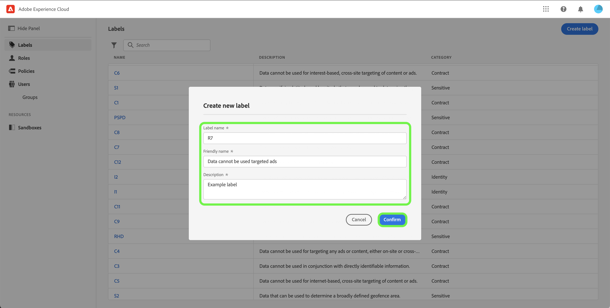

# ラベルの管理

>[!IMPORTANT]
>
>属性ベースのアクセス制御は、現在、米国を拠点とするヘルスケア関連のお客様向けの限定リリースで利用できます。この機能は、完全にリリースされると、すべての Real-time Customer Data Platform のお客様が利用できるようになります。

ラベルを使用すると、データに適用される使用ポリシーに従ってデータセットとフィールドを分類できます。 ラベルはいつでも適用でき、データの管理方法を柔軟に選択できます。ベストプラクティスでは、データが Platform に取得されるとすぐに、またはデータが Platform で使用できるようになるとすぐに、データのラベル付けが推奨されます。

## 新しいラベルを作成 {#create-new-label}

>[!CONTEXTUALHELP]
>id="platform_abac_labelusage"
>title="ラベルの使用"
>abstract="カスタムラベルを使用して、データガバナンスとアクセス制御の設定をデータに適用できます。"

>[!NOTE]
>
>カスタムラベルを作成するには、管理者権限が必要です。 現在、ラベルの削除はサポートされていません。

新しいラベルを作成するには、 **[!UICONTROL ラベル]** サイドバーの「 」タブで「 」を選択し、 **[!UICONTROL ラベルを作成]**.

この **[!UICONTROL 新しいラベルを作成]** ダイアログが表示され、名前、わかりやすい名前（オプション）、説明（オプション）を入力するよう求められます。

終了したら、「 」を選択します。 **[!UICONTROL 確認]**.
