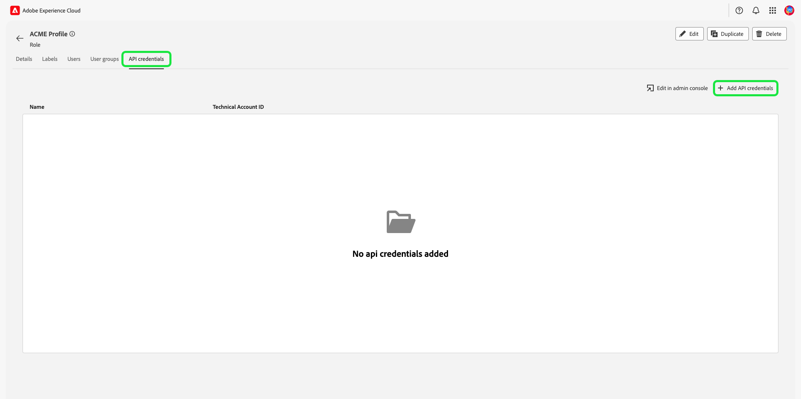

# ロールの権限の管理

>[!IMPORTANT]
>
>アクセス制御は、権限の付与にユーザー ID（ユーザーに割り当てられた内部の一意の ID）を使用します。 組織をAdobe IDから Business ID に移行すると、ユーザー ID が変更され、アクセス制御で新しく生成されたユーザー ID が使用されるので、ユーザーに設定されたすべての権限は失われます。 組織が Business ID に移行されている場合、Adobe担当者に連絡して、Adobe IDから Business ID にユーザー ID を移行してください。

権限は、管理者がユーザーの役割およびアクセスポリシーを定義し、製品アプリケーション内の機能およびオブジェクトのアクセス権限を管理できる、Experience Cloud の領域です。

権限を通じて、役割を作成および管理し、それらの役割に対して必要なリソース権限を割り当てることができます。また、権限では、特定の役割に関連付けられたラベル、サンドボックス、ユーザーを管理することもできます。

直後 [新しいロールの作成](#create-a-new-role)を含めない場合、 **[!UICONTROL 役割]** タブをクリックします。 既存のロールの権限を編集する場合は、 **[!UICONTROL 役割]** タブをクリックします。 または、「フィルター」オプションを使用して結果をフィルターし、役割を検索します。

## 役割のフィルタリング

ファネルアイコン () をクリックして、結果を絞り込むのに役立つフィルターコントロールのリストを表示します。

UI の役割では、次のフィルターを使用できます。

| フィルター | 説明 |
| --- | --- |
| [!UICONTROL 作成期間] | 結果をフィルターする日付範囲を定義する開始日または終了日を選択します。 |
| [!UICONTROL 作成者] | ドロップダウンからユーザーを選択し、役割の作成者でフィルタリングします。 |
| [!UICONTROL 次の期間で変更] | 結果をフィルターする日付範囲を定義する開始日または終了日を選択します。 |
| [!UICONTROL 変更者] | 役割修飾子でフィルタリングします。そのためには、ドロップダウンからユーザーを選択します。 |

フィルターを削除するには、該当するフィルターのピルアイコンの「X」を選択するか、「 **[!UICONTROL すべてクリア]** をクリックして、すべてのフィルターを削除します。

## 役割の詳細

次の中からロールを選択します。 **[!UICONTROL 役割]** タブに移動し、役割の詳細ページが開きます。

「詳細」タブには、役割の概要が表示されます。 概要には、ロール名、ロールの説明、ロールを作成および変更したユーザーの名前、ロールが作成および変更された日時、ロールに関連付けられた権限が表示されます。 必要に応じて、ロール名とロールの説明を変更できます。

## ロールのラベルの管理

を選択します。 **[!UICONTROL ラベル]** 「 」タブをクリックして役割ラベルページを開き、「 」を選択します。 **[!UICONTROL ラベルを追加]** ロールにラベルを割り当てます。

このページにはラベルが表示されます。 このリストには、ラベル名、わかりやすい名前、カテゴリ、説明が表示されます。

ロールに追加するラベルをリストから選択し、「 」を選択します。 **[!UICONTROL 保存]**

追加されたラベルは、の下に表示されます。 **[!UICONTROL ラベル]** タブをクリックします。

ロールからラベルを削除するには、 **X** ラベル名の横にあるアイコン。

## 役割用サンドボックスの管理

を選択します。 **[!UICONTROL サンドボックス]** 「 」タブをクリックして、「役割サンドボックス」ページを開きます。 ここには、役割に追加されたサンドボックスのリストが表示されます。

ロールにサンドボックスを追加するには、以下を選択します。 **[!UICONTROL 編集]**.

次の画面では、ドロップダウンを使用して、役割に含めるサンドボックス内に存在するリソース権限を選択するよう求められます。 終了したら、「 」を選択します。 **[!UICONTROL 保存して終了]**.

## 役割のユーザーの管理

を選択します。 **[!UICONTROL ユーザー]** 「 」タブをクリックして役割ユーザーページを開き、「 」を選択します。 **[!UICONTROL ユーザーを追加]** ユーザーを役割に割り当てます。

ロールに追加するユーザーをリストから選択します。 または、検索バーを使用して名前または電子メールアドレスを入力してユーザーを検索し、「 」を選択します **[!UICONTROL 保存]**

追加されたユーザーは、の下に表示されます。 **[!UICONTROL ユーザー]** タブをクリックします。

ユーザーをロールから削除するには、 **X** ユーザー名の横のアイコン

## ロールの API 資格情報の管理

を選択します。 **[!UICONTROL API 資格情報]** 「 」タブをクリックしてロール API 資格情報ページを開き、「 」を選択します。 **[!UICONTROL API 資格情報の追加]** をクリックして、API 資格情報を役割に割り当てます。

ロールに追加するリストから API 資格情報を選択し、「 」を選択します。 **[!UICONTROL 保存]**

追加された API 資格情報は、の下に表示されます。 **[!UICONTROL API 資格情報]** タブをクリックします。

役割から API 資格情報を削除するには、 **X** API 秘密鍵証明書名の横にあるアイコン

この **[!UICONTROL API 資格情報を削除]** ダイアログが表示され、削除を確認するプロンプトが表示されます。

次の場所に戻ります： **[!UICONTROL API 資格情報]** タブをクリックします。

## 役割用のユーザーグループの管理

ユーザーグループは、1 つにグループ化され、同じ機能を実行するためのアクセス権を持つ複数のユーザーです。

を選択します。 **[!UICONTROL ユーザーグループ]** 「 」タブをクリックして役割のユーザーグループページを開き、「 」を選択します。 **[!UICONTROL グループを追加]** をクリックして、ユーザーグループを役割に割り当てます。

ロールに追加するユーザーグループをリストから選択します。 または、検索バーを使用してグループ名を入力してユーザーグループを検索し、「 」を選択します。 **[!UICONTROL 保存]**

追加されたユーザーグループは、の下に表示されます。 **[!UICONTROL ユーザーグループ]** タブをクリックします。

役割からユーザーグループを削除するには、 **X** ユーザーグループ名の横にあるアイコン

この **[!UICONTROL ユーザーグループを削除]** ダイアログが表示され、削除を確認するプロンプトが表示されます。

次の場所に戻ります： **[!UICONTROL ユーザーグループ]** タブをクリックします。

## 製品プロファイルを使用したExperience Platformへのユーザーの追加

製品プロファイルにユーザーを追加するには、製品にログインし、「Admin Console」を選択します。 **[!UICONTROL ユーザーを追加]**

この **[!UICONTROL チームにユーザーを追加する]** ダイアログが表示されます。 ユーザーの電子メールアドレス、名（オプション）および姓（オプション）を入力します。

鉛筆アイコンを選択して、製品およびユーザーグループを選択し、「 」を選択します。 **[!UICONTROL Adobeエクスペリエンスプラットフォーム]**&#x200B;を選択し、「 **[!UICONTROL AEP-Default-All-Users]**&#x200B;を選択し、「  **[!UICONTROL 保存]**.

## 次の手順

権限が設定されている場合は、次の手順に進んで、 [ユーザーの管理](users.md).
