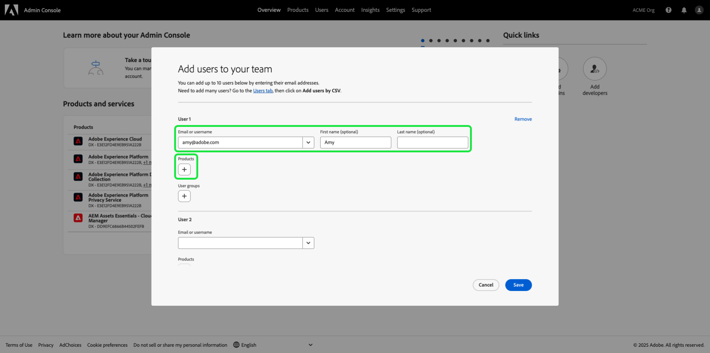

# 役割の権限の管理 {#manage-role-permissions}

>[!CONTEXTUALHELP]
>id="platform_permissions_roles_about"
>title="役割とは？"
>abstract="役割は、管理者、スペシャリストまたはエンドユーザーが組織内のリソースに対して持つアクセス権を定義します。これらは、Experience Platform インスタンスとやり取りするユーザーを分類し、アクセス制御ポリシーの構成要素になります。役割には特定の権限セットがあり、必要な表示または書き込みアクセスの範囲に応じて、組織のメンバーを 1 つ以上の役割に割り当てることができます。"
>additional-url="https://experienceleague.adobe.com/docs/experience-platform/access-control/abac/permissions-ui/roles.html?lang=ja" text="役割の管理"

>[!IMPORTANT]
>
>アクセス制御は、権限の付与にユーザー ID（ユーザーに割り当てられた内部の一意の ID）を使用します。組織を Adobe ID から Business ID に移行すると、ユーザー ID が変更され、新しく生成されたユーザー ID がアクセス制御で使用されるので、そのユーザーに設定されたすべての権限は失われます。組織が Business ID に移行されている場合、アドビ担当者に連絡して、Adobe IDから Business ID にユーザー ID を移行してください。

権限は、管理者がユーザーの役割およびアクセスポリシーを定義し、製品アプリケーション内の機能およびオブジェクトのアクセス権限を管理できる、Experience Cloud の領域です。

権限を通じて、役割を作成および管理し、それらの役割に対して必要なリソース権限を割り当てることができます。また、権限では、特定の役割に関連付けられたラベル、サンドボックス、ユーザーを管理することもできます。

[&#x200B; 新しい役割の作成 &#x200B;](#create-a-new-role) が完了するとすぐに、「**[!UICONTROL Roles]**」タブに戻ります。 既存の役割の権限を編集する場合は、「**[!UICONTROL Roles]**」タブをクリックします。 または、「フィルター」オプションを使用して結果をフィルターし、役割を見つけます。

## 役割のフィルタリング

ファネルアイコン（）を選択し、フィルターコントロールのリストを表示して、結果を絞り込みます。

役割には次のフィルターを UI で使用できます。

| フィルター | 説明 |
| --- | --- |
| [!UICONTROL Created between] | 結果をフィルターする日付範囲を定義する開始日および／または終了日を選択します。 |
| [!UICONTROL Created by] | ドロップダウンからユーザーを選択し、役割の作成者でフィルタリングします。 |
| [!UICONTROL Modified between] | 結果をフィルターする日付範囲を定義する開始日および／または終了日を選択します。 |
| [!UICONTROL Modified by] | 役割の変更者でフィルタリングします。そのためには、ドロップダウンからユーザーを選択します。 |

フィルターを削除するには、該当するフィルターのピルアイコンの「X」を選択するか、「**[!UICONTROL Clear all]**」を選択して、すべてのフィルターを削除します。

## 役割の詳細 {#role-details}

>[!CONTEXTUALHELP]
>id="platform_permissions_roles_details"
>title="役割の概要"
>abstract="役割の概要ダイアログには、特定の役割がアクセスできるリソースやサンドボックスなど、役割の詳細が表示されます。役割のワークスペース内の対応するタブに移動すると、役割のラベル、ユーザー、ユーザーグループ、API 資格情報を管理できます。"
>additional-url="https://experienceleague.adobe.com/ja/docs/experience-platform/access-control/abac/permissions-ui/permissions#manage-labels-for-a-role" text="役割のラベルの管理"
>additional-url="https://experienceleague.adobe.com/ja/docs/experience-platform/access-control/abac/permissions-ui/permissions#manage-users-for-a-role" text="役割のユーザーの管理"

「**[!UICONTROL Roles]**」タブから役割を選択すると、役割の [!UICONTROL Details] ダッシュボードが開きます。

[!UICONTROL Details] ダッシュボードには、役割の概要が表示されます。 概要には、役割名、説明、作成者、最終変更者が、作成日と変更日と共に表示されます。 また、役割に関連付けられた権限と、割り当てられたサンドボックスのリストも表示されます。 必要に応じて、役割の名前と説明を変更できます。

## 役割のラベルの管理

「**[!UICONTROL Labels]**」タブを選択して役割ラベルワークスペースを開き、「**[!UICONTROL Add labels]**」を選択して役割にラベルを割り当てます。

**[!UICONTROL Apply Access and Data Governance Labels]** ダイアログが表示され、ラベルのリストが表示されます。 リストには、ラベル名、わかりやすい名前、カテゴリ、説明が表示されます。

役割に追加するラベルをリストから選択し、「**[!UICONTROL Save]**」を選択します。

追加されたラベルは「」タブ **[!UICONTROL Labels]** 表示されます。

役割からラベルを削除するには、ラベルを選択してから「**[!UICONTROL Remove Labels]**」を選択します。

## 役割のサンドボックスの管理

「**[!UICONTROL Details]**」タブを選択し、「**[!UICONTROL Sandboxes]**」セクションに移動します。 「**[!UICONTROL View All]**」を選択して、役割に追加されたサンドボックスの完全なリストを表示します。

役割にさらにサンドボックスを追加するには、UI の右上から **[!UICONTROL Edit]** を選択します。

次の画面では、ドロップダウンを使用して、役割に含めるサンドボックスリソースを選択するように求められます。 終了したら、「**[!UICONTROL Save]**」を選択し、次に「**[!UICONTROL Close]**」を選択します。

## 役割のユーザーの管理

「**[!UICONTROL Users]**」タブを選択して役割 [!UICONTROL Users] ワークスペースを開きます。次に、「**[!UICONTROL Add Users]**」を選択して、ユーザーを役割に割り当てます。

**[!UICONTROL Add Users]** ダイアログが表示されます。 役割に追加するユーザーをリストから選択します。 または、検索バーを使用して名前またはメールアドレスを入力してユーザーを検索し、「**[!UICONTROL Save]**」を選択します。

追加されたユーザーは「」タブ **[!UICONTROL Users]** 表示されます。

役割からユーザーを削除するには、ユーザー名の横にある「**X**」アイコンを選択します。

次のビデオは、新しい役割の作成とその役割のユーザーの管理に関する理解を深めることを目的としています。

>[!VIDEO](https://video.tv.adobe.com/v/3475974/?captions=jpn&learn=on)

## 役割の API 資格情報の管理 {#manage-api-credentials-for-role}

>[!CONTEXTUALHELP]
>id="platform_permissions_apicredentials_about"
>title="API 資格情報とは"
>abstract="API 資格情報は、ユーザーと開発者に Experience Platform API へのアクセス権を付与する役割に割り当てられます。Experience Platform API を使用すると、計算属性の設定、データ／エンティティへのアクセス、データの書き出し、不要なデータやバッチの削除など、データに対する基本的な CRUD（作成、読み取り、更新、削除）操作をプログラムで実行できます。"
>additional-url="https://experienceleague.adobe.com/ja/docs/experience-platform/landing/platform-apis/api-guide" text="Experience Platform API ガイド"

>[!IMPORTANT]
>
> [!UICONTROL Permissions] で API 資格情報を使用および管理するには、ユーザーがシステム管理者権限を持っている必要があります。

Experience Platform API をユーザーまたは開発者として使用するには、役割の特定の権限セットに加えて API 資格情報を追加する必要があります。 API 資格情報の作成と割り当て、および必要な権限について詳しくは、[Experience Platform API の認証とアクセス &#x200B;](../../../landing/api-authentication.md#generate-credentials) のステップバイステップのチュートリアルを参照してください。

「**[!UICONTROL API credentials]**」タブを選択して役割 API 資格情報ワークスペースを開き、「**[!UICONTROL Add API credentials]**」を選択して、API 資格情報を役割に割り当てます。

**[!UICONTROL Add API credentials]** ダイアログが表示されます。 役割に追加するリストから API 資格情報を選択し、「**[!UICONTROL Save]**」を選択します。

追加された API 資格情報は、「**[!UICONTROL API credentials]**」タブの下に表示されます。

API 資格情報を役割から削除するには、API 資格情報名の横にある「**X**」アイコンを選択します。

削除を確認するように求める **[!UICONTROL Remove API credentials]** ダイアログが表示されます。 「**[!UICONTROL Confirm]**」を選択して、選択した秘密鍵証明書の削除を完了します。

「**[!UICONTROL API credentials]**」タブに戻されます。

## 役割のユーザーグループの管理 {#manage-user-groups}

>[!CONTEXTUALHELP]
>id="platform_permissions_usergroups_about"
>title="ユーザーグループとは"
>abstract="ユーザーグループは、同じ機能へのアクセス権を共有する複数のユーザーのコレクションです。組織内のリソースへのアクセスは、ユーザーグループに割り当てられた役割を通じて管理されます。"
>additional-url="https://experienceleague.adobe.com/ja/docs/experience-platform/access-control/abac/permissions-ui/roles" text="役割の管理"

ユーザーグループとは、同じ機能を実行するためのアクセス権を持つ、グループ化された複数のユーザーのことです。

「**[!UICONTROL User groups]**」タブを選択して役割のユーザーグループ ワークスペースを開き、「**[!UICONTROL Add Groups]**」を選択してユーザーグループを役割に割り当てます。

**[!UICONTROL Add Groups]** ダイアログが表示されます。 役割に追加するユーザーグループをリストから選択します。 または、検索バーを使用してグループ名を入力してユーザーグループを検索し、「**[!UICONTROL Save]**」を選択します。

追加されたユーザーグループは「」タブの下 **[!UICONTROL User groups]** 表示されます。

役割からユーザーグループを削除するには、ユーザーグループ名の横にある「**X**」アイコンを選択します。

削除を確認するように求める **[!UICONTROL Remove user group]** ダイアログが表示されます。 **[!UICONTROL Confirm]** を選択して、選択したユーザーグループを削除します。

「**[!UICONTROL User groups]**」タブに戻されます。

## Experience Platformへのユーザーの追加

システム管理者は、ユーザーがAdobe Developer Consoleで [&#x200B; 統合を作成 &#x200B;](../../../landing/api-authentication.md#generate-credentials) できるように、開発者にアクセス権を付与できます。

ユーザーExperience Platformを追加するには、[Admin Consoleにログインし &#x200B;](https://adminconsole.adobe.com) 「**[!UICONTROL Add users]**」を選択します。

**[!UICONTROL Add users to your team]** ダイアログが表示されます。 ユーザーのメールアドレス、名（オプション）および姓（オプション）を入力します。 次に、「**[!UICONTROL Products]**」を選択します。

**[!UICONTROL Select products]** のダイアログが表示されます。 **[!UICONTROL Adobe Experience Platform]** を選択します。

**[!UICONTROL Select product profiles]** ダイアログが表示されます。 「**[!UICONTROL AEP-Default-All-Users]**」を選択してから、「**[!UICONTROL Save]**」を選択します。

情報を確認し、「**[!UICONTROL Save]**」を選択してユーザーを追加します。

## 次の手順

権限が設定されたら、次の手順に進んで、[ユーザーを管理](users.md)することができます。
