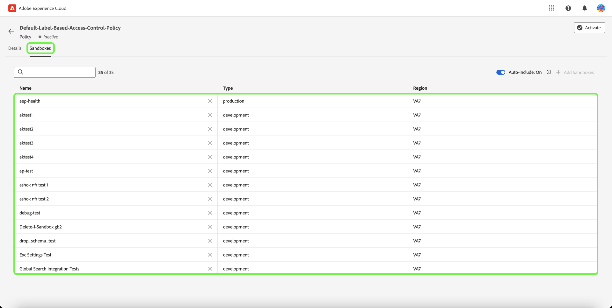

# アクセス制御ポリシーの管理

アクセス制御ポリシーとは、属性を統合して、許容されるアクションと許容されないアクションを確立するステートメントです。 アクセスポリシーは、ローカルまたはグローバルに設定でき、他のポリシーを上書きできます。 Adobeには、すぐにアクティブ化することも、組織がラベルに基づいて特定のオブジェクトへのアクセス制御を開始する準備が整ったときにアクティブ化できるデフォルトのポリシーが用意されています。 デフォルトのポリシーでは、ユーザーが対応するラベルを持つ役割にいない限り、リソースに適用されたラベルを利用してアクセスを拒否します。

>[!IMPORTANT]
>
>アクセスポリシーは、組織内のどのユーザーがアクセス権を持つかではなく、Adobe Experience Platformでのデータの使用方法を制御するデータ使用ポリシーと混同しないでください。 作成に関するガイドを参照してください。 [データ使用ポリシー](../../../data-governance/policies/create.md) を参照してください。

<!-- ## Create a new policy

To create a new policy, select the **[!UICONTROL Policies]** tab in the sidebar and select **[!UICONTROL Create Policy]**.

The **[!UICONTROL Create a new policy]** dialog appears, prompting you to enter a name, and an optional description. When finished, select **[!UICONTROL Confirm]**.

Using the dropdown arrow select if you would like to **Permit access to** () a resource or **Deny access to** () a resource.

Next, select the resource that you would like to include in the policy using the dropdown menu and search access type, read or write.

Next, using the dropdown arrow select the condition you would like to apply to this policy, **The following being true** () or **The following being false** ().

Select the plus icon to **Add matches expression** or **Add expression group** for the resource. 

Using the dropdown, select the **Resource**.

Next, using the dropdown select the **Matches**.

Next, using the dropdown, select the type of label (**[!UICONTROL Core label]** or **[!UICONTROL Custom label]**) to match the label assigned to the User in roles.

Finally, select the **Sandbox** that you would like the policy conditions to apply to, using the dropdown menu.

Select **Add resource** to add more resources. Once finished, select **[!UICONTROL Save and exit]**.

The new policy is successfully created, and you are redirected to the **[!UICONTROL Policies]** tab, where you will see the newly created policy appear in the list. 

## Edit a policy

To edit an existing policy, select the policy from the **[!UICONTROL Policies]** tab. Alternatively, use the filter option to filter the results to find the policy you want to edit.

Next, select the ellipsis (`…`) next to the policies name, and a dropdown displays controls to edit, deactivate, delete, or duplicate the role. Select edit from the dropdown.

The policy permissions screen appears. Make the updates then select **[!UICONTROL Save and exit]**.

The policy is successfully updated, and you are redirected to the **[!UICONTROL Policies]** tab.

## Duplicate a policy

To duplicate an existing policy, select the policy from the **[!UICONTROL Policies]** tab. Alternatively, use the filter option to filter the results to find the policy you want to edit.

Next, select the ellipsis (`…`) next to a policies name, and a dropdown displays controls to edit, deactivate, delete, or duplicate the role. Select duplicate from the dropdown.

The **[!UICONTROL Duplicate policy]** dialog appears, prompting you to confirm the duplication. 

The new policy appears in the list as a copy of the original on the **[!UICONTROL Policies]** tab.

## Delete a policy

To delete an existing policy, select the policy from the **[!UICONTROL Policies]** tab. Alternatively, use the filter option to filter the results to find the policy you want to delete.

Next, select the ellipsis (`…`) next to a policies name, and a dropdown displays controls to edit, deactivate, delete, or duplicate the role. Select delete from the dropdown.

The **[!UICONTROL Delete user policy]** dialog appears, prompting you to confirm the deletion. 

You are returned to the **[!UICONTROL policies]** tab and a confirmation of deletion pop over appears.

 -->

## サンドボックスのポリシーを設定する

>[!IMPORTANT]
>
>デフォルトでは、 [!UICONTROL 自動インクルード] の機能はすべての顧客に対して有効になっています。つまり、すべてのサンドボックスがポリシーに追加されます。

>[!NOTE]
>
>The **[!UICONTROL Default-Label-Based-Access-Control-Policy]** ポリシーは現在、設定で使用できる唯一のポリシーです。

ポリシーに関連付けられたサンドボックスを表示するには、 **[!UICONTROL ポリシー]** タブをクリックします。

次に、ポリシーを選択し、「 」を選択します。 **[!UICONTROL サンドボックス]** タブをクリックします。 ポリシーに関連付けられているサンドボックスのリストが表示されます。

### すべてのサンドボックスにポリシーを追加する

以下を使用します。 **[!UICONTROL 自動インクルード]** オンに切り替える **[!UICONTROL サンドボックス]** タブをクリックして、すべてのサンドボックスのポリシーを有効にします。

![The [!UICONTROL サンドボックス] タブ [!UICONTROL 自動インクルード] 切り替え](../../images/flac-ui/abac-policies-auto-include.png)

The **[!UICONTROL 自動インクルードを有効にする]** 選択を確認するダイアログが表示されます。 選択 **[!UICONTROL 有効にする]** をクリックして設定を完了します。

![The [!UICONTROL 自動インクルードを有効にする] ダイアログの強調表示 [!UICONTROL 有効にする].](../../images/flac-ui/abac-policies-auto-include-enable.png)

>[!SUCCESS]
>
>このポリシーは、既存のすべてのサンドボックスに対して有効化され、新しいサンドボックスが利用可能になると自動的に追加されます。

### サンドボックスを選択するためのポリシーを追加

>[!IMPORTANT]
>
>今後のサンドボックスは、 [!UICONTROL 自動インクルード] 切り替えがオフになっている。 サンドボックスを手動で管理し、ポリシーに追加する必要があります。

以下を使用します。 **[!UICONTROL 自動インクルード]** オンに切り替える **[!UICONTROL サンドボックス]** タブをクリックして、すべてのサンドボックスのポリシーを無効にします。

![The [!UICONTROL サンドボックス] タブ [!UICONTROL 自動インクルード] 切り替え](../../images/flac-ui/abac-policies-auto-include.png)

次から： **[!UICONTROL サンドボックス]** タブ、選択 **[!UICONTROL サンドボックスを追加]** ：このポリシーを適用するサンドボックスを選択します。

![The [!UICONTROL サンドボックス] タブに、ポリシーに追加されたサンドボックスのリストが表示されます。](../../images/flac-ui/abac-policies-sandboxes-tab-add.png)

サンドボックスのリストが表示されます。 リストから追加するサンドボックスを選択します。 または、検索バーを使用してサンドボックスを検索します。 「**[!UICONTROL 保存]**」を選択します。

![The [!UICONTROL サンドボックスを追加] ポリシーに追加できる既存のサンドボックスのリストを示すページ。](../../images/flac-ui/abac-policies-sandboxes-list.png)

>[!SUCCESS]
>
>選択したサンドボックスは、ポリシーに正常に追加されました。

### ポリシーからサンドボックスを削除する

サンドボックスを削除するには、 **X** サンドボックス名の横にあるアイコン。

![The [!UICONTROL サンドボックス] タブでサンドボックスのリストを表示し、 [!UICONTROL X] を削除します。](../../images/flac-ui/abac-policies-remove-sandbox-x.png)

The **[!UICONTROL 削除]** 選択を確認するダイアログが表示されます。 選択 **[!UICONTROL 確認]** をクリックして削除を完了します。

![The [!UICONTROL 削除] ダイアログの強調表示 [!UICONTROL 確認].](../../images/flac-ui/abac-policies-remove-sandbox.png)

>[!SUCCESS]
>
>選択したサンドボックスは、ポリシーから正常に削除されました。

## ポリシーのアクティベート

既存のポリシーをアクティブにするには、「**[!UICONTROL ポリシー]**」タブをクリックします。

次に、省略記号（`…`）をクリックします。ドロップダウンに、役割を編集、アクティブ化、削除または複製するためのコントロールが表示されます。 ドロップダウンから「アクティブ化」を選択します。

The **[!UICONTROL ポリシーを有効化]** ダイアログが表示され、アクティベーションを確認するプロンプトが表示されます。

「 **[!UICONTROL ポリシー]** 」タブが開き、アクティベーションを確認するポップアップが表示されます。ポリシーのステータスはアクティブと表示されます。

## 次の手順

ポリシーがアクティブ化されている場合は、次の手順に進んで、 [ロールの権限の管理](permissions.md).
