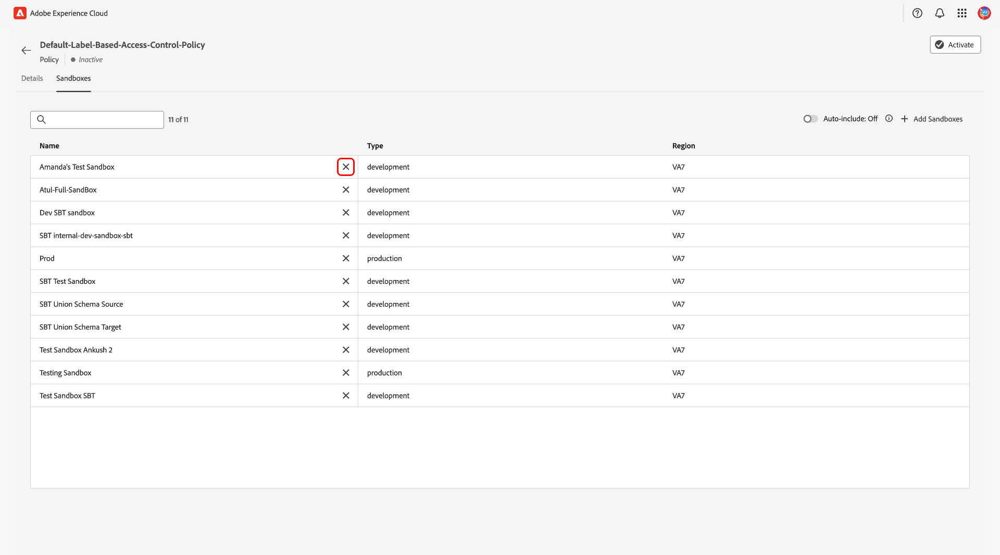

# アクセス制御ポリシーの管理

アクセス制御ポリシーとは、属性を統合して、許容されるアクションと許容されないアクションを規定するステートメントです。 Adobeには、すぐにアクティブ化できる、または組織が [&#x200B; ラベル &#x200B;](./labels.md){target="_blank"} に基づいて特定のオブジェクトへのアクセスの制御を開始する準備ができたときにアクティブ化できるデフォルトのポリシーが用意されています。 デフォルトのポリシー **[!UICONTROL Default-Label-Based-Access-Control-Policy]** は、リソースに適用されるラベルを活用して、ラベルが一致する役割にユーザーがない限りアクセスを拒否します。

>[!IMPORTANT]
>
>アクセス制御ポリシーを、Adobe Experience Platformでのデータの使用方法を制御するデータ使用ポリシーと混同しないでください。 詳しくは、[&#x200B; データ使用ポリシー &#x200B;](../../../data-governance/policies/create.md){target="_blank"} の作成に関するガイドを参照してください。

## サンドボックスのポリシーの設定 {#configure-policy}

>[!NOTE]
>
>**[!UICONTROL Default-Label-Based-Access-Control-Policy]** ポリシーは現在、設定に使用できる唯一のポリシーです。

ポリシーの設定を開始するには、**[!UICONTROL Permissions]** Adobe Experience Cloud[&#x200B; の &#x200B;](https://experience.adobe.com/){target="_blank"} に移動します。 左パネルから「**[!UICONTROL Policies]**」を選択します。 リストから **[!UICONTROL Default-Label-Based-Access-Control-Policy]** を選択します。

{zoomable="yes"}

ポリシーの詳細ワークスペースが表示されます。 「**[!UICONTROL Sandboxes]**」を選択します。ポリシーに関連付けられているサンドボックスのリストが表示されます。

{zoomable="yes"}

### すべてのサンドボックスにポリシーを追加 {#add-policy-to-all}

>[!IMPORTANT]
>
>デフォルトでは、**[!UICONTROL Auto-include]** がオンになっています。つまり、現在と将来のすべてのサンドボックスが自動的にポリシーに追加されます。

**[!UICONTROL Auto-include]** 機能をオフにして、今後のサンドボックスがポリシーに自動的に追加されないようにします。 機能をオフに切り替えると **ポリシーからサンドボックスが削除されません**。

{zoomable="yes"}

ポリシー **[!UICONTROL Auto-include]** アクティブでない場合は、切り替えスイッチを使用してオンに戻すことができます。 選択を確認するように求める **[!UICONTROL Enable Auto-include]** ダイアログが表示されます。 「**[!UICONTROL Enable]**」を選択して、設定を完了します。

>[!NOTE]
>
>オフに切り替えられてい **[!UICONTROL Auto-include]** 間にポリシーから削除したサンドボックスは、再度追加されます。

{zoomable="yes"}

### ポリシーのサンドボックスの手動選択 {#manually-select-sandboxes}

ポリシーにサンドボックスを手動で追加または削除するには、「**[!UICONTROL Auto-include]**」切替スイッチ **必須** をオフにします。

#### サンドボックスの追加

サンドボックスをポリシーに追加するには、「**[!UICONTROL Add Sandboxes]**」を選択します。

{zoomable="yes"}

**[!UICONTROL Add Sandboxes]** ダイアログが表示されます。 ポリシーに追加するサンドボックスを選択して、「**[!UICONTROL Save]**」を選択します。

{zoomable="yes"}

>[!NOTE]
>
>使用可能なすべてのサンドボックスが既にポリシーに追加されている場合は、ダイアログ内に「ライブラリに何もありません」というメッセージが表示されます。

#### サンドボックスの削除

ポリシーからサンドボックスを削除するには、削除するサンドボックスをリストから見つけて、「**X**」アイコンを選択します。

{zoomable="yes"}

確認ダイアログが表示されます。 「**[!UICONTROL Confirm]**」を選択して、ポリシーからのサンドボックスの削除を完了します。

{zoomable="yes"}

## ポリシーのアクティベート {#activate-policy}

>[!CONTEXTUALHELP]
>id="platform_permissions_policies_about"
>title="ポリシーとは"
>abstract="ポリシーとは、属性を統合して、許容されるアクションと許容されないアクションを確立するステートメントです。どの組織にもデフォルトのポリシーがあります。このポリシーをアクティブ化して、ラベルに基づいて特定のオブジェクトへのアクセスの制御を開始する必要があります。リソースに適用されたラベルは、ラベルが一致する役割にユーザーが割り当てられていない限り、アクセスを拒否します。ポリシーを編集または削除できませんが、アクティブ化または非アクティブ化することはできます。"
>additional-url="https://experienceleague.adobe.com/ja/docs/experience-platform/access-control/abac/permissions-ui/labels" text="ラベルの管理"

既存のポリシーをアクティブにするには、**[!UICONTROL Policies]** の「**[!UICONTROL Permissions]**」タブからポリシーを選択します。 ポリシーのアクティベーションステータスは、「アクティベー **[!UICONTROL Status]**」セクションに表示されます。

{zoomable="yes"}

ポリシーの詳細ワークスペースが表示されます。 **[!UICONTROL Activate]** を選択します。

{zoomable="yes"}

**[!UICONTROL Activate Policy]** ダイアログが表示されます。 「**[!UICONTROL Confirm]**」を選択して、ポリシーのアクティブ化を完了します。

{zoomable="yes"}

## 次の手順

ポリシーをアクティブにすると、次の手順 [&#x200B; 役割の権限の管理 &#x200B;](permissions.md) に進むことができます。

<!--Policies are applied at the sandbox level to control which sandboxes enforce label-based access control. By default, the **[!UICONTROL Auto-include]** feature is turned on, which means all current and future sandboxes are automatically added to the policy. When **[!UICONTROL Auto-include]** is turned off, only the sandboxes you manually add will be subject to the policy's access control rules.

To begin configuring a policy's sandboxes, navigate to **[!UICONTROL Permissions]** in [Adobe Experience Cloud](https://experience.adobe.com/){target="_blank"}. Select **[!UICONTROL Policies]** from the left panel, then select the **[!UICONTROL Default-Label-Based-Access-Control-Policy]** from the list.

The policy's details workspace appears. Select the **[!UICONTROL Sandboxes]** tab to view the list of sandboxes associated with the policy and access the sandbox configuration options.

### Manage Auto-include {#manage-auto-include}

To control which sandboxes are included in a policy, you can toggle the **[!UICONTROL Auto-include]** feature on or off. When you toggle off **[!UICONTROL Auto-include]**, future sandboxes will not be automatically added to the policy. However, toggling off the feature **will not** remove any sandboxes that are already included in the policy.

To re-enable **[!UICONTROL Auto-include]**, use the toggle to turn it back on. The **[!UICONTROL Enable Auto-include]** dialog appears prompting you to confirm your selection. Select **[!UICONTROL Enable]** to complete the configuration setting.

>[!NOTE]
>
>When you re-enable **[!UICONTROL Auto-include]**, any sandboxes you previously removed from the policy will be re-added.

### Manually manage sandboxes {#manually-manage-sandboxes}

When **[!UICONTROL Auto-include]**is turned off, you can manually add or remove specific sandboxes from the policy. This gives you precise control over which sandboxes enforce the policy's access control rules.

>[!NOTE]
>
>To manually add or remove sandboxes, the **[!UICONTROL Auto-include]** toggle **must** be off.

**To add sandboxes:**

Select **[!UICONTROL Add Sandboxes]** from the policy's sandbox workspace.

The **[!UICONTROL Add Sandboxes]** dialog appears, displaying your library of available sandboxes. Select the sandbox(es) you wish to add to the policy and then select **[!UICONTROL Save]**.

>[!NOTE]
>
>If all available sandboxes are already included in the policy, you will see a "You have nothing in your library" message within the dialog.

**To remove sandboxes:**

Find the sandbox you wish to remove from the list and select the **X** icon next to its name.

A confirmation dialog will appear. Select **[!UICONTROL Confirm]** to finish removing the sandbox from the policy.

-->