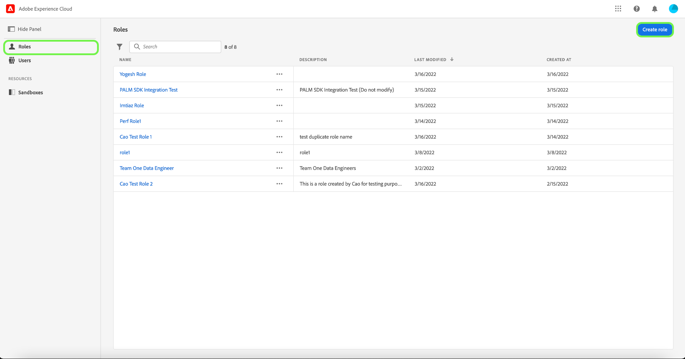

# 役割の管理

役割は、管理者、スペシャリスト、またはエンドユーザーが組織のリソースに対して持つアクセス権を定義します。 役割ベースのアクセス制御環境では、ユーザーアクセスプロビジョニングは、共通の責務とニーズを通じてグループ化されます。 ロールには、特定の権限のセットがあり、組織のメンバーは、必要な表示または書き込みアクセスの範囲に応じて、1 つ以上のロールに割り当てることができます。

## 新しいロールを作成

新しいロールを作成するには、 **[!UICONTROL 役割]** サイドバーの「 」タブで「 」を選択し、 **[!UICONTROL ロールを作成]**.

この **[!UICONTROL 新しいロールを作成]** ダイアログが表示され、名前とオプションの説明を入力するよう求められます。

終了したら、「 」を選択します。 **[!UICONTROL 確認]**.

次に、役割に含めるリソース権限をドロップダウンメニューで選択します。

リソースを追加するには、「 **[!UICONTROL Adobe Experience Platform]** 左側のナビゲーションパネルから、リソースのリストを表示します。 または、左側のナビゲーションパネルの検索バーにリソース名を入力します。

関連するリソースをクリックしてドラッグし、メインパネルにドロップします。

役割に含めるリソース権限をドロップダウンメニューで選択します。 ロールに含めるすべてのリソースに対して、この手順を繰り返します。 終了したら、「 」を選択します。 **[!UICONTROL 保存して終了]**.

新しい役割が正常に作成され、にリダイレクトされます。 **[!UICONTROL 役割]** 新しく作成された役割がリストに表示されるページです。

詳しくは、 [ロールの権限の管理](#manage-permissions-for-a-role) ロールの権限を作成後に管理する方法の詳細については、を参照してください。

## ロールを複製

既存の役割を複製するには、 **[!UICONTROL 役割]** タブをクリックします。 または、「フィルター」オプションを使用して結果をフィルターし、複製する役割を見つけます。

次に、 **[!UICONTROL 複製]** 画面の右上から、

この **[!UICONTROL 重複した役割]** ダイアログが表示され、複製を確認するよう求められます。

次に、役割の詳細ページが表示され、役割の名前と権限を変更できます。 詳細、ラベル、サンドボックスは、以前の役割から複製されます。 ユーザーは、「ユーザー」タブから追加する必要があります。 次の項目を表示すると、 [ロールの権限の管理](permissions.md) 詳細、ラベル、サンドボックス、ユーザーを役割に追加する方法について詳しくは、ドキュメントを参照してください。

左向き矢印をクリックして、 **[!UICONTROL 役割]** タブをクリックします。

新しい役割が **[!UICONTROL 役割]** ページ。

## ロールの削除

省略記号 (`…`) をクリックし、ロール名の横に表示されます。また、ドロップダウンに、ロールを編集、削除、複製するためのコントロールが表示されます。 ドロップダウンから「削除」を選択します。

この **[!UICONTROL ユーザーロールを削除]** ダイアログが表示され、削除を確認するプロンプトが表示されます。

次の場所に戻ります： **[!UICONTROL 役割]** タブをクリックします。

## 次の手順

新しいロールを作成したら、次の手順に進んで、 [ロールの権限の管理](permissions.md).
