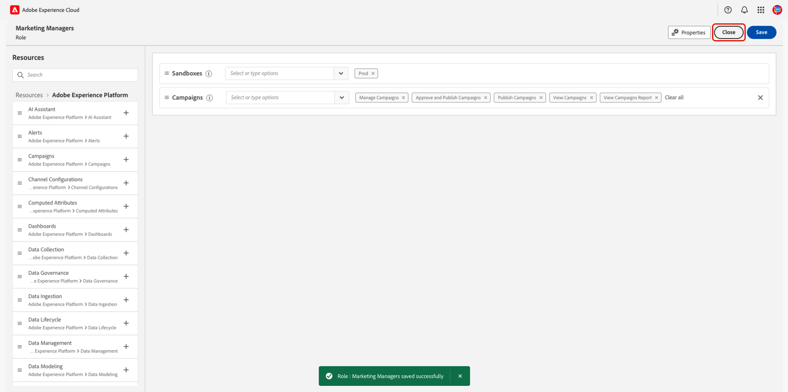
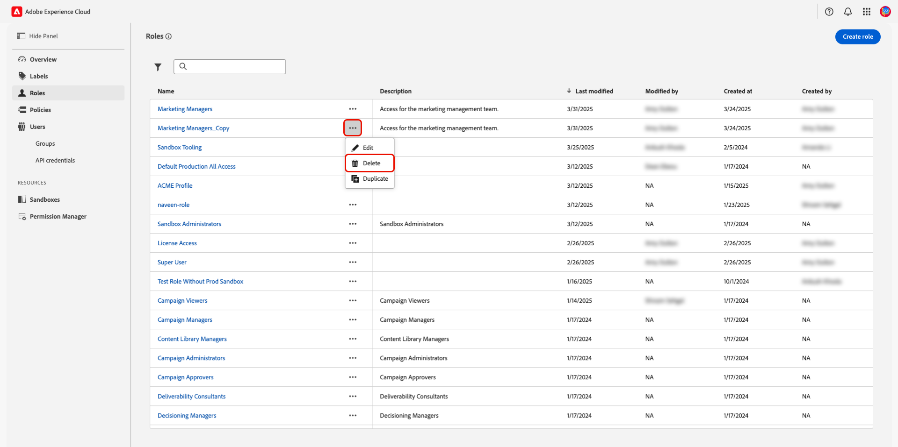

# 役割の管理

<!-- UPDATE ROLES WITH A MORE COMPREHENSIVE EXPLANATION -->

役割の管理を開始するには、**[!UICONTROL Permissions]** Adobe Experience Cloudの [&#x200B; に移動し &#x200B;](https://experience.adobe.com/){target="_blank"} 左パネルで「**[!UICONTROL Roles]**」を選択します。

## 新しい役割の作成 {#create-new-role}

>[!CONTEXTUALHELP]
>id="platform_permissions_roles_about_create"
>title="新しい役割の作成"
>abstract="新しい役割を作成すると、Experience Platform インスタンスとやり取りするユーザーをより適切に分類できます。例えば、社内マーケティングチームの役割を作成し、その役割に規制医療データ（RHD）ラベルを適用して、社内マーケティングチームが保護された医療情報（PHI）にアクセスできるようにすることができます。または、外部エージェンシーの役割を作成したうえで、その役割に RHD ラベルを適用しないことにより、その役割の PHI データへのアクセスを拒否することもできます。"
>additional-url="https://experienceleague.adobe.com/docs/experience-platform/access-control/abac/permissions-ui/roles.html?lang=ja" text="役割の作成"
>additional-url="https://experienceleague.adobe.com/ja/docs/experience-platform/access-control/abac/end-to-end-guide#label-roles" text="役割へのラベルの適用"

新しい役割を作成するには、「**[!UICONTROL Create role]**」を選択します。

>[!TIP]
>
>読み取り専用の役割は、すぐに使用できます。 読み取り専用の役割は、システムの状態を変更する機能を持たないユーザーに、データ、設定および UI 機能の表示を許可する役割です。 管理者はこれらの役割を編集できませんが、ユーザーを役割に関連付けることができます。

**[!UICONTROL Create new role]** ダイアログが表示されます。 役割の **[!UICONTROL Name]** を入力し、必要に応じて **[!UICONTROL Description]** を入力して、「**[!UICONTROL Confirm]**」を選択します。

**[!UICONTROL Resources]** ワークスペースが表示されます。 スクロールするか、左側のパネルの検索バーにリソースの名前を入力して、必要なリソースを見つけます。 リソースを追加するには、リソース名の横にある  を選択します。

<!-- ADD IN NOTE ABOUT THE DEFAULT SANDBOX - THIS SHOULD BE MENTIONED IN THE HIGHER LEVEL DOCS, WE MAY BE ABLE TO LINK TO IT -->

リソースがメインワークスペースに追加されます。 リソース名の横にあるドロップダウンを選択し、役割に追加する権限を選択します。 個別に選択したり、**[!UICONTROL Add all]** を選択したり、検索バーに権限名を入力して特定の権限を検索したりできます。

引き続き、役割に追加するすべてのリソースと権限を選択します。 完了したら、「**[!UICONTROL Save]**」を選択します。

役割が正常に保存されたことを示すアラートが表示されます。 「**[!UICONTROL Close]**」を選択して **[!UICONTROL Roles]** ワークスペースに戻ります。

新しい役割が正常に作成されると、**[!UICONTROL Roles]** ページにリダイレクトされ、新しく作成された役割がリストに表示されます。

<!-- The following video is intended to support your understanding of creating a new role and managing users for that role.

>[!VIDEO](https://video.tv.adobe.com/v/336081/?learn=on) -->

## 役割の複製

役割を複製すると、詳細、権限、ラベル、サンドボックスがコピーされます。 ユーザー、ユーザーグループおよび API 資格情報 **ではない** はコピーされ、役割に手動で追加する必要があります。

既存の役割を複製するには、複製する役割を「**[!UICONTROL Roles]**」タブで探します。 役割名の横にある  アイコンを選択し、ドロップダウンメニューから「**[!UICONTROL Duplicate]**」を選択します。

重複確認ダイアログが表示されます。 役割の複製を完了するには、「**[!UICONTROL Confirm]**」を選択します。 新しい役割は、同じ名前で保存され、`_Copy` がサフィックスとして追加されます。

または、個々の役割のワークスペース内から役割を複製できます。 **[!UICONTROL Roles]** ワークスペースから複製する役割を選択し、「複製」を選択し **[!UICONTROL Duplicate]** す。

重複確認ダイアログが表示されます。 役割の複製を完了するには、「**[!UICONTROL Confirm]**」を選択します。 新しい役割にリダイレクトされます。

## 役割の削除

ロールを削除するには、削除するロールを「**[!UICONTROL Roles]**」タブで探します。 役割名の横にある  アイコンを選択し、ドロップダウンメニューから「**[!UICONTROL Delete]**」を選択します。

削除の確認ダイアログが表示されます。 「**[!UICONTROL Confirm]**」を選択して、役割の削除を終了します。

または、個々の役割のワークスペース内から役割を削除できます。 **[!UICONTROL Roles]** ワークスペースから削除する役割を選択し、「削 **[!UICONTROL Delete]**」を選択します。

削除の確認ダイアログが表示されます。 「**[!UICONTROL Confirm]**」を選択して、役割の削除を終了します。

<!-- ADD PERMISSIONS TO THIS PAGE -->

## 次の手順

新しい役割を作成したら、次の手順 [&#x200B; 役割の権限を管理 &#x200B;](permissions.md) に進むことができます。
