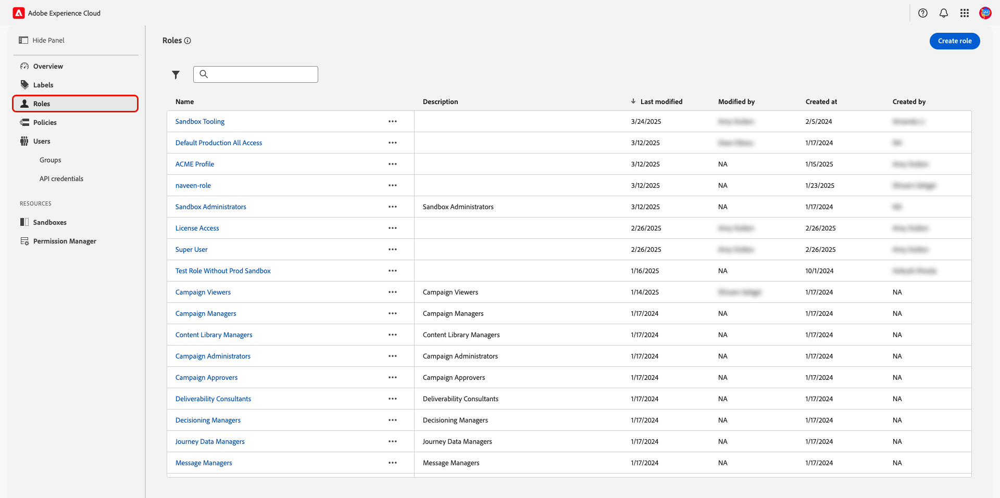
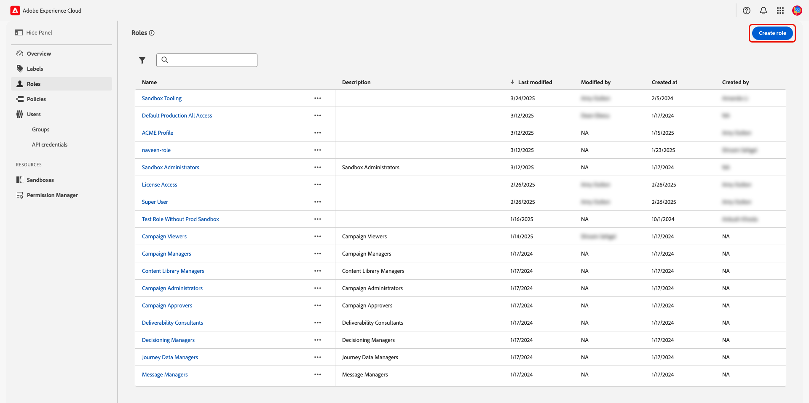
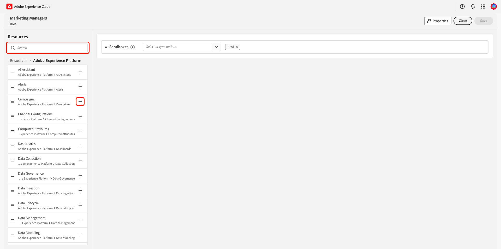
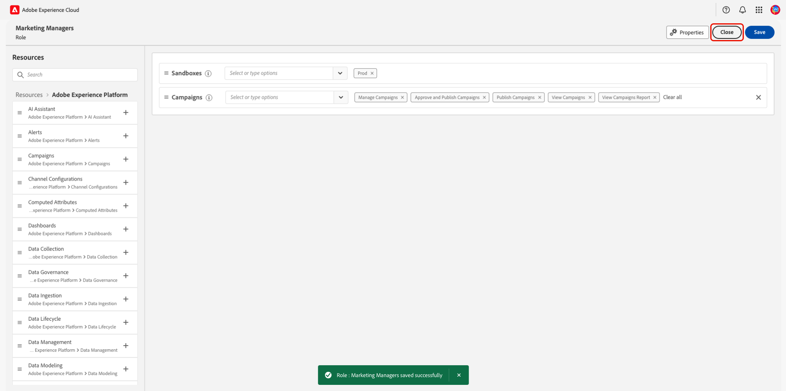
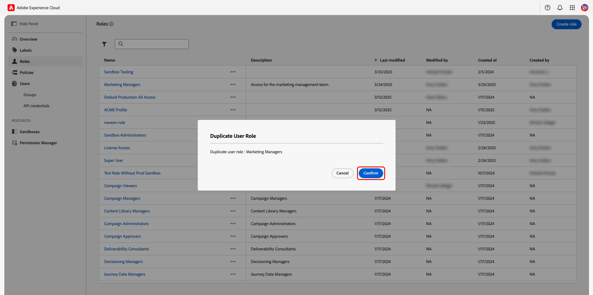

# 役割の管理

<!-- UPDATE ROLES WITH A MORE COMPREHENSIVE EXPLANATION -->

役割の管理を開始するには、**[!UICONTROL Permissions]** Adobe Experience Cloud[の](https://experience.adobe.com/){target="_blank"}に移動し、左側のパネルで&#x200B;**[!UICONTROL Roles]**&#x200B;を選択します。

## 新しい役割の作成 {#create-new-role}

>[!CONTEXTUALHELP]
>id="platform_permissions_roles_about_create"
>title="新しい役割の作成"
>abstract="新しい役割を作成すると、Experience Platform インスタンスとやり取りするユーザーをより適切に分類できます。例えば、社内マーケティングチームの役割を作成し、その役割に規制医療データ（RHD）ラベルを適用して、社内マーケティングチームが保護された医療情報（PHI）にアクセスできるようにすることができます。または、外部エージェンシーの役割を作成したうえで、その役割に RHD ラベルを適用しないことにより、その役割の PHI データへのアクセスを拒否することもできます。"
>additional-url="https://experienceleague.adobe.com/docs/experience-platform/access-control/abac/permissions-ui/roles.html?lang=ja" text="役割の作成"
>additional-url="https://experienceleague.adobe.com/ja/docs/experience-platform/access-control/abac/end-to-end-guide#label-roles" text="役割へのラベルの適用"

新しい役割を作成するには、**[!UICONTROL Create role]**&#x200B;を選択します。

>[!TIP]
>
>読み取り専用の役割は、すぐに使用できます。 読み取り専用の役割とは、システムの状態を変更することなく、データ、設定、UIの機能を表示する機能をユーザーに付与する役割です。 管理者はこれらの役割を編集することはできませんが、ユーザーを役割に関連付けることができます。

**[!UICONTROL Create new role]** ダイアログが表示されます。 役割の&#x200B;**[!UICONTROL Name]**&#x200B;を入力し、オプションで&#x200B;**[!UICONTROL Description]**&#x200B;を入力して、**[!UICONTROL Confirm]**&#x200B;を選択します。

**[!UICONTROL Resources]** ワークスペースが表示されます。 スクロールするか、左側のパネルの検索バーにリソースの名前を入力して、必要なリソースを見つけます。 リソース名の横にあるを選択して、リソースを追加します。

<!-- ADD IN NOTE ABOUT THE DEFAULT SANDBOX - THIS SHOULD BE MENTIONED IN THE HIGHER LEVEL DOCS, WE MAY BE ABLE TO LINK TO IT -->

リソースがメインワークスペースに追加されます。 リソース名の横にあるドロップダウンを選択し、役割に追加する権限を選択します。 個別に選択したり、**[!UICONTROL Add all]**&#x200B;を選択したり、検索バーに権限名を入力して特定の権限を見つけることができます。

役割に追加するすべてのリソースと権限を引き続き選択します。 完了したら、**[!UICONTROL Save]**&#x200B;を選択します。

役割が正常に保存されたことを示すアラートが表示されます。 「**[!UICONTROL Close]**」を選択して、**[!UICONTROL Roles]** ワークスペースに戻ります。

新しい役割が正常に作成され、新しく作成された役割がリストに表示される&#x200B;**[!UICONTROL Roles]** ページにリダイレクトされます。

<!-- 
The following video is intended to support your understanding of creating a new role and managing users for that role.

>[!VIDEO](https://video.tv.adobe.com/v/336081/?learn=on) 
-->

## 役割の複製

役割を複製すると、詳細、権限、ラベル、サンドボックスがコピーされます。 ユーザー、ユーザーグループ、およびAPI資格情報&#x200B;**は**&#x200B;にコピーされていないため、役割に手動で追加する必要があります。

既存の役割を複製するには、**[!UICONTROL Roles]** タブ内で複製する役割を見つけます。 役割の名前の横にあるを選択し、ドロップダウンメニューから&#x200B;**[!UICONTROL Duplicate]**&#x200B;を選択します。

重複確認ダイアログが表示されます。 役割の複製を終了するには、**[!UICONTROL Confirm]**&#x200B;を選択します。 新しい役割は同じ名前で保存され、`_Copy`がサフィックスとして追加されます。

または、個々の役割のワークスペース内から役割を複製することもできます。 **[!UICONTROL Roles]** ワークスペースから複製する役割を選択し、**[!UICONTROL Duplicate]**&#x200B;を選択します。

重複確認ダイアログが表示されます。 役割の複製を終了するには、**[!UICONTROL Confirm]**&#x200B;を選択します。 新しい役割にリダイレクトされます。

## 役割の削除

役割を削除するには、**[!UICONTROL Roles]** タブ内で削除する役割を見つけます。 役割の名前の横にあるを選択し、ドロップダウンメニューから&#x200B;**[!UICONTROL Delete]**&#x200B;を選択します。

削除確認ダイアログが表示されます。 役割の削除を完了するには、**[!UICONTROL Confirm]**&#x200B;を選択します。

または、個々の役割のワークスペース内から役割を削除することもできます。 **[!UICONTROL Roles]** ワークスペースから削除する役割を選択し、**[!UICONTROL Delete]**&#x200B;を選択します。

削除確認ダイアログが表示されます。 役割の削除を完了するには、**[!UICONTROL Confirm]**&#x200B;を選択します。

<!-- ADD PERMISSIONS TO THIS PAGE -->

## 次の手順

新しい役割を作成したら、次の手順に進み、[役割の権限を管理](permissions.md)できます。
