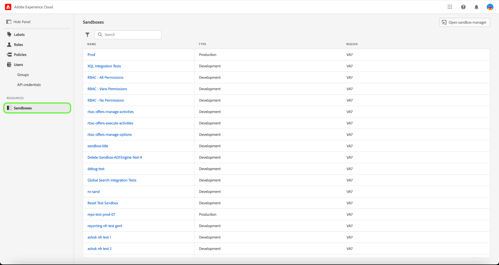
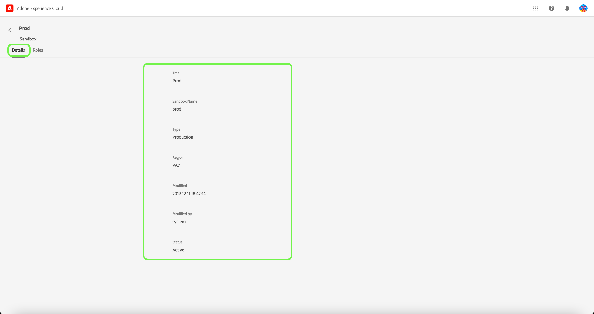

# サンドボックスの管理

サンドボックスは、Experience Platform の単一のインスタンス内の仮想パーティションで、デジタルエクスペリエンスアプリケーションの開発プロセスとシームレスに統合できます。サンドボックス内で実行されるすべてのコンテンツとアクションは、そのサンドボックスのみに限定され、他のサンドボックスには影響しません。サンドボックスについて詳しくは、 [サンドボックスの概要](../../../sandboxes/home.md).

## サンドボックスの設定

サンドボックスが割り当てられている（または割り当てられている）詳細と役割を表示するには、 **[!UICONTROL サンドボックス]** タブをクリックします。

サンドボックスのリストが表示されます。 リストから表示するサンドボックスを選択します。 または、検索バーを使用してサンドボックス名を入力し、サンドボックスを検索します。

「詳細」タブには、サンドボックスの概要が表示されます。 概要には、サンドボックスの名前、タイプ、地域、変更日、サンドボックスを変更したユーザー、サンドボックスのステータスが表示されます。

を選択します。 **[!UICONTROL 役割]** タブをクリックし、サンドボックスが割り当てられている役割を表示します。

## 次の手順

サンドボックスの詳細と、現在割り当てられている役割の表示方法を学びました。 Experience Platformのサンドボックスの概要については、 [サンドボックスの概要ドキュメント](../../sanboxes/../ui/overview.md).
