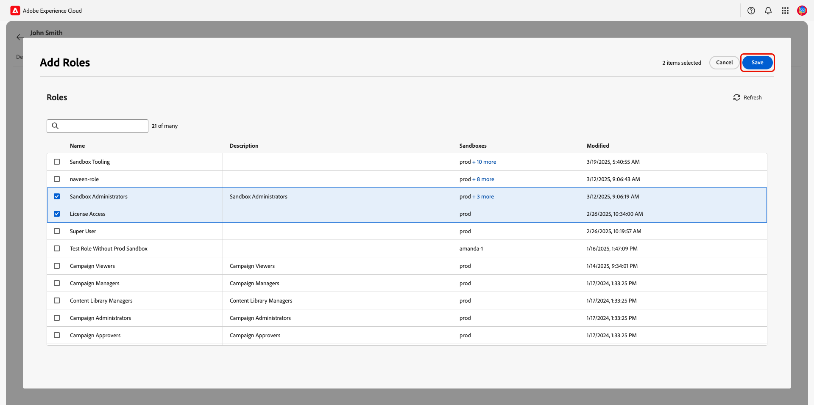
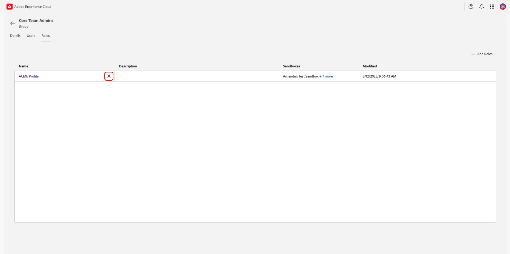

# ユーザーの管理とユーザーグループの追加 {#manage-users}

>[!CONTEXTUALHELP]
>id="platform_permissions_users_about"
>title="ユーザーとは"
>abstract="ユーザーは、Experience Platform へのアクセス権が付与された個人です。個々のユーザーの組織のリソースへのアクセスは、役割を通じて管理されます。"
>additional-url="https://experienceleague.adobe.com/ja/docs/experience-platform/access-control/abac/permissions-ui/roles" text="役割の管理"

ユーザーは、Adobe Experience Platformにアクセスできる個人です。 個々のユーザーによる組織のリソースへのアクセスは、[ 役割 ](./roles.md){target="_blank"} を通じて管理されます。 また、組織では [ ユーザーグループ ](#user-groups) を作成して、複数のユーザーに同時にシームレスにアクセスできるようにすることもできます。 ユーザーはAdmin Consoleで管理され、Adobe Experience Platform製品カードに関連付けられているユーザーはExperience Platformのユーザーリストの一部として表示されます。

## ユーザーの管理

<!-- ADD LINKS INTO IMPORTANT NOTE BELOW
>[!IMPORTANT]
>
>[!UICONTROL Permissions] manages access control for existing Experience Platform users. To add users to Experience Platform, navigate to Adobe Admin Console through the **[!UICONTROL Edit in admin console]** option. To learn how to add users through the Admin Console, follow the [adding users to Experience Platform](...){#target="_blank"} guide.
-->

組織のユーザーを表示するには、**[!UICONTROL Permissions]** Adobe Experience Cloud[ の ](https://experience.adobe.com/){target="_blank"} に移動します。 左パネルで「**[!UICONTROL Users]**」を選択します。

{zoomable="yes"}

ユーザーのリストが表示されます。 表示するユーザーをリストから選択します。 または、検索バーを使用して、名前またはメールアドレスを入力してユーザーを検索します。

「**[!UICONTROL Details]**」タブには、ユーザーの概要が表示されます。 概要には、ユーザーの **[!UICONTROL Name]**、**[!UICONTROL Preferred languages]**、**[!UICONTROL Account Type]**、**[!UICONTROL Authentication ID]**、**[!UICONTROL Email]**、**[!UICONTROL Email verified]** のステータス、**[!UICONTROL Country code]** および **[!UICONTROL Phone number]** が表示されます。

{zoomable="yes"}

「**[!UICONTROL Roles]**」タブを選択して、ユーザーが割り当てられているロールを表示します。

{zoomable="yes"}

### ユーザーへの役割の追加 {#add-user-role}

ユーザーに役割を追加するには、「**[!UICONTROL Add Roles]**」を選択します。

{zoomable="yes"}

**[!UICONTROL Add Roles]** ダイアログが表示されます。 ユーザーに追加する役割を選択してから、「**[!UICONTROL Save]**」を選択します。

{zoomable="yes"}

### ユーザーからの役割の削除 {#remove-user-role}

ユーザーから役割を削除するには、役割名の横にある **X** を選択します。

<!-- ADD LINKS INTO IMPORTANT NOTE BELOW

>[!NOTE]
>
>Role's that have been added to a user through a user group cannot be removed through the user's role workspace. Role's that have been added through a user group will have an [!Info icon](/help/images/icons/info.png) beside the **X** containing information about the associated user group. To remove the role, the role would need to be [removed from the user group](#remove-user-group-role).
-->

{zoomable="yes"}

確認ダイアログが表示されます。 **[!UICONTROL Confirm]** を選択して、役割の削除を完了します。

{zoomable="yes"}

## ユーザーグループの管理 {#user-groups}

ユーザーグループとは、同じ機能を実行するためのアクセス権を持つ、グループ化された複数のユーザーのことです。

<!-- ADD LINKS INTO IMPORTANT NOTE BELOW
>[!IMPORTANT]
>
>[!UICONTROL Permissions] manages access control for existing Experience Platform user groups. To add user groups to Experience Platform, navigate to Admin Console through the **[!UICONTROL Edit in admin console]** option. To learn how to add user groups in the Admin Console, follow the [adding user groups to Experience Platform](...){#target="_blank"} guide.
 -->

組織のユーザーを表示するには、**[!UICONTROL Permissions]** Adobe Experience Cloud[ の ](https://experience.adobe.com/){target="_blank"} に移動します。左パネルの「**[!UICONTROL Groups]**」セクションから「**[!UICONTROL Users]**」を選択します。

{zoomable="yes"}

ユーザーグループのリストが表示されます。 表示するグループをリストから選択します。

「**[!UICONTROL Details]**」タブには、ユーザーグループの概要が表示されます。 概要には、グループの **[!UICONTROL Name]**、**[!UICONTROL Description]**、**[!UICONTROL User Count]** および **[!UICONTROL Admin count]** が表示されます。

{zoomable="yes"}

「**[!UICONTROL Users]**」タブを選択して、グループに割り当てられたユーザーのリストを表示します。

{zoomable="yes"}

「**[!UICONTROL Roles]**」タブを選択して、現在グループに割り当てられている役割のリストを表示します。

{zoomable="yes"}

### ユーザーグループへの役割の追加 {#add-user-group-role}

グループに新しい役割を追加するには、「**[!UICONTROL Add Roles]**」を選択します。

{zoomable="yes"}

**[!UICONTROL Add Roles]** ダイアログが表示されます。 追加する役割を選択し、「**[!UICONTROL Save]**」を選択します。 役割は、ユーザーグループに属するすべてのユーザーに追加されます。

{zoomable="yes"}

### ユーザーグループから役割を削除 {#remove-user-group-role}

ユーザーグループから役割を削除するには、役割名の横にある「**X**」を選択します。

{zoomable="yes"}

確認ダイアログが表示されます。 **[!UICONTROL Confirm]** を選択して、役割の削除を完了します。

{zoomable="yes"}

## API 資格情報

>[!IMPORTANT]
>
>システム管理者のみが、権限の API 資格情報を表示および管理できます。

Experience Platform API をユーザーまたは開発者として使用するには、役割の特定の権限セットに加えて API 資格情報を追加する必要があります。 権限を使用すると、Experience Platform製品に割り当てられた以前に作成した API 資格情報を役割に割り当てることができます。 API 資格情報の作成と割り当て、および必要な権限について詳しくは、[Experience Platform API の認証とアクセス ](/help/landing/api-authentication.md){target="_blank"} のステップバイステップのチュートリアルを参照してください。

Experience Platformに関連付けられている組織の API 資格情報を表示するには、**[!UICONTROL Permissions]** Adobe Experience Cloud[ の ](https://experience.adobe.com/){target="_blank"} に移動します。 左パネルの「**[!UICONTROL API Credentials]**」セクションから「**[!UICONTROL Users]**」を選択します。

{zoomable="yes"}

>[!NOTE]
>
> 組織のすべての製品に対する組織の API 資格情報を表示するか、資格情報について詳しくは、「**[!UICONTROL Edit in admin console]**」を選択します。

API 資格情報のリストが表示されます。 表示する API 資格情報をリストから選択します。

「**[!UICONTROL Details]**」タブには、API 資格情報の概要が表示されます。 概要には、資格情報の **[!UICONTROL Name]**、**[!UICONTROL Modified]** 日、**[!UICONTROL Modified By]** 属性、**[!UICONTROL Created]** 日、**[!UICONTROL Created by]** 属性、**[!UICONTROL API key]**、**[!UICONTROL Technical ID]** および **[!UICONTROL Email]** が表示されます。

{zoomable="yes"}

「**[!UICONTROL Roles]**」タブを選択します。API 資格情報に関連付けられている役割のリストが表示されます。

{zoomable="yes"}

### API 資格情報への役割の追加 {#add-api-credential-role}

API 資格情報に役割を追加するには、「**[!UICONTROL Add Roles]**」を選択します。

{zoomable="yes"}

**[!UICONTROL Add Roles]** ダイアログが表示されます。 ユーザーに追加する役割を選択してから、「**[!UICONTROL Save]**」を選択します。

{zoomable="yes"}

### API 資格情報からの役割の削除 {#remove-api-credential-role}

API 資格情報から役割を削除するには、API 資格情報名の横にある **X** を選択します。

{zoomable="yes"}

確認ダイアログが表示されます。 **[!UICONTROL Confirm]** を選択して、役割の削除を完了します。

{zoomable="yes"}

## 次の手順

これで、ユーザー、ユーザーグループ、API 認証情報の詳細と役割を表示する方法がわかりました。 属性ベースのアクセス制御の詳細については、[ 属性ベースのアクセス制御の概要 ](../overview.md) を参照してください。

<!--
The following video is intended to support your understanding of developer and API credentials.

>[!VIDEO](https://video.tv.adobe.com/v/3426407/?learn=on)
-->