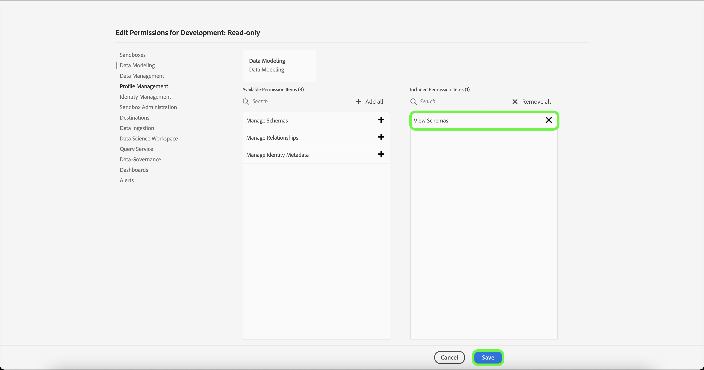

# 製品プロファイルに対する権限の管理

[新しい製品プロファイルを作成](#create-a-new-product-profile)すると、すぐにプロファイルに対する権限を設定するよう求められます。既存のプロファイルに対する権限を編集する場合は、「**[!UICONTROL 製品プロファイル]**」タブからプロファイルを選択してプロファイルの詳細ページを開き、「**[!UICONTROL 権限]**」を選択します。

権限はカテゴリに分けられ、このページに表示されます。リストには、カテゴリ名、含まれる権限の数（およびアクティブな権限の数）、説明が表示されます。

リストの任意のカテゴリをクリックして、**[!UICONTROL 権限の編集]**&#x200B;ページを開きます。

**[!UICONTROL 権限の編集]**&#x200B;ページには、選択した製品プロファイルの権限を追加および削除するためのワークスペースが表示されます。画面の左側には、権限カテゴリのリストが表示されます。カテゴリをクリックすると、**[!UICONTROL 使用可能な権限項目]**&#x200B;に表示される権限が変更されます。

例えば、プロファイル管理の権限を更新するには、「**[!UICONTROL プロファイル管理]**」を選択します。

権限を追加するには、権限名の横にあるプラス **(+)** アイコンを選択します。 または、「**[!UICONTROL すべて追加]**」をクリックして、現在のカテゴリのすべての権限をプロファイルに追加します。追加された権限は、「**[!UICONTROL 含まれる権限項目]**」の下に表示されます。

>[!NOTE]
>
>「**[!UICONTROL 含まれる権限項目]**」リストには、現在選択されているカテゴリから追加された権限のみが表示されます。

権限を削除するには、権限の名前の横にある「**X**」アイコンをクリックするか、**[!UICONTROL すべて削除]**&#x200B;を選択して、現在のカテゴリの下にあるすべての権限を削除します。削除された権限は、「**[!UICONTROL 使用可能な権限項目]**」の下に再表示されます。

引き続き使用可能なカテゴリを確認し、必要な権限を追加します。終了したら「**[!UICONTROL 保存]**」をクリックします。

製品プロファイルの 「**[!UICONTROL 権限]**」タブが再び表示され、選択した権限がアクティブになったことが示されます。

## 次の手順

権限が設定されている場合は、次の手順に進み、[製品プロファイルの詳細とサービスを管理](details-and-services.md)できます。
