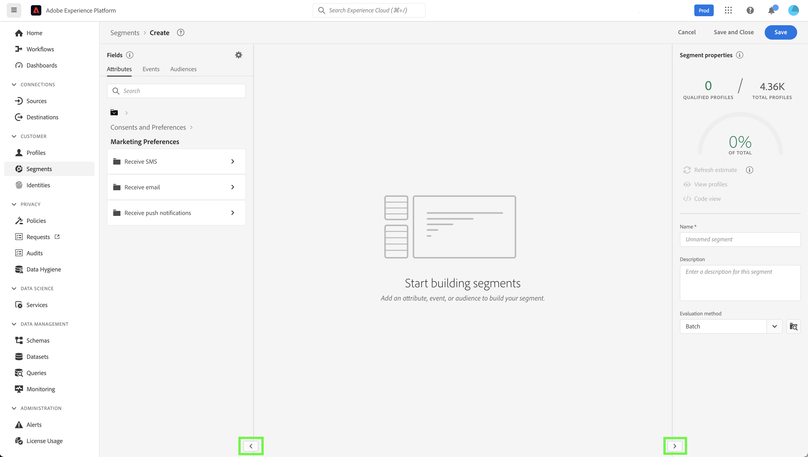

# Experience Platform のカスタムアクセシビリティソリューション

Adobe Experience Platform は、あらゆるタイプのユーザーのニーズに応え、視覚、聴覚、運動などの障害を持つユーザーも対象とした世界的な標準に準拠するように継続的に機能強化されています。このドキュメントでは、Experience Platform ユーザーインターフェイス内のカスタムアクセシビリティソリューションの概要を説明します。

## ホームページと UI の概要

Experience Platform ユーザーインターフェイスは、通常のテキスト、グラフィックおよび UI コンポーネントに必要なコントラスト比を満たしています。ユーザーインターフェイスの色も、視覚障害を持つユーザーを含むすべてのユーザーのアクセシビリティをサポートするように選択されています。

Platform では、ポインターでクリックやアクション起動が可能な UI 要素を、キーボードを使用して操作することもできます。これには、左側のナビゲーション、ビデオプレーヤー、テーブルなどが含まれます。

Experience Platform は、Web Content Accessibility Guidelines 2.1 Level A および Level AA と Web Accessibility Initiative - Accessible Rich Internet Applications（WAI-ARIA）Web 標準を含む、国際的なアクセシビリティ標準に適合するよう努めています。

## 左側のナビゲーション

Experience Platform UI の左側のナビゲーションはキーボードで操作可能で、通常の状態、カーソルを合わせた状態、選択状態のカラーコントラストはアクセシビリティ標準に適合しています。

ユーザーは、ホーム画面から左側のナビゲーションに Tab キーで移動できます。 **Shift + Tab** キーを押すと、ホーム画面に戻ります。

左側のナビゲーションにフォーカスがある状態で **Tab** キーを押すと、展開と折りたたみの操作に移動します。左側のナビゲーションを展開したり折りたたんだりする機能は、 **Enter（Return）** キーでアクティブ化されます。

左側のナビゲーションにフォーカスがある状態で上下の矢印キーを押すと、ナビゲーション内の各項目に移動し、同じ移動が連続的に繰り返されます（つまり、Tab キーを押して左側のナビゲーションから離れるまで、フォーカスは移動しません）。ナビゲーション項目を選択したときにフォーカスが表示されます。現在選択されている項目は、ハイライトと太字のテキストで表示されます。左側のナビゲーション項目を選択中に **Enter（Return）** キーを押すと、選択した UI 項目が右側のパネルに表示されますが、ユーザーが Tab キーを押してフォーカスを移動するまで左側のナビゲーションにフォーカスがとどまります。

Platform 内の一部の機能は、すべてのユーザーに対して有効になっているわけではありません。これらの項目はナビゲーションに表示されますが、選択できません。 キーボードを使用してナビゲーションを行う場合、これらの項目は矢印によるナビゲーション中にスキップされ、 **Enter（Return）** キーを使用して選択することはできません。

## 埋め込みビデオダイアログ

使用可能なビデオリンクをキーボードナビゲーションでハイライト表示して選択することにより、Experience Platform 内でビデオを視聴できます。この場合、Platform UI 内で埋め込みビデオダイアログが開きます。

## ビデオダイアログのキーボードアクセシビリティ

埋め込みビデオダイアログは、キーボードを使用してフォーカスを移動することもできます。 埋め込みビデオダイアログで使用できるキーボードナビゲーションの概要を次の表に示します。

| ダイアログ要素 | キーボードアクセシビリティ | 説明 |
|---|---|---|
| 再生と一時停止 | Tab スペースバー | **Tab** キーを使用すると、再生ボタンにフォーカスを設定できます。**スペースバー** を押すと、ビデオの再生を開始したり、ビデオの再生を一時停止したりできます。 |
| スクラバー | Tab 左向き矢印 右向き矢印 | ビデオの再生中に **Tab** キーを使用すると、スクラバーをフォーカスできます。 スクラバーをフォーカスした状態で、 **左向き矢印キーと右向き矢印キー** を押すと、それぞれビデオの再生を 5 秒前と 5 秒後にスキップできます。 |
| ミュート | Tab スペースバー | **Tab** キーを使用すると、音量ミュート要素がフォーカスされます。**スペースバー** を使用すると、ビデオ再生をミュートまたはミュート解除できます。 |
| ボリューム | Tab 左向き矢印 右向き矢印 | **Tab** キーを使用すると、音量要素がフォーカスされます。**左向き矢印キーと右向き矢印キー** を押すと、それぞれ音量が上下に移動します。 |
| [!UICONTROL クローズドキャプション]（「cc」） | Tab Enter 上向き矢印 下向き矢印 | **Tab** キーを押すと、 [!UICONTROL クローズドキャプション] （「cc」）要素にフォーカスが移動します。**Enter** キーを押すとメニューが開き、 **上向き矢印キーと下向き矢印キー** を押すとキャプションの言語を選択できます。 **Enter** キーを押すと、選択を確認できます。 |
| [!UICONTROL 画質] | Tab Enter 上向き矢印 下向き矢印 | **Tab** キーを使用すると、[!UICONTROL 品質] 要素をフォーカスできます。**Enter** キーを押すとメニューが開き、**上向き矢印キーと下向き矢印キー** を押すとビデオ画質を選択できます。 **Enter** キーを押すと、選択を確認できます。 |
| フルスクリーン | Tab スペースバーまたは Enter Esc | **Tab** キーを使用すると、フルスクリーン要素をフォーカスできます。 **スペースバーまたは Enter** キーを使用すると、フルスクリーン表示を有効にすることができます。**エスケープ** （「Esc」）はフルスクリーンモードを終了します。 |
| 閉じる | Tab スペースバーまたは Enter キー | **Tab** キーを使用すると、閉じるボタンにフォーカスが移動します。**スペースバーまたは Enter** キーを使用すると、ビデオダイアログが終了します。 |

>[!NOTE]
>
>再生中はいつでも、Esc キーを使用して埋め込みビデオダイアログを閉じることができます。

## ファイルのドラッグ＆ドロップ

Experience Platform では、ファイル選択用のすべてのドラッグ＆ドロップゾーンがキーボードでアクセスできます。**Tab** キーを使用すると&#x200B;**[!UICONTROL ファイルを選択]** がハイライト表示され、 **Enter キーまたはスペースバー** を使用して選択すると、オペレーティングシステムのファイル選択 UI が起動します。

ファイルがアップロードされると、削除アイコンがキーボードでナビゲート可能になり、選択したファイルを削除して新しいファイルをアップロードできるようになります。**Tab** キーを使用して削除アイコンをフォーカスし、 **Enter キーまたはスペースバー** を使用して選択できます。ファイルが削除されると、 **[!UICONTROL ファイルを選択]** が自動的にフォーカスされ、選択できます。

または、アップロードされたファイルが正しい形式でない場合は、エラーアイコンとエラーメッセージが表示され、「 **[!UICONTROL ファイルを選択]** 」ボタンがフォーカスされ、選択可能になります。

マウスを使用してドラッグ＆ドロップゾーンを選択すると、ファイル選択 UI も起動されます。または、ユーザーがマウスでファイルを選択し、ゾーンにドラッグしてアップロードを開始することもできます。

## テーブルの参照

Experience Platform ユーザーインターフェイス内のすべてのテーブルは、キーボードでアクセスできます。一連のキーボードショートカットを使用して、テーブルの行や列の参照と操作を行うことができます。

* テーブルヘッダーから、 **下向き矢印** キーを使用してテーブルを参照できます。 テーブルヘッダーは **Tab** キーで移動する際に選択可能で、 **スペースバー** を使用して並べ替え順を変更できます。
* **上下の矢印キー** は、テーブルの行を上下に移動します。
* 行が選択されているかフォーカスされているときに、その行で **Enter** キーを押すと、右側のパネルに詳細が表示されます。
* 行が選択されているかフォーカスされているときは、 **矢印キー** を使用して行内の各項目間を移動できます。
* **Enter** キーを押すと、行内の項目を選択できます。スクリーンリーダーを使用しているユーザーは、新しいウィンドウを開く必要がある場合に警告を受けます。
* 200%以上にズームすると、 **鉄道検査官** アイコンが折りたたまれて、テーブルの表示スペースが広がります。

### テーブルのキーボードアクセシビリティの参照

| キーボードアクセシビリティ | 説明 |
|---|---|
| Home（Fn + 左矢印） | 行にフォーカスがある場合、行の最初の項目に移動 |
| End（Fn + 右矢印） | 行にフォーカスがある場合、行の最後の項目に移動 |
| Page Up | （ページごとに）テーブルで 10 行分上に移動 |
| Page Down | （ページごとに）テーブルで 10 行分下に移動 |
| Ctrl + Home | テーブルの最初の行に移動 |
| Ctrl + End | ページごとにテーブルの最後の行に移動 |

## スキーマエディター UI

スキーマエディター UI は、次の機能によってアクセス可能になります。

* スキーマエディターは、キーボードナビゲーションをサポートしており、 **Tab** キーを使用して、UI 要素間を移動することも可能です。
* **Tab** キーが検索フィールドに入り、次にスキーマツリーに移動します。
* スキーマツリーでは、矢印キーを使用したスキーマツリー UI 内の移動をサポートしています
   * **上下の矢印キー** を使用して、ツリーを走査することができます。
   * **左右の矢印キー**&#x200B;を使用して、ノードを展開したり折りたたんだり、スキーマツリーのインラインアクション間を移動したりできます。
* **Enter（Return）** キーを押すと、右側の詳細パネルで個々のノードの詳細がアクティブになります。
* **Home** キーを押すと、ツリーの先頭に戻ります。
* **End** キーを押すと、ツリーの下部に移動します。
* スキーマツリーには、スクリーンリーダー用の ARIA ラベルも含まれています。

## セグメントビルダー UI

セグメントビルダー UI を使用して Experience Platform 内でセグメントを作成、編集、操作する際に、次の機能を利用するとアクセシビリティが向上します。

* セグメントビルダー UI には、キーボードナビゲーションでアクセスできます。
* スクリーンリーダーは、見出しのマークアップタグを認識し、見出しとそのレベルを音声で知らせることができます。
* その他の支援テクノロジーでは、適切にコード化された見出しを使用してページの視覚的表示を変更し、アウトライン表示や代替表示を行うことができます。

セグメントビルダーキャンバスの左右のレールを折りたたんだり展開したりして、より多くの画面領域を得られるようになりました。 この機能は、200%ズームで完全な機能を提供するので、特に便利です。

## クエリサービスエディター

クエリサービスエディターでは、次のアクセシビリティ機能を利用できます。

* クエリサービスエディター UI のカラーコントラストは、アクセシビリティのコンプライアンスを満たしています。
* キーボードナビゲーションは、エディター UI の外部でサポートされています。エディター UI は、CodeMirror を埋め込んだものです。

## ソースと宛先の「システム表示」タブ

ソースと宛先で **[!UICONTROL システム表示]** を参照する際に、次の機能を利用するとアクセシビリティが向上します。

* **Tab** キーを押すと最初のソース接続カードがフォーカスされます
   * もう一度 **Tab** キーを押すとカードの内側にあるボタンがフォーカスされます
   * **Enter** キーを押すとカード内のコールトゥアクションボタンがアクティブになります
* 接続カードで **Enter** キーを押すと右側のパネルの詳細もアクティブになります
   * 右側のパネルがアクティブになると、その領域にフォーカスが設定されます。 **Tab** キーを押すと、右側のパネルの「 **閉じる** 」がフォーカスされます。**Tab** キーを再度押すと、右側のパネルにフォーカスが移動します
   * ソース接続カードが複数ある場合は、 **Tab** キーを押すと接続が切り替わります
   * **矢印キー（上、下、左、右）** を使用すると、ソースのリスト内を移動できます
   * **Tab** キーを押すと、右側のパネルがフォーカスされます
