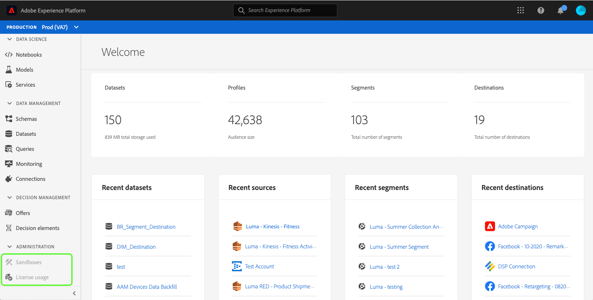

# Experience Platform向けのカスタムアクセシビリティソリューション

Adobe Experience Platformは、あらゆる種類のユーザーのニーズに応え、視覚、聴覚、運動、またはその他の障碍のある個人を含む世界的な標準に準拠するよう、継続的に強化されています。 このドキュメントでは、ユーザーインターフェイス内のカスタムアクセシビリティソリューションのExperience Platformを説明します。

## ホームページとUIの概要

Experience Platformユーザーインターフェイスは、通常のテキスト、グラフィックおよびUIコンポーネントに必要なコントラスト比を満たします。 視覚に障碍を持つユーザーを含むすべてのユーザーのアクセシビリティをサポートするために、ユーザーインターフェイスの色も選択されています。

Platformでは、クリック可能なUI要素や、ポインターで操作可能なUI要素も、キーボードを使用して操作できます。 これには、左側のナビゲーション、ビデオプレーヤー、テーブルなどが含まれます。

Experience Platformは、 Web Content Accessibility Guidelines 2.1 Level AおよびLevel AAとWeb Accessibility Initiative - Accessible Rich Internet Applications(WAI-ARIA)Web標準を含む、国際的なアクセシビリティ標準への準拠に取り組んでいます。

## 左ナビゲーション

Experience PlatformUIの左側のナビゲーションはキーボードでアクセスでき、アクセシビリティ標準を満たす、通常、カーソルを合わせた状態、選択状態のカラーコントラストを提供します。

ホーム画面から、ユーザーは左側のナビゲーションにタブを移動できます。 **Shift + Tab**&#x200B;を選択すると、ユーザーはホーム画面に戻ります。

左側のナビゲーションにフォーカスがある状態で、**タブ**&#x200B;をクリックすると、ユーザーは展開や折りたたみの操作に移動します。 左側のナビゲーションを展開または折りたたみする機能は、**Enter（戻る）**&#x200B;で有効化されます。

左ナビゲーションにフォーカスを置いた状態で、上下の矢印キーを押しながらナビゲーション内の各項目に移動し、連続的にサイクルします（つまり、ユーザーがタブを押して左ナビゲーションから離れるまで、フォーカスが移動しません）。 フォーカスは、選択したナビゲーション項目に対して表示されます。 現在の選択範囲がハイライトと太字のテキストで表示されます。 左側のナビゲーション項目を選択すると、**Enter（戻る）**&#x200B;を押すと、選択したUI項目が右側のパネルに表示されますが、ユーザーがタブを離れるまで左側のナビゲーションにフォーカスが残ります。

Platform内の一部の機能は、すべてのユーザーに対して有効になっているわけではありません。 これらの項目はナビゲーションに表示されますが、選択できません。 キーボードを使用してナビゲーションする場合、これらの項目は矢印ナビゲーション中にスキップされ、**Enter(Return)**&#x200B;を使用して選択することはできません。

## 埋め込みビデオダイアログ

キーボードナビゲーションを使用してExperience Platform内でビデオを表示し、使用可能なビデオリンクをハイライト表示して選択することができます。 これにより、Platform UI内に埋め込みビデオダイアログが開きます。

## ビデオダイアログのキーボードアクセシビリティ

埋め込みビデオダイアログは、キーボードを使用して移動することもできます。 次の表に、埋め込みビデオダイアログで使用できるキーボードナビゲーションの概要を示します。

| ダイアログ要素 | キーボードアクセシビリティ | 説明 |
|---|---|---|
| 再生と一時停止 | タブ スペースバー | **Tab**&#x200B;を使用して、再生ボタンにフォーカスを設定します。 **** Spacebarはビデオの再生を開始し、ビデオの再生を一時停止します。 |
| スクラバー | タブ 左向き矢印 右向き矢印 | ビデオの再生中に&#x200B;**タブ**&#x200B;を使用してスクラバーに焦点を合わせます。 スクラバーにフォーカスを当てた状態で、**左向き矢印キー**&#x200B;は、ビデオの再生を5秒前または後ろにスキップします。 |
| ミュート | タブ スペースバー | **Tab**&#x200B;を使用して、ミュートボリューム要素に焦点を当てます。 **スペースバー**&#x200B;を使用して、ビデオ再生のミュートまたはミュート解除を行います。 |
| ボリューム | タブ 左向き矢印 右向き矢印 | **タブ**&#x200B;を使用して、ボリューム要素に焦点を当てます。 **左向き矢印キーと右向き矢印キー** は、それぞれボリュームを上下に移動します。 |
| [!UICONTROL クローズドキャプション] (&quot;cc&quot;) | タブ  上向き矢印 下向き矢印を入力します。 | **** タブト [!UICONTROL クローズドキャプション] (「cc」)要素&#x200B;**Enter**&#x200B;キーを押してメニューを開き、**上向き矢印キー**&#x200B;キーを押してキャプションの言語を選択します。 **** 選択を確認します。 |
| [!UICONTROL 画質] | タブ  上向き矢印 下向き矢印を入力します。 | **タブ**&#x200B;を使用して、[!UICONTROL 品質]要素に焦点を当てます。 **Enter**&#x200B;キーを押してメニューを開き、**上向き矢印キー**&#x200B;キーを押してビデオ画質を選択します。 **** 選択を確認します。 |
| 全画面表示 | Tab スペースバーまたはEnter Escキーを押します。 | **タブ**&#x200B;を使用して、フルスクリーン要素に焦点を当てます。 フルスクリーン表示を有効にするには、**スペースバーまたはEnter**&#x200B;を使用します。 **エスケープ** (「esc」)はフルスクリーンモードを終了します。 |
| 閉じる | Tab スペースバーまたはEnter | **Tab**&#x200B;を使用して、閉じるボタンにフォーカスします。 **スペースバーまたはEnter**&#x200B;キーを使用して、ビデオダイアログを終了します。 |

>[!NOTE]
>
>再生中はいつでも、Escキーを使用して埋め込みビデオダイアログを閉じることができます。

## ファイルのドラッグ&amp;ドロップ

Experience Platformでは、すべてのファイル選択ドラッグ&amp;ドロップゾーンがキーボードでアクセスできます。 **Tab**&#x200B;を使用して&#x200B;**[!UICONTROL ファイルを選択]**&#x200B;し、**Enterキーまたはスペースバー**&#x200B;を使用して選択すると、オペレーティングシステムのファイル選択UIが起動します。

ファイルがアップロードされると、削除アイコンがキーボード操作で表示され、選択したファイルを削除して新しいファイルをアップロードできるようになります。 **Tab**&#x200B;を使用して削除アイコンにフォーカスし、**Enterまたはスペースバー**&#x200B;を使用して選択できます。 ファイルが削除されると、**[!UICONTROL ファイルを選択]**&#x200B;は自動的にフォーカスされ、選択できます。

または、アップロードされたファイルが正しい形式でない場合は、エラーアイコンとエラーメッセージが表示され、「**[!UICONTROL ファイルを選択]**」ボタンがフォーカスされ、選択可能になります。

マウスを使用してドラッグ&amp;ドロップゾーンを選択すると、ファイル選択UIも呼び出されます。または、マウスユーザーがファイルを選択し、ゾーンにドラッグしてアップロードを開始することもできます。

## テーブルの参照

ユーザーインターフェイス内のすべてのExperience Platformは、キーボードでアクセスできます。 一連のキーボードショートカットを使用して、テーブルの行や列の参照と操作を行うことができます。

* テーブルヘッダーから、**下向き矢印**&#x200B;を使用してテーブルを参照します。 **タブ**&#x200B;を使用して移動すると、テーブルヘッダーを選択できます。**スペースバー**&#x200B;を使用して、並べ替え順を変更できます。
* **上下の矢印キース** モーブは、テーブルの行を上下に移動します。
* 行が選択された場合、またはフォーカスされている場合、行の&#x200B;**Enter**&#x200B;を使用すると、右側のレールに詳細が表示されます。
* 行が選択された場合、またはフォーカスされた場合、**矢印キー**&#x200B;を使用して行内の各項目間を移動します。
* **Enter**&#x200B;を押して行の項目を選択します。 新しいウィンドウを開く必要がある場合、スクリーンリーダーを持つユーザーに警告が表示されます。

### テーブルのキーボードアクセシビリティの参照

| キーボードアクセシビリティ | 説明 |
|---|---|
| HOME（関数+左矢印） | 行にフォーカスがある場合、ユーザーを行の最初の項目に移動 |
| END （関数+右矢印） | 行にフォーカスがある場合、ユーザーを行の最後の項目に移動 |
| Page up | テーブル内の10行を上に移動（ページごと） |
| Page down | テーブル内の10行を下に移動（ページごと） |
| Ctrl + Home | テーブルの最初の行に移動 |
| Ctrl + End | 1ページに表の最初の行に移動 |

## スキーマエディターUI

スキーマエディターのUIには、次の機能がアクセスできます。

* スキーマエディターは、キーボードナビゲーションをサポートしています。例えば、**Tab**&#x200B;を使用して、UI要素間を移動します。
* **** Tabキーで検索フィールドを入力し、スキーマツリーに移動します。
* スキーマツリーでは、矢印キーを使用したスキーマツリーUI内の移動がサポートされています
   * **上下の矢印を使** 用して、ツリーをトラバースします。
   * **左右の矢印を使** 用して、ノードの展開や折りたたみを行ったり、スキーマツリー上のインラインアクション間を移動したりできます。
* **Enter(Return)** を押すと、右側の詳細パネルで個々のノードの詳細がアクティブになります。
* **Home**&#x200B;キーがツリーの先頭に戻ります。
* **End**&#x200B;キーはツリーの下部に移動します。
* スキーマツリーには、スクリーンリーダー用のARIAラベルも含まれています。

## セグメントビルダーUI

セグメントビルダーUIを使用してExperience Platform内でセグメントを作成、編集、操作する場合、次の機能によりアクセシビリティが向上します。

* セグメントビルダーのUIには、キーボードナビゲーションからアクセスできます。
* スクリーンリーダーは見出しのマークアップタグを認識し、見出しをそのレベルと共に読み上げることができます。
* その他の支援テクノロジーでは、適切にコード化された見出しを使用して、ページの表示を変更し、概要や代替ビューを表示できます。

## クエリサービスエディター

クエリサービスエディターでは、次のアクセシビリティ機能を使用できます。

* クエリサービスエディターUIの色コントラストは、アクセシビリティのコンプライアンスを満たしています。
* キーボードナビゲーションは、エディターのUIの外部でサポートされています。 エディターUIは埋め込みコードミラーです。

## ソースと宛先の「システム表示」タブ

ソースと宛先で&#x200B;**[!UICONTROL システムビュー]**&#x200B;を参照すると、次の機能によりアクセシビリティが向上します。

* **** タブセットは最初のソース接続カードにフォーカス
   * **** 「タブ」をタップして、カード内のボタンにフォーカス
   * **Enter**&#x200B;を選択して、カード内のコールトゥアクションボタンを有効にします。
* 接続カードで「**Enter**」を選択すると、右側のレールに詳細が表示されます
   * 右側のレールが有効になると、その領域にフォーカスが設定されます。 **** Tabfocusは、右側のレ **** ールパネルの閉じ方に焦点を当てます。**タブ**&#x200B;を再度選択すると、右側のパネルにフォーカスが移動します
   * ソース接続カードが複数ある場合は、**タブ**&#x200B;が接続を切り替えます
   * **矢印キー（上、下、左、右）**&#x200B;を使用して、ソースのリスト内を移動します。
   * **タブ**&#x200B;を選択して、右側のパネルにフォーカスを設定します。