# タグ管理ガイド

タグを使用すると、ビジネスオブジェクトを分類して検出とカテゴリ化が容易になるように、メタデータ分類を管理できます。タグは、チームが扱うオーディエンスの重要な分類属性を特定するのに役立ちます。その結果、チームはそれらの属性を迅速に見つけ出すことができ、記述子で共通のオーディエンスをグループ化することもできます。 地理的地域、ビジネスユニット、製品ライン、プロジェクト、チーム、期間（四半期、月、年）など、意味を適用したりチームのオーディエンス検出を容易にするのに役立つ一般的なタグカテゴリを特定してください。 

## タグの作成 {#create-tag}

新しいタグを作成するには、左側のナビゲーションで「**[!UICONTROL タグ]**」を選択したあと、目的のタグカテゴリを選択します。

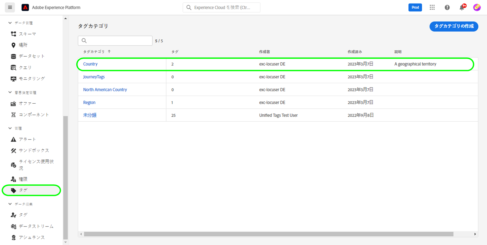

「**[!UICONTROL タグを作成]**」を選択して、新しいタグを作成します。

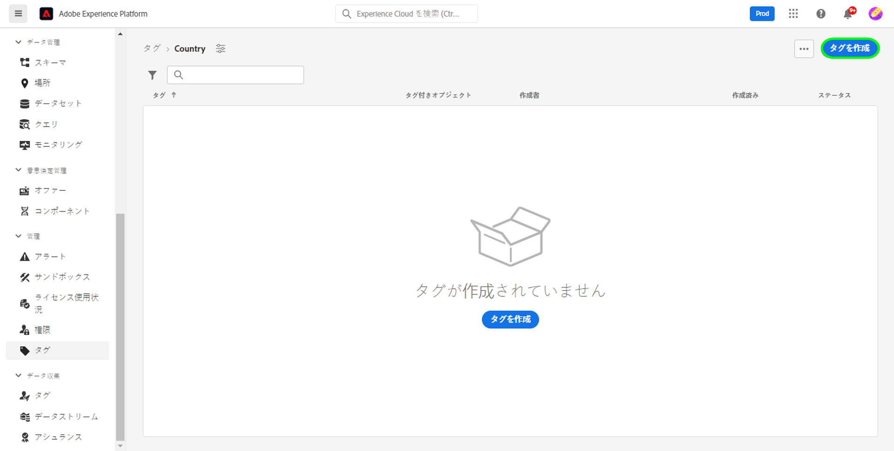

**[!UICONTROL タグを作成]**&#x200B;ダイアログが表示され、一意のタグ名を入力するように求められます。 完了したら「**[!UICONTROL 保存]**」を選択します。

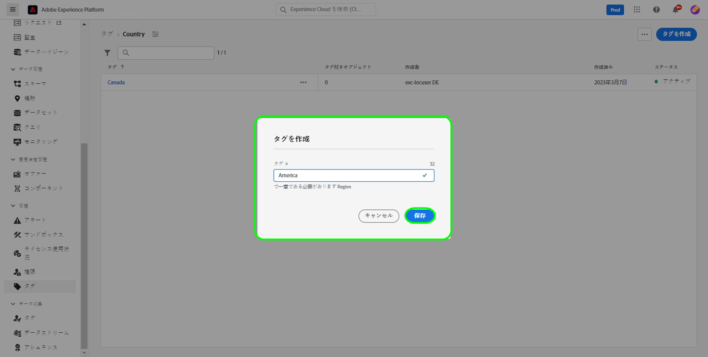

新しいタグが正常に作成され、ユーザーはタグ画面にリダイレクトされます。この画面では、新しく作成されたタグがリストに表示されます。

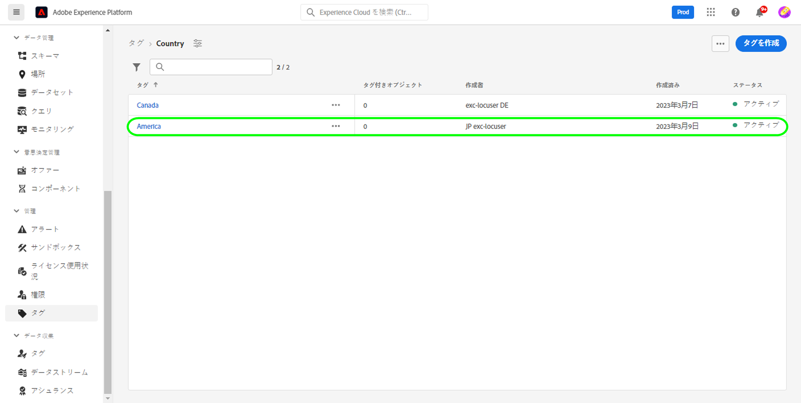

## タグの編集 {#edit-tag}

タグの編集は、スペルミス、命名規則の更新または用語の更新がある場合に役に立ちます。 タグを編集しても、タグが現在適用されているオブジェクトとの関連付けは維持されます。

既存のタグを編集するには、タグカテゴリリストで、編集するタグの名前の横にある省略記号（`...`）を選択します。 タグを編集、移動またはアーカイブするためのコントロールがドロップダウンに表示されます。ドロップダウンから「**[!UICONTROL 編集]**」を選択します。

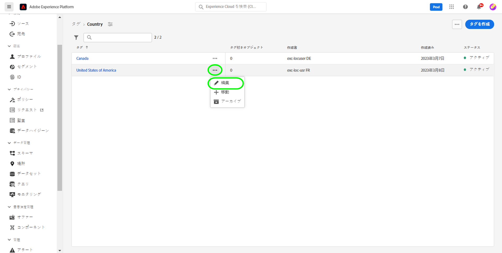

**[!UICONTROL タグを編集]**&#x200B;ダイアログが表示され、タグ名を編集するように求められます。 完了したら、「**[!UICONTROL 保存]**」を選択します。

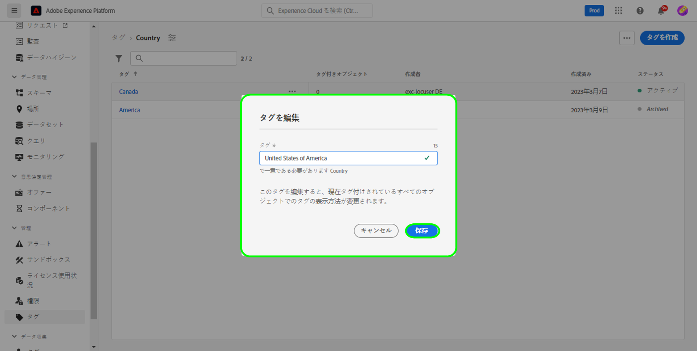

タグ名が正常に更新され、ユーザーはタグ画面にリダイレクトされます。この画面では、更新後のタグがリストに表示されます。

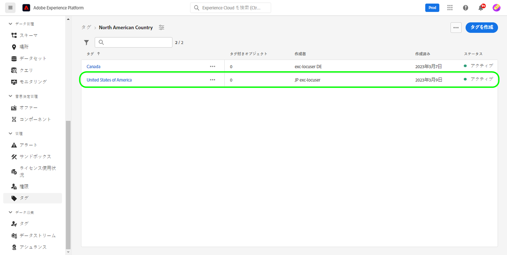

## カテゴリ間でのタグの移動 {#move-tag}

タグは、他のタグカテゴリに移動できます。 タグを移動しても、タグが現在適用されているオブジェクトとの関連付けは維持されます。

既存のタグを移動するには、タグカテゴリリストで、移動するタグの名前の横にある省略記号（`...`）を選択します。タグを編集、移動またはアーカイブするためのコントロールがドロップダウンに表示されます。ドロップダウンから「**[!UICONTROL 移動]**」を選択します。

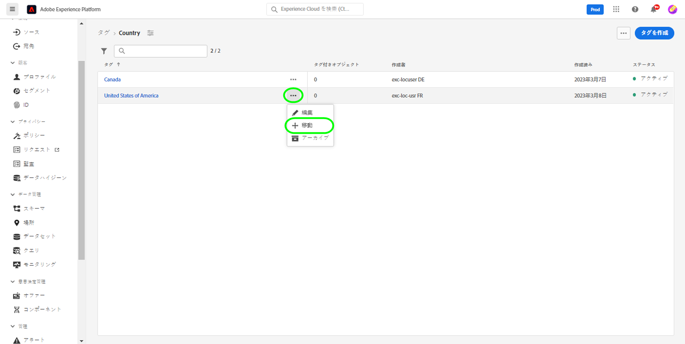

**[!UICONTROL タグを移動]**&#x200B;ダイアログが表示され、選択したタグの移動先となるタグカテゴリを選択するように求められます。

リストからスクロールして選択することも、検索機能を使用してカテゴリ名を入力することもできます。 完了したら、「**[!UICONTROL 移動]**」を選択します。

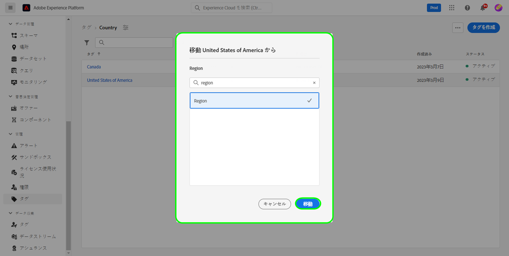

タグが正常に移動され、ユーザーはタグ画面にリダイレクトされます。この画面には更新されたタグリストが表示され、移動前のタグは表示されなくなります。

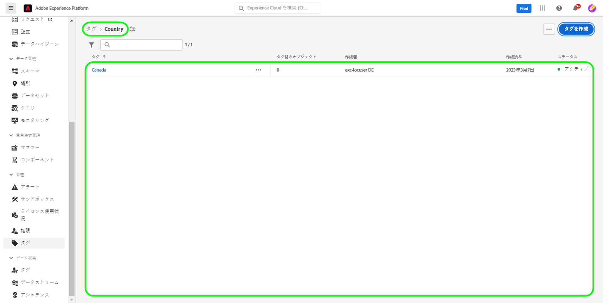

このタグは、先ほど選択したタグカテゴリに表示されるようになります。

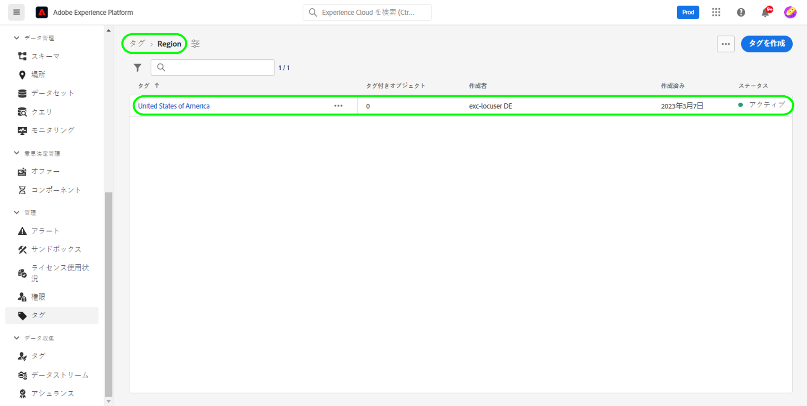

## タグのアーカイブ {#archive-tag}

タグのステータスは、「アクティブ」と「アーカイブ済み」の間で切り替えることができます。 アーカイブ済みタグは、既にそれを適用したオブジェクトからは削除されませんが、新しいオブジェクトには適用できなくなります。タグごとに、すべてのオブジェクトに同じステータスが反映されます。これは、タグとオブジェクトの現在の関連付けは維持するものの、今後はタグを適用したくない場合に特に便利です。

既存のタグをアーカイブするには、タグカテゴリリストで、アーカイブするタグの名前の横にある省略記号（`...`）を選択します。 タグを編集、移動またはアーカイブするためのコントロールがドロップダウンに表示されます。ドロップダウンから「**[!UICONTROL アーカイブ]**」を選択します。

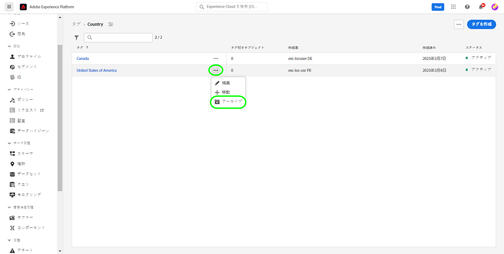

**[!UICONTROL タグをアーカイブ]**&#x200B;ダイアログが表示され、タグのアーカイブを確認するように求められます。「**[!UICONTROL アーカイブ]**」を選択します。

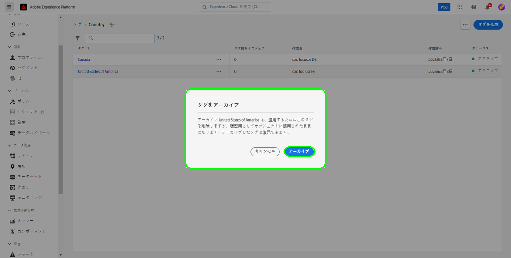

タグが正常にアーカイブされ、ユーザーはタグ画面にリダイレクトされます。更新されたタグリストに、タグのステータスが `Archived` として表示されます。

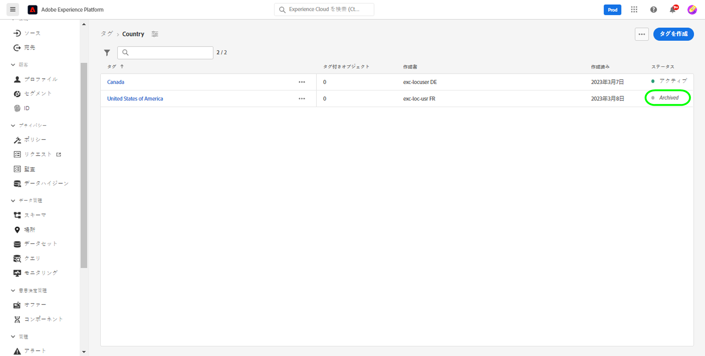

## アーカイブしたタグの復元 {#restore-archived-tag}

 `Archived` タグを新しいオブジェクトに適用する場合、タグは `Active` 状態である必要があります。アーカイブしたタグを復元すると、そのタグは `Active` 状態に戻ります。

アーカイブしたタグを復元するには、タグカテゴリリストで、復元するタグの名前の横にある省略記号（`...`）を選択します。タグを復元または削除するためのコントロールがドロップダウンに表示されます。ドロップダウンから「**[!UICONTROL 復元]**」を選択します。

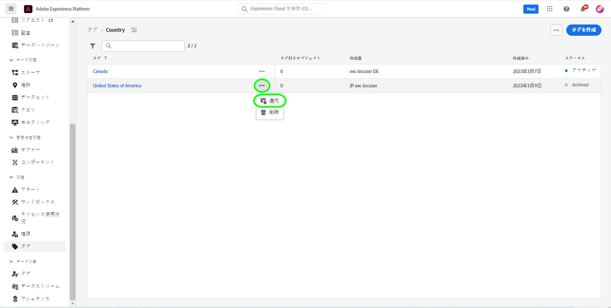

**[!UICONTROL タグを復元]**&#x200B;ダイアログが表示され、タグの復元を確認するように求められます。「**[!UICONTROL 復元]**」を選択します。

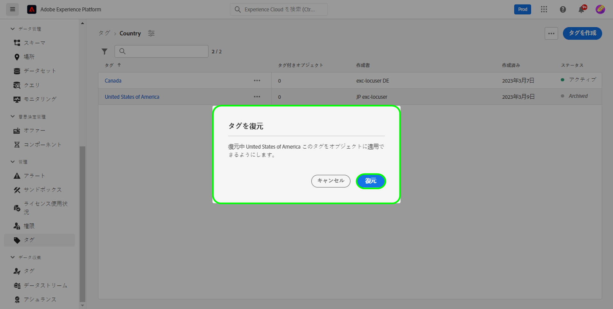

タグが正常に復元され、ユーザーはタグ画面にリダイレクトされます。更新されたタグリストに、タグのステータスが `Active` として表示されるようになります。

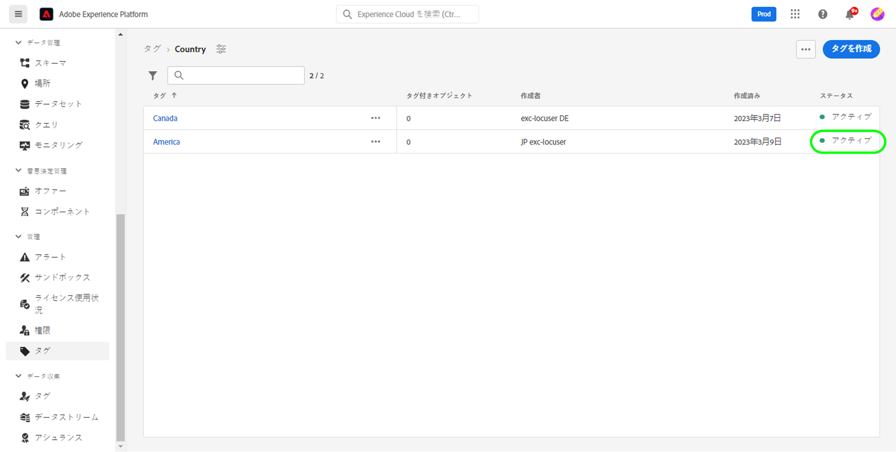

## タグの削除 {#delete-tag}

>[!NOTE]
>
>削除できるタグは、`Archived` 状態にあり、どのオブジェクトにも関連付けられていないタグのみです。

タグを削除すると、そのタグはシステムから完全に削除されます。

アーカイブしたタグを削除するには、タグカテゴリリストで、削除するタグの名前の横にある省略記号（`...`）を選択します。タグを復元または削除するためのコントロールがドロップダウンに表示されます。ドロップダウンから「**[!UICONTROL 削除]**」を選択します。

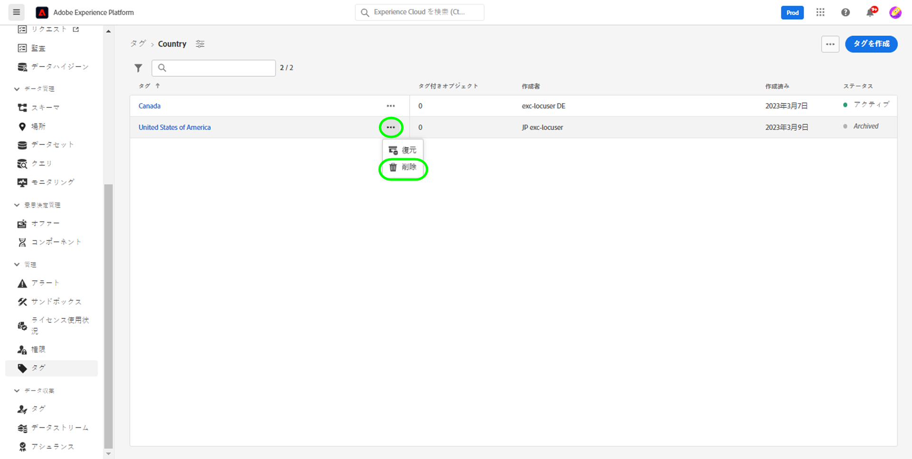

**[!UICONTROL タグを削除]**&#x200B;ダイアログが表示され、タグの削除を確認するように求められます。「**[!UICONTROL 削除]**」を選択します。

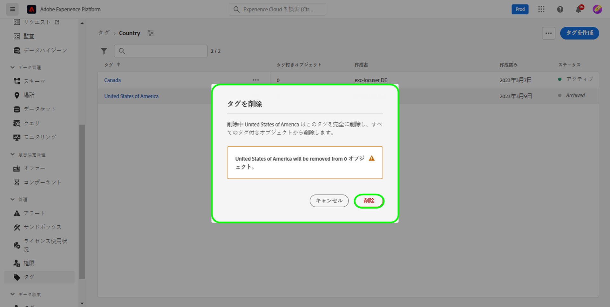

タグが正常に削除され、ユーザーはタグ画面にリダイレクトされます。このタグは完全に削除されており、リストに表示されなくなります。

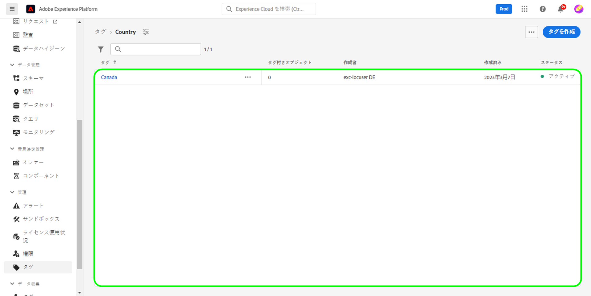

## タグ付きオブジェクトの表示 {#view-tagged}

各タグには、タグインベントリからアクセスできる詳細ページがあります。このページには、現在そのタグが適用されているすべてのオブジェクトが一覧表示され、様々なアプリや機能の関連オブジェクトを一元的に確認できます。

タグ付きオブジェクトの一覧を表示するには、タグカテゴリ内のタグを探して選択します。

[!UICONTROL タグ付きオブジェクト]ページが表示され、タグ付きオブジェクトのインベントリが表示されます。

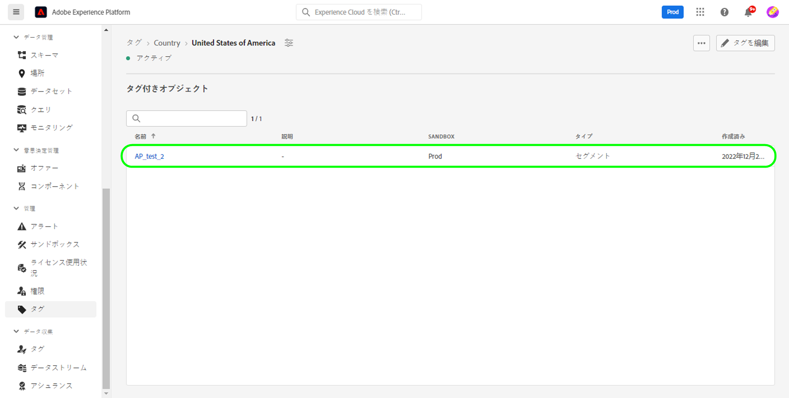

## 次の手順

タグの管理方法について説明しました。Experience Platform のタグの概要については、[タグの概要ドキュメント](../overview.md)を参照してください。
