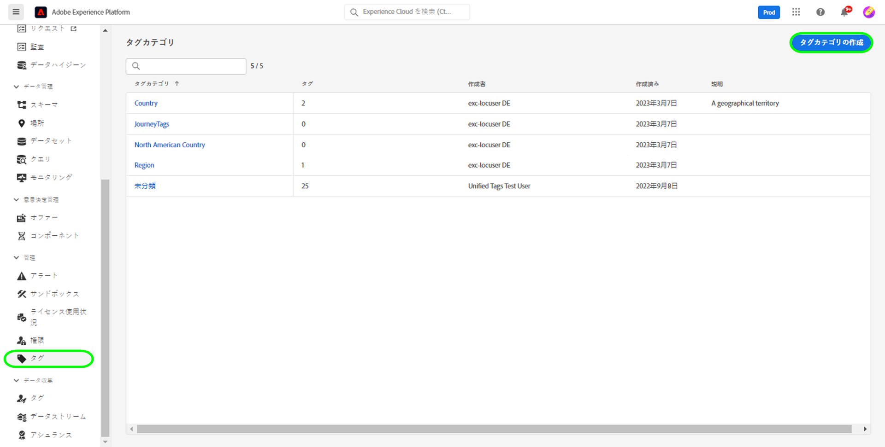
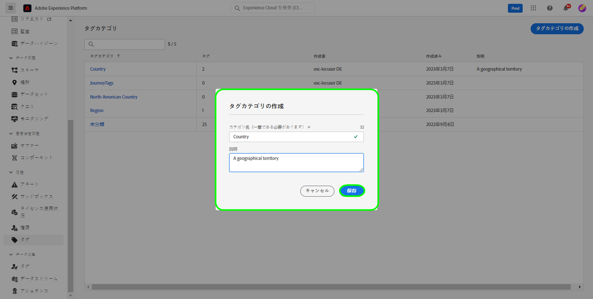
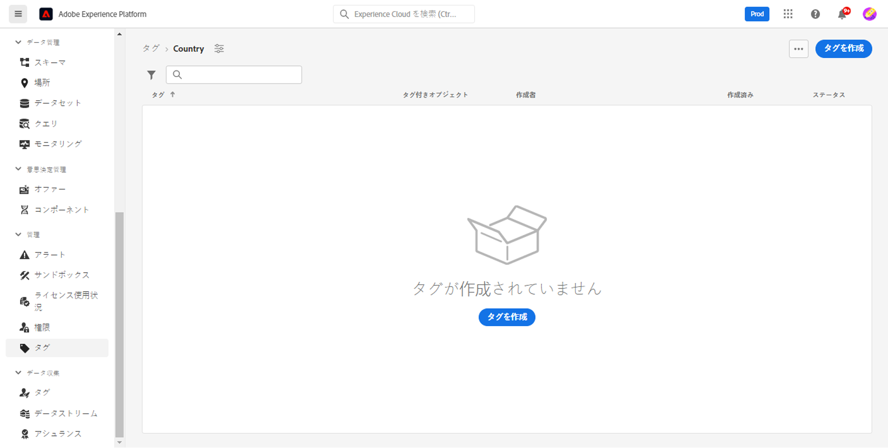
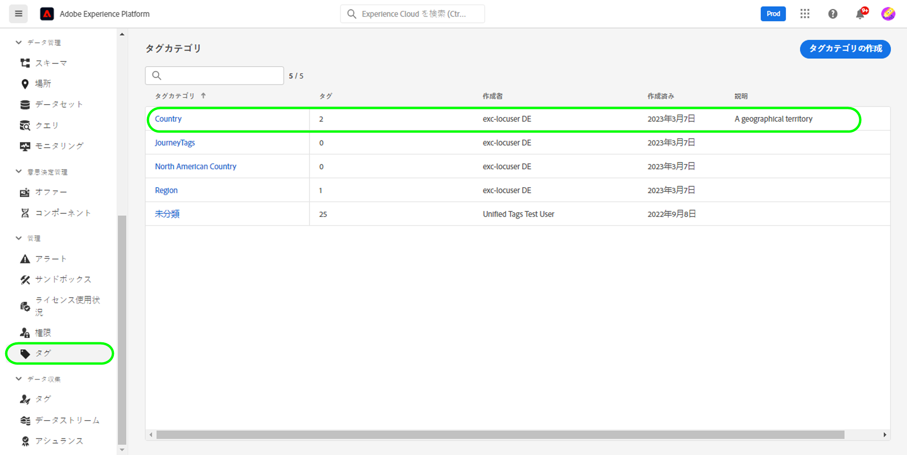
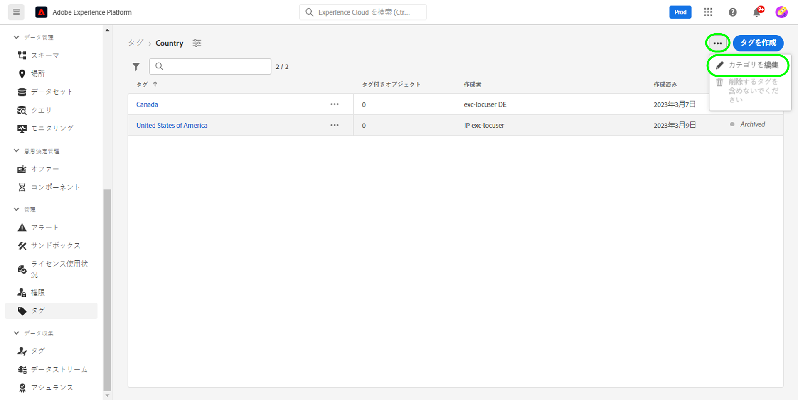
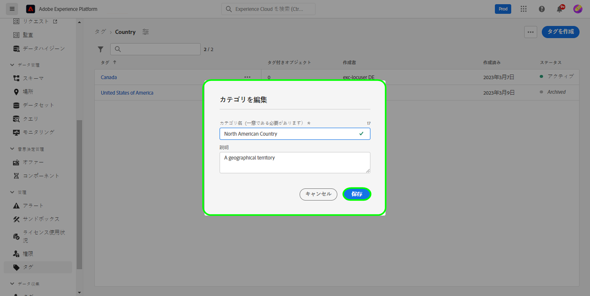
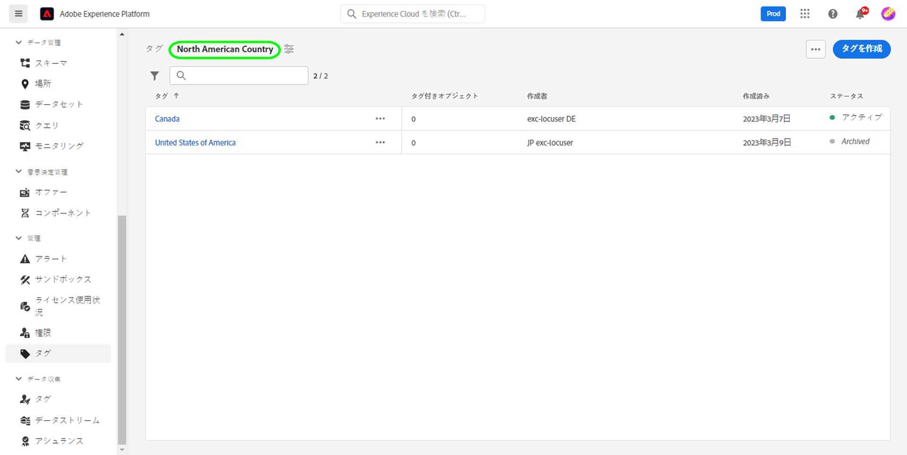
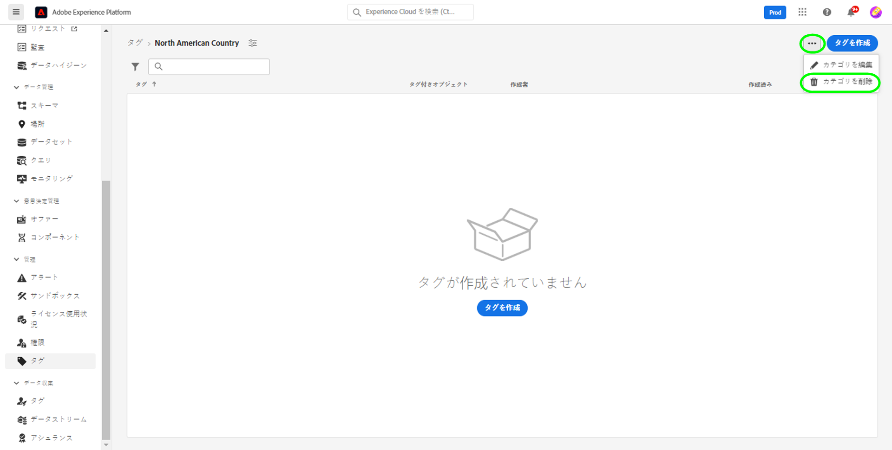
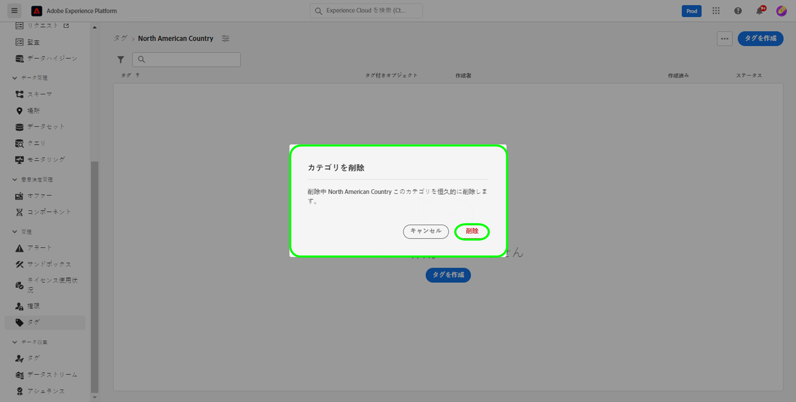

# タグカテゴリガイド

タグカテゴリは、タグを意味のあるセットにグループ化し、より多くのコンテキストを提供し、タグの目的をより明確にするために使用します。 カテゴリを持つタグには、そのカテゴリの名前の後にコロンが付いたタグ名が付きます。

## タグカテゴリの作成 {#create-tag-category}

新しいカテゴリを作成するには、「 **[!UICONTROL タグ]** 左側のナビゲーションで、「 [!UICONTROL タグカテゴリを作成].

この **[!UICONTROL タグカテゴリを作成]** ダイアログが表示され、一意のカテゴリ名とオプションの説明を入力するよう求められます。 完了したら、「 」を選択します。 **[!UICONTROL 保存]**.

新しいタグカテゴリが正常に作成され、タグ作成ページが表示され、新しいタグを割り当てることができます。 タグの作成について詳しくは、 [タグの管理](./managing-tags.md#create-a-tag-create-tag) 文書。

## タグカテゴリを編集 {#edit-tag-category}

>[!NOTE]
>
>タグカテゴリの編集や名前の変更を行っても、タグと現在適用されているオブジェクトとの関連付けが維持されます。

タグカテゴリを編集するには、 **[!UICONTROL タグ]** 左側のナビゲーションで、編集するタグカテゴリを選択します。

タグカテゴリで、省略記号 (`...`) を [!UICONTROL タグを作成]. ドロップダウンに、カテゴリの編集や削除を行うためのコントロールが表示されます。 **[!UICONTROL カテゴリを編集]**.

この **[!UICONTROL カテゴリを編集]** ダイアログが表示され、カテゴリ名とオプションの説明を更新するよう求められます。 完了したら、「 」を選択します。 **[!UICONTROL 保存]**.

タグカテゴリが正常に更新され、タグカテゴリにリダイレクトされます。

## タグカテゴリを削除 {#delete-tag-category}

>[!NOTE]
>
>タグカテゴリを削除する前に、タグが空でタグがない必要があります。

タグカテゴリを削除するには、 **[!UICONTROL タグ]** 左側のナビゲーションで、削除するタグカテゴリを選択します。

タグカテゴリで、省略記号 (`...`) を [!UICONTROL タグを作成]. ドロップダウンに、カテゴリの編集や削除を行うためのコントロールが表示されます。 **[!UICONTROL カテゴリを削除]**.

この **[!UICONTROL カテゴリを削除]** ダイアログが表示され、タグカテゴリの削除を確認するプロンプトが表示されます。 選択 **[!UICONTROL 削除]** をクリックして確定します。

タグカテゴリが正常に削除され、タグカテゴリ在庫ページにリダイレクトされます。 タグカテゴリはリストに表示されなくなり、完全に削除されました。

## 次の手順

タグカテゴリの管理方法を学びました。 次の手順に進んで、 [タグの管理](./managing-tags.md).
