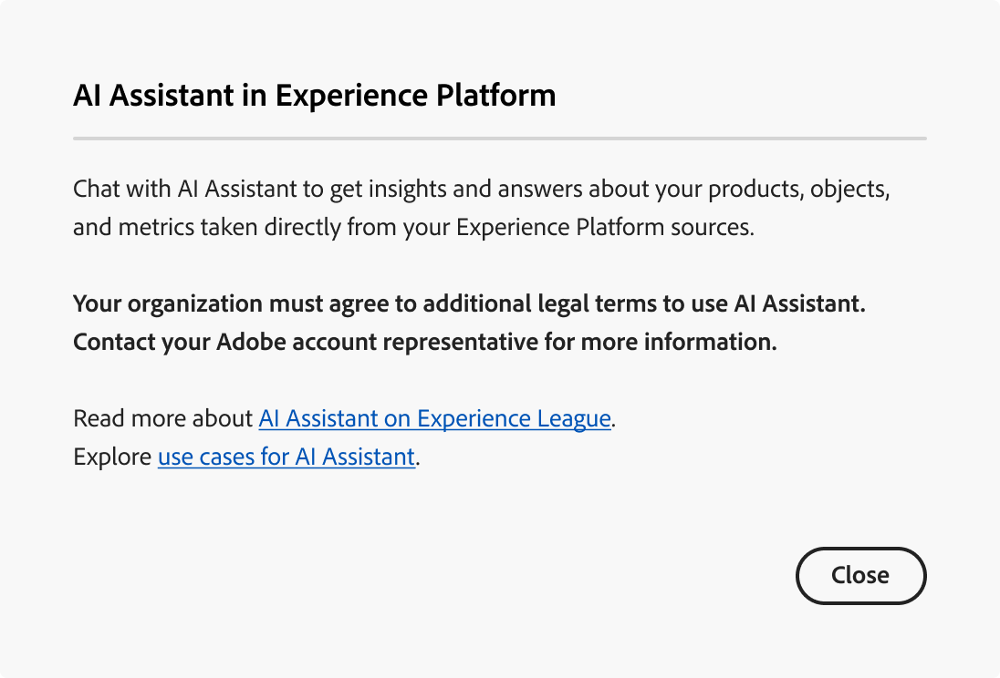

# Experience PlatformのAI アシスタント（レガシー）へのアクセス

>[!IMPORTANT]
>
>このドキュメントは、AI アシスタント（レガシー）に適用されます。 AI アシスタント（次世代型）について詳しくは、[AI アシスタント UI ガイド &#x200B;](https://experienceleague.adobe.com/ja/docs/experience-cloud-ai/experience-cloud-ai/ai-assistant/ai-assistant-ui)をExperience Cloud[の](https://experienceleague.adobe.com/ja/docs/experience-cloud-ai/experience-cloud-ai/home)AI ドキュメントでご確認ください。

AI アシスタント（レガシー）とAI アシスタント（次世代）の比較については、次の表を参照してください。

| 機能領域 | AI アシスタント（レガシー） | AI アシスタント（次世代型） |
| --- | --- | --- |
| ユーザーエクスペリエンス | AI アシスタント（レガシー）は、右側のパネルでのみ使用できます。 | AI アシスタント（次世代）は、右側のパネルと没入型のフルスクリーン体験の両方で利用できます。 |
| 機能の範囲 | AI アシスタント（レガシー）は、製品知識と運用インサイトの両方に活用できます。 | AI アシスタント（次世代）は、製品知識、運用インサイト、高度なエージェント型スキル、マルチステップのタスク実行などに使用できます。 |
| プラットフォームアーキテクチャ | AI アシスタント（レガシー）は、Agent Orchestratorスタック上に構築されていません。 | [Adobe Experience Platform Agent Orchestrator](https://experienceleague.adobe.com/ja/docs/experience-cloud-ai/experience-cloud-ai/agents/agent-orchestrator)が提供するAI アシスタント （次世代）は、機能をまたいで拡張性と高度な連携を可能にします。 |
| 適用範囲 | AI アシスタント（レガシー）は、アプリケーション固有の実装です。 | AI アシスタント（次世代）を利用すれば、あらゆるAdobe Experience Cloudアプリケーションをまたいで、統合されたAI アシスタント体験を実現できます。 |
| アクセスと権限のモデル | アプリケーション範囲のアクセスモデルを個々の製品境界に合わせて調整。 | 利用者は誰でも、AI アシスタント（次世代）と関連するExperience Platformエージェントにアクセスできます。 **メモ**: <ul><li>**Adobe Experience Manager**：管理者は、[Adobe Admin Console](https://helpx.adobe.com/jp/enterprise/using/admin-console.html)を通じてAI アシスタント （Next-Gen）にアクセスする権限を付与する必要があります。</li><li>**Customer Journey Analytics**：管理者は、[Customer Journey Analytics アクセス制御](https://experienceleague.adobe.com/ja/docs/analytics-platform/using/technotes/access-control?lang=en)を通じてAI アシスタントにアクセスする権限を付与する必要があります。 これにより、製品知識やデータインサイトにもとづいた質問が可能になります。 |

Adobe Experience Cloudの複数のアプリケーションから、AI アシスタント（レガシー）にアクセスできます。

>[!NOTE]
>
>権限UIで、AI アシスタント（レガシー）へのアクセスを取得するために最初に追加の法的条件に同意する必要があることを通知するポップアップメッセージが表示された場合は、Adobe アカウントチームに連絡して、これらの条件に関するガイダンスを受けてください。

## 基本を学ぶ {#get-started}

AI アシスタント（レガシー）にアクセスする前に、2つの前提条件ステップを完了する必要があります。

1. 組織はまず法的条件に同意する必要があります。 詳しくは、Adobe アカウントチームにお問い合わせください。
2. 管理者は、AI アシスタント（レガシー）にアクセスするための十分な権限を付与する必要があります。

これら2つの前提条件の手順のいずれかが完了していない場合は、Experience Platform UIでAI アシスタント（レガシー）チャットアイコンを選択すると、次のメッセージが表示されます。

>[!BEGINTABS]

>[!TAB 組織はAI アシスタント （レガシー）を使用できません]

AI アシスタント（レガシー）を使用する法的資格のない組織を使用している場合は、次のメッセージが表示されます。 この場合、アクセス権を解決するには、Adobe アカウントチームに連絡する必要があります。

>[!TAB 適切な権限がありません]

お客様の組織がAI アシスタント（従来）を使用する法的資格があり、引き続きこの機能にアクセスできない場合は、Experience Platform UIに次のメッセージが表示されます。 このシナリオは、機能にアクセスするための十分な権限がなく、権限を解決するには管理者に連絡する必要があることを意味します。

>[!ENDTABS]

## AI アシスタント（レガシー）へのアクセス {#get-access-to-ai-assistant}

AI アシスタント（レガシー）へのアクセスは、次のパラメーターによって管理されます。

* **アプリケーションにアクセス：** Adobe Experience Platform、Adobe Real-Time CDP、Adobe Journey Optimizerおよび[Customer Journey Analytics](https://experienceleague.adobe.com/ja/docs/analytics-platform/using/ai-assistant)のAI アシスタント （レガシー）にアクセスできます。
<!-- * **Contractual access:** Your company must agree to certain [!DNL GenAI]-related legal terms before your organization can use AI Assistant (Legacy). Contact your organization's administrator or your Adobe Account Team if you are not able to access AI Assistant (Legacy).  -->
* **権限：** [権限UI](../access-control/abac/ui/permissions.md)を使用して、組織内のAI アシスタント （レガシー）へのアクセス権を付与または取り消します。 AI アシスタント （レガシー）を使用するには、特定のユーザーが&#x200B;**AI アシスタントの有効化**&#x200B;および&#x200B;**操作インサイトの表示**&#x200B;権限でプロビジョニングされた役割に属している必要があります。
   * 管理者は、**AI アシスタントを有効にする**&#x200B;を特定の役割に追加し、その役割にユーザーを追加して、組織内のAI アシスタント （レガシー）にアクセスできるようにすることができます。 **注意**：この権限を持つユーザーは、AI アシスタント （レガシー）にアクセスできます。この権限を持つユーザーは、AI アシスタント （レガシー）にアクセスするための管理者権限を付与しません。
   * 管理者は、**運用上のインサイトの表示**&#x200B;を特定の役割に追加し、その役割にユーザーを追加して、AI アシスタント（レガシー）の運用上のインサイト機能を使用できるようにすることができます。

[権限UI](../access-control/abac/ui/roles.md)を使用して、Experience PlatformおよびJourney OptimizerでAI アシスタント（レガシー）を使用する権限を付与します。 Customer Journey AnalyticsのAI アシスタント（レガシー）へのアクセス方法について詳しくは、こちらを参照してください。 [Customer Journey Analytics](https://experienceleague.adobe.com/ja/docs/analytics-platform/using/ai-assistant)のドキュメントを参照してください。

必要な権限を取得したら、使用しているアプリケーションの上部ヘッダーにある「」アイコンを選択して、AI Assistant （Legacy）にアクセスできます。

次のビデオでは、組織とユーザーのAI アシスタント（レガシー）へのアクセスを設定する方法について説明します。

>[!VIDEO](https://video.tv.adobe.com/v/3475920/?captions=jpn&learn=on)

## 次の手順

AI アシスタント （レガシー）に完全にアクセスできたら、ワークフロー中に機能の使用に進むことができます。詳しくは、[AI アシスタント （レガシー） UI ガイド &#x200B;](./ui-guide.md)を参照してください。
