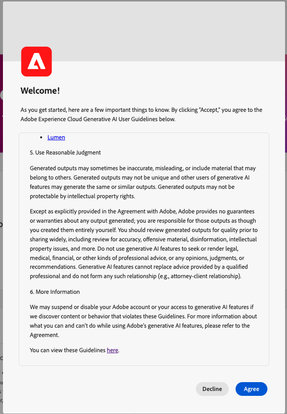

# ADOBE EXPERIENCE PLATFORMのAI アシスタント（レガシー）

>[!IMPORTANT]
>
>このドキュメントは、AI アシスタント（レガシー）に適用されます。 AI アシスタント（次世代型）について詳しくは、[AI アシスタント UI ガイド ](https://experienceleague.adobe.com/en/docs/experience-cloud-ai/experience-cloud-ai/ai-assistant/ai-assistant-ui)をExperience Cloud[の](https://experienceleague.adobe.com/en/docs/experience-cloud-ai/experience-cloud-ai/home)AI ドキュメントでご確認ください。

AI アシスタント（レガシー）とAI アシスタント（次世代）の比較については、次の表を参照してください。

| 機能領域 | AI アシスタント（レガシー） | AI アシスタント（次世代型） |
| --- | --- | --- |
| ユーザーエクスペリエンス | AI アシスタント（レガシー）は、右側のパネルでのみ使用できます。 | AI アシスタント（次世代）は、右側のパネルと没入型のフルスクリーン体験の両方で利用できます。 |
| 機能の範囲 | AI アシスタント（レガシー）は、製品知識と運用インサイトの両方に活用できます。 | AI アシスタント（次世代）は、製品知識、運用インサイト、高度なエージェント型スキル、マルチステップのタスク実行などに使用できます。 |
| プラットフォームアーキテクチャ | AI アシスタント（レガシー）は、Agent Orchestratorスタック上に構築されていません。 | [Adobe Experience Platform Agent Orchestrator](https://experienceleague.adobe.com/ja/docs/experience-cloud-ai/experience-cloud-ai/agents/agent-orchestrator)が提供するAI アシスタント （次世代）は、機能をまたいで拡張性と高度な連携を可能にします。 |
| 適用範囲 | AI アシスタント（レガシー）は、アプリケーション固有の実装です。 | AI アシスタント（次世代）を利用すれば、あらゆるAdobe Experience Cloudアプリケーションをまたいで、統合されたAI アシスタント体験を実現できます。 |
| アクセスと権限のモデル | アプリケーション範囲のアクセスモデルを個々の製品境界に合わせて調整。 | 利用者は誰でも、AI アシスタント（次世代）と関連するExperience Platformエージェントにアクセスできます。 **メモ**: <ul><li>**Adobe Experience Manager**：管理者は、[Adobe Admin Console](https://helpx.adobe.com/jp/enterprise/using/admin-console.html)を通じてAI アシスタント （Next-Gen）にアクセスする権限を付与する必要があります。</li><li>**Customer Journey Analytics**：管理者は、[Customer Journey Analytics アクセス制御](https://experienceleague.adobe.com/en/docs/analytics-platform/using/technotes/access-control?lang=en)を通じてAI アシスタントにアクセスする権限を付与する必要があります。 これにより、製品知識やデータインサイトにもとづいた質問が可能になります。 |

次のビデオは、AI アシスタントに関する理解を深めることを目的としています。

>[!VIDEO](https://video.tv.adobe.com/v/3429845?learn=on)

Adobe Experience PlatformのAI アシスタント（レガシー）について詳しくは、このドキュメントを参照してください。

ADOBE EXPERIENCE PLATFORMのAI アシスタント（レガシー）は、Adobeアプリケーションのワークフローを高速化するために利用できる会話型のエクスペリエンスです。 AI アシスタント（レガシー）を使用すれば、製品情報の理解、問題のトラブルシューティング、情報の検索を改善し、運用上のインサイトを獲得できます。 AI アシスタント（レガシー）は、Experience Platform、Real-Time Customer Data Platform、Adobe Journey Optimizer、Customer Journey Analyticsをサポートしています。

>[!IMPORTANT]
>
>AI アシスタント （レガシー）を使用するには、事前に[ ユーザー契約書](https://www.adobe.com/jp/legal/licenses-terms/adobe-dx-gen-ai-user-guidelines.html)に同意する必要があります。 ユーザー契約には、パブリックベータ契約も含まれます。 そのため、追加のAI アシスタント（レガシー）機能をベータ版で展開する際に使用できます。

+++選択してユーザー契約書インターフェイスを表示

+++

## AI アシスタントについて {#understanding-ai-assistant}

AI アシスタント（レガシー）は、送信された質問に対して、データベースにクエリを実行し、データベースのデータを人間が読みやすい回答に変換することで回答します。

この基礎となるデータの内部表現は、**[!DNL Knowledge Graph]**&#x200B;とも呼ばれます。これは、特定の回答に対する概念、データ、メタデータを包括的に組み合わせたwebです。

[!DNL Knowledge Graph]は、クエリが送信されるたびに参照されるサブグラフで構成されます。

* 顧客運用に関するインサイト。
* さまざまなメタストアをまたいだ顧客運用インサイト。
* Experience Leagueのドキュメント。

AI アシスタント（レガシー）をクエリする前に考慮すべき質問には、次の2つのクラスがあります。

### 製品知識 {#product-knowledge}

製品ナレッジとは、Experience Leagueのドキュメントに基づいた概念とトピックを指します。 製品知識に関する質問は、さらに次のサブグループに指定できます。

| 製品知識 | 例 |
| --- | --- |
| ターゲットを絞った学習 | <ul><li>IDとプライマリキーまたは外部キーの違いは何ですか？</li><li>類似オーディエンスとは何ですか？</li></ul> |
| オープン検出 | <ul><li>このデータセットを書き出すにはどうすればよいですか？</li><li>医療業界の顧客向けのスキーマはありますか？</li></ul> |
| トラブルシューティング | <ul><li>Adobeが所有するプロファイルのスキーマを有効にできないのはなぜですか？</li><li>セグメントを削除できないのはなぜですか？</li></ul> |

{style="table-layout:auto"}

AI アシスタント（レガシー）製品ナレッジに関する追加情報については、次のビデオをご覧ください。

>[!VIDEO](https://video.tv.adobe.com/v/3438032/?learn=on)

### 運用上のインサイト {#operational-insights}

運用上のインサイトとは、AI アシスタント（レガシー）が、カウント、ルックアップ、リネージへの影響など、メタデータオブジェクト（属性、オーディエンス、データフロー、データセット、宛先、ジャーニー、スキーマ、ソース）について生成する回答を指します。 サンドボックス内のデータは表示されません。

* 所有しているデータセットの数は？
* まだ使用されていないスキーマ属性の数
* どのオーディエンスがアクティブ化されたか？

次のドメインで、AI アシスタント（レガシー）に運用上のインサイトについて質問することができます。

| ドメイン | サポートされているメタデータ | サポートされていないメタデータ |
| --- | --- | --- |
| 属性 | <ul><li>属性名検索</li><li>属性 – スキーマ関係</li><li>属性 – データセットの関係</li><li>属性 – オーディエンス関係</li><li>属性 – 宛先関係</li></ul> | <ul><li>属性クラス</li><li>監査</li><li>非推奨ステータス</li><li>ラベル</li><li>属性に保存された値</li></ul> |
| オーディエンス | <ul><li>オーディエンス数</li><li>オーディエンスタイプ（ストリーミングまたはバッチ）</li><li>作成日/変更日</li><li>アクティベーションステータス</li><li>プロファイル数</li><li>オーディエンスの重複</li><li>オーディエンス定義検索</li><li>Audience - audience relationship</li><li>オーディエンス – 属性の関係</li><li>オーディエンス – データセットの関係</li><li>オーディエンス – 宛先関係</li><li>名前検索</li><li>名前とID検索 | <ul><li>オーディエンスの重複</li><li>Audience Activation</li><li>オーディエンス – キャンペーンの関係</li><li>監査</li><li>作成/修正</li><li>ラベル</li><li>プロファイル選定のトレンド</li></ul> |
| データフロー | <ul><li>データフロー数</li><li>データフローステータス</li><li>データフロー – データセットの関係</li><li>データフロー – ソース関係</li></ul> | <ul><li>制作/修正</li><li>データフローとバッチの関係</li><li>取り込みプロファイル数</li></ul> |
| データセット | <ul><li>データセット数</li><li>プロファイル有効ステータス</li><li>作成/変更日</li><li>データセット – スキーマ関係</li><li>データセット – オーディエンスの関係</li><li>データセット – 属性関係</li><li>データセット – データフローの関係</li><li>データセットサイズ</li><li>行数</li><li>名前検索 </li><li>名前とID検索</li></ul> | <ul><li>監査</li><li>作成者</li><li>データセット – バッチ関係</li><li>データセットの作成/修正</li><li>プロファイル数</li><li>値検索</li></ul> |
| データモデル（連合オーディエンス構成） | <ul><li>データモデルのカウント</li><li>名前検索</li><li>データモデルとスキーマの関係</li><li>リンクプロパティ</li><li>ステータス</li><li>作成日と変更日</li><li>リンクデータモデルの関係</li></ul> | |
| 宛先 | <ul><li>設定済みの宛先数</li><li>宛先 – オーディエンスの関係</li><li>配信先属性の関係</li></ul> | <ul><li>アカウント設定</li><li>アカウント資格情報</li><li>一意のプロファイルがアクティブ化されました</li></ul> |
| 連合データベース（連合オーディエンス構成） | <ul><li>データベース数</li><li>データベース名</li><li>データベースの種類</li><li>作成日/変更日</li><li>ステータス</li></ul> | |
| ジャーニー | <ul><li>カウント</li><li>名前検索</li><li>名前とID検索</li><li>ジャーニーステータス</li><li>トリガーされたステータス（オーディエンスとイベントの比較）</li><li>作成日/変更日</li><li>繰り返し頻度</li></ul> | <ul><li>属性 – ジャーニーの関係</li><li>監査</li><li>制作/修正</li><li>作成者</li><li>イベント</li><li>ジャーニー - データセット</li><li>ジャーニー - スキーマ</li><li>オファー</li><li>プロファイル選定のトレンド</li><li>ステップイベント</li></ul> |
| スキーマ | <ul><li>スキーマ数</li><li>作成/変更日</li><li>スキーマ – 属性関係</li><li>スキーマ – データセットの関係</li><li>スキーマ – オーディエンス関係</li><li>プロファイル有効ステータス</li><li>名前検索</li><li>名前とID検索</li></ul> | <ul><li>監査</li><li>制作/修正</li><li>作成者</li><li>フィールドグループ</li><li>ID</li><li>ID 名前空間</li><li>ラベル</li><li>プロファイル数</li></ul> |
| スキーマ（連合オーディエンス構成） | <ul><li>スキーマ数</li><li>スキーマ名/ラベル検索</li><li>作成日と変更日</li><li>スキーマとデータベースの関係</li><li>オーディエンスタイプスキーマ</li></ul> | <ul><li>スキーマとコンポジションの関係</li><li>スキーマプロパティ</li></ul> |
| ソース | <ul><li>アカウント数</li><li>アカウントステータス</li><li>各アカウントのアクティブ/非アクティブなデータフロー</li><li>Source コネクタ – データフローリレーションシップ</li><li>Source アカウント – データフローリレーションシップ</li></ul> | <ul><li>アカウント資格情報</li><li>アカウント設定</li><li>データ取り込み指標</li><li>プロファイル数</li><li>Source - バッチ関係</li></ul> |

{style="table-layout:auto"}

運用上のインサイトに関する質問の場合、回答がUIの現在の状態を反映しない場合があります。 これらの質問を裏付けるデータは、24時間ごとに更新されます。 例えば、日中にReal-Time CDPで行った変更は、夜間にデータストアと同期され、朝にユーザーからの質問に対応できるようになります。 サンドボックスにログインして、オブジェクトに関連する特定のデータについて問い合わせる必要があります。

AI アシスタント（レガシー）の運用インサイトに関する追加情報については、次の動画をご覧ください。

>[!VIDEO](https://video.tv.adobe.com/v/3444031?learn=on&enablevpops)

### 機能の範囲 {#feature-scope}

現在、AI アシスタント（レガシー）の範囲は次のとおりです。

* [製品情報](./home.md#product-knowledge): AI アシスタント （レガシー）は、Experience Platform、Real-Time Customer Data Platform、Adobe Journey Optimizerの製品情報に関する質問に答えることができます。 Customer Journey Analyticsの製品情報に関するトピックを詳しく調べることもできますが、それはCustomer Journey Analytics UIを介してのみです。
* [運用上のインサイト ](./home.md#operational-insights)：属性、オーディエンス、データフロー、データセット、宛先、ジャーニー、スキーマ、ソースのデータオブジェクトに関する運用上のインサイトについて、AI アシスタント（レガシー）に質問することができます。

## 次の手順

これで、AI アシスタント（レガシー）の概要を理解できたので、ワークフロー中にAI アシスタント（レガシー）を続行して使用できるようになります。 詳しくは、次のドキュメントを参照してください。

* [AI アシスタント（レガシー） UI ガイド](./ui-guide.md)
* [機能アクセス](./access.md)
* [質問ガイド](./questions.md)
* [AI アシスタント（レガシー）のプライバシー、セキュリティ、ガバナンス](./privacy.md)
* [よくある質問](./faq.md)
