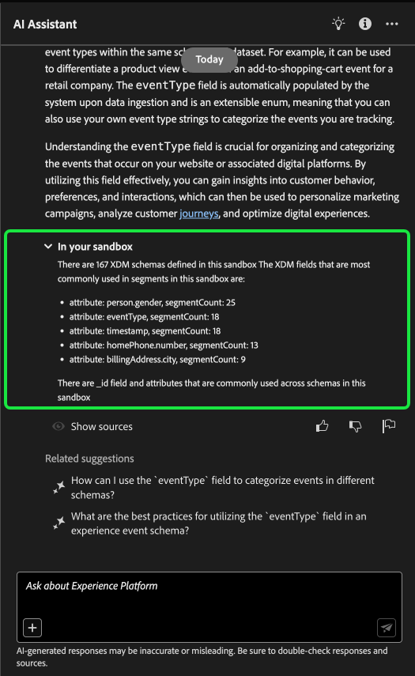
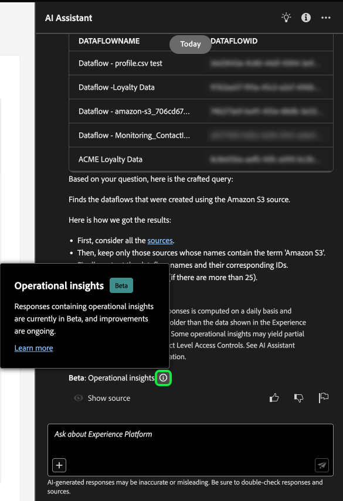

# AI アシスタント UI ガイド

Adobe Experience Platform UI で AI アシスタントを使用する方法については、このガイドをお読みください。

次のビデオは、AI アシスタントについて理解を深めるためのものです。

>[!VIDEO](https://video.tv.adobe.com/v/3429845?learn=on)

## Experience PlatformUI で AI アシスタントにアクセスする

AI アシスタントを起動するには、Experience PlatformUI の上部の見出しから **[!UICONTROL AI アシスタント]** アイコンを選択します。

AI アシスタントのインターフェイスが表示され、すぐに開始するための情報が表示されます。 「[!UICONTROL  アイデアを使って使い始める ] で提供されているオプションを使用して、次のような質問やコマンドに回答できます。

* [!UICONTROL  アクティブ化されているオーディエンスはどれですか？]
* [!UICONTROL  スキーマとは ]
* [!UICONTROL Real-Time CDPの一般的なユースケースを教えてください ]

## AI アシスタント UI ガイド

>[!NOTE]
>
>以下のワークフローは、エクスペリエンスイベントスキーマ作成プロセスを使用して、Experience Platform UI の使用時に AI Assistant を使用する方法を示す例です。

**イベントスキーマのデバイス取引** を作成するユースケースについて考えてみます。 エクスペリエンスイベントスキーマの作成プロセス中に、`eventType` フィールドに移動します。 「この時点で、ワークフローを終了して [ スキーマ構成の基本 ](../xdm/schema/composition.md) ドキュメントを参照するか、AI アシスタントを使用して質問に対する回答を取得し、AI アシスタントが推奨するドキュメントリンクから追加のリソースを見つけることができます」

開始するには、表示されたテキストボックスに質問を入力します。 次の例では、AI アシスタントに「**ExperienceEvent スキーマの eventType フィールドは何ですか？** という質問が提供されています。

次に、AI アシスタントがナレッジベースに問い合わせて、回答を計算します。 しばらくすると、AI アシスタントが回答と関連する提案を返し、フォローアップのプロンプトとして使用できます。

AI アシスタントから応答を受け取ったら、多数のオプションから選択して、進め方を決定できます。

### AI アシスタントの機能 {#features}

ここでは、Experience Platformのワークフローで使用できる AI アシスタントの様々な機能の概要を説明します。

### 運用データオブジェクトの表示 {#view-operational-data-objects}

クエリに応じて、AI アシスタントはサンドボックス内のデータに関する追加情報を提供します。 クエリに対する応答が特定のサンドボックスにどのように適用されるかを確認するには、**[!UICONTROL サンドボックス内 ].** を選択します

サンドボックスに関するデータを表示する際に、AI アシスタントは、クエリされたデータを表示する特定の UI ページへの直接リンクを提供する場合があります。

+++選択すると例が表示されます

この例では、AI アシスタントは、サンドボックス内の既存の XDM スキーマに関する追加情報（合計数や最も一般的に使用される 5 つのフィールドなど）を返します。

+++

### 引用文献の表示 {#view-citations}

AI アシスタントは、すべての製品ナレッジ回答で利用可能な引用を確認することで、返された回答を確認できます。

+++ソースの表示方法の例を表示する場合に選択します

引用文献を表示して AI アシスタントの応答を検証するには、[**[!UICONTROL ソースを表示]**] を選択します。

AI アシスタントがインターフェイスを更新し、最初の応答を裏付けるドキュメントへのリンクを提供します。 さらに、引用が有効な場合、AI アシスタントは応答を更新して脚注を含め、提供されたドキュメントを参照する回答の特定の部分を示します。

また、AI アシスタントが **[!UICONTROL 関連候補]** の下で提供する候補を使用して、元の質問に関連するトピックをさらに検索することもできます。

+++

### 運用上のインサイト {#operational-insights}

AI アシスタントが運用インサイトに関する質問に十分に対応するには、アクティブなサンドボックスにいる必要があります。

+++選択すると、オペレーショナルインサイトの質問の例が表示されます

次の例では、AI アシスタントに「Amazon S3 ソースを使用して作成されたデータフローを表示します **というクエリを要求され** す。

次に、AI アシスタントは、データフローと対応する ID をリストしたテーブルを返します。 データのテーブル全体を表示するには、右上の展開アイコンを選択します。

テーブルの展開ビューが表示され、クエリのパラメーターに基づいて、データフローのより包括的なリストが表示されます。

運用インサイトの質問が表示されたら、AI アシスタントは、回答がどのように計算されたかを説明します。 次の例では、[!DNL Amazon S3] ソースを使用して作成されたデータフローを識別するために AI アシスタントが実行した手順の概要を説明します。

また、質問に対してフィルターや変更を提供したり、含めるフィルターに基づいて結果をレンダリングするように AI アシスタントに指示したりできます。 例えば、AI アシスタントに依頼して、セグメント定義の数のトレンドを作成日順に表示したり、合計プロファイルが 0 のセグメント定義を削除したり、データを表示する際に整数の代わりに月名を使用したりできます。

**メモ：** オペレーショナルインサイトの回答は現在ベータ版です。 AI アシスタントのユーザーインターフェイスでツールチップアイコンを選択すると、Beta通知が表示され、ドキュメントへのリンクが表示されます。

+++

### オペレーショナルインサイトの応答の検証 {#verify-responses}

AI Assistant が提供する SQL クエリを使用して、運用インサイトの質問に関連する各応答を検証できます。

+++選択すると、オペレーショナルインサイトの応答の検証例が表示されます

オペレーショナルインサイトの質問に対する回答を受け取ったら、「**[!UICONTROL ソースを表示]**」を選択し、次に「**[!UICONTROL ソースクエリを表示]**」を選択します。

運用上のインサイトに関する質問で問い合わせられた場合、AI Assistant は SQL クエリを提供します。このクエリを使用して、回答の計算に要したプロセスを検証できます。 このソースクエリは検証目的でのみ使用され、クエリサービスではサポートされていません。

+++

### オートコンプリートを使用 {#use-auto-complete}

オートコンプリート関数を使用して、サンドボックスに存在するデータオブジェクトのリストを受け取ることができます。 オートコンプリートのレコメンデーションは、オーディエンス、スキーマ、データセット、ソースおよび宛先のドメインで使用できます。

+++選択すると、オートコンプリートの例が表示されます

オートコンプリートを使用するには、クエリにプラス記号（**`+`**）を含めます。 または、テキスト入力ボックスの下部にあるプラス記号（**`+`**）を選択することもできます。 ウィンドウが開き、サンドボックスから推奨されるデータオブジェクトのリストが表示されます。

+++

### マルチターンを使用 {#use-multi-turn}

AI アシスタントのマルチターン機能を使用して、エクスペリエンス中により自然な会話を行うことができます。 AI アシスタントは、与えられたフォローアップの質問に答えることができます。 このコンテキストは、以前のインタラクションから推測できます。

+++選択すると、マルチターンの例が表示されます

以下の例では、AI アシスタントに対して、まずデータフローの合計数を求められ、次に最新の 10 個のデータフローをリストするように求められます。

+++

### 新しい会話を開始

AI アシスタントでトピックを変更するには、リセットして新しい会話を開始します。

+++選択すると、会話のリセット例が表示されます

リセットするには、AI アシスタント インターフェイスで省略記号（**`...`**）を選択し、「**[!UICONTROL 新しい会話を開始]** を選択します。 これにより、トピックを変更する予定であることが AI アシスタントに通知され、失敗したり誤った情報を参照したりするクエリのトラブルシューティングを行う際に特に役立ちます。

+++

### 検出性を使用 {#use-discoverability}

AI アシスタントの検出機能を使用して、AI アシスタントがサポートする一般主題のリストをエンティティにグループ化して表示できます。

+++検索性の例を表示する場合に選択します

検出可能性を表示するには、AI Assistant インターフェイスの上部ヘッダーにある電球アイコンを選択します。

次に、カテゴリを選択し、表示されるリストからプロンプトを選択します。 この機能を使用すると、AI アシスタントが回答できる質問の種類をより深く把握できます。 また、フリーテキストまたは [ オートコンプリート ](#use-auto-complete) を使用して、サンドボックスに関連する特定の詳細で既存のプロンプトを更新することもできます。

+++

## フィードバックの提供 {#feedback}

回答に用意されているオプションを使用して、AI アシスタントでエクスペリエンスのフィードバックを提供できます。

フィードバックを入力するには、AI アシスタントから応答を受信した後で [ 親指を上げる ]、[ 親指を下げる ]、または [ フラグ ] を選択し、表示されたテキスト ボックスにフィードバックを入力します。

+++選択すると他の例が表示されます

>[!BEGINTABS]

>[!TAB  親指を立てる ]

サムズアップアイコンを選択して、AI アシスタントでエクスペリエンスに何が効果的かに関するフィードバックを提供します。

>[!TAB  サムズダウン ]

サムズダウンアイコンを選択して、AI アシスタントでの経験に基づいて改善点に関するフィードバックを提供します。 この手順の間に、エクスペリエンスに関する特定のコメントを入力することもできます。 コメントに含まれているフィードバックは毎日確認されます。

>[!TAB フラグ]

フラグアイコンを選択すると、AI アシスタントを使用したエクスペリエンスに関する詳細レポートが表示されます。

>[!ENDTABS]

+++
