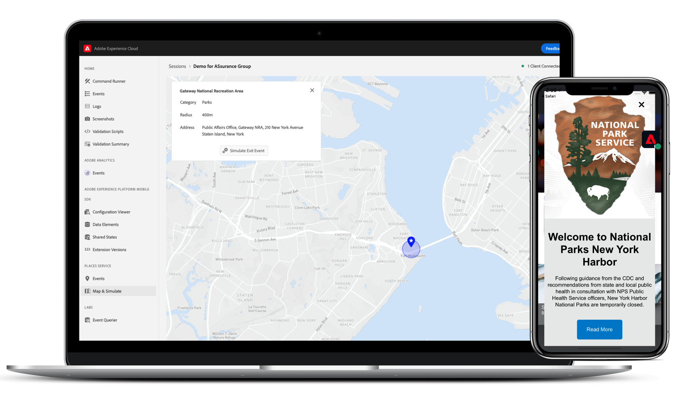

# Adobe Experience Platform Assurance

Adobe Experience Platform Assurance は、 [Adobe Experience Cloud](https://www.adobe.com/jp/experience-cloud.html) を使用して、モバイルアプリでデータを収集したりエクスペリエンスを提供したりする方法を調査、配達確認、シミュレーションおよび検証できます。

>[!IMPORTANT]
>
> プロジェクト Griffon は現在、 **アシュランス**!
>
> プロジェクト Griffon が一般に利用可能になりました。 **すべて** Adobe Experience Cloudのお客様をアシュランスとして。 この切り替えの詳細については、 [ユーザーアクセスガイド](./user-access.md).

>[!INFO]
>
>アシュランスパブリック API を利用できます。
>
>[Assurance API](https://developer.adobe.com/adobe-assurance-public-apis/) は、AdobeAssurance Mobile SDK に適合しない場合に、Web およびモバイルアプリのテストとデバッグを実行できる API のコレクションです。

## 一般公開

2022 年 10 月 15 日以降、アシュランスはすべてのAdobe Experience Cloudで一般に利用できます。

### 何が変わるの？

10 月 15 日 — アシュランスへのアクセスは、Admin Consoleを通じて管理されます。 詳しくは、 [ユーザーアクセスガイド](./user-access.md) を使用して、引き続き中断されないアクセスを実行できます。

既存の Assurance 統合、セッション、イベントに対して、その他の変更や中断は発生しません。 アシュランスは、次を通じて引き続きアクセスされます： [https://griffon.adobe.com](https://griffon.adobe.com) **または** （およびブックマーク）を使用できます。 [https://experience.adobe.com/assurance](https://experience.adobe.com/assurance).

## アシュランスは何の役に立つ？

### クイックセットアップ

コードを少し行って急いで開始します。 モバイルアプリの場合、Assurance はAdobe Experience Platform Mobile SDK と連携して、アプリのイベント、位置シグナル、設定パラメーター、SDK ログ、デバイス情報などの調査、シミュレーション、検証に役立ちます。

### 手間のかからない接続

アシュランスを利用すれば、アプリを Platform に接続する操作が簡単で信頼性が高くなります。 ネットワークプロキシを使用する必要はありません。 [MiTM](https://en.wikipedia.org/wiki/Man-in-the-middle_attack)) やその他のネットワーク体操 — QR コードをスキャンしたり、ボタンをタップしたりするのと同じくらい簡単にアプリを Assurance に接続できます。

### リアルタイムの検査、シミュレーション、検証

Assurance に接続した後、ライブストリーミングされたアプリのイベントやアクティビティを調べ、ノイズを除去するためにフィルタリングと検索をおこなうことができます。 イベントには、モバイルアプリ実装の検証、デバッグおよびトラブルシューティングに関する詳細が含まれています。 また、アシュランスでは、スクリーンショットを作成したり、ロケーションシグナルをシミュレートしたりできます。

### Adobe Experience Cloud との統合

クライアント側のデータとエクスペリエンスは、ユーザーがマーケティング担当者に焦点を当てたユーザーインターフェイスでレポートルール、アクティビティ、キャンペーンを設定する方法によってコンテキストを提供します。 この 2 つの間の点をつなぐために、Adobe Experience Platform、Adobe Analytics、Adobe Target、Places Service などのAdobe Experience Cloudソリューションとの統合を進めています。

## 機能

### Adobe Experience Platform Mobile SDK のイベント、ログなど

保証は、Adobe Experience Platform Mobile SDK で生成された生の SDK イベントを調べるのに役立ちます。 SDK で収集されたすべてのイベントを調査できます。 SDK イベントは、時間順に並べ替えられたリストビューに読み込まれます。 各イベントには、詳細を示す詳細ビューがあります。 SDK 設定、データ要素、共有状態、SDK 拡張機能のバージョンを参照するための追加のビューも提供されます。

### Adobe Analytics

Adobe Analytics / Analytics のイベント表示は、Adobe Analyticsモバイルの実装に関連するイベントを示す焦点のビューです。 リスト表示では、ライフサイクルイベント、アクション/状態イベント、後処理された「ステータス」、および特別な形式の表示で必要なイベントの詳細が表示されます。 「後処理済み」ステータスは、処理ルールがイベントに適用された後にAdobe Analyticsがイベントを処理した方法を示します。

### ストリーミングメディア用 Adobe Analytics

Adobe Analytics / Media Analytics のイベントビューには、オーディオおよびビデオ分析実装のイベントが表示されます。 イベントの詳細ビューには、再生セッションごとに追跡される標準およびカスタムのメタデータが表示されます。 さらに、後処理されたステータスと後処理されたメディア分析データ（メディア視聴時間や合計バッファー時間など）を表示できます。

### 場所（ロケーションサービス）

[ ロケーションサービス ] ビューは、ユーザーの場所の入口イベントと出口イベントを表示し、簡単に検証できるオンデバイス表示です。 この便利なビューは、コンテキスト内デバッグ用に、クライアント上の検査用の特定のデータポイントを表示する便利なインターフェイスを提供します。

## アシュランスは安全ですか？

アシュランスには、次のセキュリティ対策が実施されています。

* アシュランスとアシュランス Web UI の両方に、接続に対して PIN ベースの安全なハンドシェイクがあります。 ユーザーは、ハンドシェイクを明示的に作成する必要があります。これにより、エンドユーザーが「偶発的な」アシュランス接続を作成するのを防ぎます。
* アシュランスと、同じAdobe Experience Cloud組織 ID に属するアシュランス Web UI 間の接続のみがサポートされます。
* Adobe Experience Platform Mobile SDK のイベントは、HTTPS 経由で転送されます。
* Assurance とAdobe Experience Platform Mobile SDK が TLS 1.2 を使用
* アシュランスセッションは 30 日後に削除されます。
* ストレージのベストプラクティスに従って、保証セッションデータは保存時に暗号化されます。

## はじめに

アシュランスを設定するには、まずアプリケーションに Assurance 拡張機能をインストールする必要があります。 この方法については、次のチュートリアルを参照してください。 [Assurance 拡張機能の実装](https://developer.adobe.com/client-sdks/documentation/platform-assurance-sdk/#add-the-aep-assurance-extension-to-your-app).

アプリにアシュランスを追加した後、デバイスに接続できるアシュランスセッションを作成できます。 アシュランスの使用方法については、 [アシュランスの使用に関するガイド](./tutorials/using-assurance.md).
