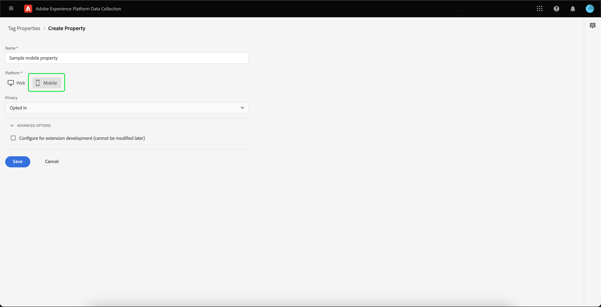

# Adobe Experience Platform Assurance 拡張機能の実装

このチュートリアルでは、Mobile SDK で Platform Assurance 拡張機能をインストールして実装する方法を説明します。 Assurance 拡張機能をアプリケーションに追加する手順については、 [Adobe Experience Platform Assurance 拡張機能の概要](https://developer.adobe.com/client-sdks/documentation/platform-assurance-sdk/#add-the-aep-assurance-extension-to-your-app).

## はじめに

Assurance 拡張機能をインストールして実装するには、次のサービスにアクセスする必要があります。

- この [Adobe Experience Platform Data Collection UI](https://experience.adobe.com/#/data-collection/)
- [Adobe Experience Platform Assurance](https://experience.adobe.com/assurance)

## モバイル プロパティの作成

>[!NOTE]
>
>既にモバイルプロパティがある場合は、次の手順に進むことができます。

データ収集 UI で、「 」を選択します。 **[!UICONTROL タグ]**. モバイルプロパティと Web プロパティのリストが表示され、組織に属するプロパティに関する情報が表示されます。 選択 **[!UICONTROL 新しいプロパティ]** をクリックして新しいプロパティを作成します。

この **[!UICONTROL プロパティを作成]** ページが表示されます。 新しいプロパティの名前を入力し、「 」を選択します。 **[!UICONTROL モバイル]** をプラットフォームとして使用する。 詳細を挿入した後、 **[!UICONTROL 保存]** をクリックしてモバイルプロパティを作成します。

>[!NOTE]
>
>モバイルプロパティの **[!UICONTROL プライバシー]** 設定 **not** アシュランスのデータ収集に影響を与える。

## Assurance 拡張機能のインストール

Assurance 拡張機能をインストールするモバイルプロパティを選択します。

この **モバイルプロパティの詳細** ページが表示されます。 選択 **[!UICONTROL 拡張機能]** をクリックして、現在モバイルプロパティに関連付けられている拡張機能のリストを表示します。

選択 **[!UICONTROL カタログ]** を参照して、モバイルプロパティに追加できる拡張機能のリストを確認します。 フィルターを使用して、 **[!UICONTROL AEP アシュランス]** 拡張機能と選択 **[!UICONTROL インストール]**.

## 次の手順

これで、モバイルプロパティに Assurance 拡張機能がインストールされ、アプリケーション内で Assurance の使用を開始できます。 Assurance 拡張機能をアプリケーションに追加する方法については、 [Adobe Experience Platform Assurance 拡張機能の概要](https://developer.adobe.com/client-sdks/documentation/platform-assurance-sdk/#add-the-aep-assurance-extension-to-your-app). アシュランスの使用方法については、 [アシュランスガイドの使用](./using-assurance.md).
