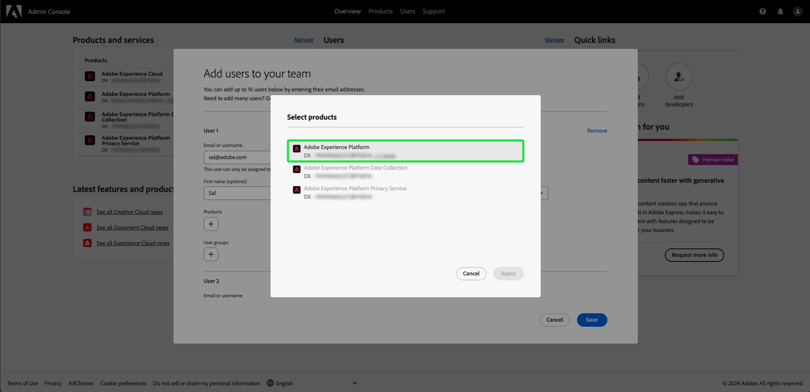

# ユーザーアクセス

[Assurance] で次の手順を実行して、Adobe Experience Platformの任意の製品プロファイルに追加することで、[!UICONTROL Adobe Admin Console](https://adminconsole.adobe.com/) へのアクセス権をユーザーに付与します。

## 製品プロファイルを使用したAdobe Experience Platformへのユーザーの追加 {#adding-product-profile}

製品プロファイルにユーザーを追加するには、[Adobe Admin Console](https://adminconsole.adobe.com/) にログインします。 Admin ConsoleUI の「**[!UICONTROL 概要]**」タブで、「**[!UICONTROL ユーザーを追加]**」を選択します。

**[!UICONTROL チームにユーザーを追加]**&#x200B;ダイアログが表示されます。追加するユーザーのメールアドレスまたはユーザー名を入力し、「**[!UICONTROL 新しいユーザーとして追加]**」を選択します。

オプションの **[!UICONTROL 名]** とオプションの **[!UICONTROL 姓]** の 2 つのテキストボックスが表示されます。 **[!UICONTROL SSO ユーザー名]** は、ドロップダウン内に **[!UICONTROL 国]** と共に自動入力されます。 これらのオプションが両方とも正しいことを確認し、必要な調整を行います。 すべてが正しければ、**[!UICONTROL 製品]** を選択します。

**[!UICONTROL 製品を選択]** ダイアログが表示されます。 Adobe Experience Platformを選択します。

**[!UICONTROL 製品プロファイルを選択]** ダイアログが表示され、製品プロファイルのリストが表示されます。 任意の製品プロファイルを選択し、「**[!UICONTROL 適用]**」を選択します。 これらの手順を繰り返すことで、製品および製品プロファイルを追加できます。

すべての項目がユーザーに対して正しいことを再確認します。 ここからユーザーを追加したり、「**[!UICONTROL 保存]** を選択して変更を保存したりできます。

