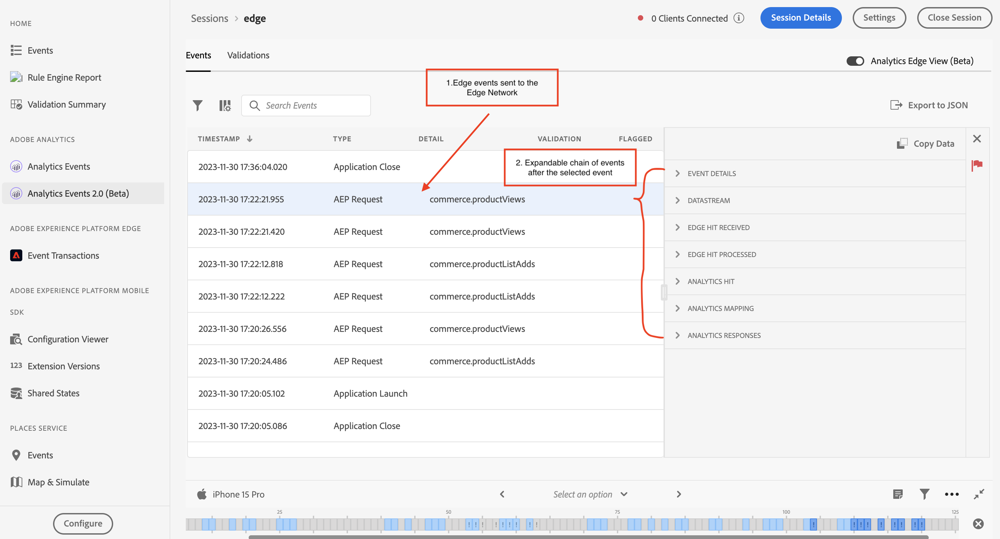

# Assurance での Analytics Events 2.0

Analytics Events 2.0 を使用すると、Adobe Analytics実装のデバッグや検証を行うユーザーに、SDK イベントをより深く表示できます。 ビューには、 [Adobe Experience Platform Mobile SDK](https://developer.adobe.com/client-sdks/solution/adobe-analytics/) 同様に [Adobe Experience Platform Edge Network SDK](https://developer.adobe.com/client-sdks/edge/edge-network/). また、このビューには、イベントがクライアント SDK でどのように処理されたかに関するコンテキストと、デバイスを離れた後のアップストリームサービスに関するコンテキストを提供する詳細パネルも含まれています。

## はじめに

このビューを使用するには、次の手順を実行します。

1. [Adobe Experience Platform Assurance の設定](../tutorials/implement-assurance.md).
2. [アシュランスセッションの作成と接続](../tutorials/using-assurance.md).
3. 左側のナビゲーションの Assurance UI で **ホーム** [ 表示 ] メニュー、[ 選択 ] **Analytics Events 2.0（ベータ版）**. このオプションが表示されない場合は、 **設定** ウィンドウの左下に、 **Analytics Events 2.0（ベータ版）**&#x200B;をクリックし、次を選択します。 **保存**.

## Analytics イベントビュー

を使用している場合は、Analytics イベントビューを使用します。 **Adobe Analytics** モバイル拡張機能。 このビューでは、接続したクライアントから送信された Analytics イベント（追跡アクション、追跡状態、ライフサイクルイベントなど）を簡単に表示できます。 テーブルで Analytics イベントの 1 つを選択すると、イベントの処理方法の詳細が右側のパネルに表示されます。

### 後処理ステータス

SDK がAdobe Analyticsでネットワークリクエストをおこなうと、アシュランスがAdobe Analyticsリクエストの後処理情報を取得できたかどうかをステータスが示します。 リクエストがトリガーされた後、後処理ステータスが操作中の間、Analytics のイベントビューをアクティブのままにしておく必要があります。

後処理情報を取得するには、ログインユーザーが対応するレポートスイートにアクセスできる必要があります。

| ステータス | 説明 |
| :----- | :---------- |
| `Queued` | ネットワークリクエストが後処理情報を取得しています。 |
| `Processed` | ネットワークリクエストが成功し、後処理情報が受信されました。 |
| `Delayed` | 後処理情報を取得するためのリクエストの再試行の最大数を超えました。 |
| `Error` | エラーが発生したため、ネットワークリクエストが失敗しました。 エラーに関する詳細は、イベントの詳細ビューに表示されます。 |
| `Unauthorized` | ユーザーはAdobe Analyticsレポートスイートにアクセスできません。 |
| `Unavailable` | Adobe Analyticsリクエストには、対応する `AnalyticsResponse` イベント。 |
| `No Debug Flag` | 現在のAdobe Analyticsまたは Assurance SDK バージョンは、Analytics デバッグ機能をサポートしていない可能性があります。 詳しくは、 [トラブルシューティングガイド](../troubleshooting.md). |
| `Expired` | The `AnalyticsTrack` または `LifecycleStart` イベントが 24 時間より古い。 |

### イベントの詳細ビュー

Analytics 追跡イベントの場合、詳細ビューには次の部分が含まれます。

- 元の SDK Analytics リクエストイベントです。
- リクエストからのメタデータとコンテキストデータ（レポートスイート ID、SDK 拡張機能のバージョン、コンテキストデータなど）。
- Revar、eVar および prop のマッピングを含む Analytics イベントに関する後処理の情報。

### Analytics ビューの検証

検証ビューを使用すると、Analytics に関連する検証スクリプトの結果を簡単に表示できます。 バリデータによって表示されるエラーには、修正されるべき場所へのリンクや、エラー状態のイベントを表示するリンクが含まれる場合があります。

## Analytics Edge ビュー

Analytics Edge ビュー ( **Edge Network** または **Edge Bridge** モバイル拡張機能。 この表示を有効にするには、右上の「Analytics Edge（ベータ版）」切り替えを選択して、現在のセッションで Edge ネットワーク経由で送信された Analytics イベントを表示します。 これには、ライフサイクル拡張機能、Edge リクエスト、および追跡アクションと追跡状態に基づく Edge Bridge イベントで発生したすべてのイベントが含まれます。

Analytics Edge ビューには、クライアントがディスパッチする Analytics 関連の Edge リクエストとライフサイクルメソッドに関する情報が含まれています。 リストでイベントを選択すると、右側のパネルに、クライアント SDK によって処理されたイベントと、デバイスを離れた後のアップストリームサービスが表示されるので、呼び出しによって生じたイベントの連鎖を簡単に表示できます。

### Analytics エッジ検証

Analytics Edge 検証ビューを使用すると、Analytics Edge に関連する検証スクリプトの結果を簡単に表示できます。 バリデータによって表示されるエラーには、修正されるべき場所へのリンクや、エラー状態のイベントを表示するリンクが含まれる場合があります。

