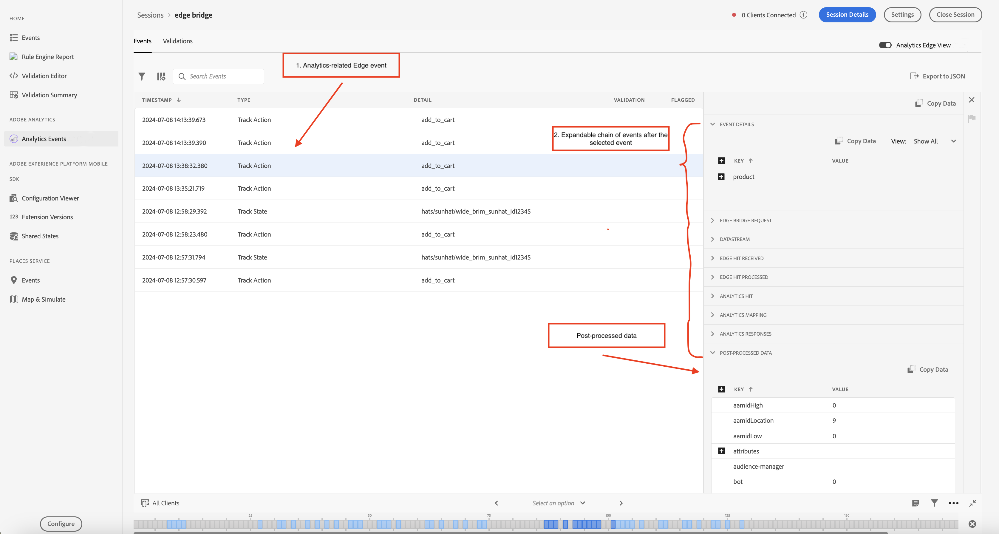
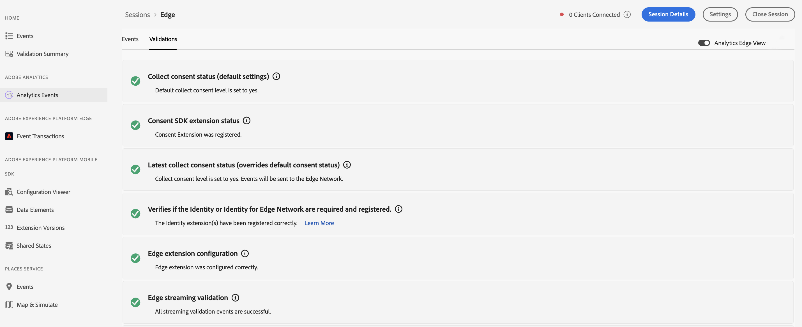

# Assurance のAdobe Analytics イベントビュー

Analytics イベントを使用すると、SDK イベントをより詳細に把握し、Adobe Analytics実装のデバッグと検証を行うことができます。 ビューには、[&#128279;](https://developer.adobe.com/client-sdks/solution/adobe-analytics/)Adobe Experience Platform Event SDK と [Adobe Experience Platform Mobile SDK](https://developer.adobe.com/client-sdks/edge/edge-network/) からAdobe Analyticsに送信されたEdge Networkが表示され  す。 また、この表示には詳細パネルも用意されており、イベントがデバイスを離れた後にクライアント SDK とアップストリームサービスによってどのように処理されたかに関するコンテキストを提供します。

## はじめに

このビューを使用するには、次の手順を実行します。

1. [Adobe Experience Platform Assurance を設定します &#x200B;](../tutorials/implement-assurance.md)。
2. [Assurance セッションを作成して接続します &#x200B;](../tutorials/using-assurance.md)。
3. 左側のナビゲーションの Assurance UI **ホーム** 表示メニュー）で、「**分析イベント**」を選択します。 このオプションが表示されない場合は、ウィンドウの左下にある **設定** を選択し、**Analytics イベント** を追加して、**保存** を選択します。

## Analytics Edge ビュー

**Analytics または** Edge Edge **モバイル拡張機能を使用している場合は、Edge Network Bridge** ビューを使用します。 このビューは、右上隅の「Analytics Edge ビュー」切り替えスイッチがアクティブ化され、現在のセッションでEdge ネットワークを介して送信された Analytics イベントを表示すると有効になります。 これには、ライフサイクル拡張機能、Edge拡張機能、Edge Bridge拡張機能によって発生したすべてのイベントが含まれます。

Analytics Edge ビューには、クライアントがディスパッチした Analytics 関連のEdge イベントとライフサイクルイベントに関する情報が表示されます。 リストでイベントを選択すると、右側のイベントの詳細表示パネルに、デバイスを離れた後にクライアント SDK およびアップストリームサービスで処理されたイベントが表示されます。 これにより、の呼び出しから生じたイベントのチェーンを簡単に表示できます。

リスト内の **後処理データ** イベントは、データが正常に処理され、Adobe Analyticsに送信されたことを確認します。 このイベントまたは処理済みデータが見つからない場合、ユーザーはリスト内の各イベントを展開して、詳細なデバッグ情報を表示できます。

### Analytics Edge イベントの詳細表示

Edge リクエストイベントまたは Analytics トラックイベントの場合、詳細ビューには次の情報が表示されます。

* イベントの詳細：元の SDK Edge リクエストイベント。
* Edge Bridge リクエスト：Edge Bridge拡張機能ワークフロー専用のイベント。
* データストリーム：このセッションのデータストリーム用に表されるイベント。
* Edge ヒット受信：Edgeから受信したヒットを表します。
* Edge ヒット処理済み：Edgeで処理されたヒットを表します。
* Analytics ヒット：Analytics から受け取ったヒットを表します。
* Analytics マッピング：Analytics のデータマッピングステータスを表します。
* Analytics 応答済み：Analytics からの応答ステータス。
* 後処理データ：リポジトリ、eVar および prop のマッピングを含むイベントに関する情報。

### Analytics Edgeの検証

Analytics Edgeの検証ビューを使用すると、Analytics Edge セッションに関連する検証スクリプトの結果を簡単に確認できます。 バリデーターによって表示されるエラーには、修正する場所へのリンクが含まれている場合や、エラー状態のイベントが表示されている場合があります。

## Analytics イベントビュー

**Adobe Analytics** モバイル拡張機能を使用している場合は、Analytics イベントビューを使用します。 このビューを使用すると、アクションの追跡、状態の追跡、ライフサイクルイベントなど、接続したクライアントから送信された Analytics イベントを簡単に確認できます。 このビューは、右上の「Analytics Edge ビュー」の切り替えが無効になっている場合にアクティブになります。

イベントテーブルの Analytics イベントの 1 つを選択すると、イベントがどのように処理されたかの詳細を右側のパネルに表示できます。

### 後処理ステータス

SDK がAdobe Analyticsでネットワークリクエストを送信すると、Adobe Analyticsが Assurance リクエストの後処理データを取得できたかどうかをステータスが示します。 リクエストがトリガーされた後、後処理ステータスが操作中は、Analytics イベントビューをアクティブにしておく必要があります。

後処理情報を取得するには、ログインしたユーザーが対応するレポートスイートにアクセスできる必要があります。

| ステータス | 説明 |
| :----- | :---------- |
| `Queued` | ネットワークリクエストは後処理情報を取得しています。 |
| `Processed` | ネットワークリクエストが成功し、後処理情報が受信されます。 |
| `Delayed` | 後処理情報を取得するための再試行リクエストの最大数を超えました。 |
| `Error` | エラーが原因で、ネットワーク要求が失敗しました。 エラーの詳細は、イベントの詳細表示に表示されます。 |
| `Unauthorized` | ユーザーには、Adobe Analytics レポートスイートへのアクセス権がありません。 |
| `Unavailable` | Adobe Analytics リクエストに対応する `AnalyticsResponse` イベントがありません。 |
| `No Debug Flag` | 現在のAdobe Analyticsまたは Assurance SDK バージョンでは、Analytics のデバッグ機能がサポートされていない可能性があります。 詳しくは、[&#x200B; トラブルシューティングガイド &#x200B;](../troubleshooting.md) を参照してください。 |
| `Expired` | `AnalyticsTrack` または `LifecycleStart` イベントが 24 時間より古い。 |

### イベントの詳細表示

Analytics のトラックイベントの場合、詳細ビューには次の部分が表示されます。

* 起点となる SDK Analytics リクエストイベント。
* リクエストからのメタデータとコンテキストデータ（レポートスイート ID、SDK 拡張機能バージョン、コンテキストデータなど）。
* リポジトリ、eVar および prop のマッピングを含む、Analytics イベントに関する後処理情報。

### Analytics ビューの検証

検証ビューを使用すると、Analytics に関連する検証スクリプトで結果を簡単に確認できます。 バリデーターによって表示されるエラーには、修正する場所へのリンクが含まれている場合や、エラー状態のイベントが表示されている場合があります。

