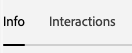
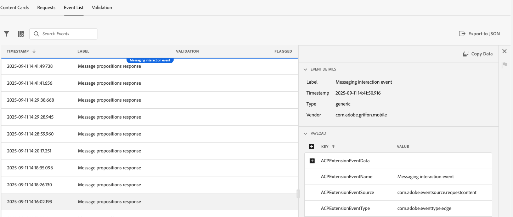

# Assuranceのコンテンツカード表示

Adobe Experience Platform Assurance内のアプリ内メッセージビューでは、アプリの検証、デバイスに配信されるコンテンツカードの監視、カードのプレビューを行うことができます。

## コンテンツカード

「**[!UICONTROL コンテンツカード]**」タブの上部には、「**[!UICONTROL コンテンツカード]** ドロップダウンがあります。 Assurance セッションで受信したすべてのコンテンツカードが一覧表示されます。 カードがこのリストにない場合は、アプリはカードを受信しなかったことを意味します。

コンテンツカードを選択すると、そのカードに関する多くの情報が表示されます（以下の節を参照）。

### カードのプレビュー

右側のパネルには **[!UICONTROL カードプレビュー]** パネルがあり、小さい画像、大きい画像、画像のみなど、一般的なテンプレートをまたいでカードがレンダリングされる方法が表示されます。

**[!UICONTROL テーマ]** トグルを使用して、カードをライトモードまたはダークモードで表示します。

### 使用可能なタブ

左側のセクションで使用できるタブは、選択したカードによって異なります。 カードにルールが含まれている場合は、「**[!UICONTROL 情報]**」、「**[!UICONTROL インタラクション]**」、「**[!UICONTROL ルールを分析]** の 3 つのタブが表示されます。

カードにルールが含まれていない場合は、「**[!UICONTROL 情報]**」タブと「**[!UICONTROL インタラクション]** タブが表示されます。

### 「情報」タブ

**[!UICONTROL 情報]** タブには、上部に **[!UICONTROL カードプロパティ]** セクションが表示されます。これには、**[!UICONTROL 現在のステート]** （トリガー、表示、解除、選定解除）のバッジと、**[!UICONTROL テンプレート]** （小画像、大画像、画像のみ）、**[!UICONTROL サーフェス]**、任意のカスタムキーと値のペアなどのメタ詳細が含まれます。

その下の「**[!UICONTROL キャンペーンプロパティ]**」セクションには、Adobe Journey Optimizer（AJO）から読み込まれた情報が表示されます。

**[!UICONTROL キャンペーンを表示]** を選択して、AJOでカードを開いて検査または編集することもできます。

### 「インタラクション」タブ

**[!UICONTROL インタラクション]** タブには、各カードのライフサイクルがバッジのシーケンスとして要約されます。常に **[!UICONTROL トリガー]** から始まり、ルールで生成されたあらゆる結果（**[!UICONTROL display]**、**[!UICONTROL disclain]**、または **[!UICONTROL disclaible]** が続きます。

### 「ルールを分析」タブ

「**[!UICONTROL 分析]**」タブには、カードのルールに基づいて、最大 3 つのルール列 **[!UICONTROL 表示]**、**[!UICONTROL 解除]**、**[!UICONTROL 選定解除]** を含むイベントテーブルが表示されます。 カードで定義されているルールが 1 つだけの場合は、その列のみが表示されます。

各行はセッションイベントを表し、各列はそのイベントの条件に対してカードのルールが一致したかどうかを示します。 スコアが 0% の場合は、一致する条件がないことを意味し、100% は完全一致です（ルールが起動します）。

イベントが条件に一致する場合は、緑色のチェックマークが表示されます。 イベントが一致しない場合は、赤いアイコンが表示されます。

**[!UICONTROL マッチしきい値]** スライダーを使用して、マッチ率の最小値でイベントをフィルタリングします。

イベントを選択すると、右側に詳細パネルが開き、3 つのルール（**[!UICONTROL 表示]**、**[!UICONTROL 解除]**、**[!UICONTROL 選定解除]** がリストされたアコーディオンが表示されます。

任意のセクションを展開して、ルールの条件、一致した条件およびその結果に対する計算された一致率を表示します。

## 「リクエスト」タブ

**[!UICONTROL リクエスト]** タブには、リクエストされたコンテンツカードとリクエストされたコンテンツカードのサーフェスが表示されます。

**[!UICONTROL カードを表示]** ボタンを使用して、特定のコンテンツカードの情報タブに戻ります。

## 「イベントリスト」タブ

**[!UICONTROL イベントリスト]** タブには、AJOの提案のリクエスト/応答、カードライフサイクルイベント、インタラクショントラッキングなど、コンテンツカードに関連するセッションイベントが表示されます。 列の検索、フィルタリング、並べ替え、カスタマイズのほか、結果の書き出しを行うことができます。

イベントを選択すると、右側の詳細パネルが開き、生のペイロードとキー属性が表示されます。フォローアップのためにイベントにフラグを付けることもできます。 このビューは、セッション全体でリクエスト、ルール結果、インタラクションを関連付ける場合に役立ちます。

## 「検証」タブ

「**[!UICONTROL 検証]**」タブは、現在のセッションに対して検証を実行し、アプリがメッセージング用に正しく設定されているかどうかを確認します。

![[Validation] タブの結果：現在のセッションのメッセージング構成を確認 &#x200B;](./images/content-cards/validation.png)
