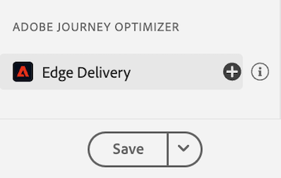
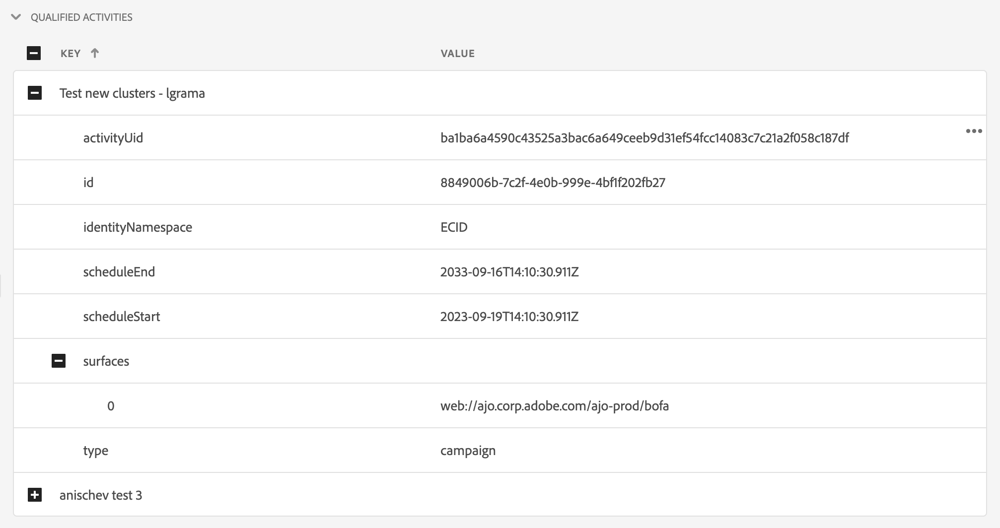

# Assurance のEdge Delivery表示

**[!UICONTROL Adobe Experience Platform Assurance]** 内の **[!UICONTROL AJO]** ビューは、web アプリやモバイルアプリに対するメッセージの [!UICONTROL Edge Delivery インバウンド ] エッジ配信を検査および検証する機能を提供します。 このビューは、[!UICONTROL AJO インバウンド、web およびモバイルキャンペーン ] ジャーニーの配信のトラブルシューティングに特に役立ちます。

## はじめに

続行する前に、次のサービスにアクセスできることを確認してください：

- [Adobe Experience Platform Data Collection UI](https://experience.adobe.com/#/data-collection/)
- [Adobe Experience Platform アシュランス ](https://experience.adobe.com/assurance)

アプリケーションに **[!UICONTROL Assurance]** をインストールする方法については、[Assurance 実装ガイド ](../tutorials/implement-assurance.md) を参照してください。

## Edge Deliveryでの Assurance の使用

**[!UICONTROL Assurance]** セッションを開くと、**[!UICONTROL Edge Delivery]** ビューを **[!UICONTROL Assurance]** に追加できます。 左側のパネルの下部にある「**[!UICONTROL 設定]**」を選択して、**[!UICONTROL Edge Delivery]** ビューを追加し、**保存** します。

。

追加したら、「**[!UICONTROL Edge Delivery]**」セクションの **[!UICONTROL Adobe Journey Optimizer]** ビューを選択して、インバウンドエッジ配信を検証します。

 す。

## リクエストリスト

ビューのメインペインに、エッジ配信リクエストのリストが表示されます。 このリストには、Experience Edgeに対して行われ、[!UICONTROL  インバウンドAJO] によって処理されるすべての **[!UICONTROL インバウンド配信サービス]** リクエストが表示されます。これには、パーソナライゼーションの決定の取得や、パーソナライゼーションの提案インタラクションのトラッキング（表示、クリック、トリガー、解除など）のリクエストが含まれます。

リクエストはタイムスタンプで並べ替えられ、最新のリクエストが先頭に表示されます。 このリストには、タイムスタンプに加えて、リクエスト ID 列とリクエストタイプも含まれます。リクエストタイプは、次のいずれかです。

- **[!UICONTROL エクスペリエンス配信]**：パーソナライゼーションの決定を取得するリクエスト
- **[!UICONTROL エクスペリエンスインタラクション]**：パーソナライゼーションの提案インタラクションを追跡するリクエスト
- **[!UICONTROL エクスペリエンス配信とインタラクション]**：パーソナライゼーションの提案インタラクションも含め、パーソナライゼーションに関する決定を取得するリクエスト
- **[!UICONTROL プレビュー配信]**：パーソナライゼーションのプレビュー決定を取得するリクエスト

リクエストは、リスト上部の検索バーに検索語句を入力してフィルタリングすることもできます。 これは、ID などの特定の値でフィルタリングする場合に役立ちます。

## 詳細なリクエストビュー

メインビューでリクエストが選択されると、選択したリクエストに関する詳細情報が右側に表示されます。 このビューには、次のセクションが含まれます。

### リクエストの概要

ここでは、{Organization ID]、[!UICONTROL Edge クラスター ]、{ リクエスト ID]  [!UICONTROL 、リクエストの種類 [!UICONTROL 、{ サンドボックス ID] [!UICONTROL 、{ サンドボックス名 ]、{ データストリーム ID][!UICONTROL  などの、選択したリクエストの概要および [!UICONTROL  エクスペリエンス配信 ] リクエストの場合のリクエストサーフェスのリストを示します [!UICONTROL 。

### プロファイル

このセクションでは、ID マップ、セグメントメンバーシップ、同意設定など、リクエストの処理時に使用されるプロファイルデータに関する情報を提供します。\
[!UICONTROL  プロファイル ] のセクションは、セグメントメンバーシップの欠如や遅延、オプトアウト同意設定が原因で配信が期待どおりに動作しないなどの問題のトラブルシューティングを行う場合に非常に役立ちます。

### 適格な活動

このセクションには、選択したリクエストに適合したアクティビティのリストが表示されます。これには、アクティビティタイプ、ID、ID 名前空間、サーフェス、スケジュール、オーディエンスが含まれます。 アクティビティについて詳しくは、[raw 実行トレースの節 ](#execution) を参照してください。

### 未適合のアクティビティ

この節では、選定から除外されたアクティビティのリストを示します。 この節には、アクティビティタイプ、ID、ID 名前空間、サーフェス、スケジュール、オーディエンスに加えて、アクティビティが選定されなかった理由のリストも含まれています。

### メッセージの詳細

このセクションには、選択したリクエストに対して配信されたメッセージに関する詳細情報が表示されます。 これには、メッセージ ID、フラグメント、決定ポリシー、[!UICONTROL Offer decisioning] パラメーターおよびメッセージ選択コンテキストが含まれます。

### インタラクション数

このセクションには、選択したリクエストで追跡されたインタラクションに関する詳細情報が表示されます。 インタラクションタイプ（`propositionEventType` 下）と、関連する提案メタデータ（アクティビティメタデータ（`scopeDetails.activity` 下）や提案イベントトークン（`scopeDetails.characteristics.eventToken` 下）など）が含まれます。

### 生のトレース

このセクションには、選択したリクエストの生のトレースが表示されます。 これには、リクエストの完全なトレース（**[!UICONTROL インバウンド配信サービス]** で受信した実際のリクエストのトレースを含む）、実行トレース、応答トレースが含まれます。 これは、配信サービスが利用できない、データが見つからない、または正しくないなどの理由で配信が期待どおりに機能しない、またはリクエスト処理の完全なフローを把握するなどの、高度なトラブルシューティングに役立ちます。

#### リクエスト

リクエストトレースには、**[!UICONTROL Inbound Delivery Service]****[!UICONTROL Konductor]** アップストリームで受信された完全なリクエストが含まれます。 リクエストヘッダー、本文、その他のメタデータが含まれます。 例えば、リクエストの XDM ペイロードを `event.body.xdm` フィールドで調べることができます。

#### 実行

実行トレースには、**[!UICONTROL インバウンド配信サービス]** で処理されたリクエストの完全なトレースが含まれます。 実行コンテキスト、アクティビティの選定、メッセージの選択、その他の処理ステップが表示されます。 リクエストの処理中に発生したエラーや警告は、「`context.messages`」フィールドと「`context.exceptions`」フィールドで確認できます。 アクティビティの選定に関する詳細な情報は、`context.qualifiedActivitiesDetailed` フィールドと `context.unqualifiedActivitiesDetailed` フィールドにあります。

#### 応答

応答トレースには、**[!UICONTROL Konductor]** にダウンストリームで **[!UICONTROL インバウンド配信サービス]** から返された完全な応答が含まれます。 応答ヘッダー、本文、その他のメタデータが含まれます。 応答全体を調べるには、「**[!UICONTROL 値をコピー]**」ボタンを使用して ID `1` のメッセージをクリップボードにコピーし、JSON ビューアに貼り付けます。

