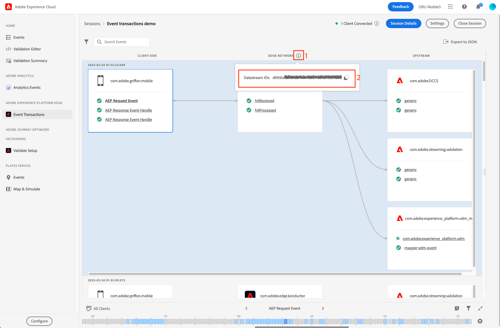

# イベントトランザクションビュー

Adobe Experience Platform Assurance の「Event Transactions」ビューを使用すると、Edge Network クライアント実装を検証およびデバッグし、アップストリーム検証の結果をほぼリアルタイムで確認できます。

## Edge ネットワークワークフローのアシュランスを設定する

後 [アシュランスの設定](../tutorials/implement-assurance.md)を使用している場合は、Assurance および Edge ネットワーク拡張機能の最新バージョンがアプリに実装されていることを確認してください。

イベントを表示するには、左側のメニューから「 」を選択します **[!UICONTROL イベントトランザクション]** の下に **[!UICONTROL Adobe Experience Platform Edge]** 」セクションに入力します。

このオプションが表示されない場合は、 **[!UICONTROL 設定]** ウィンドウの左下に、 **[!UICONTROL イベントトランザクション]** 表示して選択 **[!UICONTROL 保存]**.

## イベントトランザクションビューの使用を開始する

この節では、イベントトランザクションビューについて説明し、Edge ネットワークワークフローでのエンドツーエンドの検証に対して、トランザクションビューを効率的に使用する方法を説明します。

### イベント処理フロー

「Event Transactions」ビューには、イベント処理フローの順序で 3 つの列が表示されます。

- **[!UICONTROL クライアント側]**:この列には、Mobile SDK がアクセスできるクライアント側で処理または受け取ったイベントが表示されます。 これには、API 呼び出しを使用して作成されたイベント ( 例： `Edge.sendEvent`に設定され、クライアントが Edge ネットワークサーバーから受信した応答イベントを処理します（存在する場合）。 クライアント側イベントの例：
   - AEP リクエストイベントは、Edge 拡張機能を通じて送信されるイベントで、XDM とオプションのフリーフォームデータを含みます。
   - AEP Response Event Handle は、AEP リクエストイベントに応じて Edge ネットワークから受信したイベントハンドルです。 リクエストイベントは、1 つもの、または複数の応答イベントハンドルを受け取る場合があります。
   - AEP エラー応答は、例えば、XDM ペイロードを処理できなかった場合や、アップストリームサービスの 1 つがエラーまたは警告を返した場合などに、エラーが発生した場合に表示されることがあります。
- **[!UICONTROL Edge Network]**:この列には、ネットワークリクエストを通じて Edge ネットワークがサーバー側で受け取ったイベントと、イベントに含まれていたデータとメタデータが表示されます。
- **[!UICONTROL アップストリーム]**:この列には、設定済みのアップストリームサービスが受け取ったイベントが表示されます。この中には、受信イベントの処理や検証の結果に関する詳細情報も含まれます。
この列は動的で、次の 2 つの主な要因に応じて異なるタイプの情報が表示される場合があることに注意してください。
   - データストリーム設定と、それに対して有効なサービス。
   - Edge ネットワークに送信されるイベントのタイプ。

### Inspectイベント

[Event Transactions] ビューに表示されるイベントは、各状態で処理されるデータの形式と内容に関する情報と、データのアップストリーム処理時に発生した警告やエラーに関する洞察的な詳細を提供します。 このビューは、イベント/リクエストレベルでデバッグ情報を絞り込み、開発サイクルの初期の段階でエラーを識別するのに役立ちます。

#### イベントの詳細を展開します

イベントを検査するには、ビューから目的のイベントを選択します。 このアクションにより、 **[!UICONTROL イベントの詳細]** を表示します。
ネストされたデータは、ツリー形式で表示されます。 ネストされたキーと値を調べるには、 **+** (+) キー名の左にあるボタン。

#### Inspectの警告またはエラー

各イベント名の前には、そのイベントの処理の大まかなステータスを示すアイコンが付きます。

- イベントが正常に処理された場合は、緑のチェックマークが表示されます。
- 警告またはエラーが検出された場合は、警告記号が表示されます。 関連イベントを選択して、 **[!UICONTROL イベントの詳細]** 表示

### 設定

現在使用中のデータストリーム識別子を確認するには、 **[!UICONTROL Edge Network]** 列ヘッダー。

>[!INFO]
>
>複数のクライアントが同じ Assurance セッションに接続し、異なるデータストリーム ID を使用する場合、それらすべてがここに表示されます。 ただし、現在の実装で複数のデータストリームが使用されているとは限りません。 アプリが使用するタグ（モバイルプロパティ）で設定された現在のデータストリーム ID のみが、そのクライアントからの新しいイベントの処理に使用されます。 異なる設定や複数のクライアントが接続された、より複雑な使用例をテストする場合は、別々のアシュランスセッションを使用して検証プロセスを簡略化すると便利です。
