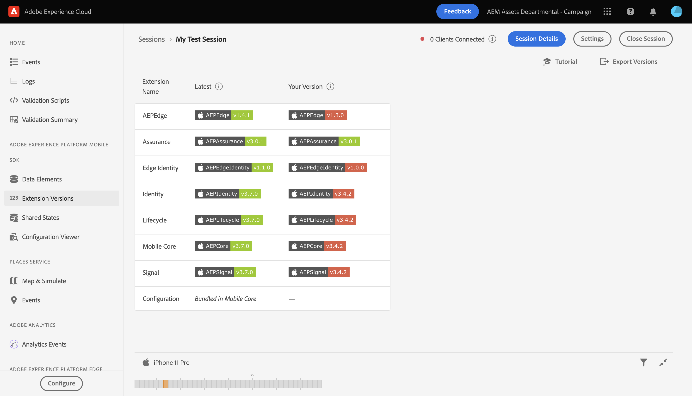

# 拡張機能のバージョン表示

拡張機能のバージョン表示を使用すると、インストールしたAdobe Experience Platform mobile extensions の順序と表示をすばやく確認できます。また、保証セッションに接続されたクライアントで、モバイル拡張機能が最新かどうかも確認できます。

## 拡張機能バージョン表示の概要

後 [アシュランスの設定](../tutorials/implement-assurance.md)、 **ホーム** 表示、選択 **[!UICONTROL 拡張機能のバージョン]**

## バージョンが最新かどうかを確認します

このビュー内には、各 Mobile SDK の最新バージョンと、インストール済みの現在のバージョン（該当する場合）の両方が表に表示されます。 バージョンが最新バージョンと同期している場合、インストールされているバージョンには緑のバッジが表示されます。 それ以外の場合は、バッジは赤で表示されます。

## バージョンを書き出し

ビューの右上で、 **[!UICONTROL バージョンを書き出し]** これは、すべての拡張機能情報と、クライアントが使用するプラットフォームを含む JSON ペイロードを提供します。 このデータを JSON ファイルに書き出すか、クリップボードにコピーするかを選択できます。

