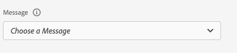

# Assurance のアプリ内メッセージビュー

Adobe Experience Platform Assurance のアプリ内メッセージビューでは、アプリの検証、デバイスに配信されるアプリ内メッセージのモニタリング、デバイスへのメッセージのシミュレーションを行うことができます。

## デバイス上のメッセージ

**[!UICONTROL デバイス上のメッセージ]** タブの上部には、**[!UICONTROL メッセージ]** ドロップダウンがあります。 これには、アシュランスセッションで受信したすべてのメッセージが含まれます。 メッセージがこのリストにない場合は、アプリに受信されたことはありません。



メッセージを選択すると、そのメッセージに関する多くの情報が表示されます（以下の節を参照）。

### メッセージのプレビュー

右側のパネルには、メッセージのプレビューを表示する **[!UICONTROL メッセージプレビュー]** パネルがあります。 **[!UICONTROL デバイスでシミュレート]** を選択すると、セッションに現在接続されているすべてのデバイスにそのメッセージが送信されます。


### メッセージの動作

**[!UICONTROL メッセージプレビュー]** ペインの下には、「**[!UICONTROL メッセージの動作]** タブがあります。 これには、メッセージの表示方法に関するすべての詳細が含まれます。 この情報には、位置情報、アニメーション、スワイプジェスチャー、外観設定が含まれます。


### 「情報」タブ

左側のセクションには、メッセージの詳細を表示する 4 つのタブがあります。 「**[!UICONTROL 情報]**」タブには、メッセージキャンペーンに関してAdobe Journey Optimizer（AJO）から読み込まれた情報が表示されます。

**[!UICONTROL キャンペーンを表示]** を選択して、AJOでメッセージを開いて検査または編集することもできます。


### 「ルール」タブ

「**[!UICONTROL ルール]**」タブには、このメッセージを表示するために必要な操作が表示されます。 これにより、表示されるメッセージにトリガーを付ける正確な内容を把握できます。 この例を次に示します。


この例では、ルールに対する 3 つの異なる条件を示しています。 （イベントリスト、「分析」タブ、またはタイムラインの）イベントを選択すると、そのイベントはこれらのルールに対して評価されます。 イベントが条件に一致する場合は、緑色のチェックマークが表示されます。


イベントが一致しない場合は、赤いアイコンが表示されます。


3 つの条件がすべて現在のイベントに一致する場合、メッセージが表示されます。

### 「分析」タブ

「**[!UICONTROL 分析]**」タブには、ルールに関する追加のインサイトが表示されます。 ここでは、メッセージルールがイベントにどれだけ近いかに基づいて、セッション内のすべてのイベントをフィルタリングします。


**[!UICONTROL [ ルール ] タブ]** セクションの例では、3 つの条件がルールに含まれています。 このタブには、各イベントがルールのどの割合で一致するかが表示されます。 イベントの大部分は 33% で一致し（3 つの条件のいずれか）、残りは 100% で一致します。

その結果、一致に近くてもルールに完全には一致しないイベントを見つけることができます。


**[!UICONTROL しきい値に一致]** スライダーを使用すると、表示するイベントをフィルタリングできます。 例えば、50%～90% に設定すると、3 つの条件のいずれか 2 つに一致するイベントのリストを取得できます。

### 「インタラクション」タブ

「**[!UICONTROL インタラクション]**」タブには、トラッキング目的でEdgeに送信されたインタラクションイベントのリストが表示されます。


通常、メッセージが表示されるたびに 4 つのインタラクションイベントが発生します。

```
trigger > display > interact > dismiss
```

「インタラクション」インタラクションには、追加の「アクション」値が関連付けられています。 使用可能な値には、「クリック済み」や「キャンセル」などがあります。

検証列は、インタラクションイベントがEdgeによって適切に受信および処理されたかどうかを示します。

## 検証

「**[!UICONTROL 検証]**」タブは、現在のセッションに対して検証を実行し、アプリがアプリ内メッセージ用に正しく設定されているかどうかを確認します。


エラーが見つかった場合は、それらのエラーの修正方法の詳細が提供されます。

## イベントリスト


「**[!UICONTROL イベントリスト]**」タブには、アプリ内メッセージに関連する、アシュランスセッション内のすべてのイベントが一覧表示されます。 ここに表示されるイベントの一部を次に示します。

* メッセージを取得するためのリクエストと応答
* メッセージイベントの表示
* インタラクショントラッキングイベント

このビューでは、検索の適用、フィルターの適用、列の追加または削除、データのエクスポートなど、標準のイベント リスト機能の多くを使用できます。

イベントを選択して、右側のパネルにイベントの生の詳細を表示します。

右側の詳細パネルから、選択したイベントにフラグを設定できます。これは、他のユーザーが確認する必要のあるものをマークするのに便利です。
