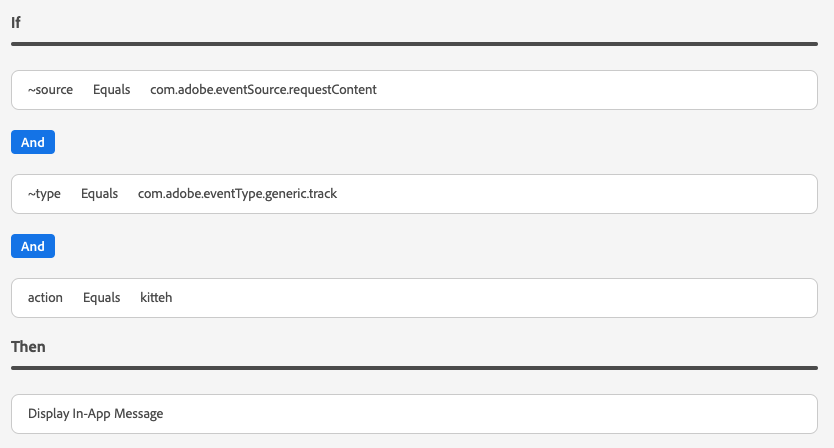

# アシュランスのアプリ内メッセージビュー

Adobe Experience Platform Assurance 内のアプリ内メッセージビューを使用すると、アプリの検証、デバイスに配信されるアプリ内メッセージの監視、デバイスへのメッセージのシミュレーションをおこなうことができます。

## デバイス上のメッセージ

の上部 **[!UICONTROL デバイス上のメッセージ]** タブは **[!UICONTROL メッセージ]** ドロップダウン。 これには、アシュランスセッションで受信したすべてのメッセージが含まれます。 メッセージがこのリストに含まれていない場合、アプリがメッセージを受信しなかったことを意味します。


メッセージを選択すると、以下の節で説明するように、そのメッセージに関する多くの情報が表示されます。

### メッセージプレビュー

右側のパネルには、 **[!UICONTROL メッセージプレビュー]** ウィンドウが開き、メッセージのプレビューが表示されます。 選択 **[!UICONTROL デバイス上でシミュレート]** は、そのメッセージを、現在セッションに接続されているすべてのデバイスに送信します。


### メッセージ動作

以下の **[!UICONTROL メッセージプレビュー]** ウィンドウは **[!UICONTROL メッセージ動作]** タブをクリックします。 これには、メッセージの表示方法に関する詳細がすべて含まれます。 この情報には、位置情報、アニメーション、スワイプジェスチャ、外観の設定が含まれます。


### 「情報」タブ

左のセクションには、メッセージの詳細を示す 4 つのタブがあります。 この **[!UICONTROL 情報]** 「 」タブには、メッセージキャンペーンに関するAdobe Journey Optimizer(AJO) から読み込まれた情報が表示されます。

また、 **[!UICONTROL キャンペーンを表示]** をクリックして、AJO でメッセージを開き、検査または編集を行います。


### 「ルール」タブ

この **[!UICONTROL ルール]** タブには、このメッセージを表示するために必要な処理が表示されます。 これにより、メッセージが何をトリガーに表示するかを正確に把握できます。 次の例を見てみましょう。



この例では、ルールの 3 つの異なる条件を示しています。 （イベントリスト、「分析」タブ、またはタイムラインから）イベントを選択した場合、そのイベントはこれらのルールに基づいて評価されます。 イベントが条件に一致する場合は、緑のチェックマークが表示されます。


イベントが一致しない場合は、赤いアイコンが表示されます。


3 つの条件がすべて現在のイベントと一致する場合は、メッセージが表示されます。

### 「分析」タブ

この **[!UICONTROL 分析]** 「 」タブには、ルールに関する追加のインサイトが表示されます。 ここでは、メッセージルールがイベントに一致する範囲に基づいて、セッション内のすべてのイベントをフィルタリングします。


例の **[!UICONTROL 「ルール」タブ]** セクションでは、ルールに 3 つの条件があります。 このタブには、各イベントが一致するルールの割合が表示されます。 イベントの大部分は 33%（3 つの条件のいずれか）で一致し、残りは 100%で一致します。

その結果、一致に近いが、ルールに完全に一致しないイベントを検索できます。


この **[!UICONTROL 一致しきい値]** スライダーを使用して、表示するイベントをフィルターできます。 例えば、50% ～ 90%に設定して、3 つの条件の 2 つと完全に一致するイベントのリストを取得できます。

### 「インタラクション」タブ

この **[!UICONTROL 操作]** 「 」タブには、追跡のために Edge に送信されたインタラクションイベントのリストが表示されます。


通常、メッセージが表示されるたびに、次の 4 つのインタラクションイベントが発生します。

```
trigger > display > interact > dismiss
```

「インタラクション」インタラクションには、追加の「アクション」値が関連付けられています。 値には、「clicked」または「cancel」が含まれます。

検証列には、インタラクションイベントが Edge で適切に受信され、処理されたかどうかが示されます。

## 検証

この **[!UICONTROL 検証]** タブは、現在のセッションに対して検証を実行し、アプリがアプリ内メッセージ用に正しく設定されているかどうかを確認します。


エラーが見つかった場合は、それらのエラーの修正方法の詳細が表示されます。

## イベントリスト


この **[!UICONTROL イベントリスト]** 「 」タブでは、アプリ内メッセージに関連するアシュランスセッションのすべてのイベントを簡単に確認できます。 以下に示すイベントの一部を示します。

* メッセージを取得するためのリクエストと応答
* メッセージイベントを表示
* インタラクショントラッキングイベント

このビューでは、検索の適用、フィルターの適用、列の追加または削除、データのエクスポートなど、多くの標準的なイベントリスト機能を使用できます。

イベントを選択して、イベントの生の詳細を右側のパネルに表示します。

右側の詳細パネルから、選択したイベントにフラグを付けることができます。これは、別の人がレビューする必要のある何かをマークするのに役立ちます。
