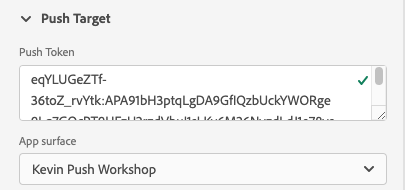

# デバッグビューをプッシュ

Adobe Experience Platform Assurance 内のプッシュデバッグ表示を使用すると、アプリのプッシュ設定を検証し、テストメッセージをデバイスに送信できます。

## クライアント

クライアントドロップダウンには、この保証セッションに接続した各一意のクライアントのリストが表示されます。 クライアントは、一意のデバイスか、デバイスに対する一意のアプリインストールのどちらかです。 例えば、Android デバイスとiOSデバイスがセッションに接続されている場合、これらのクライアントは「クライアント」ドロップダウンに表示されます。

デバイスにアプリを再インストールして再接続すると、別のクライアントが表示されます。 同じ名前のデバイスが既に存在する場合は、新しいドロップダウンで名前に#2が追加されます。

このビューは 1 つのクライアントに対してのみ有効になるので、別のクライアントを選択すると、画面の詳細が変更されます。

## 設定を検証

この **[!UICONTROL 設定の検証]** 「 」タブは、アプリのプッシュ設定を検証し、追加の詳細を提供します。 検証を実行する 3 つのパネルがあります。 検証がすべて正常に行われた場合は、緑のチェックマークが表示されます。 3 つの緑のチェックマークがある場合、アプリはプッシュメッセージ用に正しく設定され、プッシュトークンをユーザープロファイルに書き込み、関連するアプリサーフェスが設定されています。

何かが期待どおりに動作しない場合は、その問題の修正方法の詳細を示すアラートが表示されます。

### クライアントの詳細

このパネルは、デバイスが正しく設定されているかどうかを確認します。 これには、データ収集 UI での拡張機能の設定、アプリケーションでの拡張機能とその前提条件の初期化、デバイスからのプッシュトークンの取得が含まれます。

有効な場合、パネルにはデバイスの ECID、プッシュトークン、Edge サンドボックスの名前およびタイプが表示されます。

### プロファイルの詳細

クライアントが正しく設定されると、このパネルは、デバイスがプロファイルに書き込まれているかどうかを確認します。 また、プロファイルのプッシュトークンがデバイスのプッシュトークンと一致しているかを検証します。

有効な場合、パネルには、デバイスの ECID、プッシュトークン、アプリケーションのアプリ ID、メッセージングプラットフォーム、プッシュトークンが拒否リストに登録されているかどうかが表示されます。 トークンは、ユーザーがアプリをアンインストールした、またはユーザーがアプリのプッシュメッセージを無効にしたなど、様々な理由で拒否リストに表示される場合があります。

最後に、パネルの下部には、この特定のプロファイルを新しいタブで開くためのリンクが表示されます。

### AppStore の資格情報と設定

このパネルは、アプリ ID と、プロファイルに保存されたメッセージングプラットフォームに、一致するアプリサーフェスが作成されていることを検証します。 アプリケーションサーフェスとは、アプリケーションのプッシュ資格情報がアップロードされる場所です。

有効な場合、プロファイルには、アプリサーフェスの名前、アプリ ID およびメッセージングサービスの名前が表示されます。

最後に、パネルの下部には、この特定のアプリのサーフェスを新しいタブで開くリンクが表示されます。

## テストプッシュを送信

この **[!UICONTROL テストプッシュの送信]** 「 」タブを使用して、デバイスにテストメッセージを送信できます。

様々なiOSおよび Android のプッシュ機能をテストするように設定できるペインが複数あります。 設定が完了したら、「 」を選択します。 **[!UICONTROL テストプッシュ通知の送信]** をクリックして、メッセージを送信します。

### メッセージ

内 **[!UICONTROL メッセージ]** ウィンドウに、メッセージのタイトルと本文を入力できます。 サイレント通知機能は、ここでも有効にできます。

### プッシュターゲット

この **[!UICONTROL プッシュターゲット]** ペインでは、プッシュメッセージの送信時に使用するプッシュトークンとアプリの表面をカスタマイズできます。

この情報は、デフォルトで提供されます。 **[!UICONTROL 設定の検証]** タブに 3 つの緑のチェックマークが表示されます。 ただし、アプリが完全に設定されていない場合でも、独自のプッシュトークンとアプリサーフェスを提供できます。

### クリック動作

次の **[!UICONTROL クリック動作]** ウィンドウで、デバイスでプッシュ通知をクリックした場合の動作を選択できます。 デフォルトでは、アプリが開きますが、ディープリンクまたは Web ページを開くことができます。

ディープリンクの使用を選択した場合は、アプリ開発者が作成する必要があります。

### リッチメディア

この **[!UICONTROL リッチメディア]** パネルを使用すると、画像、ビデオ、GIFなどのメッセージにメディアを追加できます。 この機能を有効にするには、アプリ開発者がアプリにコードを追加する必要があります。

### ボタン

この **[!UICONTROL ボタン]** ウィンドウ枠では、プッシュ通知にボタンを追加できます。 各ボタンは、アプリを開く、アプリ内でディープリンクを開く、Web ページを開くことができます。

この機能を有効にするには、アプリ開発者がアプリにコードを追加する必要があります。

### カスタムデータ

この **[!UICONTROL カスタムデータ]** ペインでは、カスタムデータをプッシュ通知に追加できます。 各キーと値のペアは、メッセージと共にメタデータとして送信され、開発者が強力なエクスペリエンスを作成し、追加のトラッキングを追加するために使用できます。

## テスト結果

メッセージを送信した後、 **[!UICONTROL テスト結果]** セクションは、メッセージのプッシュサービスからデータを受け取ります。 次に、メッセージがGoogle/iOSメッセージングサービスに送信されたかどうかを示します。

問題が発生した場合は、次の場所に表示されます。

## アドバンス

### メッセージペイロードを表示

次の **[!UICONTROL テストプッシュ通知の送信]** ボタンは、ポップアップメニュー付きの省略記号のセットです。 ここから、メッセージのペイロードを表示できます。 これにより、リモートメッセージングサービスに送信される正確なメッセージを確認できます。 このペイロードを確認したり、コピーしてデスクトップのプッシュテストツールに貼り付けたりできます。

