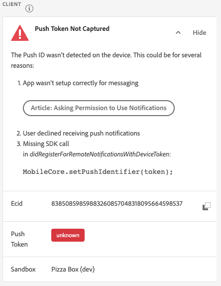
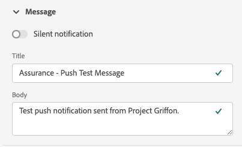

# プッシュデバッグビュー

Adobe Experience Platform Assurance 内のプッシュデバッグビューは、アプリのプッシュ設定を検証し、テストメッセージをデバイスに送信する機能を提供します。

## クライアント

クライアントドロップダウンには、この Assurance セッションに接続した一意の各クライアントのリストがあります。 クライアントは、一意のデバイスまたはデバイス用の一意のアプリインストールです。 例えば、Android デバイスとiOS デバイスがセッションに接続されている場合、これらのクライアントは「クライアント」ドロップダウンに表示されます。

デバイスにアプリを再インストールして再接続すると、別のクライアントが表示されます。 その名前のデバイスが既に存在する場合は、新しいドロップダウンによって名前に#2 が追加されます。

このビューは単一のクライアントに対してのみ有効になっているので、別のクライアントを選択すると画面の詳細が変更されます。

## 設定の検証

**[!UICONTROL 設定を検証]** タブは、アプリのプッシュ設定に関する追加の詳細を検証し提供します。 検証を実行するパネルは 3 つあります。 検証がすべて成功した場合は、緑のチェックマークが表示されます。 緑色のチェックマークが 3 つ表示されている場合、アプリはプッシュメッセージ用に正しく設定されており、ユーザープロファイルにプッシュトークンを書き込んでおり、関連するアプリサーフェスが設定されています。

何かが期待どおりに動作しない場合は、その問題の修正方法の詳細を示すアラートが表示されます。

### クライアントの詳細

このパネルは、デバイスが正しく設定されているかどうかを確認します。 これには、データ収集 UI での拡張機能の設定、アプリケーションでの拡張機能とその前提条件の初期化、デバイスからのプッシュトークンのキャプチャが含まれます。

有効な場合、パネルにはデバイスの ECID、プッシュトークン、Edge サンドボックスの名前とタイプが表示されます。

### プロファイルの詳細

クライアントが正しく設定されると、このパネルは、デバイスがプロファイルに書き込んでいるかどうかを確認します。 また、プロファイルのプッシュトークンがデバイスのプッシュトークンと一致するかも検証します。

有効な場合、パネルにはデバイスの ECID、プッシュトークン、アプリケーションのアプリ ID、メッセージプラットフォームおよびプッシュトークンが拒否リストに登録されているかどうかが表示されます。 トークンは、ユーザーがアプリをアンインストールした、アプリのプッシュメッセージを無効にするなど、様々な理由で拒否リストに表示される可能性があります。

最後に、パネルの下部には、この特定のプロファイルを新しいタブで開くリンクがあります。

### AppStore の資格情報と設定

このパネルでは、プロファイルに保存されたアプリ ID とメッセージングプラットフォームに一致するアプリサーフェスが作成されていることを検証します。 アプリサーフェスには、アプリケーションのプッシュ資格情報がアップロードされます。

有効な場合、プロファイルには、アプリサーフェスの名前、アプリ ID、メッセージングサービスの名前が表示されます。

最後に、パネルの下部にあるリンクを使用すると、この特定のアプリサーフェスを新しいタブで開くことができます。

## テストプッシュを送信

**[!UICONTROL テストプッシュを送信]** タブを使用すると、デバイスにテストメッセージを送信できます。

様々なiOSおよびAndroidのプッシュ機能をテストするように設定できるパネルがいくつか用意されています。 設定が完了したら、「**[!UICONTROL テストプッシュ通知を送信]**」を選択して、メッセージを送信します。

### メッセージ

**[!UICONTROL メッセージ]** パネルで、メッセージのタイトルと本文を指定できます。 サイレント通知機能は、ここで有効にすることもできます。

### プッシュターゲット

**[!UICONTROL プッシュターゲット]** パネルを使用すると、プッシュメッセージの送信時に使用するプッシュトークンとアプリサーフェスをカスタマイズできます。

**[!UICONTROL 設定を検証]** タブに緑色のチェックマークが 3 つ表示されている場合、この情報がデフォルトで提供されます。 ただし、アプリが完全に設定されていない場合でも、独自のプッシュトークンおよびアプリサーフェスを指定できます。

### クリック動作

**[!UICONTROL クリック動作]** パネルでは、デバイスでプッシュ通知がクリックされた場合の動作を選択できます。 デフォルトでは、アプリは開きますが、ディープリンクや web ページを開くこともできます。

ディープリンクを使用する場合は、アプリ開発者が作成する必要があります。

### リッチメディア

**[!UICONTROL リッチメディア]** パネルを使用すると、画像、ビデオ、GIFなど、メッセージに追加のメディアを追加できます。 この機能を有効にするには、アプリ開発者がアプリにコードを追加する必要があります。

### ボタン

**[!UICONTROL ボタン]** パネルを使用すると、プッシュ通知にボタンを追加できます。 各ボタンは、アプリを開いたり、アプリへのディープリンクを開いたり、web ページを開いたりすることができます。

この機能を有効にするには、アプリ開発者がアプリにコードを追加する必要があります。

### カスタムデータ

**[!UICONTROL カスタムデータ]** パネルでは、プッシュ通知にカスタムデータを追加できます。 各キーと値のペアはメッセージと共にメタデータとして送信され、開発者はこれを使用して強力なエクスペリエンスを作成し、トラッキングを追加できます。

## テスト結果

メッセージを送信すると、「テスト結果 **[!UICONTROL セクションがメッセージのプッシュサービスからデータを受け取ります]**。 ここでは、メッセージがGoogleまたはiOSのメッセージングサービスに送信されたかどうかを確認できます。

問題が発生した場合は、ここに表示されます。

## アドバンス

### メッセージペイロードを表示

**[!UICONTROL テストプッシュ通知を送信]** ボタンの横には、ポップアップメニューを含む省略記号のセットがあります。 ここから、メッセージペイロードを表示できます。 これにより、リモートメッセージサービスに送信される正確なメッセージを確認できます。 このペイロードを確認したり、コピーしてデスクトップのプッシュテストツールに貼り付けたりすることもできます。

