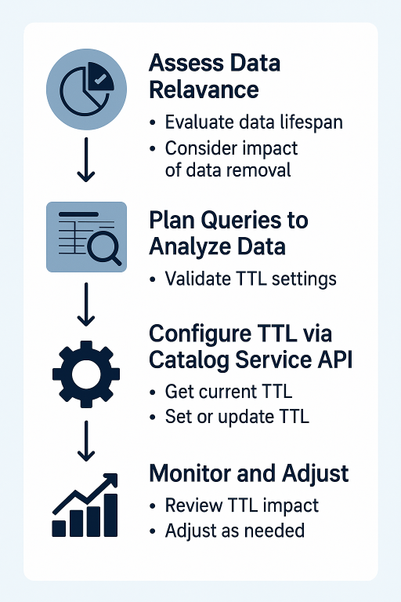

# TTLを使用したデータレイクでのエクスペリエンスイベントデータセットの保持の管理

効率的なデータ管理は、パフォーマンスの最適化、コスト管理、データの整合性にとって不可欠です。 エクスペリエンスイベントデータセットの保持有効期間（TTL）を使用して、行レベルの有効期限を強制し、データレイクのデータセットから古いレコードを自動的に削除しながら、最適なストレージ効率とデータの関連性を確保します。

このガイドでは、Catalog Service APIを使用してTTLを評価、設定、管理する方法について説明します。 TTLを適用するタイミングと理由、API呼び出しを使用してTTL値を設定および更新する方法、効果的な実装を確保するためのベストプラクティスについて説明します。

>[!IMPORTANT]
>
>TTLは、データライフサイクル管理とストレージ効率を最適化するように設計されています。 これはコンプライアンスツールではなく、規制要件に依存すべきではありません。 コンプライアンスでは、多くの場合、より広範なデータガバナンス戦略が必要です。

## 行レベルのデータ管理にTTLを使用する理由

データセットが成長するにつれ、パフォーマンスを維持し、コストを管理し、データの関連性を維持するために、効率的なデータ管理がますます重要になっています。 TTL ベースの行レベルのデータ有効期限は、古いレコードを手動で削除することでデータのクリーンアップを自動化し、ストレージの最適化やシステム効率の向上に役立ちます。

TTLは、時間の経過とともに関連性が失われる時間的制約のあるデータを管理する場合に役立ちます。 必要に応じて、TTLの導入を検討してください。

- 古いレコードを自動的に削除し、ストレージコストを削減。
- 無関係なデータを最小限に抑えてクエリのパフォーマンスを向上。
- 関連情報のみを保持することで、データの健全性を維持する。
- ビジネス目標をサポートするためにデータ保持を最適化する。

>[!NOTE]
>
>Experience Event Dataset Retentionは、データレイクに保存されたイベントデータに適用されます。 Real-Time Customer Data Platformでリテンションを管理する場合は、[Experience Event Expiration](../../profile/event-expirations.md)および[Pseudonymous Profile Expiration](../../profile/pseudonymous-profiles.md)をデータレイクのリテンション設定と組み合わせて使用することを検討してください。

TTL設定を使用して、使用権限に基づいてストレージを最適化します。 プロファイルストアデータ（Real-Time CDPで使用）は古いと見なされ、30日後に削除される場合がありますが、データレイク内の同じイベントデータは、AnalyticsとData Distillerのユースケースで12～13か月間（または使用権限に基づいて）利用できます。

>[!TIP]
>
>使用権限とは、Adobeのサブスクリプション契約およびライセンス契約で定義されているストレージおよび保持権限を指します。

### ある業界の例 {#industry-example}

例えば、動画の再生回数、検索、レコメンデーションなど、利用者のインタラクションを追跡する動画ストリーミングサービスを考えてみましょう。 最近のエンゲージメントデータはパーソナライゼーションに不可欠ですが、古いアクティビティログ（1年以上前からのやり取りなど）は関連性を失います。 行レベルの有効期限を使用することで、Experience Platformは古いログを自動的に削除し、分析やレコメンデーションに最新かつ有意義なデータのみを使用します。

## TTL適合性の評価 {#evaluate-ttl-suitability}

保持ポリシーを適用する前に、データセットが行レベルの有効期限の適切な候補であるかどうかを評価します。 次の点に留意してください。

- データの関連性：古いデータは価値を提供しますか、それとも時代遅れになりますか？
- 下流プロセスへの影響：データの削除は、レポート、分析、統合に影響しますか？
- 保管コストと維持価値：古いデータの価値は、保管コストを正当化しますか？

過去の記録が長期的な分析や事業運営に不可欠な場合、TTLは適切なアプローチではない可能性があります。 これらの要素を確認することで、TTLがデータの可用性に悪影響を与えることなく、データ保持のニーズに合致していることを確認できます。

## TTL設定のベストプラクティス {#best-practices}

適切なTTL値を選択し、エクスペリエンスイベントデータセット保持ポリシーが、データ保持、ストレージ効率、分析ニーズとバランスしていることを確認します。 TTLが短すぎるとデータ損失が発生する可能性があり、長すぎるとストレージコストと不要なデータ蓄積が増加する可能性があります。 データにアクセスする頻度と、関連し続ける時間を考慮することで、TTLがデータセットの目的に沿ったものであることを確認できます。

次の表に、データセットのタイプと使用パターンに基づく一般的なTTLの推奨事項を示します。

| データセットタイプ | 推奨TTL | 一般的なユースケース |
|-----------------------------|------------------------|-------------------|
| 頻繁にアクセスされるデータセット | 30～90日 | ユーザーエンゲージメントログ、web サイトのクリックストリームデータ、短期的なキャンペーンパフォーマンスデータ。 |
| Archival datasets | 1年以上 | 金融取引のログ、コンプライアンスデータ、長期的なトレンド分析、マシンラーニング（機械学習）のトレーニングデータセット。 |
| アプリ管理のデータセット | 最大13か月 | システムで管理されるデータセットには事前に定義されたTTL制限があり、システムによって課される制限に準拠するために自動的に適用されます。 |
| 顧客管理のデータセット | 30日 – 最大TTL | UI、API、Data Distillerを通じて作成されたデータセット。 TTLは、少なくとも30日間で、定義された最大TTL以内である必要があります。 |

TTL設定を定期的に確認して、ストレージポリシー、分析ニーズ、ビジネス要件に継続的に対応できるようにします。

### TTLを設定する際の主な考慮事項 {#key-considerations}

TTL設定がデータ保持戦略に合致していることを確認するには、次のベストプラクティスに従ってください。

- TTLの変更を定期的に監査します。 TTLが更新されるたびに、トリガーが監査イベントを実行します。 監査ログを使用して、コンプライアンス、データガバナンス、トラブルシューティングの目的でTTLの変更を追跡します。
- データを無期限に保持する必要がある場合は、TTLを無効にします。 TTLを無効にするには、`ttlValue`を`null`に設定します。 これにより、自動有効期限を防ぎ、すべてのレコードを永続的に保持します。 この変更を行う前に、ストレージへの影響を考慮してください。

## TTLの制限 {#limitations}

TTLを使用する場合は、次の制限事項に注意してください。

- **TTLを使用したエクスペリエンスイベントデータセットの保持は、データセットの削除ではなく、行レベルの有効期限**&#x200B;に適用されます。 TTLは、定義された保持期間に基づいてレコードを削除しますが、データセット全体は削除しません。 データセットを削除するには、[ データセット有効期限エンドポイント ](../../hygiene/api/dataset-expiration.md)または手動削除を使用します。
- **TTL設定は、明示的に無効になるまでアクティブのままです**。 設定は、無効にするまで有効です。 TTLを無効にすると、有効期限が停止し、データセット内のすべてのレコードが保持されます。
- **TTLはコンプライアンス ツールではありません**。 TTLによってストレージとライフサイクル管理を最適化する一方で、規制コンプライアンスを確保するために、より広範なガバナンス戦略を導入する必要があります。

## TTLを適用する前に、データセットのサイズと関連性を分析したい {#analyze-dataset-size}

TTLを適用する前に、クエリを使用してデータセットのサイズと関連性を分析します。 ターゲットクエリ（特定の日付範囲内のレコードのカウントなど）を実行して、さまざまなTTL値の影響をプレビューします。 次に、この情報を使用して、データのユーティリティと費用対効果のバランスを取る最適な保持期間を選択します。



ターゲットクエリを実行すると、異なるTTL設定で保持または削除されるデータの量を決定できます。 例えば、次のSQL クエリでは、過去30日以内に作成されたレコードの数をカウントします。

```sql
SELECT COUNT(1) FROM [datasetName] WHERE timestamp > date_sub(now(), INTERVAL 30 DAY);
```

異なる時間間隔で同様のクエリを実行すると、TTL設定を検証し、ストレージ効率とデータアクセシビリティのバランスを確認できます。

## TTL管理の基本を学ぶ

カタログサービス APIを使用してエクスペリエンスイベントデータセットの保持を評価、設定、管理する前に、リクエストを正しくフォーマットする方法を理解する必要があります。 これには、API パスの把握、必要なヘッダーの提供、リクエストペイロードのフォーマットなどが含まれます。 この重要な情報については、[Catalog Service API入門ガイド ](../api/getting-started.md)を参照してください。

>[!NOTE]
>
>このドキュメントでは、行レベルの有効期限について説明します。この有効期限は、データセット自体を維持しながら、データセット内の期限切れの個々の行を削除します。 データセット全体を削除し、別の機能によって管理されるデータセットの有効期限には適用されません。 データセットレベルの有効期限については、[ データセットの有効期限API ドキュメント ](../../hygiene/api/dataset-expiration.md)を参照してください。

### TTLの制約を確認する {#check-ttl-constraints}

Data Hygiene API `/ttl/{DATASET_ID}` エンドポイントを使用して、TTL設定を計画します。 このエンドポイントは、組織でサポートされている最小および最大のTTL値と、データセット タイプの推奨値（`defaultValue`）を返します。

詳しくは、Adobe Developer [Data Hygiene API](https://developer.adobe.com/experience-platform-apis/references/data-hygiene/#operation/getTtl) ドキュメントを参照してください。

現在データセット [に適用されているTTLを](#check-applied-ttl-values)確認するには、代わりに[ カタログサービス API](https://developer.adobe.com/experience-platform-apis/references/catalog/) `/dataSets/{DATASET_ID}` エンドポイントにGET リクエストを行います。

>[!TIP]
>
>カタログサービス APIのExperience Platform Gateway URLとベースパスは`https://platform.adobe.io/data/foundation/catalog`です。 Data Hygiene APIのベース パスは`https://platform.adobe.io/data/core/hygiene`です

**API 形式**

```http
GET /ttl/{DATASET_ID}
```

| パラメーター | 説明 |
| --- | --- |
| `{DATASET_ID}` | データセットを一意に識別するシステム生成の文字列。 データセット IDを検索するには、`/datasets` エンドポイントを使用します。 関連するデータセットに対する応答のフィルタリングの手順については、[ リストカタログオブジェクト API ガイド ](../api/list-objects.md)を参照してください。 |

**リクエスト**

次のリクエストは、特定のデータセットに対する組織のTTL制約を取得します。

```shell
curl -X GET \
  'https://platform.adobe.io/data/foundation/catalog/ttl/{DATASET_ID}' \
  -H 'Authorization: Bearer {ACCESS_TOKEN}' \
  -H 'x-api-key: {API_KEY}' \
  -H 'x-gw-ims-org-id: {ORG_ID}' \
  -H 'x-sandbox-name: {SANDBOX_NAME}'
  -H 'x-sandbox-id: {SANDBOX_ID}'
```

**応答**

応答が成功すると、組織の使用権限に基づいて推奨、最大、および最小のTTL値と、データセットに対する推奨TTL （`defaultValue`）が返されます。 この`defaultValue`は、ガイダンスでのみ提供される、推奨されるTTL期間です。 お客様が明示的に設定しない限り、適用されません。 応答には、既に設定されている可能性のあるカスタム TTL値は含まれません。 データセットの現在のTTLを表示するには、GET `/catalog/dataSets/{DATASET_ID}` エンドポイントを使用します。

+++選択して応答を表示します

```json
{
  "extensions": {
    "adobe_lakeHouse": {
      "rowExpiration": {
        "defaultValue": "P12M",
        "maxValue": "P12M",
        "minValue": "P7D"
      }
    }
  }
}
```

+++

| プロパティ | 説明 |
|--------------|-------------|
| `defaultValue` | データセットに推奨されるTTL値。 この値は&#x200B;**not**&#x200B;が自動的に適用されます。 有効にするには、TTLを明示的に設定する必要があります。 |
| `maxValue` | 組織の使用権限によって許可されるTTLの最大期間。 通常、この期間は10年（`P10Y`）です。 |
| `minValue` | 組織の使用権限によって許可される最小TTL期間。 通常、この期間は30日（`P30D`）です。 |

### 適用されたTTL値の確認方法 {#check-applied-ttl-values}

データセットに適用された現在のTTL値を確認するには、次のAPI呼び出しを使用します。

```http
GET /dataSets/{DATASET_ID}
```

この呼び出しは、`ttlValue` セクションの現在の`extensions.adobe_lakeHouse.rowExpiration` （設定されている場合）を返します。

**リクエスト**

次のリクエストは、特定のデータセットに対する組織のTTL値を取得します。

```shell
curl -X GET \
https://platform.adobe.io/data/foundation/catalog/dataSets/{DATASET_ID} \
  -H 'Authorization: Bearer {ACCESS_TOKEN}' \
  -H 'x-api-key: {API_KEY}' \
  -H 'x-gw-ims-org-id: {ORG_ID}' \
  -H 'x-sandbox-name: {SANDBOX_NAME}'
```

**応答**

応答が成功すると、データセットに適用された現在のTTL設定を含む`extensions` オブジェクトが含まれます。 以下の応答の例は、簡潔にするために切り捨てられています。

```json
{
    "{DATASET_ID}": {
        "name": "Acme Sales Data",
        "description": "This dataset contains sales transaction records for Acme Corporation.",
        "imsOrg": "{ORG_ID}",
        "sandboxId": "{SANDBOX_ID}",
        "extensions": {
            "adobe_lakeHouse": {
            "rowExpiration": {
                "ttlValue": "P3M",
            }
            }
        }
        ...
    }
}
```

### データセットのTTLの設定または更新 {#set-update-ttl}

>[!IMPORTANT]
>
>TTL ベースの行レベルの有効期限は、時系列スキーマを使用するイベントデータセットにのみ適用できます。 これには、標準のXDM ExperienceEvent クラスに基づくデータセットと、時系列スキーマ （`https://ns.adobe.com/xdm/data/time-series`）を拡張するカスタムスキーマが含まれます。
>
>TTLを適用する前に、Schema Registry APIを使用して、`meta:extends` プロパティを確認し、データセットのスキーマに正しい拡張機能が含まれていることを確認します。 この方法のガイダンスについては、[ スキーマエンドポイントのドキュメント ](../../xdm/api/schemas.md#lookup)を参照してください。

新しいTTLを設定するか、同じAPI メソッドを使用して既存のTTLを更新することで、Experience Event データセットの保持を設定できます。 `/v2/datasets/{DATASET_ID}` エンドポイントに対するPATCH リクエストを使用して、TTLを適用または調整します。

**API 形式**

```http
PATCH /v2/datasets/{DATASET_ID}
```

| パラメーター | 説明 |
| --- | --- |
| `{DATASET_ID}` | TTL値を更新するデータセット ID。 |

**リクエスト**

次の例では、`ttlValue`は`P3M`に設定されています。 これは、3か月以上のレコードが自動的に削除されることを意味します。 ビジネスのニーズに合わせて保持期間を調整します（例：6か月は`P6M`、1年は`P12M`）。

```shell
curl -X PATCH \
  'https://platform.adobe.io/data/foundation/catalog/v2/datasets/{DATASET_ID}' \
  -H 'Authorization: Bearer {ACCESS_TOKEN}' \
  -H 'Content-Type: application/json' \
  -H 'x-api-key: {API_KEY}' \
  -H 'x-gw-ims-org-id: {ORG_ID}' \
  -d '{
    "extensions": {
        "adobe_lakeHouse": {
            "rowExpiration": {
                "ttlValue": "P3M"  // A 3 month retention period
            }
        }
    }
}
```

| プロパティ | 説明 |
|----------------------------------|-------------|
| `rowExpiration.ttlValue` | データセット内のレコードが自動的に削除されるまでの期間を定義します。 ISO-8601の期間フォーマットを使用します（例えば、3か月間は`P3M`、30日間は`P30D`）。 |

**応答**

応答が成功すると、更新されたデータセットへの参照が返されますが、TTL設定は明示的に含まれません。 TTL設定を確認するには、フォローアップ `GET /dataSets/{DATASET_ID}` リクエストを行います。

```JSON
[
  "@/dataSets/{DATASET_ID}"
]
```

#### シナリオの例 {#example-scenario}

パーソナライゼーションに役立つ新しいエンゲージメントデータを確保するために、最初はTTLを3 ヶ月に設定するビデオストリーミングプラットフォームを検討してください。 ただし、その後の分析で、古いインタラクションが依然として貴重なインサイトを提供することが明らかになった場合、次のリクエストを使用してTTLを6か月に延長できます。

```shell
curl -X PATCH \
  'https://platform.adobe.io/data/foundation/catalog/v2/datasets/{DATASET_ID}' \
  -H 'Authorization: Bearer {ACCESS_TOKEN}' \
  -H 'Content-Type: application/json' \
  -H 'x-api-key: {API_KEY}' \
  -H 'x-gw-ims-org-id: {ORG_ID}' \
  -d '{
    "extensions": {
        "adobe_lakeHouse": {
            "rowExpiration": {
                "ttlValue": "P6M"  // Extend to 6 months
            }
        }
    }
}
```

## データセット保持ポリシーに関するFAQ {#faqs}

このFAQでは、データセット保持ジョブ、TTL変更の即時効果、回復オプション、およびPlatform サービス間での保持期間の違いに関する実用的な質問について説明します。

### 保持ポリシールールを適用できるデータセットの種類？

+++回答
TTL ベースの保持ポリシーは、時系列動作を使用する任意のデータセットに適用できます。 これには、標準のXDM ExperienceEvent クラスに基づくデータセットや、時系列データを取得するように設計されたカスタムスキーマが含まれます。

行レベルの有効期限には、次の技術条件が必要です。

- スキーマは、時系列データを取得するように設計する必要があります。
- スキーマには、有効期限の評価に使用するタイムスタンプフィールドを含める必要があります。
- データセットは、通常、XDM ExperienceEvent クラスを使用または拡張するイベントレベルのデータを格納する必要があります。
- TTL設定は`extensions.adobe_lakeHouse.rowExpiration`を介して適用されるため、データセットはカタログサービスに登録する必要があります。
- TTL値は、ISO-8601期間形式（例：`P30D`、`P6M`、`P1Y`）を使用する必要があります。
+++

### データセット保持ジョブがデータレイクサービスからデータを削除するまでの時間はどれくらいですか？

+++回答
データセットのTTLは30日ごとに評価および処理され、期限切れのレコードはすべて削除されます。 イベントが30日以上前（取り込み日> 30日）にExperience Platformに取り込まれ、そのイベント日が定義された保持期間（TTL）を超えた場合、イベントは期限切れとみなされます。
+++

<!-- 
### How soon will the Dataset Retention job delete data from Profile services?

+++Answer
Once a retention policy is set, existing events that already exceed the newly defined TTL are immediately deleted. Newer events remain until their timestamps surpass the retention period.

For example, if you apply a 30-day expiration policy on May 15th, the following occurs:

- New events receive a 30-day expiration as they are ingested.
- Existing events with a timestamp older than April 15th are immediately deleted.
- Existing events with a timestamp after April 15th are set to expire 30 days after their timestamp (for example, an event from April 18th would be deleted on May 18th).
+++ 
-->

### データレイクとプロファイルサービスに対して異なる保持ポリシーを設定できますか？

+++回答

>[!NOTE]
>
>プロファイルサービスの保持期間は、30日ごとに1回のみ更新できます。

はい。データレイクとプロファイルサービスに対して異なる保持ポリシーを設定できます。 プロファイルストアの保持期間は、組織のニーズに応じて、データレイクの保持期間よりも短くしたり、長くしたりできます。

+++

### 現在のデータセットの使用状況を確認するにはどうすればよいですか？

+++回答
データレイクとプロファイルストアの最新のデータセットのストレージサイズは、[!UICONTROL Dataset] インベントリワークスペースで別々の指標として確認できます。 列を並べ替えて、最大のデータセットを特定し、保持ポリシーが適用されていることを確認します。

サンドボックスレベルの使用状況については、ライセンス使用状況ダッシュボードを参照してください。 詳しくは、[ ライセンス使用状況に関するドキュメント ](../../dashboards/guides/license-usage.md)を参照してください。
+++

### データ保持ジョブが成功したかどうかを確認するにはどうすればよいですか？

+++回答
最後のデータ保持ジョブを確認するには、[ データセット保持設定UI](./user-guide.md#data-retention-policy)またはデータインベントリページでタイムスタンプを確認します。

または、次のエンドポイントに対してGET リクエストを行うこともできます。

`GET https://platform.adobe.io/data/foundation/catalog/dataSets/{DATASET_ID}`

応答にはプロパティ `extensions.adobe_lakeHouse.rowExpiration.lastCompleted`が含まれます。これは、最新のTTL ジョブが完了したときのUnix タイムスタンプ（ミリ秒単位）を示します。

現在、過去のデータセット使用状況レポートは利用できません。
+++

### 削除したデータを復元できますか？

+++回答
いいえ、保持ポリシーが適用されると、保持期間より古いデータは完全に削除され、復元できません。
+++

### データレイクエクスペリエンスイベントデータセットで設定できる最小TTLは何ですか？

+++回答 
データレイクのExperience Event データセットの最小TTLは30日です。 データレイクは、最初の取り込みおよび処理中に、処理のバックアップおよびリカバリーシステムとして機能します。 その結果、データは有効期限が切れるまで、取り込み後30日以上データレイクに残る必要があります。
+++

### TTL ポリシーで許可されている期間を超えてデータレイクフィールドを保持する必要がある場合はどうなりますか？

+++回答 
Data Distillerを使用すると、データセットのTTLを超える特定のフィールドを保持しながら、使用率の制限内に収めることができます。 派生データセットに必要なフィールドのみを定期的に書き込むジョブを作成します。 このワークフローは、重要なデータを長期使用のために保存しながら、短いTTLでのコンプライアンスを保証します。

詳細については、[SQLを使用した派生データセットの作成ガイド ](../../query-service/data-distiller/derived-datasets/create-derived-datasets-with-sql.md)を参照してください。
+++

## 次の手順 {#next-steps}

行レベルの有効期限のTTL設定を管理する方法を理解したところで、次のドキュメントを参照して、TTL管理について詳しく説明します。

- リテンションジョブ：[ データライフサイクル UI ガイド ](../../hygiene/ui/dataset-expiration.md)を使用して、Experience Platform UIでデータセットの有効期限をスケジュールおよび自動化する方法を説明します。または、データセットのリテンション設定を確認し、期限切れのレコードが削除されていることを確認します。
- [ データセットの有効期限API エンドポイントガイド ](../../hygiene/api/dataset-expiration.md)：行だけでなく、データセット全体を削除する方法について説明します。 APIを使用してデータセットの有効期限をスケジュール、管理、自動化し、効率的なデータ保持を実現する方法を説明します。
- [ データ使用ポリシーの概要](../../data-governance/policies/overview.md)：データ保持戦略をより広範なコンプライアンス要件とマーケティング使用の制限に合わせる方法について説明します。
