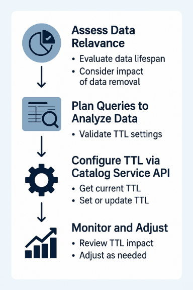

# TTL を使用してデータレイクでのエクスペリエンスイベントデータセット保持を管理

効率的なデータ管理は、最適なパフォーマンス、コスト管理、データの整合性を実現するために重要です。 エクスペリエンスイベントデータセット保持の有効期間（TTL）を使用して、行レベルの有効期限を適用し、データレイク内のデータセットから古いレコードを自動的に削除すると同時に、最適なストレージ効率とデータ関連性を確保します。

このガイドでは、Catalog Service API を使用して TTL を評価、設定、管理する方法について説明します。 TTL を適用するタイミングと理由、API 呼び出しを使用して TTL 値を設定および更新する方法、効果的な実装を確実に行うためのベストプラクティスについて説明します。

>[!IMPORTANT]
>
>TTL は、データのライフサイクル管理とストレージ効率を最適化するように設計されています。 これはコンプライアンスツールではないので、規制要件に当てるべきではありません。 コンプライアンスには、多くの場合、より広範なデータガバナンス戦略が必要です。

## 行レベルのデータ管理に TTL を使用する理由

データセットが増加するにつれて、パフォーマンスの維持、コストの制御、データの関連性の維持を実現するために、効率的なデータ管理がますます重要になります。 TTL ベースの行レベルのデータ有効期限は、手動の介入なしで古いレコードを削除することでデータクリーンアップを自動化し、ストレージの最適化とシステム効率の向上を支援します。

TTL は、時間の経過と共に関連性が失われる時間依存データを管理する場合に役立ちます。 次の必要がある場合は、TTL の実装を検討してください。

- 古いレコードを自動的に削除することで、ストレージ・コストを削減します。
- 無関係なデータを最小限に抑えることで、クエリのパフォーマンスを向上させます。
- 関連情報のみを保持することで、データハイジーンを維持します。
- データ保持を最適化してビジネス目標をサポートします。

>[!NOTE]
>
>エクスペリエンスイベントデータセット保持は、データレイクに保存されたイベントデータに適用されます。 Real-Time Customer Data Platformでリテンションを管理している場合は、データレイクのリテンション設定と共に [ エクスペリエンスイベントの有効期限 ](../../profile/event-expirations.md) および [ 偽名プロファイルの有効期限 ](../../profile/pseudonymous-profiles.md) を使用することを検討してください。

TTL 設定を使用して、使用権限に基づいてストレージを最適化します。 （Real-Time CDPで使用される）プロファイルストアデータは古いと見なされ、30 日後に削除される可能性がありますが、Data Lake 内の同じイベントデータは、Analytics と Data Distillerのユースケースで 12 ～ 13 か月間（または使用権限に基づいて、それより長い期間）使用できます。

>[!TIP]
>
>使用権限とは、Adobeのサブスクリプションとライセンス契約で定義されたストレージとリテンションの許容値を指します。

### ある業界の例 {#industry-example}

例えば、ビデオビュー、検索、レコメンデーションなど、ユーザーのインタラクションを追跡するビデオストリーミングサービスについて考えてみます。 最近のエンゲージメントデータはパーソナライゼーションにとって重要ですが、古いアクティビティログ（1 年以上のインタラクションなど）は関連性を失います。 行レベルの有効期限を使用すると、Experience Platformは古いログを自動的に削除し、現在の意味のあるデータのみが分析とレコメンデーションに使用されるようにします。

## TTL の適合性の評価 {#evaluate-ttl-suitability}

保持ポリシーを適用する前に、データセットが行レベルの有効期限の適切な候補であるかどうかを評価します。 次の点に留意してください。

- データの関連性の推移：古いデータは価値を提供しますか、それとも古くなりますか。
- ダウンストリームプロセスへの影響：データを削除すると、レポート、分析または統合に影響がありますか？
- ストレージコストと保存コストの比較：古いデータの価値によって、保存コストは正当化されますか？

履歴レコードが長期的な分析やビジネスオペレーションに不可欠な場合、TTL は適切なアプローチではない可能性があります。 これらの要因を確認することで、データの可用性に悪影響を与えることなく、TTL がデータ保持のニーズに確実に対応できるようになります。

## TTL 設定のベストプラクティス {#best-practices}

適切な TTL 値を選択して、エクスペリエンスイベントデータセット保持ポリシーが、データ保持、ストレージ効率、分析のニーズのバランスを取れるようにします。 TTL が短すぎるとデータが失われる可能性がありますが、長すぎると、ストレージコストや不要なデータ蓄積が増加する可能性があります。 データのアクセス頻度と関連性の高いデータを保持する期間を考慮して、TTL がデータセットの目的に合っていることを確認します。

次の表に、データセットタイプと使用パターンに基づいた、一般的な TTL 推奨事項を示します。

| データセットタイプ | 推奨 TTL | 典型的なユースケース |
|-----------------------------|------------------------|-------------------|
| 頻繁にアクセスするデータセット | 30 ～ 90 日 | ユーザーエンゲージメントログ、web サイトクリックストリームデータ、短期キャンペーンパフォーマンスデータ。 |
| アーカイブデータセット | 一年以上 | 金融取引ログ、コンプライアンスデータ、長期トレンド分析、機械学習トレーニングデータセット。 |
| アプリ管理データセット | 最大 13 か月 | システム管理データセットには事前に定義された TTL 制限があり、システムが課した制限に準拠するように自動的に適用されます。 |
| 顧客管理データセット | 30 日 – 最大 TTL | UI、API または Data Distillerで作成したデータセット。 TTL は、少なくとも 30 日で、定義された最大 TTL 内である必要があります。 |

TTL 設定を定期的に確認して、ストレージポリシー、分析ニーズ、ビジネス要件に引き続き合致していることを確認します。

### TTL を設定する際の主な考慮事項 {#key-considerations}

TTL 設定をデータ保持戦略に確実に合致させるには、次のベストプラクティスに従います。

- TTL の変更を定期的に監査します。 すべての TTL 更新トリガーに監査イベントが発生します。 監査ログを使用して、コンプライアンス、データガバナンスおよびトラブルシューティングの目的で TTL の変更をトラックします。
- データを無期限に保持する必要がある場合は、TTL を無効にします。 TTL を無効にするには、`ttlValue` を `null` に設定します。 これにより、自動期限切れを防ぎ、すべてのレコードを永続的に保持します。 この変更を行う前に、ストレージの影響を考慮します。

## TTL の制限 {#limitations}

TTL を使用する場合は、次の制限事項に注意してください。

- **TTL を使用したエクスペリエンスイベントデータセットの保持は、データセットの削除ではなく、行レベルの有効期限に適用**。 TTL は、定義された保持期間に基づいてレコードを削除しますが、データセット全体は削除しません。 データセットを削除するには、[ データセットの有効期限エンドポイント ](../../hygiene/api/dataset-expiration.md) を使用するか、手動で削除します。
- **TTL 設定は、明示的に無効になるまでアクティブのままになります**。 この設定は、無効にするまでは有効です。 TTL を無効にすると、有効期限が停止し、データセット内のすべてのレコードが確実に保持されます。
- **TTL はコンプライアンスツールではありません**。 TTL はストレージとライフサイクルの管理を最適化しますが、規制へのコンプライアンスを確保するには、より広範なガバナンス戦略を導入する必要があります。

## TTL を適用する前にデータセットのサイズと関連性を分析 {#analyze-dataset-size}

TTL を適用する前に、クエリを使用してデータセットのサイズと関連性を分析します。 ターゲットクエリ（特定の日付範囲内のレコードのカウントなど）を実行して、様々な TTL 値の影響をプレビューします。 次に、この情報を使用して、データ・ユーティリティとコスト・パフォーマンスのバランスを取る最適な保存期間を選択します。



ターゲットクエリの実行は、様々な TTL 設定で保持または削除されるデータの量を決定するのに役立ちます。 例えば、次の SQL クエリは、過去 30 日間に作成されたレコードの数をカウントします。

```sql
SELECT COUNT(1) FROM [datasetName] WHERE timestamp > date_sub(now(), INTERVAL 30 DAY);
```

異なる時間間隔で同様のクエリを実行すると、TTL 設定を検証し、ストレージの効率とデータのアクセシビリティのバランスを確保できます。

## TTL 管理の基本を学ぶ

Catalog Service API を使用してエクスペリエンスイベントデータセット保持を評価、設定、管理する前に、リクエストを正しくフォーマットする方法を理解する必要があります。 これには、API パスの把握、必要なヘッダーの提供、リクエストペイロードの書式設定が含まれます。 この重要な情報については、[Catalog Service API 入門ガイド ](../api/getting-started.md) を参照してください。

>[!NOTE]
>
>このドキュメントでは、データセット自体はそのままの状態で、データセット内の期限切れの行を個別に削除する、行レベルの有効期限について説明します。 データセットの有効期限には適用されません。この有効期限は、データセット全体を削除し、別の機能によって管理されます。 データセットレベルの有効期限については、[ データセット有効期限 API ドキュメント ](../../hygiene/api/dataset-expiration.md) を参照してください。

### TTL 制約の確認 {#check-ttl-constraints}

Data Hygiene API `/ttl/{DATASET_ID}` エンドポイントを使用して、TTL 設定の計画に役立てます。 このエンドポイントは、組織でサポートされる最小および最大 TTL 値と、データセットタイプの推奨値（`defaultValue`）を返します。

詳しくは、Adobe Developer [Data Hygiene API](https://developer.adobe.com/experience-platform-apis/references/data-hygiene/#operation/getTtl) のドキュメントを参照してください。

[ データセットに現在適用されている TTL を確認する ](#check-applied-ttl-values) には、代わりに [Catalog Service API](https://developer.adobe.com/experience-platform-apis/references/catalog/) `/dataSets/{DATASET_ID}` エンドポイントに対してGET リクエストを実行します。

>[!TIP]
>
>Catalog Service API のExperience Platform Gateway URL とベースパスは `https://platform.adobe.io/data/foundation/catalog` です。 Data Hygiene API のベースパスは `https://platform.adobe.io/data/core/hygiene` です。

**API 形式**

```http
GET /ttl/{DATASET_ID}
```

| パラメーター | 説明 |
| --- | --- |
| `{DATASET_ID}` | データセットを一意に識別する、システムで生成された文字列。 データセット ID を見つけるには、`/datasets` エンドポイントを使用します。 関連するデータセットの応答をフィルタリングする手順については、[list catalog objects API ガイド ](../api/list-objects.md) を参照してください。 |

**リクエスト**

次のリクエストでは、特定のデータセットに関する組織の TTL 制約を取得します。

```shell
curl -X GET \
  'https://platform.adobe.io/data/foundation/catalog/ttl/{DATASET_ID}' \
  -H 'Authorization: Bearer {ACCESS_TOKEN}' \
  -H 'x-api-key: {API_KEY}' \
  -H 'x-gw-ims-org-id: {ORG_ID}' \
  -H 'x-sandbox-name: {SANDBOX_NAME}'
  -H 'x-sandbox-id: {SANDBOX_ID}'
```

**応答**

正常な応答では、組織の使用権限に基づく推奨 TTL 値、最大値、最小値と、データセットに対して推奨される TTL （`defaultValue`）が返されます。 この `defaultValue` は、ガイダンスとしてのみ提供される、推奨される TTL 期間です。 明示的に設定されない限り、適用されません。 応答には、既に設定されているカスタム TTL 値は含まれていません。 データセットの現在の TTL を表示するには、GET `/catalog/dataSets/{DATASET_ID}` エンドポイントを使用します。

+++選択して応答を表示します

```json
{
  "extensions": {
    "adobe_lakeHouse": {
      "rowExpiration": {
        "defaultValue": "P12M",
        "maxValue": "P12M",
        "minValue": "P7D"
      }
    }
  }
}
```

+++

| プロパティ | 説明 |
|--------------|-------------|
| `defaultValue` | データセットに推奨される TTL 値。 この値は自動的に適用 **れ** せん。 TTL を明示的に設定して、有効にする必要があります。 |
| `maxValue` | 組織の使用権限で許可されている最大 TTL 期間。 通常、この期間は 10 年（`P10Y`）です。 |
| `minValue` | 組織の使用権限で許可されている最小 TTL 期間。 通常、この期間は 30 日（`P30D`）です。 |

### 適用された TTL 値の確認方法 {#check-applied-ttl-values}

データセットに適用されている現在の TTL 値を確認するには、次の API 呼び出しを使用します。

```http
GET /dataSets/{DATASET_ID}
```

この呼び出しは、`ttlValue` セクションに現在の `extensions.adobe_lakeHouse.rowExpiration` が設定されている場合、その値を返します。

**リクエスト**

次のリクエストでは、特定のデータセットに対する組織の TTL 値を取得します。

```shell
curl -X GET \
https://platform.adobe.io/data/foundation/catalog/dataSets/{DATASET_ID} \
  -H 'Authorization: Bearer {ACCESS_TOKEN}' \
  -H 'x-api-key: {API_KEY}' \
  -H 'x-gw-ims-org-id: {ORG_ID}' \
  -H 'x-sandbox-name: {SANDBOX_NAME}'
```

**応答**

正常な応答には `extensions` オブジェクトが含まれます。このオブジェクトには、データセットに適用された現在の TTL 設定が含まれます。 以下の応答の例は、簡潔にするために切り捨てられています。

```json
{
    "{DATASET_ID}": {
        "name": "Acme Sales Data",
        "description": "This dataset contains sales transaction records for Acme Corporation.",
        "imsOrg": "{ORG_ID}",
        "sandboxId": "{SANDBOX_ID}",
        "extensions": {
            "adobe_lakeHouse": {
            "rowExpiration": {
                "ttlValue": "P3M",
            }
            }
        }
        ...
    }
}
```

### データセットの TTL の設定または更新 {#set-update-ttl}

>[!IMPORTANT]
>
>TTL ベースの行レベルの有効期限は、時系列スキーマを使用するイベントデータセットにのみ適用できます。 これには、標準の XDM ExperienceEvent クラスに基づくデータセットと、時系列スキーマ（`https://ns.adobe.com/xdm/data/time-series`）を拡張するカスタムスキーマが含まれます。
>
>TTL を適用する前に、Schema Registry API を使用して、`meta:extends` プロパティを確認することで、データセットのスキーマに正しい拡張子が含まれていることを確認します。 これを行う方法のガイダンスについては、[ スキーマエンドポイントのドキュメント ](../../xdm/api/schemas.md#lookup) を参照してください。

エクスペリエンスイベントデータセット保持を設定するには、新しい TTL を設定するか、同じ API 方法を使用して既存の TTL を更新します。 `/v2/datasets/{DATASET_ID}` エンドポイントへのPATCH リクエストを使用して、TTL を適用または調整します。

**API 形式**

```http
PATCH /v2/datasets/{DATASET_ID}
```

| パラメーター | 説明 |
| --- | --- |
| `{DATASET_ID}` | TTL 値を更新するデータセットの ID。 |

**リクエスト**

次の例では、`ttlValue` が `P3M` に設定されています。 つまり、3 か月を超えるレコードは自動的に削除されます。 ビジネスのニーズに合わせて保持期間を調整します（例えば、6 か月間は `P6M`、1 年間は `P12M`）。

```shell
curl -X PATCH \
  'https://platform.adobe.io/data/foundation/catalog/v2/datasets/{DATASET_ID}' \
  -H 'Authorization: Bearer {ACCESS_TOKEN}' \
  -H 'Content-Type: application/json' \
  -H 'x-api-key: {API_KEY}' \
  -H 'x-gw-ims-org-id: {ORG_ID}' \
  -d '{
    "extensions": {
        "adobe_lakeHouse": {
            "rowExpiration": {
                "ttlValue": "P3M"  // A 3 month retention period
            }
        }
    }
}
```

| プロパティ | 説明 |
|----------------------------------|-------------|
| `rowExpiration.ttlValue` | データセット内のレコードが自動的に削除されるまでの期間を定義します。 ISO-8601 の期間形式を使用します（例：3 か月の場合は `P3M`、30 日の場合は `P30D`）。 |

**応答**

応答が成功すると、更新されたデータセットへの参照が返されますが、TTL 設定は明示的には含まれません。 TTL 設定を確認するには、フォローアップの `GET /dataSets/{DATASET_ID}` リクエストを実行します。

```JSON
[
  "@/dataSets/{DATASET_ID}"
]
```

#### サンプルシナリオ {#example-scenario}

パーソナライゼーション用に新しいエンゲージメントデータを確保するために、最初に TTL を 3 か月に設定するビデオストリーミングプラットフォームについて考えてみます。 ただし、後続の分析で、古いインタラクションが引き続き貴重なインサイトを提供することが明らかになった場合は、次のリクエストを使用して TTL を 6 か月に拡張できます。

```shell
curl -X PATCH \
  'https://platform.adobe.io/data/foundation/catalog/v2/datasets/{DATASET_ID}' \
  -H 'Authorization: Bearer {ACCESS_TOKEN}' \
  -H 'Content-Type: application/json' \
  -H 'x-api-key: {API_KEY}' \
  -H 'x-gw-ims-org-id: {ORG_ID}' \
  -d '{
    "extensions": {
        "adobe_lakeHouse": {
            "rowExpiration": {
                "ttlValue": "P6M"  // Extend to 6 months
            }
        }
    }
}
```

## データセット保持ポリシーに関する FAQ {#faqs}

この FAQ では、データセット保持ジョブ、TTL 変更の即時影響、回復オプション、保持期間の Platform サービス間での違いに関する実践的な質問について説明しています。

### 保持ポリシールールを適用できるデータセットのタイプを教えてください。

+++回答
時系列の動作を使用する任意のデータセットに、TTL ベースの保持ポリシーを適用できます。 これには、標準の XDM ExperienceEvent クラスに基づくデータセットと、時系列データをキャプチャするように設計されたカスタムスキーマが含まれます。

行レベルの有効期限には、次の技術的条件が必要です。

- スキーマは、時系列データを取り込むように設計する必要があります。
- スキーマには、有効期限の評価に使用するタイムスタンプ フィールドを含める必要があります。
- データセットには、イベントレベルのデータを保存する必要があります。通常、XDM ExperienceEvent クラスを使用または拡張します。
- TTL 設定は `extensions.adobe_lakeHouse.rowExpiration` を介して適用されるので、データセットはカタログサービスに登録する必要があります。
- TTL 値では、ISO-8601 期間形式（例：`P30D`、`P6M`、`P1Y`）を使用する必要があります。
+++

### データセット保持ジョブによって Data Lake Services からデータはどのくらいの時間で削除されますか？

+++回答
データセット TTL は 30 日ごとに評価および処理され、期限切れのすべてのレコードが削除されます。 イベントが 30 日以上前（取り込み日 > 30 日）にExperience Platformに取り込まれ、そのイベントの日付が定義された保持期間（TTL）を超えている場合、イベントは期限切れと見なされます。
+++

<!-- ### How soon will the Dataset Retention job delete data from Profile services?

+++Answer
Once a retention policy is set, existing events that already exceed the newly defined TTL are immediately deleted. Newer events remain until their timestamps surpass the retention period.

For example, if you apply a 30-day expiration policy on May 15th, the following occurs:

- New events receive a 30-day expiration as they are ingested.
- Existing events with a timestamp older than April 15th are immediately deleted.
- Existing events with a timestamp after April 15th are set to expire 30 days after their timestamp (for example, an event from April 18th would be deleted on May 18th).
+++ -->

### データレイクとプロファイルサービスに異なる保持ポリシーを設定できますか。

+++回答
はい。データレイクとプロファイルサービスに対して異なる保持ポリシーを設定できます。 プロファイルストアの保持期間は、組織のニーズに応じて、データレイクの保持期間よりも短くなったり長くなったりする場合があります。
+++

### 現在のデータセットの使用状況を確認するにはどうすればよいですか？

+++回答
データレイクとプロファイルストアの最新のデータセットストレージサイズを、[!UICONTROL &#x200B; データセット &#x200B;] インベントリワークスペースで別の指標として確認できます。 最大のデータセットを識別するために列を並べ替え、保存ポリシーが適用されていることを確認します。

サンドボックスレベルの使用については、ライセンス使用状況ダッシュボードを参照してください。 詳しくは、[ ライセンスの使用に関するドキュメント ](../../dashboards/guides/license-usage.md) を参照してください。
+++

### データ保持ジョブが成功したかどうかを確認する方法

+++回答
最後のデータ保持ジョブを検証するには、[ データセット保持設定 UI](./user-guide.md#data-retention-policy) またはデータインベントリページでそのタイムスタンプを確認します。

または、次のエンドポイントに対してGET リクエストを行うこともできます。

`GET https://platform.adobe.io/data/foundation/catalog/dataSets/{DATASET_ID}`

応答にはプロパティ `extensions.adobe_lakeHouse.rowExpiration.lastCompleted` が含まれます。これは、最新の TTL ジョブが完了した時点の Unix タイムスタンプ（ミリ秒単位）を示します。

データセットの使用状況に関する履歴レポートは現在ご利用いただけません。
+++

### 削除したデータを復元できますか？

+++回答
いいえ。保存ポリシーが適用されると、保存期間より古いデータは完全に削除され、リカバリできなくなります。
+++

### データレイクのエクスペリエンスイベントデータセットで設定できる最小 TTL は何ですか？

+++回答
データレイクエクスペリエンスイベントデータセットの最小 TTL は 30 日です。 データレイクは、最初の取り込みおよび処理中に、処理バックアップおよびリカバリシステムとして機能します。 その結果、データは、有効期限が切れる前に、取り込み後 30 日以上データレイクに残る必要があります。
+++

### TTL ポリシーで許可されている期間より長くデータレイクフィールドを保持する必要がある場合はどうすればよいですか。

+++回答
Data Distillerを使用すると、稼働率の制限内に収まりながら、データセットの TTL を超える特定のフィールドを保持できます。 必要なフィールドのみを派生データセットに定期的に書き込むジョブを作成します。 このワークフローにより、長期間使用するために重要なデータを保持しながら、より短い TTL に確実に準拠できます。

詳しくは、[SQL での派生データセットの作成 ](../../query-service/data-distiller/derived-datasets/create-derived-datasets-with-sql.md) ガイドを参照してください。
+++

## 次の手順 {#next-steps}

これで、行レベルの有効期限の TTL 設定を管理する方法を学びました。次のドキュメントを参照して、TTL 管理をさらに理解してください。

- 保持ジョブ：[ データライフサイクル UI ガイド ](../../hygiene/ui/dataset-expiration.md) を使用して、Experience Platform UI でデータセットの有効期限をスケジュールおよび自動化する方法を説明します。または、データセットの保持の設定を確認し、期限切れのレコードが削除されていることを確認します。
- [Dataset Expiration API エンドポイントガイド ](../../hygiene/api/dataset-expiration.md)：行だけでなく、データセット全体を削除する方法を説明します。 API を使用してデータセットの有効期限をスケジュール、管理、自動化し、効率的なデータ保持を確保する方法を説明します。
- [ データ使用ポリシーの概要 ](../../data-governance/policies/overview.md)：データ保持戦略を、より広範なコンプライアンス要件やマーケティング上の使用制限に合わせる方法について説明します。
