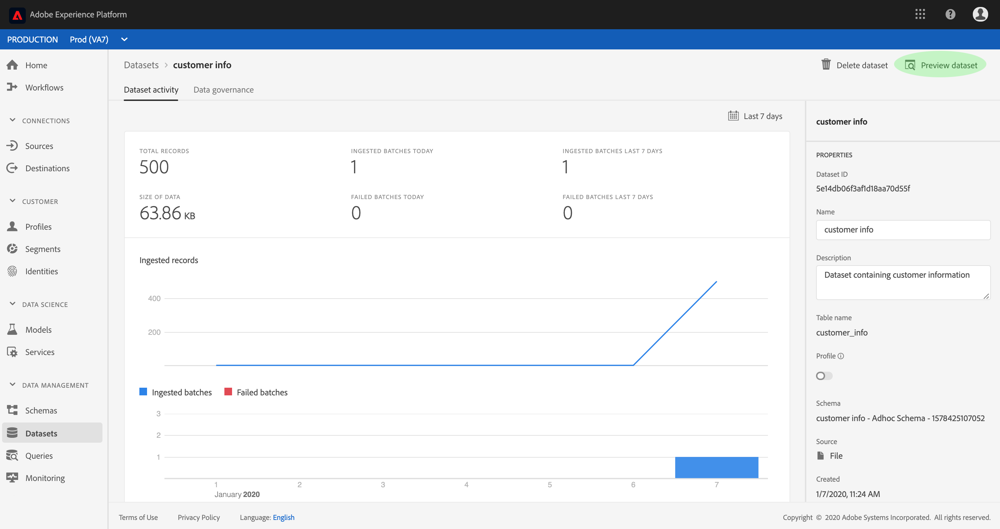
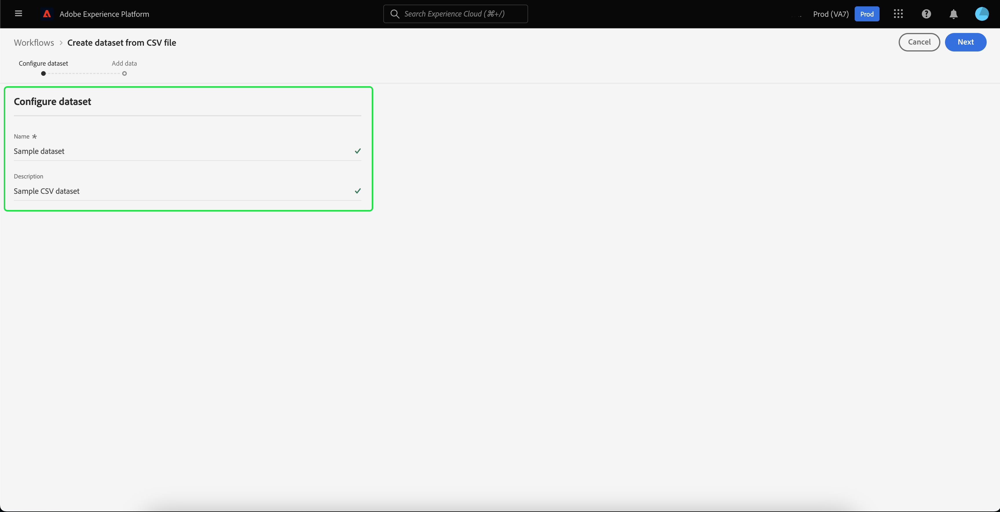

# データセットUIガイド

このユーザガイドでは、Adobe Experience Platform ユーザーインターフェイス内でデータセットを操作する際に、一般的なアクションを実行する手順を説明します。

## はじめに

このユーザガイドでは、Adobe Experience Platform の次のコンポーネントに関する十分な知識が必要です。 

* [Datasets](overview.md):でのデータ永続性のストレージと管理の構成体 [!DNL Experience Platform]。
* [[!DNL Experience Data Model (XDM) System]](../../xdm/home.md)：顧客体験データを編成する際に [!DNL Experience Platform] に使用される標準化されたフレームワーク。
   * [スキーマ構成の基本](../../xdm/schema/composition.md)：スキーマ構成の主要な原則やベストプラクティスなど、XDM スキーマの基本的な構成要素について学びます。
   * [スキーマエディタ](../../xdm/tutorials/create-schema-ui.md):ユー [!DNL Schema Editor] ザーインターフェイス [!DNL Platform] 内で独自のカスタムXDMスキーマを作成する方法を説明します。
* [[!DNL Real-time Customer Profile]](../../profile/home.md):複数のソースからの集計データに基づいて、統合されたリアルタイムの消費者プロファイルを提供します。
* [[!DNL Adobe Experience Platform Data Governance]](../../data-governance/home.md):お客様のデータの使用に関する規制、制限、ポリシーへの準拠を確保します。

## データセットの表示

[!DNL Experience Platform] UIで、左側のナビゲーションの&#x200B;**[!UICONTROL Datasets]**&#x200B;をクリックして、**[!UICONTROL Datasets]**&#x200B;ダッシュボードを開きます。 ダッシュボードリストは、組織で使用可能なすべてのデータセットを管理します。リストに表示された各データセットに関する詳細（名前、データセットが適用されるスキーマ、最新の取得実行のステータスなど）が表示されます。

データセットの名前をクリックして、その&#x200B;**[!UICONTROL データセットのアクティビティ]**&#x200B;画面にアクセスし、選択したデータセットの詳細を確認します。「アクティビティ」タブには、消費されるメッセージの割合を視覚化したグラフと、成功および失敗したバッチのリストが含まれます。

## データセットのプレビュー

**[!UICONTROL データセットアクティビティ]**&#x200B;画面で、画面の右上隅近くにある「**[!UICONTROL データセットのプレビュー]** 」をクリックして、最大 100 行のデータをプレビューします。データセットが空の場合、プレビューリンクは無効になり、プレビューは使用できないと表示されます。

プレビューウィンドウの右側に、データセットのスキーマの階層表示が表示されます。

データにアクセスするためのより堅牢な方法を提供するために、[!DNL Experience Platform]は、[!DNL Query Service]や[!DNL JupyterLab]などのダウンストリームサービスを提供し、データを調査および分析します。 詳しくは、次のドキュメントを参照してください。

* [クエリサービスの概要](../../query-service/home.md)
* [JupyterLab ユーザガイド](../../data-science-workspace/jupyterlab/overview.md)

## データセットの作成  {#create}

新しいデータセットを作成するには、まず、「**[!UICONTROL データセット]**」ダッシュボードの「**[!UICONTROL データセットを作成]**」をクリックします。

次の画面に、新しいデータセットを作成するための次の 2 つのオプションが表示されます。

* [スキーマからのデータセットの作成](#schema)
* [CSV ファイルからのデータセットの作成](#csv)

### 既存スキーマからのデータセットの作成  {#schema}

**[!UICONTROL データセット作成]**&#x200B;画面で、「**[!UICONTROL スキーマからデータセットを作成]**」をクリックし、新しい空のデータセットを作成します。

「**[!UICONTROL スキーマ選択]**」手順が表示されます。「**[!UICONTROL 次へ]**」をクリックする前に、スキーマリストを参照し、データセットの準拠先となるスキーマを選択します。

**[!UICONTROL データセットの設定]**&#x200B;手順が表示されます。データセットの名前と説明（オプション）を入力し、「**[!UICONTROL 完了]**」をクリックしてデータセットを作成します。

### CSV ファイルを使用したデータセットの作成  {#csv}

CSV ファイルを使用してデータセットを作成する場合、アドホックスキーマが作成され、指定された CSV ファイルと一致する構造のデータセットが提供されます。**[!UICONTROL データセット作成]**&#x200B;画面で、「**[!UICONTROL CSV ファイルからデータセットを作成]**」というボックスをクリックします。

**[!UICONTROL 設定]**&#x200B;手順が表示されます。データセットの名前とオプションの説明を入力し、「**[!UICONTROL 次へ]**」をクリックします。

「**[!UICONTROL データ追加]**」手順が表示されます。CSV ファイルを画面の中央にドラッグ&amp;ドロップしてアップロードするか、「**[!UICONTROL 参照]**」をクリックしてファイルディレクトリを表示します。ファイルのサイズは 10 ギガバイトまでです。CSV ファイルがアップロードされたら、「**[!UICONTROL 保存]**」をクリックし 、データセットを作成します。

>[!NOTE]
>
> CSV の列名は英数字で始める必要があり、文字、数字、アンダースコアのみを含めることができます。

## リアルタイム顧客プロファイルデータセットの有効化 {#enable-profile}

すべてのデータセットには、取得したデータによって顧客プロファイルを拡張する機能があります。そのためには、データセットに従うスキーマが[!DNL Real-time Customer Profile]での使用に対して互換性がある必要があります。 互換性のあるスキーマは、次の要件を満たします。

* スキーマに、ID プロパティとして指定された属性が 1 つ以上あります。
* スキーマに、プライマリ ID として定義された ID プロパティがあります。

[!DNL Profile]のスキーマを有効にする方法について詳しくは、[スキーマエディターユーザーガイド](../../xdm/tutorials/create-schema-ui.md)を参照してください。

プロファイルでデータセットを有効にするには、その&#x200B;**[!UICONTROL データセットアクティビティ]**&#x200B;画面にアクセスし、「**[!UICONTROL プロパティ]**」列内の&#x200B;**[!UICONTROL プロファイル]**&#x200B;切り替えをクリックします。有効にすると、データセットに取得されたデータが顧客プロファイルに入力されます。

>[!NOTE]
>
>データセットに既にデータが含まれていて、その後[!DNL Profile]が有効になっている場合、既存のデータは[!DNL Profile]で自動的に消費されません。 [!DNL Profile]のデータセットを有効にした後、既存のデータを再度取り込み、顧客のプロファイルに貢献させることをお勧めします。

## データセットのデータガバナンスの管理と実施

データ使用状況ラベルを使用すると、データに適用される使用ポリシーに従ってデータセットを分類できます。ラベルについて詳しくは、『[データガバナンスの概要](../../data-governance/home.md)』を参照してください。また、データセットにラベルを適用する方法については、『[データ使用レベルユーザガイド](../../data-governance/labels/overview.md)』を参照してください。

## データセットの削除

データセットを削除するには、まず&#x200B;**[!UICONTROL データセットアクティビティ]**&#x200B;画面にアクセスします。次に、「**[!UICONTROL データセットの削除]**」をクリックして削除します。

>[!NOTE]
>
>Adobeのアプリケーションおよびサービス(Adobe Analytics、Adobe Audience Manager、[!DNL Offer Decisioning]など)で作成および使用されるデータセットは削除できません。

確認ボックスが表示されます。「**[!UICONTROL 削除]**」をクリックし、データセットの削除を確定します。

## プロファイル対応データセットの削除

[!DNL Profile]に対してデータセットが有効になっている場合、UIからそのデータセットを削除すると、プラットフォーム内のData Lakeとプロファイルストアの両方から削除されます。

データセットを[!DNL Profile]ストアからのみ削除できます（データはData Lakeに残す）。この場合、削除できるのはReal-time CustomerプロファイルAPIを使用する方法です。 詳しくは、[プロファイルシステムジョブAPIエンドポイントガイド](../../profile/api/profile-system-jobs.md)を参照してください。

## データ取得の監視

[!DNL Experience Platform] UIの左側のナビゲーションで[**[!UICONTROL 監視]**]をクリックします。 「**[!UICONTROL 監視]**」ダッシュボードを使用すると 、バッチ取得またはストリーミング取得から受信データのステータスを表示できます。個々のバッチのステータスを表示するには、「**[!UICONTROL エンドツーエンドのバッチ処理]**」または「**[!UICONTROL エンドツーエンドのストリーミング]**」をクリックします。ダッシュボードリストは、正常に実行された、失敗した、または進行中のバッチまたはストリーミング取り込みを含む、すべての実行をします。 各リストには、バッチ ID、ターゲットデータセットの名前、取得したレコード数など、バッチの詳細が表示されます。ターゲットデータセットが[!DNL Profile]に対して有効になっている場合は、取り込まれたIDレコードとプロファイルレコードの数も表示されます。

個々の&#x200B;**[!UICONTROL バッチ ID]** をクリックして「**[!UICONTROL バッチの概要]**」ダッシュボードにアクセスし、バッチの取得に失敗した場合にはエラーログを含むバッチの詳細を確認できます。

バッチを削除する場合は、ダッシュボードの右上にある「**[!UICONTROL バッチの削除]**」をクリックします。また、バッチの最初の取得先であるデータセットからもレコードが削除されます。

## 次の手順

このユーザーガイドでは、[!DNL Experience Platform]ユーザーインターフェイスでデータセットを操作する際に、一般的な操作を実行する手順を説明しています。 データセットに関連する一般的な[!DNL Platform]ワークフローを実行する手順については、以下のチュートリアルを参照してください。

* [API を使用したデータセットの作成](create.md)
* [データアクセス API を使用したクエリデータセットデータ](../../data-access/home.md)
* [API を使用したリアルタイム顧客プロファイルおよび ID サービスのデータセットの設定](../../profile/tutorials/dataset-configuration.md)
