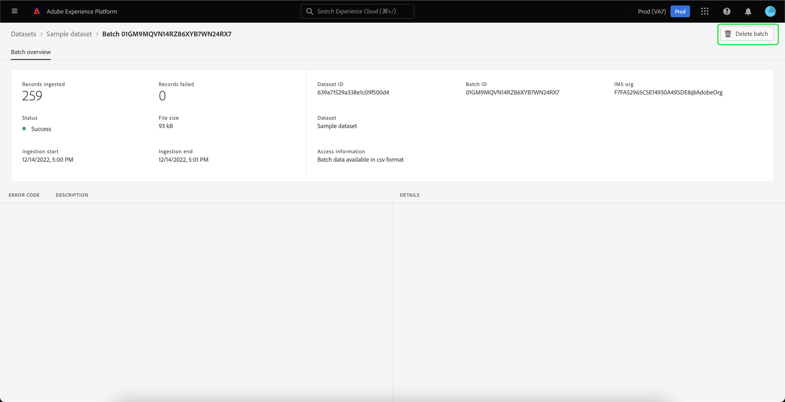

# データセット UI ガイド

このユーザガイドでは、Adobe Experience Platform ユーザーインターフェイス内でデータセットを操作する際に、一般的なアクションを実行する手順を説明します。

## はじめに

このユーザガイドでは、Adobe Experience Platform の次のコンポーネントに関する十分な知識が必要です。 

* [データセット](overview.md)：でのデータ永続化のためのストレージと管理の構成 [!DNL Experience Platform].
* [[!DNL Experience Data Model (XDM) System]](../../xdm/home.md)：[!DNL Experience Platform] が、カスタマーエクスペリエンスデータを整理する際に使用する、標準化されたフレームワーク。
   * [スキーマ構成の基本](../../xdm/schema/composition.md)：スキーマ構成の主要な原則やベストプラクティスなど、XDM スキーマの基本的な構成要素について説明します。
   * [スキーマエディター](../../xdm/tutorials/create-schema-ui.md)：を使用して独自のカスタム XDM スキーマを構築する方法を説明します。 [!DNL Schema Editor] 内 [!DNL Platform] ユーザーインターフェイス。
* [[!DNL Real-Time Customer Profile]](../../profile/home.md)：複数のソースから集計したデータに基づいて、統合されたリアルタイム顧客プロファイルを提供します。
* [[!DNL Adobe Experience Platform Data Governance]](../../data-governance/home.md)：お客様のデータの使用に関する規制、制限、ポリシーへの準拠を確保します。

## データセットの表示 {#view-datasets}

>[!CONTEXTUALHELP]
>id="platform_datasets_negative_numbers"
>title="データセットアクティビティの負の数値"
>abstract="取り込まれたレコードの負の数値は、選択した時間範囲でユーザーが特定のバッチを削除したことを意味します。"
>text="Learn more in documentation"

>[!CONTEXTUALHELP]
>id="platform_datasets_browse_daysRemaining"
>title="データセットの有効期限"
>abstract="この列は、ターゲットデータセットが自動的に期限切れになるまでの残り日数を示します。"

Adobe Analytics の [!DNL Experience Platform] UI、「 」を選択します。 **[!UICONTROL データセット]** 左側のナビゲーションで、 **[!UICONTROL データセット]** ダッシュボード。 ダッシュボードリストは、組織で使用可能なすべてのデータセットを管理します。リストに表示された各データセットに関する詳細（名前、データセットが適用されるスキーマ、最新の取得実行のステータスなど）が表示されます。

次の中からデータセットの名前を選択します： [!UICONTROL 参照] タブをクリックして、アクセスします **[!UICONTROL データセットアクティビティ]** 画面に、選択したデータセットの詳細が表示されます。 「アクティビティ」タブには、消費されるメッセージの割合を視覚化したグラフと、成功および失敗したバッチのリストが含まれます。

## インラインデータセットアクション {#inline-actions}

データセット UI に、使用可能な各データセットに対して一連のインラインアクションが提供されるようになりました。 管理対象のデータセットの省略記号 (...) を選択し、ポップアップメニューで使用可能なオプションを表示します。 使用可能なアクションは次のとおりです。 [[!UICONTROL データセットをプレビュー]](#preview), [[!UICONTROL データおよびアクセスラベルの管理]](#manage-and-enforce-data-governance), [[!UICONTROL 統合プロファイルを有効にする]](#enable-profile), [[!UICONTROL タグの管理]](#add-tags), [[!UICONTROL フォルダーに移動]](#move-to-folders)、および [[!UICONTROL 削除]](#delete). 使用可能なこれらのアクションについて詳しくは、それぞれの節を参照してください。

### データセットタグを追加 {#add-tags}

カスタムで作成したタグを追加して、データセットを整理し、検索、フィルタリング、並べ替え機能を改善します。 次から： [!UICONTROL 参照] タブ [!UICONTROL データセット] workspace で、管理するデータセットの省略記号を選択し、その後に **[!UICONTROL タグの管理]** をドロップダウンメニューから選択します。

The [!UICONTROL タグの管理] ダイアログが表示されます。 簡単な説明を入力してカスタムタグを作成するか、既存のタグから選択してデータセットにラベルを付けます。 「**[!UICONTROL 保存]**」を選択して、設定を確定します。

The [!UICONTROL タグの管理] ダイアログでは、データセットから既存のタグを削除することもできます。 削除するタグの横にある「x」を選択し、「 」を選択します。 **[!UICONTROL 保存]**.

タグがデータセットに追加されたら、対応するタグに基づいてデータセットをフィルタリングできます。 方法に関する節を参照してください。 [タグでデータセットをフィルタリング](#enable-profile) を参照してください。

検出と分類を容易にするためにビジネスオブジェクトを分類する方法の詳細については、 [メタデータ分類の管理](../../administrative-tags/ui/managing-tags.md). このガイドでは、適切な権限を持つユーザーが、事前定義済みのタグを作成し、タグにカテゴリを割り当て、Platform UI でタグとタグカテゴリに関連するすべての CRUD 操作を実行する方法について詳しく説明します。

## データセットの検索とフィルタリング {#search-and-filter}

使用可能なデータセットのリストを検索またはフィルタリングするには、フィルターアイコン () をクリックします。 左側のパネルに一連のフィルターオプションが表示されます。 使用可能なデータセットをフィルタリングする方法はいくつかあります。 これには次が含まれます。 [[!UICONTROL システムデータセットを表示]](#show-system-datasets), [[!UICONTROL プロファイルに含まれる]](#filter-profile-enabled-datasets), [[!UICONTROL タグ]](#filter-by-tag), [[!UICONTROL 作成日]](#filter-by-creation-date), [[!UICONTROL 変更日], [!UICONTROL 作成者]](#filter-by-creation-date)、および [[!UICONTROL スキーマ]](#filter-by-schema).

適用されたフィルターのリストが、フィルターされた結果の上に表示されます。

### システムデータセットを表示 {#show-system-datasets}

デフォルトでは、データの取り込み先のデータセットのみが表示されます。 システム生成データセットを表示する場合は、 **[!UICONTROL はい]** 」チェックボックスをオンにします。 [!UICONTROL システムデータセットを表示] 」セクションに入力します。 システム生成データセットは、他のコンポーネントの処理にのみ使用されます。 例えば、システム生成のプロファイル書き出しデータセットを使用して、プロファイルダッシュボードが処理されます。

![「データセット」ワークスペースのフィルターオプションで、 [!UICONTROL システムデータセットを表示] セクションがハイライト表示されました。](../images/datasets/user-guide/show-system-datasets.png)

### プロファイルが有効なデータセットをフィルター {#filter-profile-enabled-datasets}

プロファイルデータが有効になっているデータセットは、データの取り込み後に顧客プロファイルに入力するために使用されます。 詳しくは、 [プロファイルのデータセットの有効化](#enable-profile) を参照してください。

プロファイルが有効かどうかに基づいてデータセットをフィルタリングするには、 [!UICONTROL はい] 」チェックボックスをオンにします。

![「データセット」ワークスペースのフィルターオプションで、 [!UICONTROL プロファイルに含まれる] セクションがハイライト表示されました。](../images/datasets/user-guide/included-in-profile.png)

### タグでデータセットをフィルタリング {#filter-by-tag}

カスタムタグ名を [!UICONTROL タグ] を入力し、使用可能なオプションのリストからタグを選択して、そのタグに対応するデータセットを検索し、フィルタリングします。

![「データセット」ワークスペースのフィルターオプションで、 [!UICONTROL タグ] 入力およびフィルターアイコンがハイライト表示されています。](../images/datasets/user-guide/filter-tags.png)

### 作成日でデータセットをフィルタリング {#filter-by-creation-date}

データセットは、カスタム期間の作成日別にフィルタリングできます。 これを使用して、履歴データを除外したり、特定の時系列のデータインサイトとレポートを生成したりできます。 を選択します。 [!UICONTROL 開始日] および [!UICONTROL 終了日] 各フィールドのカレンダーアイコンを選択します。 その後、その条件に適合するデータセットのみが「参照」タブに表示されます。

### 変更日でデータセットをフィルタリング {#filter-by-modified-date}

作成日のフィルターと同様に、最終変更日に基づいてデータセットをフィルタリングできます。 Adobe Analytics の [!UICONTROL 変更日] セクション、 [!UICONTROL 開始日] および [!UICONTROL 終了日] 各フィールドのカレンダーアイコンを選択します。 その後、その期間に変更されたデータセットのみが「参照」タブに表示されます。

### スキーマでフィルター {#filter-by-schema}

構造を定義するスキーマに基づいて、データセットをフィルタリングできます。 ドロップダウンアイコンを選択するか、テキストフィールドにスキーマ名を入力します。 一致する可能性がある項目のリストが表示されます。 リストから適切なスキーマを選択します。

## 作成日でデータセットを並べ替える {#sort}

内のデータセット [!UICONTROL 参照] タブは、昇順または降順の日付で並べ替えることができます。 を選択します。 [!UICONTROL 作成済み] または [!UICONTROL 最終更新日] 列見出しを使用して昇順と降順を切り替えることができます。 選択すると、列ヘッダーの側に上向き矢印または下向き矢印が表示されます。

## データセットのプレビュー {#preview}

データセットサンプルデータは、 [!UICONTROL 参照] タブと [!UICONTROL データセットアクティビティ] 表示。 次から： [!UICONTROL 参照] 「 」タブで、プレビューするデータセット名の横にある省略記号 (...) を選択します。 オプションのメニューリストが表示されます。 次に、「 **[!UICONTROL データセットをプレビュー]** を選択します。 データセットが空の場合、プレビューリンクは非アクティブになり、代わりにプレビューは使用できないと表示されます。

プレビューウィンドウが開き、右側にデータセットのスキーマの階層表示が表示されます。

または、 **[!UICONTROL データセットアクティビティ]** 画面、選択 **[!UICONTROL データセットをプレビュー]** 画面の右上隅付近にあり、最大 100 行のデータをプレビューできます。

より堅牢な方法でデータにアクセスするには、 [!DNL Experience Platform] は、次のようなダウンストリームサービスを提供します。 [!DNL Query Service] および [!DNL JupyterLab] を参照して、データを分析します。 詳しくは、次のドキュメントを参照してください。

* [クエリサービスの概要](../../query-service/home.md)
* [JupyterLab ユーザーガイド](../../data-science-workspace/jupyterlab/overview.md)

## データセットの作成 {#create}

新しいデータセットを作成するには、まず、データセットダッシュボードの「**[!UICONTROL データセットを作成]**」を選択します。****

次の画面に、新しいデータセットを作成するための次の 2 つのオプションが表示されます。

* [スキーマからのデータセットの作成](#schema)
* [CSV ファイルからのデータセットの作成](#csv)

### 既存スキーマからのデータセットの作成 {#schema}

Adobe Analytics の **[!UICONTROL データセットを作成]** 画面、選択 **[!UICONTROL スキーマからデータセットを作成]** 新しい空のデータセットを作成します。

「**[!UICONTROL スキーマ選択]**」手順が表示されます。選択する前に、スキーマリストを参照し、データセットの準拠先となるスキーマを選択します **[!UICONTROL 次へ]**.

**[!UICONTROL データセットの設定]**&#x200B;手順が表示されます。データセットの名前と説明（オプション）を入力し、「 」を選択します。 **[!UICONTROL 完了]** をクリックして、データセットを作成します。

データセットは、UI で使用可能なデータセットのリストから、スキーマフィルターでフィルタリングできます。 方法に関する節を参照してください。 [データセットをスキーマ別にフィルタリング](#filter-by-schema) を参照してください。

### CSV ファイルを使用したデータセットの作成 {#csv}

CSV ファイルを使用してデータセットを作成する場合、アドホックスキーマが作成され、指定された CSV ファイルと一致する構造のデータセットが提供されます。Adobe Analytics の **[!UICONTROL データセットを作成]** 画面、選択 **[!UICONTROL CSV ファイルからデータセットを作成]**.

**[!UICONTROL 設定]**&#x200B;手順が表示されます。データセットの名前と説明（オプション）を入力し、「 」を選択します。 **[!UICONTROL 次へ]**.

**[!UICONTROL データを追加]**&#x200B;手順が表示されます。CSV ファイルを画面の中央にドラッグ&amp;ドロップしてアップロードするか、「 **[!UICONTROL 参照]** をクリックして、ファイルディレクトリを表示します。 ファイルのサイズは 10 ギガバイトまでです。CSV ファイルがアップロードされたら、「 」を選択します。 **[!UICONTROL 保存]** をクリックして、データセットを作成します。

>[!NOTE]
>
> CSV の列名は英数字で始める必要があり、文字、数字、アンダースコアのみを含めることができます。

## リアルタイム顧客プロファイルのデータセットの有効化 {#enable-profile}

すべてのデータセットには、取得したデータによって顧客プロファイルを拡張する機能があります。これをおこなうには、データセットが準拠するスキーマが、での使用に対して互換性がある必要があります [!DNL Real-Time Customer Profile]. 互換性のあるスキーマは、次の要件を満たします。

* スキーマに、ID プロパティとして指定された属性が 1 つ以上あります。
* スキーマに、プライマリ ID として定義された ID プロパティがあります。

のスキーマを有効にする方法について詳しくは、 [!DNL Profile]を参照し、 [スキーマエディターユーザーガイド](../../xdm/tutorials/create-schema-ui.md).

プロファイルのデータセットは、 [!UICONTROL 参照] タブと [!UICONTROL データセットアクティビティ] 表示。 次から： [!UICONTROL 参照] タブ [!UICONTROL データセット] workspace で、プロファイルに対して有効にするデータセットの省略記号を選択します。 オプションのメニューリストが表示されます。 次に、「 **[!UICONTROL 統合プロファイルを有効にする]** を選択します。

または、データセットの **[!UICONTROL データセットアクティビティ]** 画面で、 **[!UICONTROL プロファイル]** 内で切り替える **[!UICONTROL プロパティ]** 列。 有効にすると、データセットに取得されたデータが顧客プロファイルに入力されます。

>[!NOTE]
>
>データセットに既にデータが含まれ、が有効になっている場合 [!DNL Profile]に設定されている場合、既存のデータは [!DNL Profile]. のデータセットを有効にした後 [!DNL Profile]既存のデータを再取り込みして、顧客プロファイルに貢献させることをお勧めします。

プロファイルに対して有効になったデータセットも、この条件に基づいてフィルタリングできます。 方法に関する節を参照してください。 [フィルタープロファイル対応データセット](#filter-profile-enabled-datasets) を参照してください。

## データセットのデータガバナンスの管理と実施 {#manage-and-enforce-data-governance}

データセットのデータガバナンスラベルは、 [!UICONTROL 参照] タブをクリックします。 管理するデータセット名の横にある省略記号 (...) を選択し、その後に **[!UICONTROL データおよびアクセスラベルの管理]** をドロップダウンメニューから選択します。

スキーマレベルで適用されるデータ使用状況ラベルを使用すると、データに適用される使用ポリシーに従ってデータセットとフィールドを分類できます。 詳しくは、 [データガバナンスの概要](../../data-governance/home.md) ラベルの詳細を確認するには、以下を参照してください。 [データ使用ラベルユーザーガイド](../../data-governance/labels/overview.md) データセットに伝達するためにスキーマにラベルを適用する方法については、を参照してください。

## フォルダーに移動 {#move-to-folders}

フォルダー内にデータセットを配置すると、データセットの管理を改善できます。 データセットをフォルダーに移動するには、管理するデータセット名の横にある省略記号 (...) を選択し、その後に **[!UICONTROL フォルダーに移動]** をドロップダウンメニューから選択します。

![The [!UICONTROL データセット] 省略記号付きのダッシュボードと [!UICONTROL フォルダーに移動] ハイライト表示されました。](../images/datasets/user-guide/move-to-folder.png)

The [!UICONTROL 移動] データセットをフォルダーに設定ダイアログが表示されます。 オーディエンスの移動先のフォルダーを選択し、「 」を選択します。 **[!UICONTROL 移動]**. データセットの移動が成功したことを示すポップアップ通知が表示されます。

![The [!UICONTROL 移動] を使用したデータセットダイアログ [!UICONTROL 移動] ハイライト表示されました。](../images/datasets/user-guide/move-dialog.png)

>[!TIP]
>
>また、データセットを移動ダイアログから直接フォルダーを作成することもできます。 フォルダーを作成するには、フォルダーを作成アイコン () をクリックします。
>
>![The [!UICONTROL 移動] 「データセット」ダイアログに、「フォルダーを作成」アイコンがハイライトされています。](/help/catalog/images/datasets/user-guide/create-folder.png)

データセットをフォルダーに追加したら、特定のフォルダーに属するデータセットのみを表示するように選択できます。 フォルダー構造を開くには、フォルダーを表示アイコン () をクリックします。 次に、選択したフォルダーを選択し、関連するすべてのデータセットを表示します。

![The [!UICONTROL データセット] 「データセット」フォルダー構造が表示されたダッシュボード、「フォルダーを表示」アイコン、選択したフォルダーがハイライト表示されています。](../images/datasets/user-guide/folder-structure.png)

## データセットの削除 {#delete}

データセットは、 [!UICONTROL 参照] タブまたは [!UICONTROL データセットアクティビティ] 表示。 次から： [!UICONTROL 参照] 「 」を表示し、削除するデータセット名の横にある省略記号 (...) を選択します。 オプションのメニューリストが表示されます。 次に、「 **[!UICONTROL 削除]** をドロップダウンメニューから選択します。

確認ダイアログが表示されます。 「**[!UICONTROL 削除]**」を選択して確定します。

または、 **[!UICONTROL データセットを削除]** から **[!UICONTROL データセットアクティビティ]** 画面。

>[!NOTE]
>
>Adobeのアプリケーションおよびサービス (Adobe Analytics、Adobe Audience Manager、 [!DNL Offer Decisioning]) は削除できません。

確認ボックスが表示されます。選択 **[!UICONTROL 削除]** をクリックして、データセットの削除を確定します。

## プロファイル対応データセットの削除

データセットのプロファイルが有効になっている場合、UI を通じてそのデータセットを削除すると、データレイク、ID サービス、Platform 内のプロファイルストアからそのデータセットが削除されます。

データセットは、 [!DNL Profile] は、（データレイクにデータを残す）リアルタイム顧客プロファイル API を使用してのみ保存します。 詳しくは、 [プロファイルシステムジョブ API エンドポイントのガイド](../../profile/api/profile-system-jobs.md) を参照してください。

## データ取得の監視

Adobe Analytics の [!DNL Experience Platform] UI、「 」を選択します。 **[!UICONTROL 監視]** をクリックします。 「**[!UICONTROL 監視]**」ダッシュボードを使用すると 、バッチ取得またはストリーミング取得から受信データのステータスを表示できます。個々のバッチのステータスを表示するには、次のいずれかを選択します。 **[!UICONTROL エンドツーエンドのバッチ処理]** または **[!UICONTROL エンドツーエンドのストリーミング]**. ダッシュボードには、正常、失敗、または進行中のすべてのバッチ取り込みまたはストリーミング取り込みの実行が一覧表示されます。 各リストには、バッチ ID、ターゲットデータセットの名前、取得したレコード数など、バッチの詳細が表示されます。ターゲットデータセットが [!DNL Profile]に設定すると、取り込まれた id レコードとプロファイルレコードの数も表示されます。

個人を選択できます **[!UICONTROL バッチ ID]** にアクセスするには **[!UICONTROL バッチの概要]** ダッシュボードを開き、バッチの取り込みに失敗した場合にエラーログを含むバッチの詳細を確認します。

バッチを削除する場合は、 **[!UICONTROL バッチを削除]** ダッシュボードの右上近くに表示されます。 また、バッチを削除すると、バッチの最初の取得先のデータセットからもレコードが削除されます。

## 次の手順

このユーザーガイドでは、 [!DNL Experience Platform] ユーザーインターフェイス。 共通の実行手順 [!DNL Platform] データセットを含むワークフローについては、次のチュートリアルを参照してください。

* [API を使用したデータセットの作成](create.md)
* [データアクセス API を使用したクエリデータセットデータ](../../data-access/home.md)
* [API を使用したリアルタイム顧客プロファイルおよび ID サービスのデータセットの設定](../../profile/tutorials/dataset-configuration.md)
