# データセット UI ガイド

このユーザガイドでは、Adobe Experience Platform ユーザーインターフェイス内でデータセットを操作する際に、一般的なアクションを実行する手順を説明します。

## はじめに

このユーザガイドでは、Adobe Experience Platform の次のコンポーネントに関する十分な知識が必要です。

* [ データセット ](overview.md): [!DNL Experience Platform]のデータ永続性のためのストレージと管理の構成図。
* [[!DNL Experience Data Model (XDM) System]](../../xdm/home.md)：[!DNL Experience Platform] が、カスタマーエクスペリエンスデータを整理する際に使用する、標準化されたフレームワーク。
   * [スキーマ構成の基本](../../xdm/schema/composition.md)：スキーマ構成の主要な原則やベストプラクティスなど、XDM スキーマの基本的な構成要素について説明します。
   * [ スキーマエディター](../../xdm/tutorials/create-schema-ui.md): [!DNL Experience Platform] ユーザーインターフェイス内で[!DNL Schema Editor]を使用して独自のカスタム XDM スキーマを構築する方法について説明します。
* [[!DNL Real-Time Customer Profile]](../../profile/home.md)：複数のソースから集計したデータに基づいて、統合されたリアルタイム顧客プロファイルを提供します。
* [[!DNL Adobe Experience Platform Data Governance]](../../data-governance/home.md)：顧客データの使用に関する規制、制限、ポリシーに準拠していることを確認します。

## データセットの表示 {#view-datasets}

>[!CONTEXTUALHELP]
>id="platform_datasets_negative_numbers"
>title="データセットアクティビティの負の数値"
>abstract="取り込まれたレコードの負の数値は、選択した時間範囲でユーザーが特定のバッチを削除したことを意味します。"
>text="Learn more in documentation"

>[!CONTEXTUALHELP]
>id="platform_datasets_browse_daysRemaining"
>title="データセットの有効期限"
>abstract="この列は、ターゲットデータセットが自動的に期限切れになるまでの残り日数を示します。"

>[!CONTEXTUALHELP]
>id="platform_datasets_browse_datalakeretention"
>title="データレイクの保持"
>abstract="各データセットの現在の保持ポリシーを表示します。 この値は、各データセットの保持設定で変更できます。 ExperienceEvent データセットの保持期間のみを設定できます。"

>[!CONTEXTUALHELP]
>id="platform_datasets_browse_profileretention"
>title="プロファイルの保持"
>abstract="各データセットの現在の保持ポリシーを表示します。 この値は、各データセットの保持設定で変更できます。 ExperienceEvent データセットの保持期間のみを設定できます。"

>[!CONTEXTUALHELP]
>id="platform_datasets_datalakesettings_datasetretention"
>title="データセットの保持"
>abstract="データレイクの保持では、様々なサービスでデータが保存される期間と削除されるタイミングに関するルールを設定します。 これにより、規制への準拠、ストレージコストの管理、データ品質の維持が保証されます。"

>[!CONTEXTUALHELP]
>id="platform_datasets_orchestratedCampaigns_toggle"
>title="オーケストレーションキャンペーン"
>abstract="この切替スイッチを有効にすると、選択したデータセットを Adobe Journey Optimizer のオーケストレーションキャンペーンで使用できるようになります。 データセットは 1 つのリレーショナルスキーマを使用する必要があり、スキーマごとにデータセットを 1 つだけ作成できます。"
>additional-url="https://experienceleague.adobe.com/jp/docs/journey-optimizer/using/campaigns/orchestrated-campaigns/data-configuration/schemas-datasets/manual-schema#enable" text="オーケストレーションキャンペーンのデータセットを有効にする"

>[!CONTEXTUALHELP]
>id="platform_datasets_enableforlookup_toggle"
>title="参照のために有効にする"
>abstract="ルックアップでこのデータセットを有効にすると、このデータセットののデータを Journey Optimizer のパーソナライズ機能、意思決定、ジャーニーオーケストレーションに使用できるようになります。"
>additional-url="https://experienceleague.adobe.com/jp/docs/journey-optimizer/using/data-management/lookup-aep-data" text="Journey Optimizer での Adobe Experience Platform の使用"

[!DNL Experience Platform] UIで、左側のナビゲーションで「**[!UICONTROL Datasets]**」を選択して、**[!UICONTROL Datasets]** ダッシュボードを開きます。 ダッシュボードリストは、組織で使用可能なすべてのデータセットを管理します。 リストされた各データセットの詳細（名前、データセットが準拠するスキーマ、最新の取り込み実行のステータスなど）が表示されます。

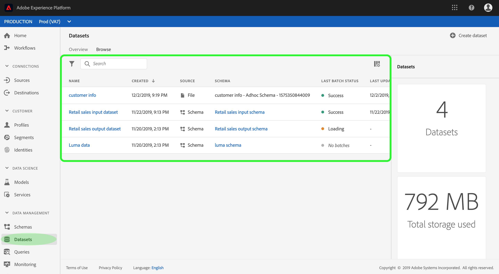

「[!UICONTROL Browse]」タブからデータセットの名前を選択して、**[!UICONTROL Dataset activity]**&#x200B;画面にアクセスし、選択したデータセットの詳細を確認します。 「アクティビティ」タブには、消費されるメッセージの割合を視覚化したグラフと、成功および失敗したバッチのリストが含まれます。

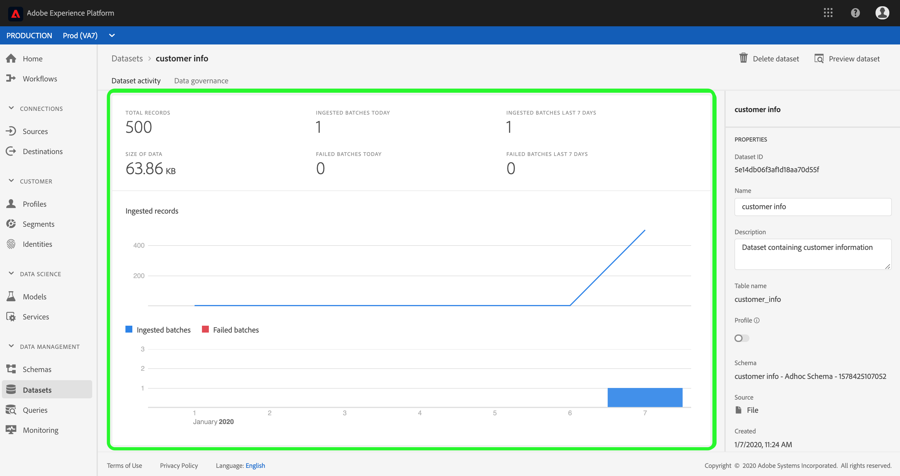
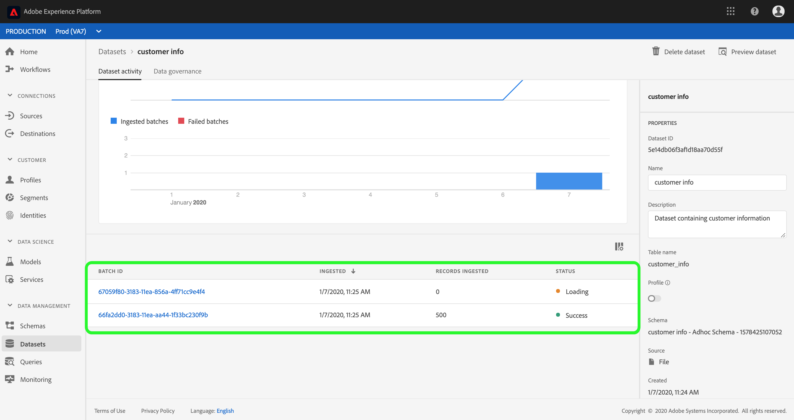

## その他のアクション {#more-actions}

[!UICONTROL Dataset]の詳細ビューから[!UICONTROL Delete]または[!UICONTROL Enable a dataset for Profile]を使用できます。 使用可能なアクションを表示するには、UIの右上にある「**[!UICONTROL ... More]**」を選択します。 ドロップダウンメニューが表示されます。

![ [!UICONTROL ... More] ドロップダウンメニューがハイライト表示されたデータセット ワークスペース。](../images/datasets/user-guide/more-actions.png)

**[!UICONTROL Enable a dataset for Profile]**&#x200B;を選択すると、確認ダイアログが表示されます。 **[!UICONTROL Enable]**&#x200B;を選択して選択を確定します。

>[!NOTE]
>
>プロファイルのデータセットを有効にするには、データセットが準拠するスキーマが、リアルタイム顧客プロファイルで使用できる互換性がある必要があります。 詳しくは、「[ プロファイルのデータセットを有効にする](#enable-profile)」の節を参照してください。

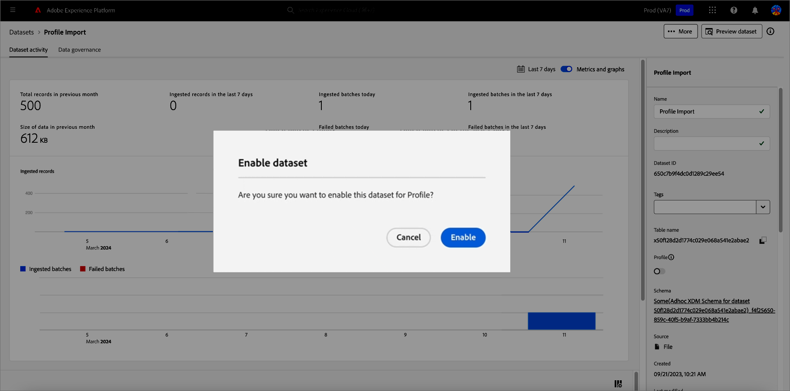

**[!UICONTROL Delete]**&#x200B;を選択すると、[!UICONTROL Delete dataset]の確認ダイアログが表示されます。 **[!UICONTROL Delete]**&#x200B;を選択して選択を確定します。

>[!NOTE]
>
>システムデータセットは削除できません。

[!UICONTROL Browse] タブにあるインラインアクションから、リアルタイム顧客プロファイルで使用するデータセットを削除または追加することもできます。 詳しくは、[ インラインアクションの節](#inline-actions)を参照してください。

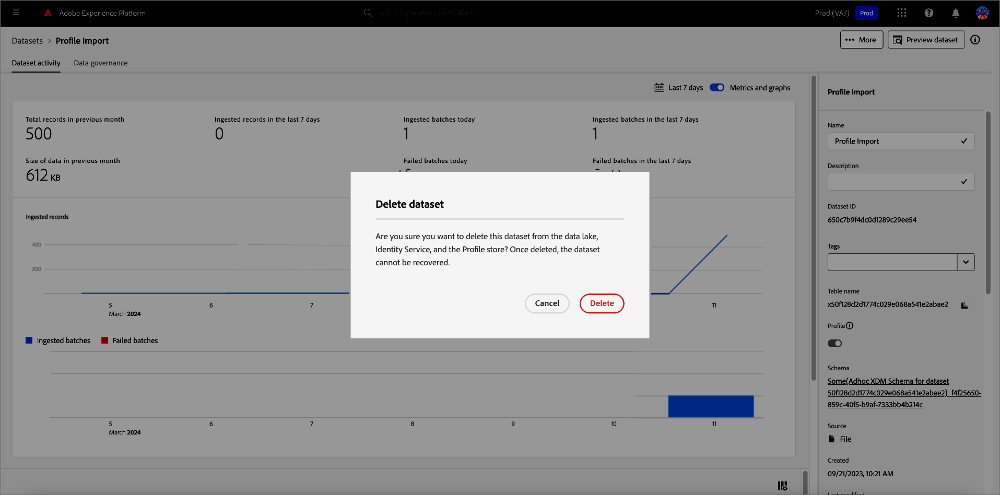

## インラインデータセットのアクション {#inline-actions}

データセット UIで、使用可能な各データセットのインラインアクションのコレクションが提供されるようになりました。 省略記号（。..）を選択 ポップアップメニューで利用可能なオプションを表示するために管理するデータセットの。 使用可能なアクションには、次のものが含まれます。

* [[!UICONTROL Preview dataset]](#preview)
* [[!UICONTROL Manage data and access labels]](#manage-and-enforce-data-governance)
* [[!UICONTROL Enable unified profile]](#enable-profile)
* [[!UICONTROL Manage tags]](#manage-tags)
* [[!UICONTROL Set data retention policy]](#data-retention-policy)
* [[!UICONTROL Move to folders]](#move-to-folders)
* [[!UICONTROL Delete]](#delete)。

これらの使用可能なアクションについて詳しくは、それぞれの節を参照してください。 大量のデータセットを同時に管理する方法については、[ バルクアクション ](#bulk-actions)の節を参照してください。

### データセットのプレビュー {#preview}

[!UICONTROL Browse] タブのインラインオプションまたは[!UICONTROL Dataset activity] ビューから、任意のデータセットに対して最大100行のサンプルデータをプレビューできます。

「[!UICONTROL Browse]」タブで、省略記号（。..）を選択します。 データセット名の横にある「[!UICONTROL Preview dataset]」を選択します。 データセットが空の場合、プレビューオプションは無効になります。 または、**[!UICONTROL Dataset activity]**&#x200B;画面から、画面の右上隅付近にある&#x200B;**[!UICONTROL Preview dataset]**&#x200B;を選択します。

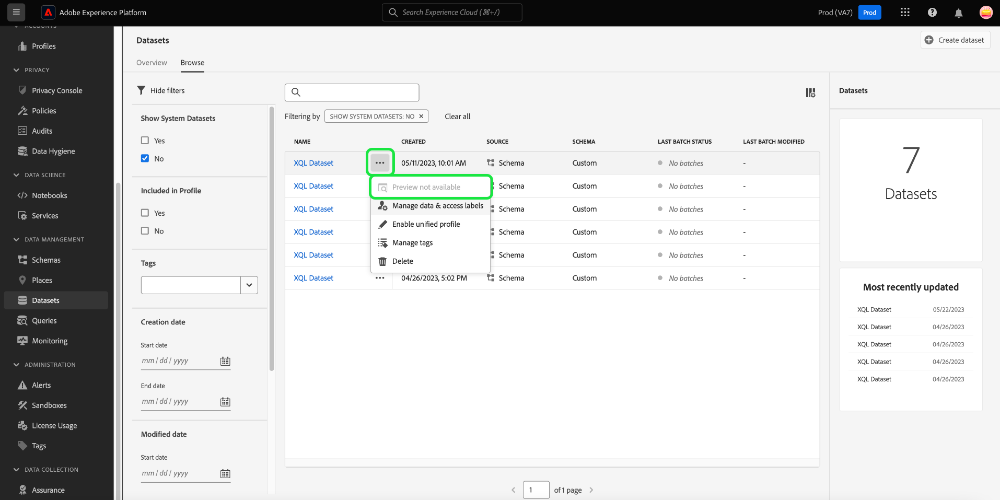

プレビューウィンドウが開き、データセットの階層スキーマビューが左側に表示されます。

>[!NOTE]
>
>左側のスキーマダイアグラムには、データを含むフィールドのみが表示されます。 データのないフィールドは自動的に非表示になり、UIを合理化して関連情報に集中できます。

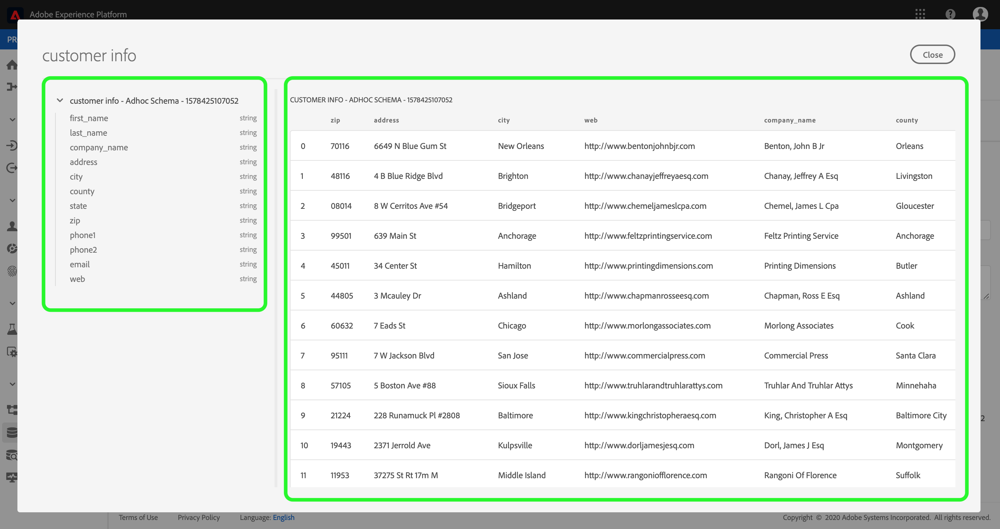

または、**[!UICONTROL Dataset activity]**&#x200B;画面から「**[!UICONTROL Preview dataset]**」を選択してプレビューウィンドウを開き、データセットの構造と値のサンプルを確認します。

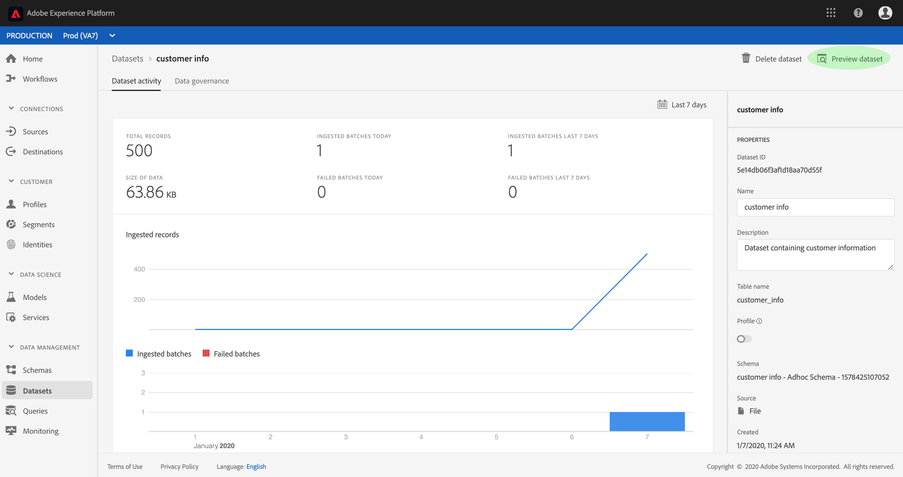

データセットのプレビューウィンドウでは、データセットの構造とデータを簡単に探索および検証できます。

#### データセットプレビューウィンドウ {#dataset-preview-window}

次のアニメーションは、ナビゲーション機能とデータ探索機能を備えたデータセットのプレビューウィンドウを示しています。

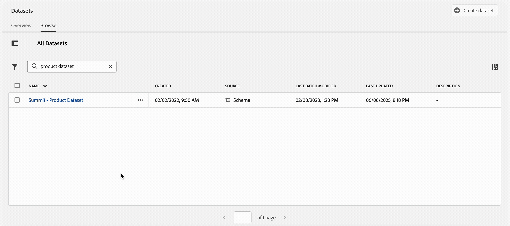

データセットのプレビューウィンドウには、次のものが含まれます。

* 左側のオブジェクトブラウザーサイドバーで、データセットフィールドのナビゲーションとフィルタリングを行うことができます。
* Insightの各列名の横にあるデータタイプインジケーターをデータセットの構造に配置します。
* ウィンドウの上部にSQL クエリが表示され、データセットの生成に使用されたクエリが表示されます。
* 効率的なデータレビューのために、最大100行の書式設定されたテーブルビュー。

これらの機能は、スキーマの詳細を理解し、サンプルデータを効率的に検証するのに役立ちます。

#### 高度なクエリエディターショートカット {#query-editor-shortcut}

組織がData Distiller ライセンスを持っている場合は、データセットのプレビューウィンドウから[!UICONTROL Advanced Query Editor]に直接アクセスできます。 このショートカットを使用すると、サンプルデータのプレビューから、クエリサービスでのクエリの実行と調整にシームレスに移動できます。

>[!AVAILABILITY]
>
>[!UICONTROL Advanced Query Editor]へのアクセスは、Data Distiller SKU ライセンスを持つ組織に限定されます。 組織に必要なライセンスがない場合、このオプションはデータセットのプレビューウィンドウには表示されません。

プレビューウィンドウの右上にある「[!UICONTROL Advanced Query Editor]」を選択して、現在のSQL クエリを事前に読み込んで実行した状態でQuery Serviceを開きます。 クエリを再入力せずに、引き続きSQLを分析または変更できます。

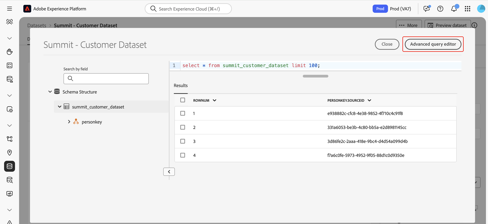

追加の分析には、[!DNL Query Service]や[!DNL JupyterLab]などのダウンストリームサービスを使用します。 詳しくは、次のドキュメントを参照してください。

* [クエリサービスの概要](../../query-service/home.md)
* [JupyterLab ユーザーガイド](../../data-science-workspace/jupyterlab/overview.md)

### データセットのデータガバナンスの管理と実施 {#manage-and-enforce-data-governance}

データセットのデータガバナンスラベルを管理するには、「[!UICONTROL Browse]」タブのインラインオプションを選択します。 省略記号（。..）を選択します 管理するデータセット名の横に&#x200B;**[!UICONTROL Manage data and access labels]**&#x200B;が表示されます。

データ使用ラベルをスキーマレベルで適用すると、そのデータに適用される使用ポリシーに従ってデータセットとフィールドを分類できます。 ラベルについて詳しくは、[ データガバナンスの概要](../../data-governance/home.md)を参照するか、[ データ使用ラベルユーザーガイド ](../../data-governance/labels/overview.md)を参照して、データセットに伝播するためにスキーマにラベルを適用する方法について説明します。

## リアルタイム顧客プロファイルのデータセットの有効化 {#enable-profile}

すべてのデータセットには、取得したデータによって顧客プロファイルを拡張する機能があります。 これを行うには、データセットが準拠するスキーマが[!DNL Real-Time Customer Profile]で使用できる互換性がある必要があります。 互換性のあるスキーマは、次の要件を満たします。

* スキーマに、ID プロパティとして指定された属性が 1 つ以上あります。
* スキーマに、プライマリ ID として定義された ID プロパティがあります。

[!DNL Profile]のスキーマを有効にする方法について詳しくは、[ スキーマエディターユーザーガイド ](../../xdm/tutorials/create-schema-ui.md)を参照してください。

プロファイルのデータセットは、[!UICONTROL Browse] タブのインラインオプションと[!UICONTROL Dataset activity] ビューの両方から有効にできます。 [!UICONTROL Datasets] ワークスペースの「[!UICONTROL Browse]」タブから、プロファイルに対して有効にするデータセットの省略記号を選択します。 オプションのメニューリストが表示されます。 次に、使用可能なオプションのリストから「**[!UICONTROL Enable unified profile]**」を選択します。

または、データセットの&#x200B;**[!UICONTROL Dataset activity]**&#x200B;画面から、**[!UICONTROL Properties]**&#x200B;列内の&#x200B;**[!UICONTROL Profile]** トグルを選択します。 有効にすると、データセットに取得されたデータが顧客プロファイルに入力されます。

>[!NOTE]
>
>データセットに既にデータが含まれており、その後[!DNL Profile]に対して有効になっている場合、既存のデータは[!DNL Profile]によって自動的に消費されません。 データセットを[!DNL Profile]に対して有効にした後、既存のデータを再インジェストして、顧客プロファイルに寄与させることをお勧めします。

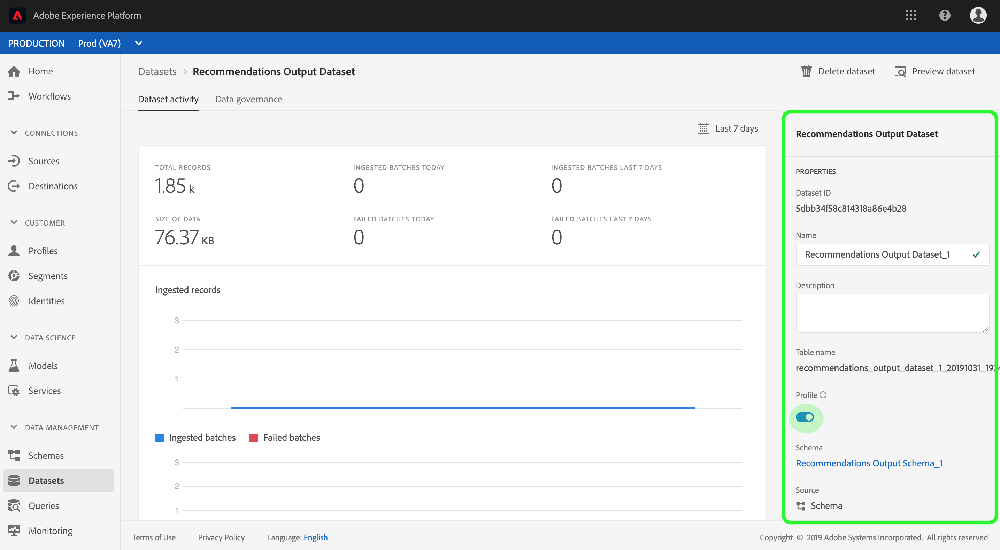

プロファイルに対して有効になっているデータセットも、この条件でフィルタリングできます。 詳しくは、「[ プロファイルが有効なデータセットをフィルタリングする方法](#filter-profile-enabled-datasets)」の節を参照してください。

### データセットタグの管理 {#manage-tags}

カスタム作成タグを追加して、データセットを整理し、検索、フィルタリング、並べ替え機能を向上させます。 [!UICONTROL Datasets] ワークスペースの「[!UICONTROL Browse]」タブで、管理するデータセットの省略記号を選択し、ドロップダウンメニューから&#x200B;**[!UICONTROL Manage tags]**&#x200B;を選択します。

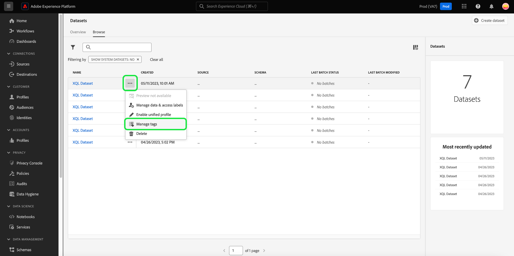

[!UICONTROL Manage tags] ダイアログが表示されます。 カスタムタグを作成するには、短い説明を入力するか、既存のタグから選択してデータセットにラベルを付けます。 **[!UICONTROL Save]**&#x200B;を選択して設定を確定します。

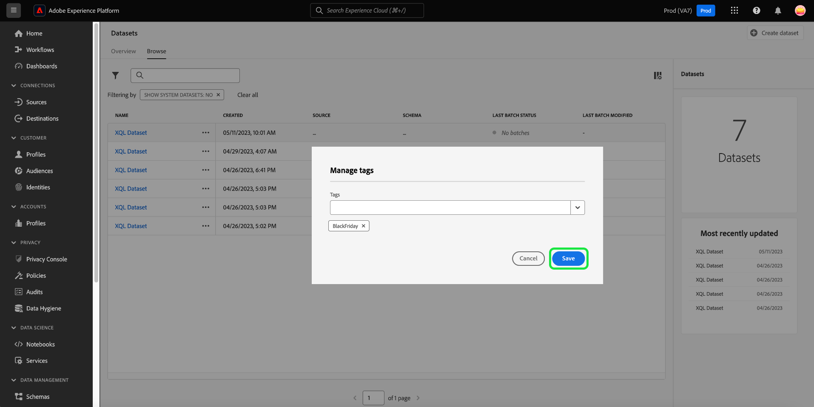

[!UICONTROL Manage tags] ダイアログは、データセットから既存のタグを削除することもできます。 削除するタグの横にある「x」を選択し、**[!UICONTROL Save]**&#x200B;を選択します。

タグをデータセットに追加すると、対応するタグに基づいてデータセットをフィルタリングできます。 詳しくは、「タグでデータセットを[ フィルタリングする方法」の節を参照してください。](#enable-profile)

簡単に検出および分類できるようにビジネスオブジェクトを分類する方法について詳しくは、[ メタデータ分類の管理](../../administrative-tags/ui/managing-tags.md)に関するガイドを参照してください。 このガイドでは、適切な権限を持つユーザーが、Experience Platform UIで事前定義済みのタグを作成してカテゴリに割り当て、関連するすべてのCRUD操作を管理する方法について説明します。

### データ保持ポリシーを設定 {#data-retention-policy}

[!UICONTROL Datasets] ワークスペースの「[!UICONTROL Browse]」タブのインラインアクションメニューを使用して、データセットの有効期限と保持設定を管理します。 この機能を使用して、データレイクとプロファイルストアにデータを保持する期間を設定できます。 有効期限は、データがExperience Platformに取り込まれた日付と、設定した保持期間に基づきます。

>[!IMPORTANT]
>
>ExperienceEvent データセットの保持ルールを適用または更新するには、ユーザーの役割に&#x200B;**[!UICONTROL Manage datasets]**&#x200B;権限を含める必要があります。 このロールベースのアクセス制御により、データセットの保持設定を変更できるのは許可されたユーザーのみです。
>
>Adobe Experience Platformでの権限の割り当てについて詳しくは、[ アクセス制御の概要](../../access-control/home.md#platform-permissions)を参照してください。

>[!TIP]
>
>データレイクは、分析と処理のために、イベントログ、クリックストリームデータ、一括取り込みレコードなどの未処理データを保存します。 プロファイルストアには、リアルタイムのパーソナライゼーションとアクティベーションをサポートするために、IDをつなぎ合わせたイベントや属性情報を含む、顧客を特定できるデータが含まれています。

保持期間を設定するには、データセットの横にある省略記号を選択し、ドロップダウンメニューから&#x200B;**[!UICONTROL Set data retention policy]**&#x200B;を選択します。

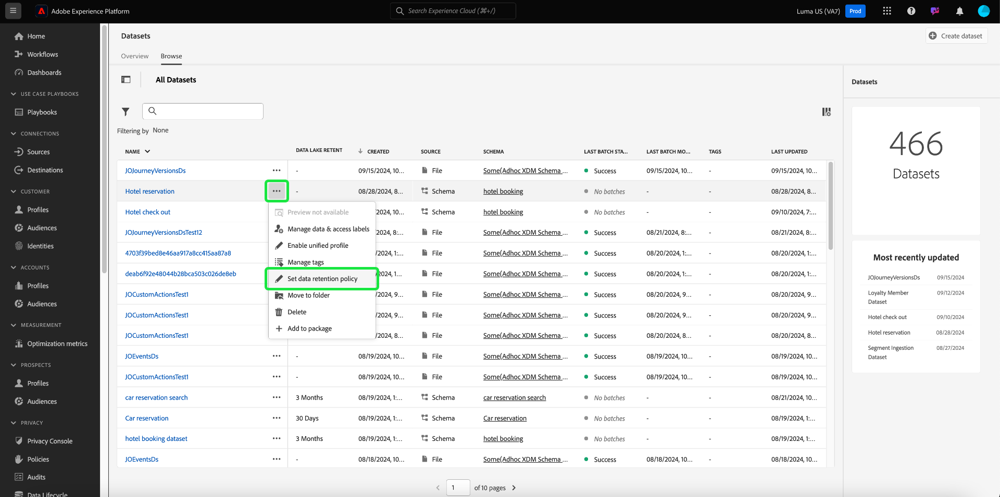

[!UICONTROL Set dataset retention] ダイアログが表示されます。 このダイアログには、サンドボックスレベルのライセンス使用率の指標、データセットレベルの詳細、現在のデータ保持設定が表示されます。 これらの指標は、使用状況と使用権限を比較し、データセット固有の保存と保持の設定を評価するのに役立ちます。 指標には、データセット名、タイプ、プロファイルのイネーブルメントステータス、データレイクおよびプロファイルストアの使用状況が含まれます。

>[!NOTE]
>
>サンドボックスレベルのライセンスされたデータレイクのストレージ指標はまだ開発中のため、表示されない可能性があります。 ライセンス使用率の指標の詳細については、ライセンス使用率ダッシュボードを参照してください。 これらの指標について詳しくは、ドキュメントを参照してください。
<!-- replace this screenshot with a dataset that enabled unified profile so user can see the Profile TTL settings -->
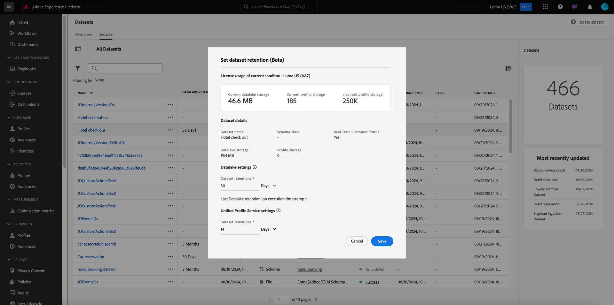

データ保持設定ダイアログで、必要な保持期間を設定します。 数値を入力し、ドロップダウンメニューから時間単位（日、月、年）を選択します。 データレイクとプロファイルサービスに対して、個別の保持設定を設定できます。

>[!NOTE]
> 
>データレイクの最小保持期間は30日です。 プロファイルサービスの最小保持期間は1日です。
>
>さらに、プロファイルサービスの保持期間は30日ごとに1回のみ更新できます。

透明性と監視をサポートするために、**last**&#x200B;および&#x200B;**next**&#x200B;のデータ保持ジョブ実行にタイムスタンプが提供されます。 タイムスタンプは、最後のデータクリーンアップがいつ発生し、次のデータクリーンアップがいつスケジュールされるかを理解するのに役立ちます。

#### ストレージの影響インサイト {#storage-impact-insights}

異なる保持ポリシーのストレージへの影響を視覚的に予測するには、**[!UICONTROL View Experience Event Data distribution]**&#x200B;を選択します。

このグラフは、現在選択されているデータセットに対する様々な保持期間におけるエクスペリエンスイベントの分布を示しています。 各バーにカーソルを合わせると、選択した保持期間が適用された場合に削除されるレコードの正確な数が表示されます。

ビジュアル予測を活用して、さまざまな顧客維持期間の影響を評価し、情報にもとづいたビジネス上の意思決定を下すことができます。 例えば、30日間の保持期間を選択し、グラフにデータの60%が削除されることが示されている場合、分析用により多くのデータを保存するために保持を拡張することができます。

>[!NOTE]
>
>エクスペリエンスイベント分布チャートは、選択したデータセットに固有であり、そのデータのみを反映します。 データレイクに保存されたデータにのみ適用されます。

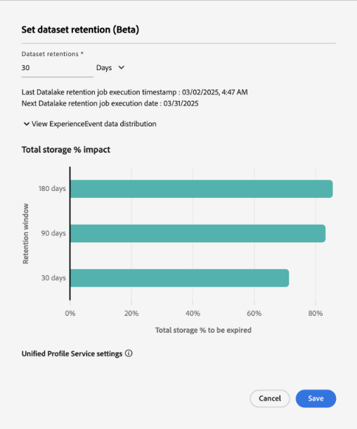

設定に問題がなければ、**[!UICONTROL Save]**&#x200B;を選択して設定を確認します。

>[!IMPORTANT]
>
>データ保持ルールが適用されると、有効期限で定義された日数を超えるデータは完全に削除され、復元できません。

保持設定を設定したら、監視UIを使用して、変更がシステムによって実行されたことを確認します。 監視UIは、すべてのデータセットのデータ保持アクティビティを一元的に表示します。 そこから、ジョブの実行を追跡し、削除されたデータの量を確認し、保持ポリシーが期待どおりに機能していることを確認できます。

様々なサービスをまたいで保持ポリシーがどのように適用されるかについて詳しくは、[ プロファイルでのエクスペリエンスイベントデータセットの保持](../../profile/event-expirations.md)および[ データレイクでのエクスペリエンスイベントデータセットの保持](./experience-event-dataset-retention-ttl-guide.md)に関する専用ガイドを参照してください。 この可視性は、ガバナンス、コンプライアンス、効率的なデータライフサイクル管理をサポートします。

監視ダッシュボードを使用してExperience Platform UIでソースデータフローをトラッキングする方法については、UI](../../dataflows/ui/monitor-sources.md) ドキュメントの「[ ソースのデータフローを監視」を参照してください。

<!-- Improve the link above. I cannot link to a 100% appropriate document yet. -->

データセットの有効期限を定義するルールと、データ保持ポリシーを設定するためのベストプラクティスについて詳しくは、[よくある質問ページ ](../catalog-faq.md)を参照してください。

#### 保持期間とストレージ指標の可視性の向上 {#retention-and-storage-metrics}

4つの新しい列（**[!UICONTROL Data Lake Storage]**、**[!UICONTROL Data Lake Retention]**、**[!UICONTROL Profile Storage]**、**[!UICONTROL Profile Retention]**）は、データ管理をより可視化します。 これらの指標は、データレイクとプロファイルサービスの両方で、データがどれくらいのストレージを消費し、その保持期間を示しています。

これにより、可視性を向上させ、十分な情報にもとづいた意思決定を行い、ストレージコストをより効果的に管理できるようになります。 ストレージサイズ別にデータセットを並べ替えて、現在のサンドボックス内で最大のデータセットを特定します。 これらのインサイトは、データ管理のベストプラクティスをサポートし、ライセンス取得済みの使用権限のコンプライアンスを確保するのに役立ちます。

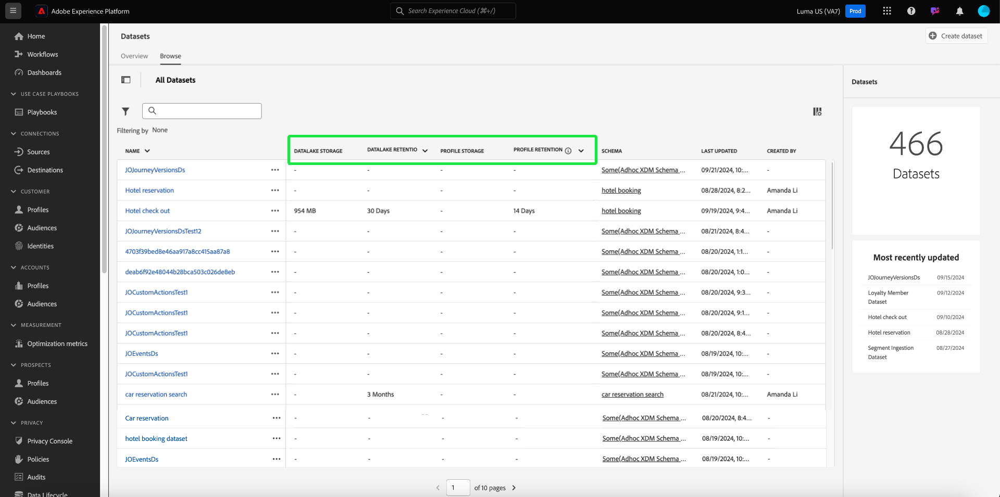

次の表に、新しいリテンションおよびストレージ指標の概要を示します。 各列の目的と、データの保持と保存の管理をどのようにサポートしているかを詳しく説明します。

| 列タイトル | 説明 |
|---|---|
| [!UICONTROL Data Lake Retention] | データレイク内の各データセットの現在の保持期間。 この値は設定可能で、データが削除されるまでの保持時間を決定します。 |
| [!UICONTROL Data Lake Storage] | データレイク内の各データセットの現在のストレージ使用状況。 この指標は、ストレージ制限の管理と使用状況の最適化に使用します。 |
| [!UICONTROL Profile Storage] | プロファイルサービス内の各データセットの現在のストレージ使用状況。 ストレージ消費を監視し、データ管理に関する意思決定をサポートします。 |
| [!UICONTROL Profile Retention] | プロファイルデータセットの現在の保持期間。 この値を更新して、プロファイルデータを保持する期間を制御できます。 |

{style="table-layout:auto"}

ストレージと保持の指標から得られるインサイトを活用するには、[ データ管理ライセンス使用権限のベストプラクティスガイド ](../../landing/license-usage-and-guardrails/data-management-best-practices.md)を参照してください。 取り込んで保持するデータを管理し、フィルターと有効期限ルールを適用し、ライセンスされた使用制限の範囲内でデータの増加を制御するために使用します。

### フォルダーに移動 {#move-to-folders}

フォルダー内にデータセットを配置することで、データセット管理を向上させることができます。 データセットをフォルダーに移動するには、省略記号（。..）を選択します。 管理するデータセット名の横に&#x200B;**[!UICONTROL Move to folder]**&#x200B;が表示されます。

![省略記号と[!UICONTROL Move to folder]がハイライト表示された[!UICONTROL Datasets] ダッシュボード。](../images/datasets/user-guide/move-to-folder.png)

[!UICONTROL Move] データセットからフォルダーへの変換ダイアログが表示されます。 オーディエンスを移動するフォルダーを選択し、**[!UICONTROL Move]**&#x200B;を選択します。 データセットの移動が成功したことを通知するポップアップ通知。

![[!UICONTROL Move]がハイライト表示された[!UICONTROL Move] データセット ダイアログ。](../images/datasets/user-guide/move-dialog.png)

>[!TIP]
>
>データセットを移動ダイアログから直接フォルダーを作成することもできます。 フォルダーを作成するには、フォルダーを作成アイコン（）を選択します。 ダイアログの右上に表示されます。
>
>![ フォルダーを作成アイコンがハイライト表示された[!UICONTROL Move] データセット ダイアログ。](/help/catalog/images/datasets/user-guide/create-folder.png)

データセットがフォルダーに格納されたら、特定のフォルダーに属するデータセットのみを表示するように選択できます。 フォルダー構造を開くには、「フォルダーを表示」アイコン（）を選択します。 次に、選択したフォルダーを選択して、関連するすべてのデータセットを表示します。

![ データセット フォルダー構造が表示され、フォルダーを表示アイコンが表示され、選択したフォルダーがハイライト表示された[!UICONTROL Datasets] ダッシュボード。](../images/datasets/user-guide/folder-structure.png)

### データセットの削除 {#delete}

データセットは、[!UICONTROL Browse] タブのデータセットのインラインアクションまたは[!UICONTROL Dataset activity] ビューの右上から削除できます。 [!UICONTROL Browse] ビューから、省略記号（。..）を選択します。 削除するデータセット名の横に。 オプションのメニューリストが表示されます。 次に、ドロップダウンメニューから「**[!UICONTROL Delete]**」を選択します。

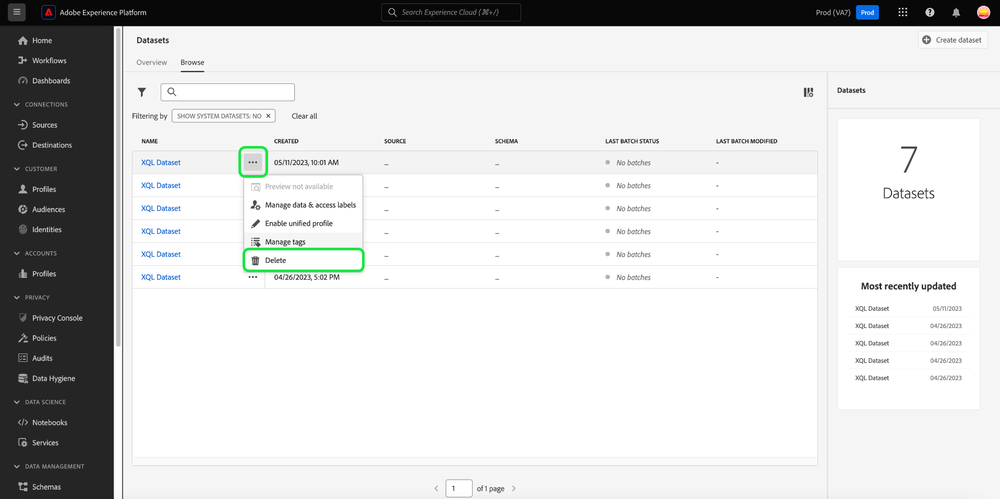

確認ダイアログが表示されます。 確認するには、**[!UICONTROL Delete]**&#x200B;を選択してください。

または、**[!UICONTROL Dataset activity]**&#x200B;画面から&#x200B;**[!UICONTROL Delete dataset]**&#x200B;を選択します。

>[!NOTE]
>
>Adobe アプリケーションおよびサービス（Adobe Analytics、Adobe Audience Manager、または[!DNL Offer Decisioning]など）によって作成および使用されたデータセットは削除できません。

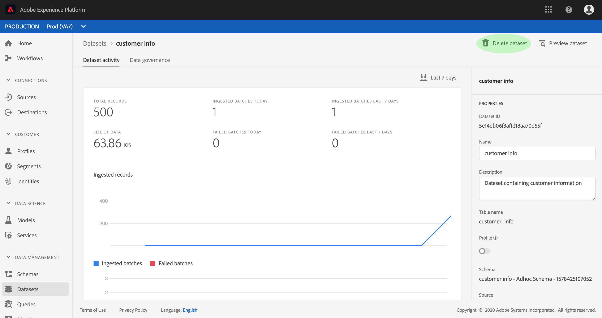

確認ボックスが表示されます。 データセットの削除を確認するには、**[!UICONTROL Delete]**&#x200B;を選択します。

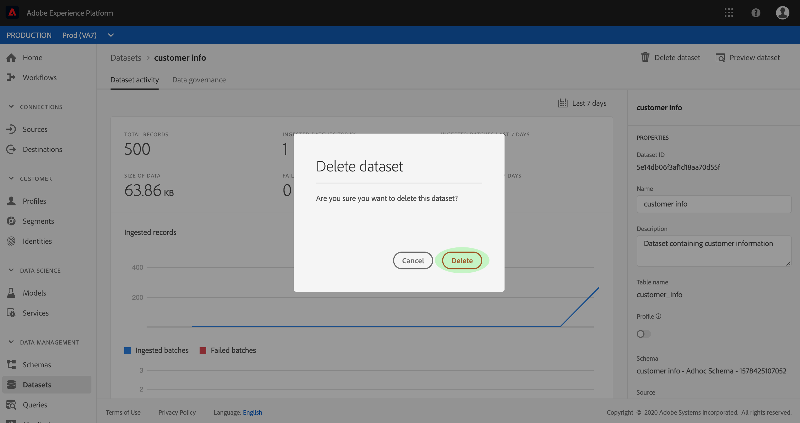

### プロファイル対応データセットの削除

プロファイルでデータセットが有効になっている場合、UIを介してそのデータセットを削除すると、データレイク、ID サービス、およびプロファイルストアのそのデータセットに関連付けられたすべてのプロファイルデータからデータセットが削除されます。

Real-Time Customer Profile APIを使用すると、データセットに関連付けられたプロファイルデータを[!DNL Profile] ストアから削除できます（データレイクにデータを残します）。 詳しくは、 [プロファイルシステムジョブ API エンドポイントのガイド](../../profile/api/profile-system-jobs.md) を参照してください。

## データセットの検索とフィルタリング {#search-and-filter}

使用可能なデータセットのリストを検索またはフィルタリングするには、フィルターアイコン（）を選択します。 ワークスペースの左上に表示されます。 左側のパネルに一連のフィルターオプションが表示されます。 使用可能なデータセットをフィルタリングする方法はいくつかあります。 [[!UICONTROL Show System Datasets]](#show-system-datasets)、[[!UICONTROL Included in profile]](#filter-profile-enabled-datasets)、[[!UICONTROL Tags]](#filter-by-tag)、[[!UICONTROL Creation date]](#filter-by-creation-date)、[[!UICONTROL Modified date]、[!UICONTROL Created by]](#filter-by-creation-date)および[[!UICONTROL Schema]](#filter-by-schema)が含まれます。

適用されたフィルターのリストが、フィルターされた結果の上に表示されます。

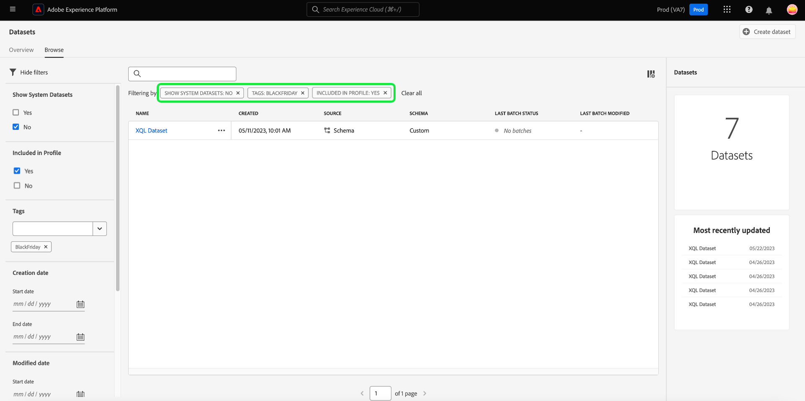

### システムデータセットを表示 {#show-system-datasets}

デフォルトでは、データを取り込んだデータセットのみが表示されます。 システムで生成されたデータセットを表示する場合は、[!UICONTROL Show system datasets] セクションの&#x200B;**[!UICONTROL Yes]** チェックボックスを選択します。 システム生成データセットは、他のコンポーネントを処理するためにのみ使用されます。 例えば、システム生成のプロファイル書き出しデータセットは、プロファイルダッシュボードの処理に使用されます。

![ 「[!UICONTROL Show system datasets]」セクションがハイライト表示されたデータセットワークスペースのフィルターオプション。](../images/datasets/user-guide/show-system-datasets.png)

### プロファイルが有効なデータセットをフィルター {#filter-profile-enabled-datasets}

プロファイルデータに対して有効になっているデータセットは、データの取り込み後に顧客プロファイルに入力するために使用されます。 詳しくは、「[ プロファイルのデータセットの有効化](#enable-profile)」の節を参照してください。

プロファイルに対してデータセットが有効になっているかどうかに基づいてデータセットをフィルタリングするには、フィルターオプションから「[!UICONTROL Yes]」チェックボックスを選択します。

![ 「[!UICONTROL Included in Profile]」セクションがハイライト表示されたデータセットワークスペースのフィルターオプション。](../images/datasets/user-guide/included-in-profile.png)

### タグによるデータセットのフィルタリング {#filter-by-tag}

[!UICONTROL Tags]入力にカスタムタグ名を入力し、使用可能なオプションのリストからタグを選択して、そのタグに対応するデータセットを検索およびフィルタリングします。

![[!UICONTROL Tags]入力とフィルターのアイコンがハイライト表示されたデータセット ワークスペースのフィルターオプション。](../images/datasets/user-guide/filter-tags.png)

### 作成日でデータセットをフィルタリング {#filter-by-creation-date}

データセットは、作成日ごとにカスタム期間でフィルタリングできます。 これにより、過去のデータを除外したり、特定の時系列データインサイトやレポートを生成したりできます。 各フィールドのカレンダーアイコンを選択して、[!UICONTROL Start date]と[!UICONTROL End date]を選択します。 その後、その条件に準拠するデータセットのみが「参照」タブに表示されます。

### 変更日でデータセットをフィルタリング {#filter-by-modified-date}

作成日のフィルターと同様に、データセットを最後に変更された日付に基づいてフィルターできます。 [!UICONTROL Modified date] セクションで、各フィールドのカレンダーアイコンを選択して、[!UICONTROL Start date]と[!UICONTROL End date]を選択します。 その後、その期間中に変更されたデータセットのみが「参照」タブに表示されます。

### スキーマでフィルター {#filter-by-schema}

構造を定義するスキーマに基づいて、データセットをフィルタリングできます。 ドロップダウンアイコンを選択するか、テキストフィールドにスキーマ名を入力します。 一致する可能性のある項目のリストが表示されます。 リストから適切なスキーマを選択します。

## 一括アクション {#bulk-actions}

一括アクションを使用すると、運用効率が向上し、多数のデータセットに対して複数のアクションを同時に実行できます。 [ フォルダーに移動](#move-to-folders)、[ タグの編集](#manage-tags)、[ データセットの削除](#delete)などの一括アクションを使用して、時間を節約し、整理されたデータ構造を維持できます。

一度に複数のデータセットに対してアクションを実行するには、各行にチェックボックスを付けた個々のデータセットを選択するか、列ヘッダーのチェックボックスを付けたページ全体を選択します。 選択すると、一括アクションバーが表示されます。

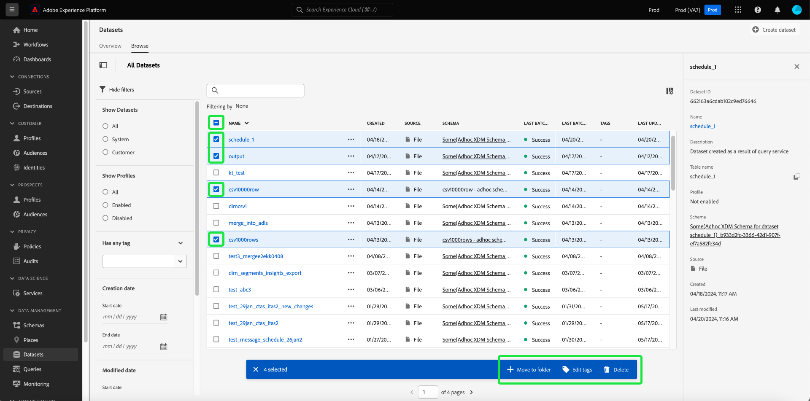

データセットにバルクアクションを適用する場合、次の条件が適用されます。

* UIの様々なページからデータセットを選択できます。
* フィルターを選択すると、選択したデータセットがリセットされます。

## 作成日別のデータセットの並べ替え {#sort}

[!UICONTROL Browse] タブのデータセットは、昇順または降順で並べ替えることができます。 [!UICONTROL Created]または[!UICONTROL Last updated]列の見出しを選択して、昇順と降順を切り替えます。 選択すると、列ヘッダーの横に上向き矢印または下向き矢印が表示されます。

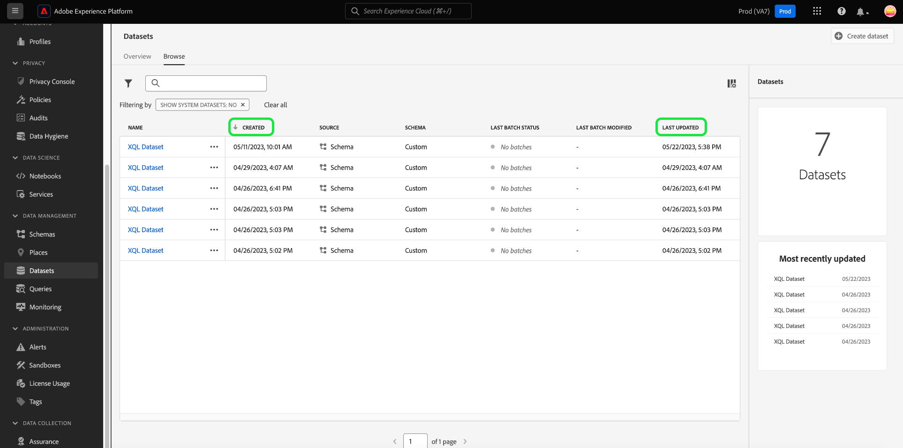

## データセットの作成 {#create}

新しいデータセットを作成するには、まず&#x200B;**[!UICONTROL Datasets]** ダッシュボードで&#x200B;**[!UICONTROL Create dataset]**&#x200B;を選択します。

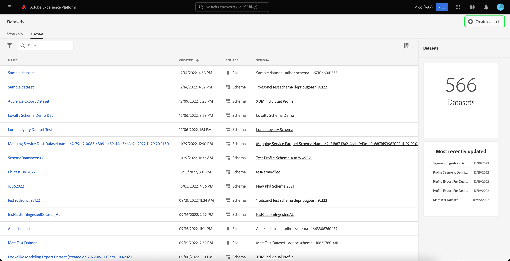

次の画面に、新しいデータセットを作成するための次の 2 つのオプションが表示されます。

* [スキーマからデータセットを作成](#schema)
* [CSV ファイルからデータセットを作成](#csv)

### 既存スキーマからのデータセットの作成 {#schema}

**[!UICONTROL Create dataset]**&#x200B;画面で、**[!UICONTROL Create dataset from schema]**&#x200B;を選択して、新しい空のデータセットを作成します。

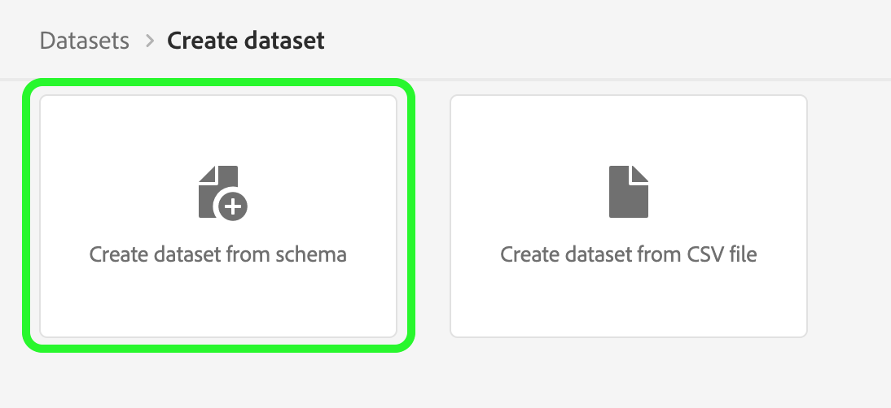

**[!UICONTROL Select schema]** ステップが表示されます。 スキーマリストを参照し、**[!UICONTROL Next]**&#x200B;を選択する前に、データセットが準拠するスキーマを選択します。

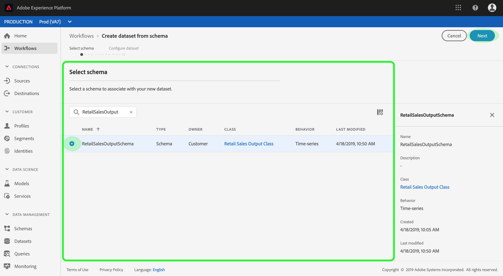

**[!UICONTROL Configure dataset]** ステップが表示されます。 データセットに名前とオプションの説明を入力し、**[!UICONTROL Finish]**&#x200B;を選択してデータセットを作成します。

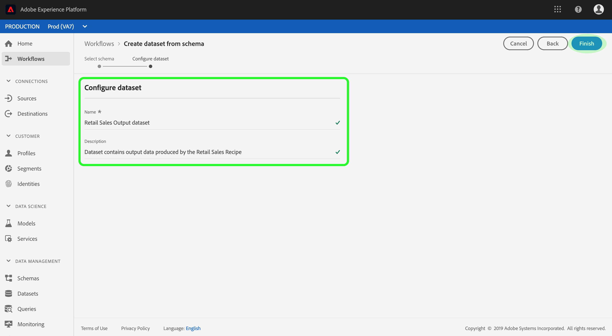

スキーマフィルターを使用すると、UIで使用可能なデータセットのリストからデータセットをフィルタリングできます。 詳しくは、[ スキーマでデータセットをフィルタリングする方法](#filter-by-schema)の節を参照してください。

### CSV ファイルを使用したデータセットの作成 {#csv}

CSV ファイルを使用してデータセットを作成する場合、アドホックスキーマが作成され、指定された CSV ファイルと一致する構造のデータセットが提供されます。 **[!UICONTROL Create dataset]**&#x200B;画面で、**[!UICONTROL Create dataset from CSV file]**&#x200B;を選択します。

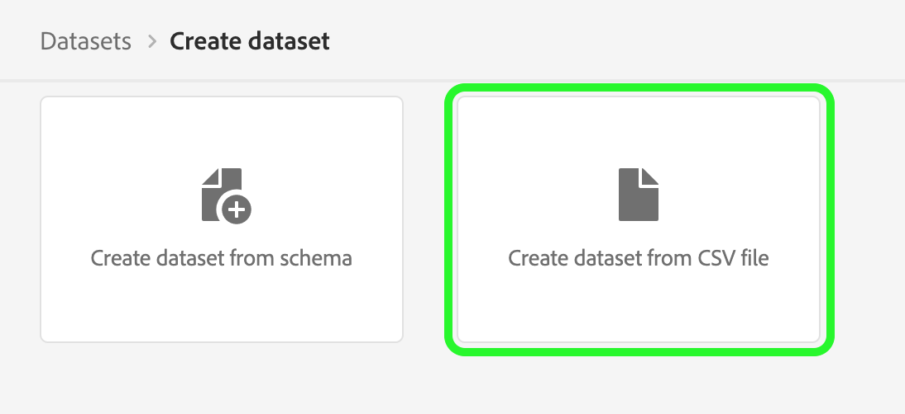

**[!UICONTROL Configure]** ステップが表示されます。 データセットに名前とオプションの説明を入力し、**[!UICONTROL Next]**&#x200B;を選択します。

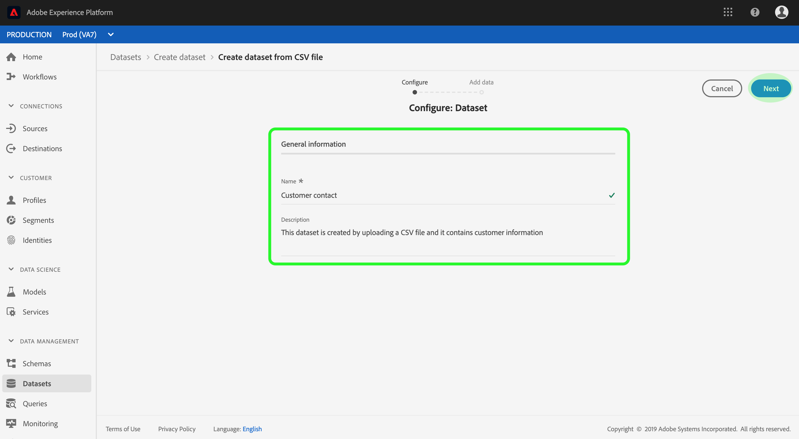

**[!UICONTROL Add data]** ステップが表示されます。 CSV ファイルをドラッグ&amp;ドロップして画面の中央にアップロードするか、**[!UICONTROL Browse]**&#x200B;を選択してファイルディレクトリを検索します。 ファイルのサイズは 10 ギガバイトまでです。 CSV ファイルがアップロードされたら、**[!UICONTROL Save]**&#x200B;を選択してデータセットを作成します。

>[!NOTE]
>
>CSV列名は英数字で始まる必要があり、文字、数字、アンダースコアのみを含めることができます。

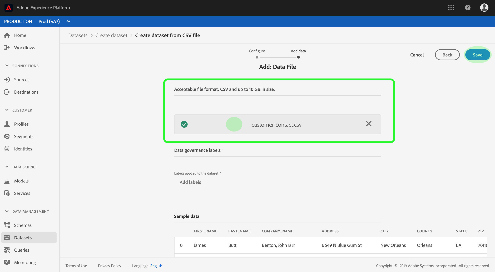

## データ取得の監視

[!DNL Experience Platform] UIで、左側のナビゲーションで「**[!UICONTROL Monitoring]**」を選択します。 **[!UICONTROL Monitoring]** ダッシュボードでは、バッチまたはストリーミング取得からのインバウンドデータのステータスを表示できます。 個々のバッチのステータスを表示するには、**[!UICONTROL Batch end-to-end]**&#x200B;または&#x200B;**[!UICONTROL Streaming end-to-end]**&#x200B;のいずれかを選択します。 ダッシュボードには、成功、失敗、または進行中の取り込みなど、すべてのバッチまたはストリーミング取り込み実行が一覧表示されます。 各リストには、バッチ ID、ターゲットデータセットの名前、取得したレコード数など、バッチの詳細が表示されます。 ターゲットデータセットが[!DNL Profile]に対して有効になっている場合、取り込まれたIDとプロファイルレコードの数も表示されます。

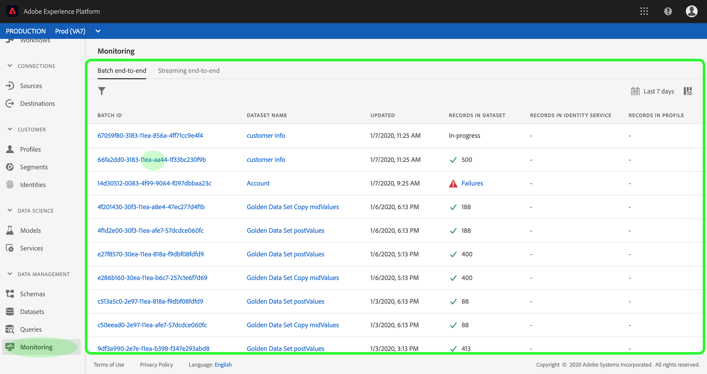

個別の&#x200B;**[!UICONTROL Batch ID]**&#x200B;で選択して&#x200B;**[!UICONTROL Batch overview]** ダッシュボードにアクセスし、バッチの取り込みに失敗した場合のエラーログなど、バッチの詳細を確認できます。

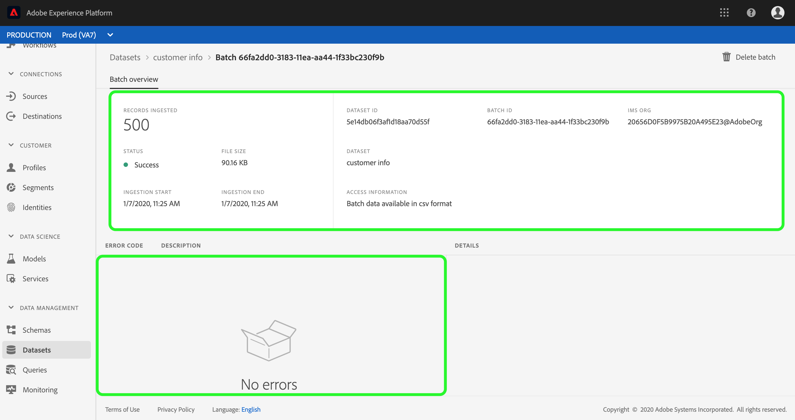

バッチを削除する場合は、ダッシュボードの右上付近にある「**[!UICONTROL Delete batch]**」を選択します。 バッチを削除すると、バッチが最初に取り込まれたデータセットからそのレコードも削除されます。

>[!NOTE]
>
>取り込んだデータがプロファイルに対して有効になっていて処理されている場合、バッチを削除しても、そのデータはプロファイルストアから削除されません。

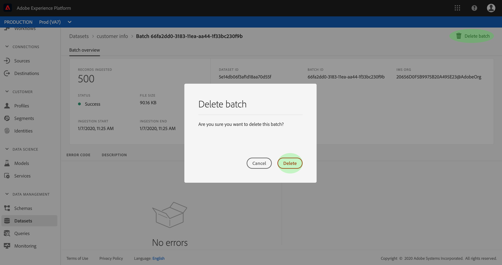

## 次の手順

このユーザーガイドでは、[!DNL Experience Platform] ユーザーインターフェイスでデータセットを操作する際に一般的なアクションを実行する方法について説明しました。 データセットを含む一般的な[!DNL Experience Platform] ワークフローを実行する手順については、次のチュートリアルを参照してください。

* [API を使用したデータセットの作成](create.md)
* [Data Access APIを使用したデータセットのクエリ](../../data-access/home.md)
* [APIを使用したリアルタイム顧客プロファイルおよびID サービスのデータセットの設定](../../profile/tutorials/dataset-configuration.md)

