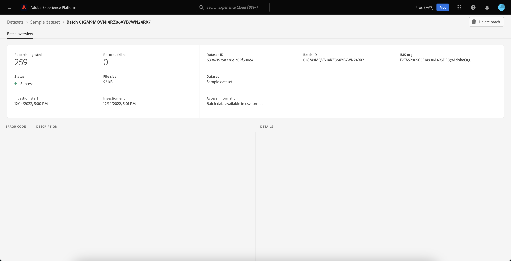

# データセット UI ガイド

このユーザガイドでは、Adobe Experience Platform ユーザーインターフェイス内でデータセットを操作する際に、一般的なアクションを実行する手順を説明します。

## はじめに

このユーザガイドでは、Adobe Experience Platform の次のコンポーネントに関する十分な知識が必要です。 

* [データセット](overview.md):のデータ永続化のためのストレージと管理の構成 [!DNL Experience Platform].
* [[!DNL Experience Data Model (XDM) System]](../../xdm/home.md)：[!DNL Experience Platform] がカスタマーエクスペリエンスのデータの整理に使用する、標準化されたフレームワーク。
   * [スキーマ構成の基本](../../xdm/schema/composition.md)：スキーマ構成の主要な原則やベストプラクティスなど、XDM スキーマの基本的な構成要素について説明します。
   * [スキーマエディター](../../xdm/tutorials/create-schema-ui.md):を使用して独自のカスタム XDM スキーマを構築する方法を説明します。 [!DNL Schema Editor] 内 [!DNL Platform] ユーザーインターフェイス。
* [[!DNL Real-time Customer Profile]](../../profile/home.md)：複数のソースからの集計データに基づいて、統合されたリアルタイムの顧客プロファイルを提供します。
* [[!DNL Adobe Experience Platform Data Governance]](../../data-governance/home.md):お客様のデータの使用に関する規制、制限、ポリシーへの準拠を確保します。

## データセットの表示 {#view-datasets}

>[!CONTEXTUALHELP]
>id="platform_datasets_negative_numbers"
>title="データセットアクティビティの負の数"
>abstract="取り込まれたレコードの負の数は、ユーザーが選択した期間で特定のバッチを削除したことを意味します。"
>text="Learn more in documentation"

内 [!DNL Experience Platform] UI、「 」を選択します。 **[!UICONTROL データセット]** 左側のナビゲーションで **[!UICONTROL データセット]** ダッシュボード。 ダッシュボードリストは、組織で使用可能なすべてのデータセットを管理します。リストに表示された各データセットに関する詳細（名前、データセットが適用されるスキーマ、最新の取得実行のステータスなど）が表示されます。

デフォルトでは、取り込んだデータセットのみが表示されます。システム生成データセットを表示する場合は、 **[!UICONTROL システムデータセットを表示]** 切り替え システム生成データセットは、他のコンポーネントの処理にのみ使用されます。 例えば、システム生成のプロファイル書き出しデータセットを使用して、プロファイルダッシュボードが処理されます。

アクセスするデータセットの名前を選択します **[!UICONTROL データセットアクティビティ]** 画面に、選択したデータセットの詳細が表示されます。 「アクティビティ」タブには、消費されるメッセージの割合を視覚化したグラフと、成功および失敗したバッチのリストが含まれます。

## データセットのプレビュー

次の **[!UICONTROL データセットアクティビティ]** 画面、選択 **[!UICONTROL データセットをプレビュー]** 画面の右上隅付近にあり、最大 100 行のデータをプレビューできます。 データセットが空の場合、プレビューリンクは非アクティブになり、代わりにプレビューは使用できないと表示されます。

プレビューウィンドウの右側に、データセットのスキーマの階層表示が表示されます。

より堅牢な方法でデータにアクセスするには、 [!DNL Experience Platform] は、 [!DNL Query Service] および [!DNL JupyterLab] データを参照および分析する。 詳しくは、次のドキュメントを参照してください。

* [クエリサービスの概要](../../query-service/home.md)
* [JupyterLab ユーザーガイド](../../data-science-workspace/jupyterlab/overview.md)

## データセットの作成 {#create}

新しいデータセットを作成するには、まず、データセットダッシュボードの「**[!UICONTROL データセットを作成]**」を選択します。****

次の画面に、新しいデータセットを作成するための次の 2 つのオプションが表示されます。

* [スキーマからのデータセットの作成](#schema)
* [CSV ファイルからのデータセットの作成](#csv)

### 既存スキーマからのデータセットの作成 {#schema}

内 **[!UICONTROL データセットを作成]** 画面、選択 **[!UICONTROL スキーマからデータセットを作成]** 新しい空のデータセットを作成します。

「**[!UICONTROL スキーマ選択]**」手順が表示されます。選択する前に、スキーマリストを参照し、データセットの準拠先となるスキーマを選択します **[!UICONTROL 次へ]**.

**[!UICONTROL データセットの設定]**&#x200B;手順が表示されます。データセットの名前と説明（オプション）を入力し、「 」を選択します。 **[!UICONTROL 完了]** をクリックして、データセットを作成します。

### CSV ファイルを使用したデータセットの作成 {#csv}

CSV ファイルを使用してデータセットを作成する場合、アドホックスキーマが作成され、指定された CSV ファイルと一致する構造のデータセットが提供されます。内 **[!UICONTROL データセットを作成]** 画面、選択 **[!UICONTROL CSV ファイルからデータセットを作成]**.

**[!UICONTROL 設定]**&#x200B;手順が表示されます。データセットの名前と説明（オプション）を入力し、「 」を選択します。 **[!UICONTROL 次へ]**.

「**[!UICONTROL データ追加]**」手順が表示されます。CSV ファイルを画面の中央にドラッグ&amp;ドロップしてアップロードするか、「 **[!UICONTROL 参照]** ファイルディレクトリを表示します。 ファイルのサイズは 10 ギガバイトまでです。CSV ファイルがアップロードされたら、「 」を選択します。 **[!UICONTROL 保存]** をクリックして、データセットを作成します。

>[!NOTE]
>
> CSV の列名は英数字で始める必要があり、文字、数字、アンダースコアのみを含めることができます。

## リアルタイム顧客プロファイルデータセットの有効化 {#enable-profile}

すべてのデータセットには、取得したデータによって顧客プロファイルを拡張する機能があります。これをおこなうには、データセットが準拠するスキーマが、での使用に対して互換性がある必要があります [!DNL Real-time Customer Profile]. 互換性のあるスキーマは、次の要件を満たします。

* スキーマに、ID プロパティとして指定された属性が 1 つ以上あります。
* スキーマに、プライマリ ID として定義された ID プロパティがあります。

のスキーマを有効にする方法について詳しくは、 [!DNL Profile]を参照し、 [スキーマエディターユーザーガイド](../../xdm/tutorials/create-schema-ui.md).

プロファイルのデータセットを有効にするには、そのデータセットにアクセスします **[!UICONTROL データセットアクティビティ]** 画面を開き、 **[!UICONTROL プロファイル]** 内で切り替える **[!UICONTROL プロパティ]** 列。 有効にすると、データセットに取得されたデータが顧客プロファイルに入力されます。

>[!NOTE]
>
>データセットに既にデータが含まれ、が有効になっている場合 [!DNL Profile]に設定されている場合、既存のデータは [!DNL Profile]. データセットを有効にした後 [!DNL Profile]既存のデータを再取り込みして、顧客プロファイルに貢献させることをお勧めします。

## データセットのデータガバナンスの管理と実施

データ使用状況ラベルを使用すると、データに適用される使用ポリシーに従ってデータセットとフィールドを分類できます。ラベルについて詳しくは、『[データガバナンスの概要](../../data-governance/home.md)』を参照してください。また、データセットにラベルを適用する方法については、『[データ使用レベルユーザガイド](../../data-governance/labels/overview.md)』を参照してください。

## データセットの削除

データセットを削除するには、まず&#x200B;**[!UICONTROL データセットアクティビティ]**&#x200B;画面にアクセスします。次に、 **[!UICONTROL データセットを削除]** をクリックして削除します。

>[!NOTE]
>
>Adobeのアプリケーションおよびサービス (Adobe Analytics、Adobe Audience Manager、 [!DNL Offer Decisioning]) は削除できません。

確認ボックスが表示されます。選択 **[!UICONTROL 削除]** をクリックして、データセットの削除を確定します。

## プロファイル対応データセットの削除

データセットが [!DNL Profile]を削除した場合、UI からそのデータセットを削除すると、Platform 内のデータレイクとプロファイルストアの両方から削除されます。

データセットは、 [!DNL Profile] は、（データレイクにデータを残す）リアルタイム顧客プロファイル API を使用してのみ保存します。 詳しくは、 [プロファイルシステムジョブ API エンドポイントのガイド](../../profile/api/profile-system-jobs.md) を参照してください。

## データ取得の監視

内 [!DNL Experience Platform] UI、「 」を選択します。 **[!UICONTROL 監視]** をクリックします。 「**[!UICONTROL 監視]**」ダッシュボードを使用すると 、バッチ取得またはストリーミング取得から受信データのステータスを表示できます。個々のバッチのステータスを表示するには、次のいずれかを選択します。 **[!UICONTROL エンドツーエンドのバッチ処理]** または **[!UICONTROL エンドツーエンドのストリーミング]**. ダッシュボードには、正常、失敗、または進行中のすべてのバッチ取り込みまたはストリーミング取り込みの実行が一覧表示されます。 各リストには、バッチ ID、ターゲットデータセットの名前、取得したレコード数など、バッチの詳細が表示されます。ターゲットデータセットが [!DNL Profile]に設定すると、取り込まれた id レコードとプロファイルレコードの数も表示されます。

個人を選択できます **[!UICONTROL バッチ ID]** にアクセスするには **[!UICONTROL バッチの概要]** ダッシュボードを開き、バッチの取り込みに失敗した場合にエラーログを含むバッチの詳細を確認します。

バッチを削除する場合は、「 **[!UICONTROL バッチを削除]** ダッシュボードの右上付近にあります。 また、バッチの最初の取得先であるデータセットからもレコードが削除されます。

## 次の手順

このユーザーガイドでは、 [!DNL Experience Platform] ユーザーインターフェイス。 一般的な [!DNL Platform] データセットを含むワークフローについては、次のチュートリアルを参照してください。

* [API を使用したデータセットの作成](create.md)
* [データアクセス API を使用したクエリデータセットデータ](../../data-access/home.md)
* [API を使用したリアルタイム顧客プロファイルおよび ID サービスのデータセットの設定](../../profile/tutorials/dataset-configuration.md)
