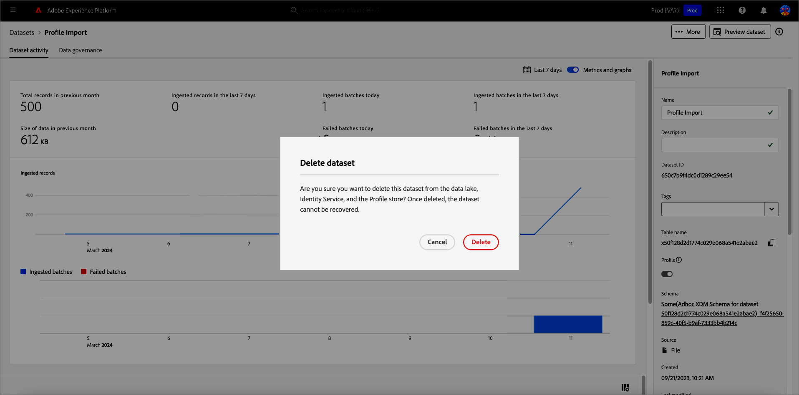

# データセット UI ガイド

このユーザガイドでは、Adobe Experience Platform ユーザーインターフェイス内でデータセットを操作する際に、一般的なアクションを実行する手順を説明します。

## はじめに

このユーザガイドでは、Adobe Experience Platform の次のコンポーネントに関する十分な知識が必要です。 

* [データセット](overview.md)：でのデータ永続性のためのストレージと管理の構成体 [!DNL Experience Platform].
* [[!DNL Experience Data Model (XDM) System]](../../xdm/home.md)：[!DNL Experience Platform] が、カスタマーエクスペリエンスデータを整理する際に使用する、標準化されたフレームワーク。
   * [スキーマ構成の基本](../../xdm/schema/composition.md)：スキーマ構成の主要な原則やベストプラクティスなど、XDM スキーマの基本的な構成要素について説明します。
   * [スキーマエディター](../../xdm/tutorials/create-schema-ui.md)：を使用して独自のカスタム XDM スキーマを作成する方法を説明します [!DNL Schema Editor] 内 [!DNL Platform] ユーザーインターフェイス。
* [[!DNL Real-Time Customer Profile]](../../profile/home.md)：複数のソースから集計したデータに基づいて、統合されたリアルタイム顧客プロファイルを提供します。
* [[!DNL Adobe Experience Platform Data Governance]](../../data-governance/home.md)：顧客データの使用に関する規制、制限、ポリシーへの準拠を確保します。

## データセットの表示 {#view-datasets}

>[!CONTEXTUALHELP]
>id="platform_datasets_negative_numbers"
>title="データセットアクティビティの負の数値"
>abstract="取り込まれたレコードの負の数値は、選択した時間範囲でユーザーが特定のバッチを削除したことを意味します。"
>text="Learn more in documentation"

>[!CONTEXTUALHELP]
>id="platform_datasets_browse_daysRemaining"
>title="データセットの有効期限"
>abstract="この列は、ターゲットデータセットが自動的に期限切れになるまでの残り日数を示します。"

が含まれる [!DNL Experience Platform] UI、選択 **[!UICONTROL データセット]** 左側のナビゲーションでを開きます **[!UICONTROL データセット]** ダッシュボード。 ダッシュボードリストは、組織で使用可能なすべてのデータセットを管理します。リストに表示された各データセットに関する詳細（名前、データセットが適用されるスキーマ、最新の取得実行のステータスなど）が表示されます。

からデータセットの名前を選択 [!UICONTROL 参照] タブをクリックしてアクセス **[!UICONTROL データセットアクティビティ]** 選択したデータセットの詳細を画面に表示します。 「アクティビティ」タブには、消費されるメッセージの割合を視覚化したグラフと、成功および失敗したバッチのリストが含まれます。

## その他のアクション {#more-actions}

次のことができます [!UICONTROL 削除] または [!UICONTROL プロファイルのデータセットを有効にする] から [!UICONTROL データセット] 詳細表示。 使用可能なアクションを表示するには、次を選択します **[!UICONTROL ...詳細]** UI の右上に表示されます。 ドロップダウンメニューが表示されます。

![を使用したデータセットワークスペース [!UICONTROL ...詳細] ドロップダウンメニューがハイライト表示されている。](../images/datasets/user-guide/more-actions.png)

を選択する場合 **[!UICONTROL プロファイルのデータセットを有効にする]**&#x200B;を選択すると、確認ダイアログが表示されます。 を選択 **[!UICONTROL Enable （有効）]** をクリックして選択内容を確定します。

>[!NOTE]
>
>プロファイルのデータセットを有効にするには、データセットが準拠するスキーマがリアルタイム顧客プロファイルでの使用に対応している必要があります。 を参照してください。 [プロファイルのデータセットを有効にする](#enable-profile) を参照してください。

を選択する場合 **[!UICONTROL 削除]**, [!UICONTROL データセットを削除] 確認ダイアログが表示されます。 を選択 **[!UICONTROL 削除]** をクリックして選択内容を確定します。

>[!NOTE]
>
>システムデータセットは削除できません。

次にあるインラインアクションから、リアルタイム顧客プロファイルで使用するデータセットを削除または追加することもできます [!UICONTROL 参照] タブ。 を参照してください。 [インラインアクションセクション](#inline-actions) を参照してください。

## インラインデータセットのアクション {#inline-actions}

データセット UI で、使用可能な各データセットに対してインラインアクションのコレクションが提供されるようになりました。 管理するデータセットの省略記号（...）を選択して、ポップアップメニューに使用可能なオプションを表示します。 利用可能なアクションは次のとおりです。 [[!UICONTROL データセットをプレビュー]](#preview), [[!UICONTROL データとアクセスラベルの管理]](#manage-and-enforce-data-governance), [[!UICONTROL 統合プロファイルを有効にする]](#enable-profile), [[!UICONTROL タグを管理]](#add-tags), [[!UICONTROL フォルダーに移動]](#move-to-folders)、および [[!UICONTROL 削除]](#delete). これらの使用可能なアクションについて詳しくは、それぞれの節を参照してください。

### データセットタグを追加 {#add-tags}

カスタムで作成したタグを追加して、データセットを整理し、検索、フィルタリング、並べ替えの機能を向上させます。 から [!UICONTROL 参照] タブ [!UICONTROL データセット] ワークスペースで、管理するデータセットの省略記号を選択したあと、データセットの **[!UICONTROL タグを管理]** ドロップダウンメニューから。

この [!UICONTROL タグを管理] ダイアログが表示されます。 短い説明を入力してカスタムタグを作成するか、既存のタグから選択してデータセットにラベルを付けます。 「**[!UICONTROL 保存]**」を選択して、設定を確定します。

この [!UICONTROL タグを管理] また、ダイアログでデータセットから既存のタグを削除することもできます。 削除するタグの横にある「x」をクリックして選択するだけです。 **[!UICONTROL 保存]**.

タグをデータセットに追加したら、対応するタグに基づいてデータセットをフィルタリングできます。 方法については、の節を参照してください。 [タグでデータセットをフィルタリングする](#enable-profile) を参照してください。

ビジネス オブジェクトを分類して検出と分類を容易にする方法の詳細については、のガイドを参照してください [メタデータ分類の管理](../../administrative-tags/ui/managing-tags.md). このガイドでは、適切な権限を持つユーザーが、事前定義済みのタグを作成し、タグにカテゴリを割り当て、Platform UI でタグとタグカテゴリに関連するすべての CRUD 操作を実行する方法について詳しく説明します。

## データセットの検索とフィルタリング {#search-and-filter}

使用可能なデータセットのリストを検索またはフィルタリングするには、フィルターアイコン（）を選択します。 左側のパネルに一連のフィルターオプションが表示されます。 使用可能なデータセットをフィルタリングするには、いくつかの方法があります。 これには以下が含まれます。 [[!UICONTROL システムデータセットを表示]](#show-system-datasets), [[!UICONTROL プロファイルに含まれる]](#filter-profile-enabled-datasets), [[!UICONTROL タグ]](#filter-by-tag), [[!UICONTROL 作成日]](#filter-by-creation-date), [[!UICONTROL 変更日], [!UICONTROL 作成者]](#filter-by-creation-date)、および [[!UICONTROL スキーマ]](#filter-by-schema).

適用されたフィルターのリストは、フィルタリングされた結果の上に表示されます。

### システムデータセットを表示 {#show-system-datasets}

デフォルトでは、データを取り込んだデータセットのみが表示されます。 システム生成データセットを表示する場合は、 **[!UICONTROL はい]** のチェックボックス [!UICONTROL システムデータセットを表示] セクション。 システム生成データセットは、他のコンポーネントの処理にのみ使用されます。 例えば、システム生成プロファイル書き出しデータセットを使用して、プロファイルダッシュボードを処理します。

![を使用したデータセットワークスペースのフィルターオプション [!UICONTROL システムデータセットを表示] ハイライト表示されたセクション。](../images/datasets/user-guide/show-system-datasets.png)

### プロファイル対応データセットのフィルタリング {#filter-profile-enabled-datasets}

プロファイルデータが有効になっているデータセットは、データの取り込み後に顧客プロファイルの入力に使用されます。 の節を参照してください。 [プロファイルへのデータセットの有効化](#enable-profile) を参照してください。

プロファイルに対して有効になっているかどうかに基づいてデータセットをフィルタリングするには、 [!UICONTROL はい] フィルターオプションのチェックボックス。

![を使用したデータセットワークスペースのフィルターオプション [!UICONTROL プロファイルに含める] ハイライト表示されたセクション。](../images/datasets/user-guide/included-in-profile.png)

### タグでデータセットをフィルター {#filter-by-tag}

にカスタムタグ名を入力します。 [!UICONTROL タグ] 次に、使用可能なオプションのリストからタグを選択し、そのタグに対応するデータセットを検索およびフィルタリングします。

![を使用したデータセットワークスペースのフィルターオプション [!UICONTROL タグ] 入力およびフィルターアイコンがハイライト表示されている様子](../images/datasets/user-guide/filter-tags.png)

### 作成日でデータセットをフィルタリング {#filter-by-creation-date}

データセットは、カスタム期間の作成日でフィルタリングできます。 これを使用して、履歴データを除外したり、特定の時系列データのインサイトとレポートを生成したりできます。 を選択 [!UICONTROL 開始日] および [!UICONTROL 終了日] 各フィールドのカレンダーアイコンを選択する。 その後、その条件に準拠するデータセットのみが「参照」タブに表示されます。

### 変更日でデータセットをフィルタリング {#filter-by-modified-date}

作成日のフィルターと同様に、最終変更日に基づいてデータセットをフィルタリングできます。 が含まれる [!UICONTROL 変更日] セクションで、 [!UICONTROL 開始日] および [!UICONTROL 終了日] 各フィールドのカレンダーアイコンを選択する。 その後は、その期間中に変更されたデータセットのみが「参照」タブに表示されます。

### スキーマでフィルター {#filter-by-schema}

構造を定義するスキーマに基づいてデータセットをフィルタリングできます。 ドロップダウンアイコンを選択するか、テキストフィールドにスキーマ名を入力します。 一致する可能性のある項目のリストが表示されます。 リストから適切なスキーマを選択します。

## 作成日でデータセットを並べ替え {#sort}

のデータセット [!UICONTROL 参照] タブは、日付の昇順または降順で並べ替えることができます。 「」を選択します [!UICONTROL 作成日時] または [!UICONTROL 最終更新日] 列見出しを昇順と降順に切り替えます。 選択すると、列ヘッダーの横に上向き矢印または下向き矢印が表示されて、このことが列に示されます。

## データセットのプレビュー {#preview}

の両方のインラインオプションから、データセットサンプルデータをプレビューできます [!UICONTROL 参照] タブと [!UICONTROL データセットアクティビティ] 表示。 から [!UICONTROL 参照] タブで、プレビューするデータセット名の横にある省略記号（...）を選択します。 メニューリストが表示されます。 次に、を選択します **[!UICONTROL データセットをプレビュー]** 使用可能なオプションのリストから。 データセットが空の場合、プレビューリンクは非アクティブになり、代わりに、プレビューが使用できないことを示します。

これにより、プレビューウィンドウが開き、データセットのスキーマの階層ビューが右側に表示されます。

または、から **[!UICONTROL データセットアクティビティ]** 画面、選択 **[!UICONTROL データセットをプレビュー]** 画面の右上隅付近で、最大 100 行のデータをプレビューできます。

データにアクセスするより堅牢な方法については、 [!DNL Experience Platform] 次のようなダウンストリームサービスを提供 [!DNL Query Service] および [!DNL JupyterLab] データの調査と分析 詳しくは、次のドキュメントを参照してください。

* [クエリサービスの概要](../../query-service/home.md)
* [JupyterLab ユーザーガイド](../../data-science-workspace/jupyterlab/overview.md)

## データセットの作成 {#create}

新しいデータセットを作成するには、まず、を選択します。 **[!UICONTROL データセットを作成]** が含まれる **[!UICONTROL データセット]** ダッシュボード。

次の画面に、新しいデータセットを作成するための次の 2 つのオプションが表示されます。

* [スキーマからのデータセットの作成](#schema)
* [CSV ファイルからのデータセットの作成](#csv)

### 既存スキーマからのデータセットの作成 {#schema}

が含まれる **[!UICONTROL データセットを作成]** 画面、選択 **[!UICONTROL スキーマからのデータセットの作成]** 新しい空のデータセットを作成します。

「**[!UICONTROL スキーマ選択]**」手順が表示されます。スキーマリストを参照し、データセットが準拠するスキーマを選択してから、を選択します **[!UICONTROL 次]**.

**[!UICONTROL データセットの設定]**&#x200B;手順が表示されます。名前とオプションの説明をデータセットに入力し、次に選択します **[!UICONTROL 終了]** データセットを作成します。

データセットは、スキーマフィルターを使用して、UI で使用可能なデータセットのリストからフィルタリングできます。 方法については、の節を参照してください。 [スキーマ別にデータセットをフィルター](#filter-by-schema) を参照してください。

### CSV ファイルを使用したデータセットの作成 {#csv}

CSV ファイルを使用してデータセットを作成する場合、アドホックスキーマが作成され、指定された CSV ファイルと一致する構造のデータセットが提供されます。が含まれる **[!UICONTROL データセットを作成]** 画面、選択 **[!UICONTROL CSV ファイルからのデータセットの作成]**.

**[!UICONTROL 設定]**&#x200B;手順が表示されます。名前とオプションの説明をデータセットに入力し、次に選択します **[!UICONTROL 次]**.

**[!UICONTROL データを追加]**&#x200B;手順が表示されます。CSV ファイルを画面の中央にドラッグ&amp;ドロップするか、を選択して、アップロードします **[!UICONTROL 参照]** をクリックしてファイルディレクトリを参照します。 ファイルのサイズは 10 ギガバイトまでです。CSV ファイルをアップロードしたら、次のオプションを選択します。 **[!UICONTROL 保存]** データセットを作成します。

>[!NOTE]
>
>CSV 列名は、英数字で始まる必要があり、文字、数字、アンダースコアのみを含めることができます。

## リアルタイム顧客プロファイルのデータセットを有効にする {#enable-profile}

すべてのデータセットには、取得したデータによって顧客プロファイルを拡張する機能があります。それには、データセットが準拠するスキーマがでの使用に対応している必要があります [!DNL Real-Time Customer Profile]. 互換性のあるスキーマは、次の要件を満たします。

* スキーマに、ID プロパティとして指定された属性が 1 つ以上あります。
* スキーマに、プライマリ ID として定義された ID プロパティがあります。

スキーマの有効化に関する詳細情報 [!DNL Profile]を参照してください。 [スキーマエディターユーザーガイド](../../xdm/tutorials/create-schema-ui.md).

の両方のインラインオプションから、プロファイルのデータセットを有効にできます [!UICONTROL 参照] タブと [!UICONTROL データセットアクティビティ] 表示。 から [!UICONTROL 参照] タブ [!UICONTROL データセット] ワークスペースで、プロファイルに対して有効にするデータセットの省略記号を選択します。 メニューリストが表示されます。 次に、を選択します **[!UICONTROL 統合プロファイルを有効にする]** 使用可能なオプションのリストから。

または、データセットのから **[!UICONTROL データセットアクティビティ]** 画面で、 **[!UICONTROL Profile]** 内での切り替え **[!UICONTROL プロパティ]** 列。 有効にすると、データセットに取得されたデータが顧客プロファイルに入力されます。

>[!NOTE]
>
>データセットに既にデータが含まれており、が有効になっている場合 [!DNL Profile]既存のデータは、によって自動的に使用されるわけではありません [!DNL Profile]. データセットが有効になった後 [!DNL Profile]既存のデータを再度取り込んで、顧客プロファイルに貢献させることをお勧めします。

プロファイルに対して有効になっているデータセットは、この条件でフィルタリングすることもできます。 方法については、の節を参照してください。 [プロファイル対応データセットのフィルタリング](#filter-profile-enabled-datasets) を参照してください。

## データセットのデータガバナンスの管理と実施 {#manage-and-enforce-data-governance}

のインラインオプションを選択すると、データセットのデータガバナンスラベルを管理できます [!UICONTROL 参照] タブ。 管理するデータセット名の横にある省略記号（...）を選択し、続けて「」を選択します **[!UICONTROL データとアクセスラベルの管理]** ドロップダウンメニューから。

スキーマレベルで適用されるデータ使用ラベルを使用すると、データに適用される使用ポリシーに従ってデータセットとフィールドを分類できます。 を参照してください。 [データガバナンスの概要](../../data-governance/home.md) ラベルの詳細については、を参照してください [データ使用ラベルユーザーガイド](../../data-governance/labels/overview.md) データセットに伝播するためにスキーマにラベルを適用する方法について説明します。

## フォルダーに移動 {#move-to-folders}

データセットをフォルダー内に配置すると、データセット管理が向上します。 データセットをフォルダーに移動するには、管理するデータセット名の横にある省略記号（...）を選択し、次に「。..」を選択します **[!UICONTROL フォルダーに移動]** ドロップダウンメニューから。

![この [!UICONTROL データセット] ダッシュボード（省略記号および） [!UICONTROL フォルダーに移動] ハイライト表示](../images/datasets/user-guide/move-to-folder.png)

この [!UICONTROL 移動] データセットをフォルダーへダイアログが表示されます。 オーディエンスの移動先のフォルダーを選択し、次のいずれかを選択します **[!UICONTROL 移動]**. データセットの移動が成功したことを示すポップアップ通知が表示されます。

![この [!UICONTROL 移動] データセットダイアログ（） [!UICONTROL 移動] ハイライト表示](../images/datasets/user-guide/move-dialog.png)

>[!TIP]
>
>また、データセットを移動ダイアログから直接フォルダーを作成することもできます。 フォルダーを作成するには、「フォルダーを作成」アイコン（）を選択します。
>
>![この [!UICONTROL 移動] フォルダー作成アイコンがハイライト表示されたデータセットダイアログ](/help/catalog/images/datasets/user-guide/create-folder.png)

データセットがフォルダーに含まれたら、特定のフォルダーに属するデータセットのみを表示するように選択できます。 フォルダー構造を開くには、「フォルダーを表示」アイコン（）に設定します。 次に、選択したフォルダーを選択して、関連するすべてのデータセットを表示します。

![この [!UICONTROL データセット] データセットフォルダー構造が表示されたダッシュボード、「フォルダーを表示」アイコン、選択したフォルダーがハイライト表示されています。](../images/datasets/user-guide/folder-structure.png)

## データセットの削除 {#delete}

のデータセットインラインアクションのいずれかからデータセットを削除できます [!UICONTROL 参照] tab キーまたは右上 [!UICONTROL データセットアクティビティ] 表示。 から [!UICONTROL 参照] 表示し、削除するデータセット名の横にある省略記号（...）を選択します。 メニューリストが表示されます。 次に、を選択します **[!UICONTROL 削除]** ドロップダウンメニューから。

確認ダイアログが表示されます。 「**[!UICONTROL 削除]**」を選択して確定します。

または、以下を選択します。 **[!UICONTROL データセットを削除]** から **[!UICONTROL データセットアクティビティ]** 画面。

>[!NOTE]
>
>Adobeのアプリケーションおよびサービス（Adobe Analytics、Adobe Audience Managerなど）で作成および使用されるデータセット [!DNL Offer Decisioning]）は削除できません。

確認ボックスが表示されます。を選択 **[!UICONTROL 削除]** データセットの削除を確認します。

## プロファイル対応データセットの削除

データセットがプロファイルに対して有効になっている場合、UI からデータセットを削除すると、データレイク、ID サービス、およびプロファイルストア内のそのデータセットに関連付けられたすべてのプロファイルデータからデータセットが削除されます。

データセットに関連付けられたプロファイルデータは、 [!DNL Profile] リアルタイム顧客プロファイル API を使用して保存（データレイクにデータを残す）。 詳しくは、 [プロファイルシステムジョブ API エンドポイントのガイド](../../profile/api/profile-system-jobs.md) を参照してください。

## データ取得の監視

が含まれる [!DNL Experience Platform] UI、選択 **[!UICONTROL 監視]** 左側のナビゲーションの 「**[!UICONTROL 監視]**」ダッシュボードを使用すると 、バッチ取得またはストリーミング取得から受信データのステータスを表示できます。個々のバッチのステータスを表示するには、次のいずれかを選択します **[!UICONTROL エンドツーエンドのバッチ]** または **[!UICONTROL エンドツーエンドのストリーミング]**. ダッシュボードには、成功、失敗、または進行中のものを含め、すべてのバッチまたはストリーミング取得の実行が一覧表示されます。 各リストには、バッチ ID、ターゲットデータセットの名前、取得したレコード数など、バッチの詳細が表示されます。ターゲットデータセットがに対して有効になっている場合 [!DNL Profile]、取り込まれた ID とプロファイルレコードの数も表示されます。

個人のを選択できます **[!UICONTROL バッチ ID]** にアクセスする **[!UICONTROL バッチの概要]** ダッシュボードでバッチの詳細（バッチの取り込みに失敗した場合のエラーログを含む）を確認できます。

バッチを削除する場合は、 **[!UICONTROL バッチを削除]** ダッシュボードの右上隅付近。 バッチを削除すると、バッチの元の取り込み先のデータセットからレコードも削除されます。

>[!NOTE]
>
>取り込んだデータがプロファイルに対して有効になっており、処理されている場合、バッチを削除しても、そのデータはプロファイルストアから削除されません。

## 次の手順

このユーザーガイドでは、でデータセットを操作する際に一般的なアクションを実行する手順を説明しました [!DNL Experience Platform] ユーザーインターフェイス。 共通のの実行手順については、こちらを参照してください [!DNL Platform] データセットに関するワークフローについては、次のチュートリアルを参照してください。

* [API を使用したデータセットの作成](create.md)
* [Data Access API を使用したデータセットデータのクエリ](../../data-access/home.md)
* [API を使用したリアルタイム顧客プロファイルおよび ID サービスのデータセットの設定](../../profile/tutorials/dataset-configuration.md)
