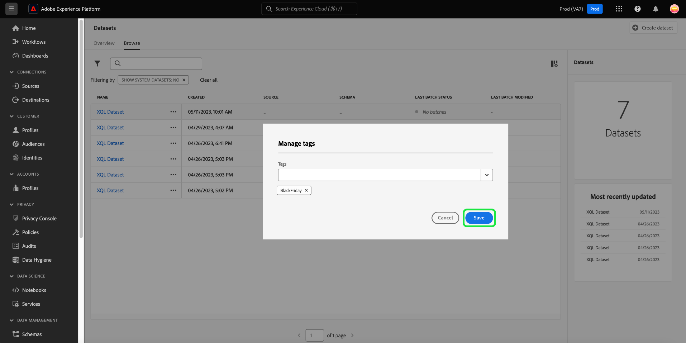

# データセット UI ガイド

このユーザガイドでは、Adobe Experience Platform ユーザーインターフェイス内でデータセットを操作する際に、一般的なアクションを実行する手順を説明します。

## はじめに

このユーザガイドでは、Adobe Experience Platform の次のコンポーネントに関する十分な知識が必要です。 

* [&#x200B; データセット &#x200B;](overview.md):[!DNL Experience Platform] でのデータ永続性を確保するためのストレージと管理の構成体。
* [[!DNL Experience Data Model (XDM) System]](../../xdm/home.md)：[!DNL Experience Platform] が、カスタマーエクスペリエンスデータを整理する際に使用する、標準化されたフレームワーク。
   * [スキーマ構成の基本](../../xdm/schema/composition.md)：スキーマ構成の主要な原則やベストプラクティスなど、XDM スキーマの基本的な構成要素について説明します。
   * [&#x200B; スキーマエディター &#x200B;](../../xdm/tutorials/create-schema-ui.md):[!DNL Schema Editor] ユーザーインターフェイス内の [!DNL Experience Platform] を使用して独自のカスタム XDM スキーマを作成する方法を説明します。
* [[!DNL Real-Time Customer Profile]](../../profile/home.md)：複数のソースから集計したデータに基づいて、統合されたリアルタイム顧客プロファイルを提供します。
* [[!DNL Adobe Experience Platform Data Governance]](../../data-governance/home.md)：顧客データの使用に関する規制、制限、ポリシーへの準拠を確保します。

## データセットの表示 {#view-datasets}

>[!CONTEXTUALHELP]
>id="platform_datasets_negative_numbers"
>title="データセットアクティビティの負の数値"
>abstract="取り込まれたレコードの負の数値は、選択した時間範囲でユーザーが特定のバッチを削除したことを意味します。"
>text="Learn more in documentation"

>[!CONTEXTUALHELP]
>id="platform_datasets_browse_daysRemaining"
>title="データセットの有効期限"
>abstract="この列は、ターゲットデータセットが自動的に期限切れになるまでの残り日数を示します。"

>[!CONTEXTUALHELP]
>id="platform_datasets_browse_datalakeretention"
>title="データレイクの保持"
>abstract="各データセットの現在の保持ポリシーを表示します。この値は、各データセットの保持設定で変更できます。ExperienceEvent データセットの保持期間のみを設定できます。"

>[!CONTEXTUALHELP]
>id="platform_datasets_browse_profileretention"
>title="プロファイルの保持"
>abstract="各データセットの現在の保持ポリシーを表示します。この値は、各データセットの保持設定で変更できます。ExperienceEvent データセットの保持期間のみを設定できます。"

>[!CONTEXTUALHELP]
>id="platform_datasets_datalakesettings_datasetretention"
>title="データセットの保持"
>abstract="データレイクの保持では、様々なサービスでデータが保存される期間と削除されるタイミングに関するルールを設定します。これにより、規制への準拠、ストレージコストの管理、データ品質の維持が保証されます。"

>[!CONTEXTUALHELP]
>id="platform_datasets_orchestratedCampaigns_toggle"
>title="調整されたキャンペーン"
>abstract="この切替スイッチを有効にすると、選択したデータセットをAdobe Journey Optimizer オーケストレートキャンペーンで使用できるようになります。 データセットは 1 つのリレーショナルスキーマを使用する必要があり、スキーマごとにデータセットを 1 つだけ作成できます。"
>additional-url="https://experienceleague.adobe.com/en/docs/journey-optimizer/using/campaigns/orchestrated-campaigns/data-configuration/schemas-datasets/manual-schema#enable" text="オーケストレーションキャンペーンのデータセットを有効にする"

>[!CONTEXTUALHELP]
>id="platform_datasets_enableforlookup_toggle"
>title="参照のために有効にする"
>abstract="このデータセットをルックアップに有効にして、Journey Optimizerでそのデータをパーソナライゼーション、意思決定、ジャーニーオーケストレーションに使用できるようにします。"
>additional-url="https://experienceleague.adobe.com/en/docs/journey-optimizer/using/data-management/lookup-aep-data" text="Journey OptimizerでのAdobe Experience Platform データの使用"

[!DNL Experience Platform] UI で、左側のナビゲーションで **[!UICONTROL Datasets]** を選択して、**[!UICONTROL Datasets]** ダッシュボードを開きます。 ダッシュボードリストは、組織で使用可能なすべてのデータセットを管理します。リストに表示された各データセットに関する詳細（名前、データセットが準拠するスキーマ、最新の取得実行のステータスなど）が表示されます。

「[!UICONTROL Browse]」タブからデータセットの名前を選択して **[!UICONTROL Dataset activity]** 画面にアクセスし、選択したデータセットの詳細を確認します。 「アクティビティ」タブには、消費されるメッセージの割合を視覚化したグラフと、成功および失敗したバッチのリストが含まれます。

## その他のアクション {#more-actions}

[!UICONTROL Delete] の詳細ビューから [!UICONTROL Enable a dataset for Profile] または [!UICONTROL Dataset] 行できます。 使用可能なアクションを表示するには、UI の右上にある「**[!UICONTROL ... More]**」を選択します。 ドロップダウンメニューが表示されます。

![[!UICONTROL ... More] ドロップダウンメニューがハイライト表示されたデータセットワークスペース。](../images/datasets/user-guide/more-actions.png)

「**[!UICONTROL Enable a dataset for Profile]**」を選択すると、確認ダイアログが表示されます。 「**[!UICONTROL Enable]**」を選択して、選択内容を確定します。

>[!NOTE]
>
>プロファイルのデータセットを有効にするには、データセットが準拠するスキーマがリアルタイム顧客プロファイルでの使用に対応している必要があります。 詳しくは、[&#x200B; プロファイルのデータセットを有効にする &#x200B;](#enable-profile) の節を参照してください。

**[!UICONTROL Delete]** を選択すると、[!UICONTROL Delete dataset] の確認ダイアログが表示されます。 「**[!UICONTROL Delete]**」を選択して、選択内容を確定します。

>[!NOTE]
>
>システムデータセットは削除できません。

「[!UICONTROL Browse]」タブにあるインラインアクションから、リアルタイム顧客プロファイルで使用するデータセットを削除または追加することもできます。 詳しくは、[&#x200B; インラインアクションの節 &#x200B;](#inline-actions) を参照してください。

## インラインデータセットのアクション {#inline-actions}

データセット UI で、使用可能な各データセットに対してインラインアクションのコレクションが提供されるようになりました。 管理するデータセットの省略記号（...）を選択して、ポップアップメニューに使用可能なオプションを表示します。 利用可能なアクションは次のとおりです。

* [[!UICONTROL Preview dataset]](#preview)
* [[!UICONTROL Manage data and access labels]](#manage-and-enforce-data-governance)
* [[!UICONTROL Enable unified profile]](#enable-profile)
* [[!UICONTROL Manage tags]](#manage-tags)
* [[!UICONTROL Set data retention policy]](#data-retention-policy)
* [[!UICONTROL Move to folders]](#move-to-folders)
* [[!UICONTROL Delete]](#delete)。

これらの使用可能なアクションについて詳しくは、それぞれの節を参照してください。 多数のデータセットを同時に管理する方法については、[&#x200B; 一括アクション &#x200B;](#bulk-actions) の節を参照してください。

### データセットのプレビュー {#preview}

「[!UICONTROL Browse]」タブのインラインオプションまたは [!UICONTROL Dataset activity] 表示から、任意のデータセットについて最大 100 行のサンプルデータをプレビューできます。

「[!UICONTROL Browse]」タブから、データセット名の横にある省略記号（...）を選択し、「[!UICONTROL Preview dataset]」を選択します。 データセットが空の場合、「プレビュー」オプションは非アクティブになります。 または、**[!UICONTROL Dataset activity]** 画面で、画面の右上隅付近にある **[!UICONTROL Preview dataset]** を選択します。

これにより、プレビューウィンドウが開き、データセットの階層スキーマビューが左側に表示されます。

>[!NOTE]
>
>左側のスキーマ図には、データを含んだフィールドのみが表示されます。 データのないフィールドは、UI を効率化し関連情報に集中するために、自動的に非表示になります。

または、**[!UICONTROL Dataset activity]** の画面で「**[!UICONTROL Preview dataset]**」を選択してプレビューウィンドウを開き、データセットの構造と値のサンプルを確認します。

データセットプレビューウィンドウでは、データセットの構造とデータを簡単に調べて検証できます。

#### データセットプレビューウィンドウ {#dataset-preview-window}

次のアニメーションは、ナビゲーションとデータ探査機能を備えたデータセットのプレビューウィンドウを示しています。

データセットプレビューウィンドウには、次のものが含まれます。

* データセットフィールドの移動とフィルタリングを行うための、左側のオブジェクトブラウザーサイドバー。
* データセットの構造に対するinsightの各列名の横にあるデータタイプインジケーター。
* ウィンドウの上部に SQL クエリが表示され、データセットの生成に使用したクエリが表示されます。
* 効率的なデータレビューのために、最大 100 行の書式設定されたテーブルビュー。

これらの機能は、効率的に移動、スキーマの詳細を理解、サンプルデータを検証するのに役立ちます。

#### 高度なクエリエディターのショートカット {#query-editor-shortcut}

組織が Data Distiller ライセンスを持っている場合は、データセットプレビューウィンドウから直接 [!UICONTROL Advanced Query Editor] にアクセスできます。 このショートカットを使用すると、サンプルデータのプレビューからクエリサービスでのクエリの実行と調整にシームレスに移動できます。

>[!AVAILABILITY]
>
>[!UICONTROL Advanced Query Editor] へのアクセスは、Data Distiller SKU ライセンスを持つ組織に制限されます。 組織が必要なライセンスを持っていない場合、このオプションはデータセットプレビューウィンドウに表示されません。

プレビューウィンドウの右上にある「[!UICONTROL Advanced Query Editor]」を選択して、現在の SQL クエリが事前に読み込まれて実行された状態でクエリサービスを開きます。 クエリを再入力しなくても、SQL の分析または変更を続行できます。

さらに分析するには、[!DNL Query Service] や [!DNL JupyterLab] などのダウンストリームサービスを使用します。 詳しくは、次のドキュメントを参照してください。

* [クエリサービスの概要](../../query-service/home.md)
* [JupyterLab ユーザーガイド](../../data-science-workspace/jupyterlab/overview.md)

### データセットのデータガバナンスの管理と実施 {#manage-and-enforce-data-governance}

データセットタブのインラインオプションを選択することで、データセットのデータガバナ [!UICONTROL Browse] スラベルを管理できます。 管理するデータセット名の横にある省略記号（...）をクリックし、ドロップダウンメニューから **[!UICONTROL Manage data and access labels]** をクリックします。

スキーマレベルで適用されるデータ使用ラベルを使用すると、データに適用される使用ポリシーに従ってデータセットとフィールドを分類できます。 ラベルについて詳しくは、[&#x200B; データガバナンスの概要 &#x200B;](../../data-governance/home.md) を参照するか、[&#x200B; データ使用ラベルユーザーガイド &#x200B;](../../data-governance/labels/overview.md) を参照して、データセットに伝播するラベルをスキーマに適用する方法を確認してください。

## リアルタイム顧客プロファイルのデータセットを有効にする {#enable-profile}

すべてのデータセットには、取得したデータによって顧客プロファイルを拡張する機能があります。それには、データセットが準拠するスキーマが [!DNL Real-Time Customer Profile] で使用できるように互換性を持つ必要があります。 互換性のあるスキーマは、次の要件を満たします。

* スキーマに、ID プロパティとして指定された属性が 1 つ以上あります。
* スキーマに、プライマリ ID として定義された ID プロパティがあります。

スキーマの [!DNL Profile] 用を有効にする方法については、[&#x200B; スキーマエディターユーザーガイド &#x200B;](../../xdm/tutorials/create-schema-ui.md) を参照してください。

[!UICONTROL Browse] タブと [!UICONTROL Dataset activity] ビューの両方のインラインオプションから、プロファイルのデータセットを有効にできます。 [!UICONTROL Browse] ワークスペースの「[!UICONTROL Datasets]」タブで、プロファイルに対して有効にするデータセットの省略記号を選択します。 メニューリストが表示されます。 次に、使用可能なオプションのリストから「**[!UICONTROL Enable unified profile]**」を選択します。

または、データセットの **[!UICONTROL Dataset activity]** 画面で、**[!UICONTROL Profile]** 列内の「**[!UICONTROL Properties]**」トグルを選択します。 有効にすると、データセットに取得されたデータが顧客プロファイルに入力されます。

>[!NOTE]
>
>データセットに既にデータが含まれており、[!DNL Profile] に対して有効になっている場合、既存のデータは [!DNL Profile] によって自動的には使用されません。 データセットを [!DNL Profile] 用に有効にした後は、既存のデータを再度取り込んで、顧客プロファイルに貢献させることをお勧めします。

プロファイルに対して有効になっているデータセットは、この条件でフィルタリングすることもできます。 詳しくは、[&#x200B; プロファイルが有効なデータセットをフィルタリング &#x200B;](#filter-profile-enabled-datasets) する方法に関する節を参照してください。

### データセットタグの管理 {#manage-tags}

カスタムで作成したタグを追加して、データセットを整理し、検索、フィルタリング、並べ替えの機能を向上させます。 [!UICONTROL Browse] ワークスペースの「[!UICONTROL Datasets]」タブで、管理するデータセットの省略記号を選択し、ドロップダウンメニューから **[!UICONTROL Manage tags]** を選択します。

[!UICONTROL Manage tags] ダイアログが表示されます。 短い説明を入力してカスタムタグを作成するか、既存のタグから選択してデータセットにラベルを付けます。 「**[!UICONTROL Save]**」を選択して、設定を確定します。

[!UICONTROL Manage tags] ダイアログでは、データセットから既存のタグを削除することもできます。 削除するタグの横にある「x」をクリックして「**[!UICONTROL Save]**」を選択するだけです。

タグをデータセットに追加したら、対応するタグに基づいてデータセットをフィルタリングできます。 詳しくは、[&#x200B; タグでデータセットをフィルターする &#x200B;](#enable-profile) 方法に関する節を参照してください。

検出と分類を容易にするためにビジネスオブジェクトを分類する方法について詳しくは、[&#x200B; メタデータ分類の管理 &#x200B;](../../administrative-tags/ui/managing-tags.md) に関するガイドを参照してください。 このガイドでは、適切な権限を持つユーザーがExperience Platform UI で事前定義済みタグを作成し、カテゴリに割り当て、関連するすべての CRUD 操作を管理する方法について説明します。

### データ保持ポリシーを設定 {#data-retention-policy}

データセットワークスペースの「[!UICONTROL Browse]」タブのインラインアクションメニューを使用して、デー [!UICONTROL Datasets] セットの有効期限と保持設定を管理します。 この機能を使用して、データをデータレイクおよびプロファイルストアに保持する期間を設定できます。 有効期限は、データがExperience Platformに取り込まれた日時と、設定された保持期間に基づきます。

>[!IMPORTANT]
>
>ExperienceEvent データセットの保持ルールを適用または更新するには、ユーザーの役割に **[!UICONTROL Manage datasets]** 権限が含まれている必要があります。 この役割ベースのアクセス制御により、許可されたユーザーのみがデータセット保持設定を変更できるようになります。
>
>Adobe Experience Platformでの権限の割り当てについて詳しくは、[&#x200B; アクセス制御の概要 &#x200B;](../../access-control/home.md#platform-permissions) を参照してください。

>[!TIP]
>
>データレイクには、イベントログ、クリックストリームデータ、一括取り込みレコードなど、分析や処理に使用される生の未処理データが保存されます。 プロファイルストアには、リアルタイムのパーソナライゼーションとアクティベーションをサポートするために、ID ステッチイベントや属性情報など、顧客を特定できるデータが含まれています。

保持期間を設定するには、データセットの横にある省略記号を選択し、ドロップダウンメニューから **[!UICONTROL Set data retention policy]** を選択します。

[!UICONTROL Set dataset retention] ダイアログが表示されます。 このダイアログには、サンドボックスレベルのライセンス使用指標、データセットレベルの詳細および現在のデータ保持設定が表示されます。 これらの指標は、使用権限と比較した使用状況を表示し、データセット固有のストレージおよび保持設定を評価するのに役立ちます。 指標には、データセット名、タイプ、プロファイル有効化ステータス、データレイクとプロファイルストアの使用状況が含まれます。

>[!NOTE]
>
>サンドボックスレベルのライセンス取得済みデータレイクストレージ指標は、まだ開発中で、表示されない場合があります。 ライセンス使用状況の指標の完全な分類については、ライセンス使用状況ダッシュボードを参照してください。 これらの指標の説明については、ドキュメントを参照してください。
<!-- replace this screenshot with a dataset that enabled unified profile so user can see the Profile TTL settings -->

データ保持設定ダイアログで、希望する保持期間を設定します。 数値を入力し、ドロップダウンメニューから時間単位（日、月、年）を選択します。 データレイクとプロファイルサービスに対して別々の保持設定を指定できます。

>[!NOTE]
> 
>データレイクの最小保持期間は 30 日です。 プロファイルサービスの最小保持期間は 1 日です。
>
>さらに、プロファイルサービスの保持期間は 30 日に 1 回のみ更新できます。

透明性と監視をサポートするために、データ保持ジョブの **最後の** および **次の** 実行にタイムスタンプが提供されています。 タイムスタンプは、最後のデータクリーンアップが実行された日時と次のデータクリーンアップがスケジュールされた日時を理解するのに役立ちます。

#### ストレージへの影響に関するインサイト {#storage-impact-insights}

さまざまな保存ポリシーのストレージへの影響を視覚的に予測するには、[**[!UICONTROL View Experience Event Data distribution]**] を選択します。

グラフには、現在選択しているデータセットに対して、様々な保持期間をまたいだエクスペリエンスイベントの分布が表示されます。 各バーにカーソルを合わせると、選択した保持期間が適用された場合に削除されるレコードの正確な数が表示されます。

視覚的な予測を使用することで、さまざまな保存期間の影響を評価し、十分な情報に基づいてビジネス上の意思決定を行うことができます。 例えば、30 日間の保持期間を選択し、グラフにデータの 60% が削除されることが示されている場合、分析のために多くのデータを保持するために保持期間を延長することを選択できます。

>[!NOTE]
>
>エクスペリエンスイベント配布グラフは、選択したデータセットに固有で、そのデータのみを反映します。 これは、データレイクに保存されたデータにのみ適用されます。

設定に問題がなければ、「**[!UICONTROL Save]**」を選択して、設定を確定します。

>[!IMPORTANT]
>
>データ保持ルールが適用されると、有効期限値で定義されている日数より古いデータは、完全に削除されリカバリできなくなります。

保持設定を指定したら、監視 UI を使用して、変更がシステムによって実行されたことを確認します。 監視 UI を使用すると、すべてのデータセットをまたいでデータ保持アクティビティを一元的に表示できます。 そこから、ジョブの実行を追跡し、削除されたデータの量を確認し、保存ポリシーが期待どおりに機能していることを確認できます。

様々なサービス間で保持ポリシーがどのように適用されるかを詳しくは、[&#x200B; プロファイルでのエクスペリエンスイベントデータセットの保持 &#x200B;](../../profile/event-expirations.md) および [&#x200B; データレイクでのエクスペリエンスイベントデータセットの保持 &#x200B;](./experience-event-dataset-retention-ttl-guide.md) に関する専用ガイドを参照してください。 この可視性により、ガバナンス、コンプライアンス、効率的なデータ・ライフサイクル管理がサポートされます。

モニタリングダッシュボードを使用してExperience Platform UI でソースデータフローをトラッキングする方法については、[UI でのソースのデータフローのモニター &#x200B;](../../dataflows/ui/monitor-sources.md) ドキュメントを参照してください。

<!-- Improve the link above. I cannot link to a 100% appropriate document yet. -->

データセットの有効期限の日付範囲を定義するルールと、データ保持ポリシーを設定するためのベストプラクティスについて詳しくは、[&#x200B; よくある質問のページ &#x200B;](../catalog-faq.md) を参照してください。

#### 保存期間とストレージ指標の可視性の向上 {#retention-and-storage-metrics}

4 つの新しい列により、**[!UICONTROL Data Lake Storage]**、**[!UICONTROL Data Lake Retention]**、**[!UICONTROL Profile Storage]**、**[!UICONTROL Profile Retention]** のデータ管理をより明確に把握できます。 これらの指標は、データレイクとプロファイルサービスの両方で、データが消費するストレージとその保持期間を示します。

この可視性の向上により、十分な情報に基づいた意思決定が可能になり、ストレージ・コストをより効果的に管理できるようになります。 ストレージサイズでデータセットを並べ替えて、現在のサンドボックス内で最大のデータセットを識別します。 これらのインサイトは、データ管理のベストプラクティスをサポートし、ライセンスを取得した使用権限へのコンプライアンスを確保するのに役立ちます。

次の表に、新しいリテンションとストレージの指標の概要を示します。 各列の目的と、データ保持とストレージの管理をサポートする方法を詳しく説明します。

| 列タイトル | 説明 |
|---|---|
| [!UICONTROL Data Lake Retention] | データレイク内の各データセットの現在の保持期間。 この値は設定可能で、削除前のデータの保持期間を決定します。 |
| [!UICONTROL Data Lake Storage] | データレイク内の各データセットに対する現在のストレージ使用量。 この指標を使用して、ストレージ制限を管理し、使用状況を最適化します。 |
| [!UICONTROL Profile Storage] | プロファイルサービス内の各データセットに対する現在のストレージ使用量。 ストレージ消費の監視と、データ管理に関する決定のサポートに役立ちます。 |
| [!UICONTROL Profile Retention] | プロファイルデータセットの現在の保持期間。 この値を更新して、プロファイルデータを保持する期間を制御できます。 |

{style="table-layout:auto"}

ストレージと保持の指標からのインサイトに基づいて対処するには、[&#x200B; データ管理ライセンス使用権限のベストプラクティスガイド &#x200B;](../../landing/license-usage-and-guardrails/data-management-best-practices.md) を参照してください。 これを使用して、取得および保持するデータを管理し、フィルターおよび有効期限ルールを適用し、ライセンス取得済みの使用制限内に収まるようにデータの増加を制御します。

### フォルダーに移動 {#move-to-folders}

データセットをフォルダー内に配置すると、データセット管理が向上します。 データセットをフォルダーに移動するには、管理するデータセット名の横にある省略記号（...）を選択し、ドロップダウンメニューから **[!UICONTROL Move to folder]** を選択します。

![&#x200B; 省略記号と [!UICONTROL Datasets] がハイライト表示された [!UICONTROL Move to folder] ダッシュボード。](../images/datasets/user-guide/move-to-folder.png)

データセット [!UICONTROL Move] フォルダーに追加ダイアログが表示されます。 オーディエンスの移動先のフォルダーを選択し、「**[!UICONTROL Move]**」を選択します。 データセットの移動が成功したことを示すポップアップ通知が表示されます。

![[!UICONTROL Move] がハイライト表示されたデータセットを [!UICONTROL Move] 成ダイアログ &#x200B;](../images/datasets/user-guide/move-dialog.png)

>[!TIP]
>
>また、データセットを移動ダイアログから直接フォルダーを作成することもできます。 フォルダーを作成するには、フォルダー作成アイコン（）を選択します。
>
>![&#x200B; 「フォルダーを作成」アイコンがハイライト表示されたデータセットを [!UICONTROL Move] 成ダイアログ &#x200B;](/help/catalog/images/datasets/user-guide/create-folder.png)

データセットがフォルダーに含まれたら、特定のフォルダーに属するデータセットのみを表示するように選択できます。 フォルダー構造を開くには、「フォルダーを表示」アイコン（）を選択します。 次に、選択したフォルダーを選択して、関連するすべてのデータセットを表示します。

![&#x200B; データセットフォルダー構造が表示された [!UICONTROL Datasets] のダッシュボード、フォルダーを表示アイコン、選択したフォルダーがハイライト表示されています。](../images/datasets/user-guide/folder-structure.png)

### データセットの削除 {#delete}

データセットタブのデータセットインラインアクションまたはデータセットビュ [!UICONTROL Browse] の右上からデー [!UICONTROL Dataset activity] セットを削除できます。 [!UICONTROL Browse] ビューで、削除するデータセット名の横にある省略記号（...）を選択します。 メニューリストが表示されます。 次に、ドロップダウンメニューから「**[!UICONTROL Delete]**」を選択します。

確認ダイアログが表示されます。 「**[!UICONTROL Delete]**」を選択して確定します。

または、**[!UICONTROL Delete dataset]** 画面から「**[!UICONTROL Dataset activity]**」を選択します。

>[!NOTE]
>
>Adobeのアプリケーションやサービス（Adobe Analytics、Adobe Audience Manager、[!DNL Offer Decisioning] など）で作成および使用されたデータセットは、削除できません。

確認ボックスが表示されます。「**[!UICONTROL Delete]**」を選択して、データセットの削除を確認します。

### プロファイル対応データセットの削除

データセットがプロファイルに対して有効になっている場合、UI からデータセットを削除すると、データレイク、ID サービス、およびプロファイルストア内のそのデータセットに関連付けられたすべてのプロファイルデータからデータセットが削除されます。

リアルタイム顧客プロファイル API を使用して、データセットに関連付けられたプロファイルデータを [!DNL Profile] ストアから削除（データレイク内のデータを残す）できます。 詳しくは、 [プロファイルシステムジョブ API エンドポイントのガイド](../../profile/api/profile-system-jobs.md) を参照してください。

## データセットの検索とフィルタリング {#search-and-filter}

使用可能なデータセットのリストを検索またはフィルタリングするには、フィルターアイコン（）を選択します。 左側のパネルに一連のフィルターオプションが表示されます。 使用可能なデータセットをフィルタリングするには、いくつかの方法があります。 これには、[[!UICONTROL Show System Datasets]](#show-system-datasets)、[[!UICONTROL Included in profile]](#filter-profile-enabled-datasets)、[[!UICONTROL Tags]](#filter-by-tag)、[[!UICONTROL Creation date]](#filter-by-creation-date)、[[!UICONTROL Modified date]、[!UICONTROL Created by]](#filter-by-creation-date) および [[!UICONTROL Schema]](#filter-by-schema) が含まれます。

適用されたフィルターのリストは、フィルタリングされた結果の上に表示されます。

### システムデータセットを表示 {#show-system-datasets}

デフォルトでは、データを取り込んだデータセットのみが表示されます。 システム生成データセットを表示する場合は、「**[!UICONTROL Yes]**」セクションの「[!UICONTROL Show system datasets]」チェックボックスを選択します。 システム生成データセットは、他のコンポーネントの処理にのみ使用されます。 例えば、システム生成プロファイル書き出しデータセットを使用して、プロファイルダッシュボードを処理します。

![[!UICONTROL Show system datasets] のセクションがハイライト表示されたデータセットワークスペースのフィルターオプション。](../images/datasets/user-guide/show-system-datasets.png)

### プロファイル対応データセットのフィルタリング {#filter-profile-enabled-datasets}

プロファイルデータが有効になっているデータセットは、データの取り込み後に顧客プロファイルの入力に使用されます。 詳しくは、[&#x200B; プロファイル用データセットの有効化 &#x200B;](#enable-profile) の節を参照してください。

プロファイルに対して有効になっているかどうかに基づいてデータセットをフィルタリングするには、フィルターオプションから「[!UICONTROL Yes]」チェックボックスを選択します。

![[!UICONTROL Included in Profile] のセクションがハイライト表示されたデータセットワークスペースのフィルターオプション。](../images/datasets/user-guide/included-in-profile.png)

### タグでデータセットをフィルター {#filter-by-tag}

[!UICONTROL Tags] 入力にカスタムタグ名を入力し、使用可能なオプションのリストからタグを選択して、そのタグに対応するデータセットを検索およびフィルタリングします。

![[!UICONTROL Tags] 入力とフィルターアイコンがハイライト表示されたデータセットワークスペースのフィルターオプション。](../images/datasets/user-guide/filter-tags.png)

### 作成日でデータセットをフィルタリング {#filter-by-creation-date}

データセットは、カスタム期間の作成日でフィルタリングできます。 これを使用して、履歴データを除外したり、特定の時系列データのインサイトとレポートを生成したりできます。 各フィールドのカレンダーアイコンを選択して、[!UICONTROL Start date] と [!UICONTROL End date] を選択します。 その後、その条件に準拠するデータセットのみが「参照」タブに表示されます。

### 変更日でデータセットをフィルタリング {#filter-by-modified-date}

作成日のフィルターと同様に、最終変更日に基づいてデータセットをフィルタリングできます。 [!UICONTROL Modified date] セクションで、各フィールドのカレンダーアイコンを選択して [!UICONTROL Start date] と [!UICONTROL End date] を選択します。 その後は、その期間中に変更されたデータセットのみが「参照」タブに表示されます。

### スキーマでフィルター {#filter-by-schema}

構造を定義するスキーマに基づいてデータセットをフィルタリングできます。 ドロップダウンアイコンを選択するか、テキストフィールドにスキーマ名を入力します。 一致する可能性のある項目のリストが表示されます。 リストから適切なスキーマを選択します。

## 一括アクション {#bulk-actions}

バルクアクションを使用すると、運用効率を高め、多数のデータセットに対して複数のアクションを同時に実行できます。 [&#x200B; フォルダーに移動 &#x200B;](#move-to-folders)、[&#x200B; タグを編集 &#x200B;](#manage-tags)、[&#x200B; 削除 &#x200B;](#delete) データセットなどの一括アクションを使用して、時間を節約し、整理されたデータ構造を維持できます。

一度に複数のデータセットに対してアクションを実行するには、各行のチェックボックスで個々のデータセットを選択するか、列ヘッダーチェックボックスでページ全体を選択します。 選択すると、一括アクションバーが表示されます。

データセットに一括アクションを適用する場合、次の条件が適用されます。

* UI の様々なページからデータセットを選択できます。
* フィルターを選択すると、選択したデータセットがリセットされます。

## 作成日でデータセットを並べ替え {#sort}

「[!UICONTROL Browse]」タブのデータセットは、日付の昇順または降順で並べ替えることができます。 [!UICONTROL Created] または [!UICONTROL Last updated] の列見出しを選択して、昇順と降順を切り替えます。 選択すると、列ヘッダーの横に上向き矢印または下向き矢印が表示されて、このことが列に示されます。

## データセットの作成 {#create}

新しいデータセットを作成するには、まず、**[!UICONTROL Create dataset]** ダッシュボードで **[!UICONTROL Datasets]** を選択します。

次の画面に、新しいデータセットを作成するための次の 2 つのオプションが表示されます。

* [スキーマからデータセットを作成](#schema)
* [CSV ファイルからデータセットを作成](#csv)

### 既存スキーマからのデータセットの作成 {#schema}

**[!UICONTROL Create dataset]** 画面で「**[!UICONTROL Create dataset from schema]**」を選択して、新しい空のデータセットを作成します。

**[!UICONTROL Select schema]** の手順が表示されます。 スキーマリストを参照し、データセットが従うスキーマを選択してから **[!UICONTROL Next]** を選択します。

**[!UICONTROL Configure dataset]** の手順が表示されます。 データセットに名前とオプションの説明を入力し、「**[!UICONTROL Finish]**」を選択してデータセットを作成します。

データセットは、スキーマフィルターを使用して、UI で使用可能なデータセットのリストからフィルタリングできます。 詳しくは、[&#x200B; スキーマでデータセットをフィルタリング &#x200B;](#filter-by-schema) する方法に関する節を参照してください。

### CSV ファイルを使用したデータセットの作成 {#csv}

CSV ファイルを使用してデータセットを作成する場合、アドホックスキーマが作成され、指定された CSV ファイルと一致する構造のデータセットが提供されます。**[!UICONTROL Create dataset]** 画面で、「**[!UICONTROL Create dataset from CSV file]**」を選択します。

**[!UICONTROL Configure]** の手順が表示されます。 名前とオプションの説明をデータセットに入力し、「**[!UICONTROL Next]**」を選択します。

**[!UICONTROL Add data]** の手順が表示されます。 CSV ファイルを画面の中央にドラッグ&amp;ドロップするか、「**[!UICONTROL Browse]**」を選択してファイルディレクトリを参照して、アップロードします。 ファイルのサイズは 10 ギガバイトまでです。CSV ファイルがアップロードされたら、「**[!UICONTROL Save]**」を選択して、データセットを作成します。

>[!NOTE]
>
>CSV 列名は、英数字で始まる必要があり、文字、数字、アンダースコアのみを含めることができます。

## データ取得の監視

[!DNL Experience Platform] UI で、左側のナビゲーションの「**[!UICONTROL Monitoring]**」を選択します。 **[!UICONTROL Monitoring]** ダッシュボードでは、バッチ取り込みまたはストリーミング取り込みからのインバウンドデータのステータスを表示できます。 個々のバッチのステータスを表示するには、「**[!UICONTROL Batch end-to-end]**」または「**[!UICONTROL Streaming end-to-end]**」を選択します。 ダッシュボードには、成功、失敗、または進行中のものを含め、すべてのバッチまたはストリーミング取得の実行が一覧表示されます。 各リストには、バッチ ID、ターゲットデータセットの名前、取得したレコード数など、バッチの詳細が表示されます。ターゲットデータセットが [!DNL Profile] に対して有効になっている場合、取り込まれた ID とプロファイルレコードの数も表示されます。

個々のア **[!UICONTROL Batch ID]** ットを選択して **[!UICONTROL Batch overview]** ダッシュボードにアクセスし、バッチの詳細（バッチの取り込みに失敗した場合のエラーログなど）を確認できます。

バッチを削除する場合は、ダッシュボードの右上付近にある「**[!UICONTROL Delete batch]**」を選択します。 バッチを削除すると、バッチの元の取り込み先のデータセットからレコードも削除されます。

>[!NOTE]
>
>取り込んだデータがプロファイルに対して有効になっており、処理されている場合、バッチを削除しても、そのデータはプロファイルストアから削除されません。

## 次の手順

このユーザーガイドでは、[!DNL Experience Platform] ユーザーインターフェイスでデータセットを操作する際に一般的なアクションを実行する手順を説明しました。 データセットに関する一般的な [!DNL Experience Platform] ワークフローの実行手順については、次のチュートリアルを参照してください。

* [API を使用したデータセットの作成](create.md)
* [Data Access API を使用したデータセットデータのクエリ](../../data-access/home.md)
* [API を使用したリアルタイム顧客プロファイルおよび ID サービスのデータセットの設定](../../profile/tutorials/dataset-configuration.md)

