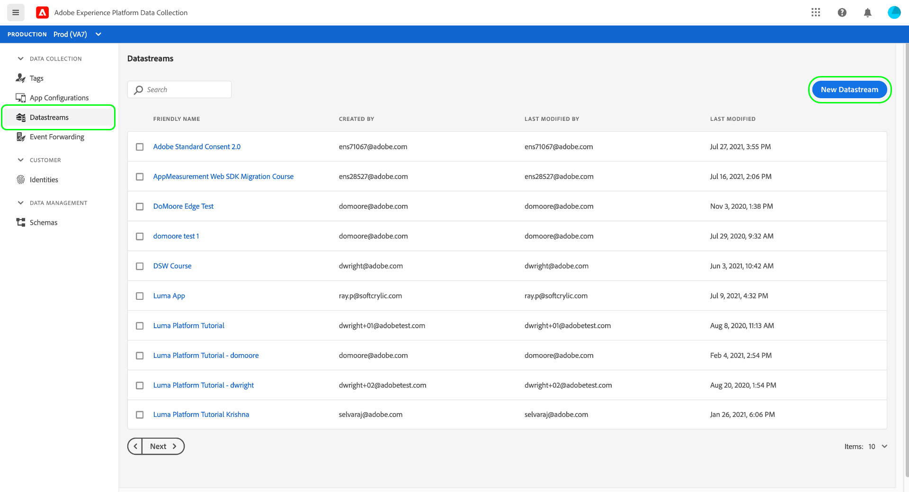

# Adobe Experience Platformのデータ収集のエンドツーエンドの概要

Adobe Experience Platformデータ収集は、連携してデータを収集し、他のAdobe製品やサードパーティの宛先にデータを転送するいくつかのテクノロジーを提供します。 アプリケーションからAdobe Experience Platform Edgeネットワークにイベントデータを送信するには、これらのコアテクノロジーと、必要なときに必要な宛先にデータを配信するように設定する方法を理解することが重要です。

このガイドでは、データ収集テクノロジーを使用してEdgeネットワークを通じてイベントを送信する方法に関する概要レベルのチュートリアルを提供します。 特に、このチュートリアルでは、データ収集UI内でAdobe Experience Platform Web SDKタグ拡張機能をインストールおよび設定する手順について説明します。

>[!NOTE]
>
>タグを使用しない場合は、SDKのインストールと設定を手動で選択することもできますが、以下に示すように、その前後の手順は完了しておく必要があります。

## 前提条件

このチュートリアルでは、データ収集UIを使用して、スキーマを作成し、データストリームを設定し、Web SDKをインストールします。 UIでこれらの操作を実行するには、少なくとも1つのWebプロパティに対するアクセス権と、次の[プロパティ権限](../tags/ui/administration/user-permissions.md#property-rights)を付与する必要があります。

* 開発
* 拡張機能の管理

プロパティおよびプロパティ権限へのアクセス権を付与する方法については、[タグ](../tags/ui/administration/manage-permissions.md)の権限の管理に関するガイドを参照してください。

このガイドに記載されている様々なデータ収集製品を使用するには、データストリームにアクセスでき、スキーマを作成および管理する機能も必要です。 これらの機能のいずれかにアクセスする必要がある場合は、CSMに問い合わせて、必要なアクセス権を取得してください。 Adobe Experience Platformを購入していない場合、Adobeは、SDKを使用するために必要なアクセス権を無償で提供します。

既にPlatformへのアクセス権を持っている場合は、次のカテゴリですべての[権限](../access-control/home.md#permissions)が有効になっていることを確認する必要があります。

* データモデリング
* ID

ユーザーにPlatform機能の権限を付与する方法については、[アクセス制御UIの概要](../access-control/ui/overview.md)を参照してください。

## プロセスの概要

WebサイトのEdgeネットワークを設定するプロセスを、次のように要約できます。

1. [スキーマを作](#schema) 成し、Edgeネットワークに送信する際のデータの構造を決定します。
1. [データス](#datastream) トリームを作成し、データの送信先を設定します。
1. [Webサイトで特定のイベントが発](#sdk) 生した場合にデータストリームにデータを送信するように、Web SDKをインストールおよび設定します。

Edgeネットワークにデータを送信できるようになったら、組織にライセンスがある場合は、オプションで[イベント転送](#event-forwarding)を設定することもできます。

## スキーマの作成 {#schema}

[エクスペリエンスデータモデル(XDM)](../xdm/home.md) は、スキーマの形式でデータの共通の構造と定義を提供するオープンソース仕様です。つまり、XDMは、Edgeネットワークや他のAdobe Experience Cloudアプリケーションで対応可能な方法でデータを構造化および書式設定する方法です。

データ収集操作を設定する最初の手順は、データを表すXDMスキーマを作成することです。 このチュートリアルの後の手順で、送信するデータをこのスキーマの構造にマッピングします。

>[!NOTE]
>
>XDMスキーマは非常にカスタマイズ可能です。 以下に説明する手順は、過度に規範的なものではなく、特にWeb SDKのスキーマ要件に焦点を当てています。 これらのパラメーターの外部では、データの残りの構造を自由に定義できます。

データ収集UIで、左側のナビゲーションから「**[!UICONTROL スキーマ]**」を選択します。 ここから、組織に属する以前に作成したスキーマのリストを表示できます。 続行するには、「**[!UICONTROL スキーマを作成]**」を選択し、ドロップダウンメニューから「**[!UICONTROL XDM ExperienceEvent]**」を選択します。

フィールドグループのスキーマへの追加を開始するよう求めるダイアログが表示されます。 Web SDKを使用してイベントを送信するには、フィールドグループ&#x200B;**[!UICONTROL AEP Web SDK ExperienceEvent Mixin]**&#x200B;を追加する必要があります。 このフィールドグループには、Web SDKライブラリによって自動的に収集されるデータ属性の定義が含まれています。

検索バーを使用してリストを絞り込むと、このフィールドグループを見つけやすくなります。 見つかったら、「**[!UICONTROL フィールドグループを追加]**」を選択する前に、リストから選択します。

スキーマキャンバスが表示され、Web SDKフィールドグループが提供するフィールドを含むXDMスキーマのツリー構造が表示されます。

ツリーのルートフィールドを選択して、右側のレールで&#x200B;**[!UICONTROL スキーマのプロパティ]**&#x200B;を開きます。スキーマの名前と説明（オプション）を指定できます。

スキーマにフィールドを追加する場合は、左側のレールの「**[!UICONTROL フィールドグループ]**」セクションで「**[!UICONTROL 追加]**」を選択します。

>[!NOTE]
>
>使用例に合わせて様々なフィールドグループを検索する方法について詳しくは、XDMドキュメントの[フィールドグループ](../xdm/ui/resources/schemas.md#add-field-groups)の追加に関するガイドを参照してください。
>
>ベストプラクティスは、Edgeネットワークを介して送信する予定のデータのフィールドのみを追加することです。 フィールドをスキーマに追加して保存した後は、その後はスキーマに追加の変更を加えることのみ可能です。 詳しくは、[スキーマ進化のルール](../xdm/schema/composition.md#evolution)の節を参照してください。

必要なフィールドを追加したら、「**[!UICONTROL 保存]**」を選択してスキーマを保存します。

## データストリームの作成 {#datastream}

データストリームとは、データの送信先をEdgeネットワークに指示する設定です。 特に、データストリームは、データの送信先のExperience Cloud製品と、各製品でデータを処理および保存する方法を指定します。

>[!NOTE]
>
>[イベント転送](../tags/ui/event-forwarding/overview.md)を使用する場合（組織で機能のライセンスが取得されている場合）、Adobe製品を有効にするのと同じ方法でデータストリームに対して有効にする必要があります。 このプロセスの詳細については、[後の](#event-forwarding)の節で説明します。

データ収集UIで、「**[!UICONTROL Datastreams]**」を選択します。 ここから、編集する既存のデータストリームをリストから選択したり、「**[!UICONTROL 新しいデータストリーム]**」を選択して新しい設定を作成したりできます。

データストリームの設定要件は、データの送信先の製品と機能に応じて異なります。 各製品の設定オプションについて詳しくは、[datastreamsの概要](../edge/fundamentals/datastreams.md)を参照してください。

## Web SDKのインストールと設定

スキーマとデータストリームを作成したら、次の手順は、Platform Web SDKをインストールして、Edgeネットワークへのデータ送信を開始するように設定することです。

>[!NOTE]
>
>この節では、データ収集UIを使用してWeb SDKタグ拡張を設定しますが、代わりに生のコードを使用してインストールおよび設定することもできます。 詳しくは、次のガイドを参照してください。
>
>* [SDK のインストール](../edge/fundamentals/installing-the-sdk.md)
>* [SDK の設定](../edge/fundamentals/configuring-the-sdk.md)

>
>また、イベント転送のみを使用する場合でも、[後の手順](#event-forwarding)でイベント転送を設定する前に、説明に従ってSDKをインストールして設定する必要があります。

プロセスの概要は次のとおりです。

1. [Adobe Experience Platform Web SDKをタグプロパティにインストールし](#install-sdk) て、機能にアクセスできるようにします。
1. [XDMオブジェクトデータ要](#data-element) 素を作成して、Webサイト上の変数を、以前に作成したXDMスキーマの構造にマッピングします。
1. [Edgeネットワークに](#rule) データを送信するタイミングをSDKに通知するルールを作成します。
1. [ライブラリを構築してイ](#library) ンストールし、Webサイトにルールを実装します。

### タグプロパティにSDKをインストールする {#install-sdk}

左側のナビゲーションで「**[!UICONTROL タグ]**」を選択して、タグプロパティのリストを表示します。 必要に応じて、既存のプロパティを選択して編集することも、「**[!UICONTROL 新しいプロパティ]**」を選択することもできます。

新しいプロパティを作成する場合は、わかりやすい名前を指定し、[!UICONTROL Platform]を&#x200B;**[!UICONTROL Web]**&#x200B;に設定します。 Webプロパティの完全なドメインを指定し、「**[!UICONTROL 保存]**」を選択します。

プロパティの概要ページが表示されます。 ここから、左側のナビゲーションで「**[!UICONTROL 拡張機能]**」を選択し、「**[!UICONTROL カタログ]**」を選択します。 Platform Web SDKのリストを見つけ（オプションで検索バーを使用して結果を絞り込みます）、**[!UICONTROL Install]**&#x200B;を選択します。

SDKの設定ページが表示されます。 必要な値のほとんどはデフォルトで自動入力され、必要に応じて変更できます。

ただし、SDKをインストールする前に、データの送信先を把握できるように、データストリームを選択する必要があります。 **[!UICONTROL 「Datastreams]**」の下で、ドロップダウンメニューを使用して、[前の手順](#datastream)で設定したデータストリームを選択します。 データストリームを設定したら、「**[!UICONTROL 保存]**」を選択して、SDKのプロパティへのインストールを完了します。

### XDMデータ要素の作成 {#data-element}

SDKがEdgeネットワークにデータを送信するには、そのデータを前の手順[で作成したXDMスキーマにマッピングする必要があります。 ](#schema)このマッピングは、データ要素を使用しておこないます。

UIで、「**[!UICONTROL データ要素]**」を選択し、「**[!UICONTROL 新しいデータ要素を作成]**」を選択します。

次の画面で、「[!UICONTROL 拡張機能]」ドロップダウンの下の「**[!UICONTROL Adobe Experience Platform Web SDK]**」を選択し、データ要素タイプとして「**[!UICONTROL XDM object]**」を選択します。

XDMオブジェクトタイプの設定ダイアログが表示されます。 ダイアログは自動的にPlatformサンドボックスを選択し、ここから、そのサンドボックスで作成されたすべてのスキーマを表示できます。 作成済みのXDMスキーマをリストから選択します。

スキーマの構造が表示されます。 アスタリスク(**\***)が付くすべてのフィールドは、イベントの発生時に自動的に入力されるフィールドを示します。 その他すべてのフィールドについては、スキーマの構造を調べ、残りのデータを入力できます。

>[!NOTE]
>
>上のスクリーンショットは、[!UICONTROL 値]フィールドで名前を参照し、パーセント記号(`%`)で囲んで、Webサイトのクライアント側(`cartAbandonsTotal`)からXDMフィールドにグローバルにアクセス可能な変数をマッピングする方法を示しています。
>
>また、以前に作成した他のデータ要素を使用して、これらのフィールドに値を入力することもできます。 詳しくは、タグのドキュメントの[データ要素](../tags/ui/managing-resources/data-elements.md)の参照を参照してください。

データのスキーマへのマッピングが完了したら、「**[!UICONTROL 保存]**」を選択する前にデータ要素の名前を指定します。

### ルールの作成

データ要素を保存した後、次の手順では、Webサイトで特定のイベントが発生した場合（顧客が買い物かごに商品を追加した場合など）に常にEdgeネットワークにデータ要素を送信するルールを作成します。

例えば、この節では、顧客が買い物かごに品目を追加したときにトリガーを表示するルールを作成する方法を示します。 ただし、Webサイト上で発生する可能性のあるほぼすべてのイベントに対してルールを設定できます。

左側のナビゲーションで「**[!UICONTROL ルール]**」を選択し、「**[!UICONTROL 新しいルールを作成]**」を選択します。

次の画面で、ルールの名前を指定します。 ここから、次の手順は、ルールのイベント（つまり、ルールが起動するタイミング）を決定することです。 [!UICONTROL イベント]の下の&#x200B;**[!UICONTROL 追加]**&#x200B;を選択します。

イベント設定ページが表示されます。 イベントを設定するには、まずイベントタイプを選択する必要があります。 イベントタイプは拡張機能で提供されます。 例えば、「フォーム送信」イベントを設定するには、**[!UICONTROL Core]**&#x200B;拡張機能を選択し、**[!UICONTROL フォーム]**&#x200B;カテゴリで&#x200B;**[!UICONTROL 送信]**&#x200B;イベントタイプを選択します。 表示される設定ダイアログで、このルールを実行する特定のフォームのCSSセレクターを指定できます。

>[!NOTE]
>
>AdobeのWeb拡張機能で提供される様々なAdobeタイプについて詳しくは、タグのドキュメントの[イベント拡張機能のリファレンス](../tags/extensions/web/overview.md)を参照してください。

「**[!UICONTROL 変更を保持]**」を選択して、ルールにイベントを追加します。

ルール設定ページが再び表示され、イベントが追加されたことが示されます。 ルールに条件を追加すると、「[!UICONTROL If]」を絞り込むことができます。

それ以外の場合は、ルールが起動したときに実行するアクションを追加します。 **[!UICONTROL アクション]**&#x200B;の下の&#x200B;**[!UICONTROL 追加]**&#x200B;を選択して続行します。

アクションの設定ページが表示されます。 データをEdgeネットワークに送信するルールを取得するには、拡張機能に&#x200B;**[!UICONTROL Adobe Experience Platform Web SDK]**&#x200B;を選択し、アクションタイプに&#x200B;**[!UICONTROL Send event]**&#x200B;を選択します。

画面が更新され、イベント送信アクションを設定する追加のオプションが表示されます。 **[!UICONTROL 型]**&#x200B;の下で、`eventType` XDMフィールドに値を入力するカスタム型の値を指定できます。 **[!UICONTROL XDM data]**&#x200B;の下に、作成したXDMデータ型の名前を指定するか（パーセント記号で囲みます）、データベースアイコン（）を選択してリストから選択します。 これは、最終的にEdgeネットワークに送信されるデータです。

終了したら「**[!UICONTROL 変更を保持]**」を選択します。

ルールの設定が完了したら、「**[!UICONTROL 保存]**」を選択してプロセスを終了します。

### ライブラリのビルドとインストール {#library}

ルールが設定されたら、タグライブラリに追加し、そのライブラリを環境にビルドして、Webサイトにそのビルドをインストールする準備が整います。

>[!NOTE]
>
>まだデータ収集UIで環境を設定していない場合は、ビルドを作成する前に設定する必要があります。 詳しくは、タグのドキュメントの[Webプロパティ](../tags/ui/publishing/environments.md#web-configuration)の環境の設定に関する節を参照してください。

ライブラリの作成、ライブラリへの拡張機能とルールの追加、環境へのライブラリの構築の方法については、タグのドキュメントの[ライブラリの管理](../tags/ui/publishing/libraries.md)に関するガイドを参照してください。 ライブラリを作成する場合、Platform Web SDK拡張機能と、以前に作成したデータ収集ルールが含まれていることを確認します。

ライブラリを作成し、そのビルドを環境に割り当てたら、その環境をWebサイトのクライアント側にインストールできます。 詳しくは、[環境のインストール](../tags/ui/publishing/environments.md#installation)の節を参照してください。

Webサイトに環境をインストールしたら、Adobe Experience Platform Debuggerを使用して[実装をテスト](../tags/ui/publishing/embed-code-testing.md)できます。

## イベント転送の設定（オプション） {#event-forwarding}

>[!NOTE]
>
>イベント転送は、そのイベントのライセンスを持つ組織でのみ使用できます。

Edgeネットワークにデータを送信するようにSDKを設定したら、イベント転送を設定して、Edgeネットワークにそのデータを配信する場所を通知できます。

イベント転送を使用するには、まずイベント転送プロパティを作成する必要があります。 左側のナビゲーションで「**[!UICONTROL イベント転送]**」を選択し、「**[!UICONTROL 新しいプロパティ]**」を選択します。 「**[!UICONTROL 保存]**」を選択する前に、プロパティの名前を指定します。

イベント転送プロパティを作成したら、次の手順で、データの送信先を決定するルールを作成します。 イベント転送プロパティのルールは、タグプロパティとほぼ同じ方法で構築されますが、イベントを指定できない点が異なります（イベント転送はデータストリームから直接受信するイベントのみを扱うため）。 ルールのアクションに対して、使用可能なイベント転送拡張機能の1つを使用するか、カスタムコードを使用してイベントを配信します。

前と同様に、ルールを設定したら、ライブラリに追加して、そのライブラリを環境にビルドする必要があります。

ビルドが完了したら、最後の手順は、[以前に設定した](#datastream)データストリームを更新し、イベント転送を有効にすることです。 開始するには、**[!UICONTROL Datastreams]**&#x200B;に移動し、該当するデータストリームをリストから選択します。 ここから、イベント転送の切り替えを有効にし、設定したプロパティと環境の名前を指定します。

## 次の手順

このガイドでは、Platform Web SDKを使用してEdgeネットワークにデータを送信する方法に関する、エンドツーエンドの大まかな概要を示しました。 関連する様々なコンポーネントとサービスの詳細については、このガイド全体にリンクされたドキュメントを参照してください。
