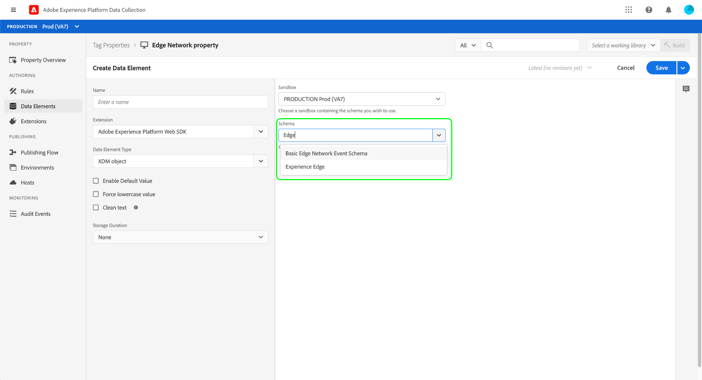

# エンドツーエンドでのデータ収集の概要

Adobe Experience Platform において、データ収集とは、連携してデータを収集し、他のアドビ製品またはサードパーティの宛先に転送する複数のテクノロジーを指します。アプリケーションから Adobe Experience Platform Edge ネットワークにイベントデータを送信するには、これらのコアテクノロジーと、必要なときに必要な宛先へとデータを配信するように設定する方法を理解することが重要です。

このガイドでは、データ収集テクノロジーを使用し、 Edge ネットワークを通じてイベントを送信する方法に関する大まかなチュートリアルを提供します。具体的には、チュートリアルでは、データ収集 UI（旧 Adobe Experience Platform Launch）内で Adobe Experience Platform Web SDK タグ拡張機能をインストールおよび設定する手順について説明します。

>[!NOTE]
>
>タグを使用しない場合は、SDK を手動でインストールして設定することもできますが、以下に示すように、その前後の手順は完了しておく必要があります。

## 前提条件

このチュートリアルでは、データ収集 UI を使用して、スキーマの作成、データストリームの設定および Web SDK のインストールを行います。UI でこれらのアクションを実行するには、少なくとも 1 つの web プロパティに対するアクセス権と、次の[プロパティ権限](../tags/ui/administration/user-permissions.md#property-rights)が付与されている必要があります。

* 開発
* 拡張機能の管理

プロパティおよびプロパティ権限に対してアクセス権を付与する方法については、[タグの権限の管理](../tags/ui/administration/manage-permissions.md)に関するガイドを参照してください。

このガイドに記載されている様々なデータ収集製品を使用するには、データストリームにアクセスし、スキーマを作成および管理する機能も必要です。 これらの機能のいずれかにアクセスする必要がある場合は、CSM に問い合わせて、必要なアクセス権を取得してください。 Adobe Experience Platform を購入していない場合、アドビでは、SDK を使用するために必要なアクセス権を追加料金なしで提供します。

既に Platform へのアクセス権を持っている場合は、次のカテゴリですべての[権限](../access-control/home.md#permissions)が有効になっていることを確認する必要があります。

* データモデリング
* ID

ユーザーに Platform 機能の権限を付与する方法については、[アクセス制御 UI の概要](../access-control/ui/overview.md)を参照してください。

## プロセスの概要

Web サイトのデータ収集を設定するプロセスは、要約すると次のようになります。

1. [スキーマを作成](#schema)し、Edge ネットワークに送信する際にデータをどのように構造化するかを決定します。
1. [データストリームを作成](#datastream)し、データの送信先を設定します。
1. [Web SDK をインストール](#sdk)し、web サイトで特定のイベントが発生した場合にデータストリームへとデータを送信するように設定します。

Edge ネットワークにデータを送信できるようになったら、組織がライセンスを保有している場合は、オプションで[イベント転送を設定](#event-forwarding)することもできます。

## スキーマの作成 {#schema}

[エクスペリエンスデータモデル（XDM）](../xdm/home.md)は、スキーマの形式でデータの共通の構造と定義を提供するオープンソース仕様です。つまり、XDM は、Edge ネットワークや他の Adobe Experience Cloud アプリケーションで実行可能な方法でデータを構造化およびフォーマットする方法です。

データ収集操作を設定する最初の手順は、データを表す XDM スキーマを作成することです。 このチュートリアルの後の手順では、送信するデータをこのスキーマの構造にマッピングします。

>[!NOTE]
>
>XDM スキーマはカスタマイズ可能です。 以下に概説する手順は、過度に規範的なものではなく、特に web SDK のスキーマ要件に焦点を当てています。これらのパラメーター以外では、データの残りの構造を自由に定義できます。

データ収集 UI で、左側のナビゲーションから「**[!UICONTROL スキーマ]**」を選択します。ここから、組織に属する以前に作成したスキーマのリストを表示できます。続行するには、「**[!UICONTROL スキーマを作成]**」を選択し、ドロップダウンメニューから「**[!UICONTROL XDM ExperienceEvent]**」を選択します。


フィールドグループのスキーマへの追加を開始するよう求めるダイアログが表示されます。Web SDK を使用してイベントを送信するには、フィールドグループ **[!UICONTROL AEP Web SDK ExperienceEvent Mixin]** を追加する必要があります。このフィールドグループには、Web SDK ライブラリによって自動的に収集されるデータ属性の定義が含まれています。

検索バーを使用してリストを絞り込むと、このフィールドグループを見つけやすくなります。見つかったら、リストから選択して、「**[!UICONTROL フィールドグループを追加]**」を選択します。


スキーマキャンバスが表示され、Web SDK フィールドグループが提供するフィールドを含む XDM スキーマのツリー構造が示されます。


ツリーのルートフィールドを選択して、右パネルで&#x200B;**[!UICONTROL スキーマのプロパティ]**&#x200B;を開きます。ここで、スキーマの名前と説明（オプション）を指定できます。


スキーマにさらにフィールドを追加する場合は、左パネルの「**[!UICONTROL フィールドグループ]**」セクションで「**[!UICONTROL 追加]**」を選択します。


>[!NOTE]
>
>ユースケースに合う様々なフィールドグループを検索する方法について詳しくは、XDM ドキュメントの[フィールドグループの追加](../xdm/ui/resources/schemas.md#add-field-groups)に関するガイドを参照してください。
>
>ベストプラクティスは、Edge ネットワークを介して送信する予定のデータのフィールドのみを追加することです。フィールドをスキーマに追加して保存すると、それ以降はスキーマに追加の変更を加えることのみ可能です。詳しくは、[スキーマ進化のルール](../xdm/schema/composition.md#evolution)の節を参照してください。

必要なフィールドを追加したら、「**[!UICONTROL 保存]**」を選択してスキーマを保存します。


## データストリームの作成 {#datastream}

データストリームとは、データの送信先を Edge ネットワークに伝える設定のことです。具体的には、データストリームは、データの送信先のExperience Cloud 製品と、各製品でデータを処理および保存する方法を指定します。

>[!NOTE]
>
>[イベント転送](../tags/ui/event-forwarding/overview.md)を使用する場合（組織が機能のライセンスを取得している場合）、アドビ製品を有効にするのと同じ方法でデータストリームに対してイベント転送を有効にする必要があります。このプロセスについて詳しくは、[後の節](#event-forwarding)で説明します。

データ収集 UI で、「**[!UICONTROL データストリーム]**」を選択します。ここから、編集する既存のデータストリームをリストから選択したり、「**[!UICONTROL 新規データストリーム]**」を選択して新しい設定を作成したりできます。


データストリームの設定要件は、データの送信先の製品と機能によって異なります。 各製品の設定オプションについて詳しくは、[データストリームの概要](../edge/fundamentals/datastreams.md)を参照してください。

## Web SDK のインストールと設定

スキーマとデータストリームを作成したら、次の手順として、Platform Web SDK をインストールして、Edge ネットワークへのデータ送信を開始するように設定します。

>[!NOTE]
>
>この節では、データ収集 UI を使用して web SDK タグ拡張機能を設定しますが、代わりに生のコードを使用してインストールおよび設定することもできます。詳しくは、次のガイドを参照してください。
>
>* [SDK のインストール](../edge/fundamentals/installing-the-sdk.md)
>* [SDK の設定](../edge/fundamentals/configuring-the-sdk.md)
>
>また、イベント転送のみを使用する場合でも、[後の手順](#event-forwarding)でイベント転送を設定する前に、説明に従って SDK をインストールして設定する必要があります。

プロセスの概要は次のとおりです。

1. [Adobe Experience Platform Web SDK をタグプロパティにインストール](#install-sdk)して、その機能にアクセスできるようにします。
1. [XDM オブジェクトデータ要素を作成](#data-element)して、web サイト上の変数を、以前作成した XDM スキーマの構造にマッピングします。
1. Edgeネットワークへのデータ送信のタイミングを SDK に通知する[ルールを作成](#rule)します。
1. [ライブラリを構築してイ ンストール](#library)し、web サイトにルールを実装します。

### タグプロパティに SDK をインストールする {#install-sdk}

左側のナビゲーションで「**[!UICONTROL タグ]**」を選択して、タグプロパティのリストを表示します。必要に応じて、既存のプロパティを選択して編集することも、代わりに「**[!UICONTROL 新しいプロパティ]**」を選択することもできます。


新しいプロパティを作成する場合は、わかりやすい名前を指定し、[!UICONTROL Platform] を **[!UICONTROL Web]** に設定します。Web プロパティの完全なドメインを指定し、「**[!UICONTROL 保存]**」を選択します。


プロパティの概要ページが表示されます。ここから、左側のナビゲーションで「**[!UICONTROL 拡張機能]**」を選択し、「**[!UICONTROL カタログ]**」を選択します。Platform Web SDK のリストを見つけ（オプションとして検索バーを使用して結果を絞り込む）、「**[!UICONTROL インストール]**」を選択します。


SDK の設定ページが表示されます。必要な値のほとんどはデフォルトで自動入力されますが、必要に応じて変更できます。


ただし、SDK をインストールする前に、データストリームを選択して、データの送信先がわかるようにする必要があります。「**[!UICONTROL データストリーム]**」の下で、ドロップダウンメニューを使用して、[前の手順](#datastream)で設定したデータストリームを選択します。データストリームを設定したら、「**[!UICONTROL 保存]**」を選択して、SDK のプロパティへのインストールを完了します。


### XDM データ要素の作成 {#data-element}

SDK が Edge ネットワークにデータを送信するには、そのデータを[前の手順](#schema)で作成した XDM スキーマにマッピングする必要があります。このマッピングは、データ要素を使用して実行されます。

UI で「**[!UICONTROL データ要素]**」を選択し、「**[!UICONTROL 新しいデータ要素の作成]**」を選択します。


次の画面で、「[!UICONTROL 拡張機能]」ドロップダウンの下の「**[!UICONTROL Adobe Experience Platform Web SDK]**」を選択し、データ要素タイプとして「**[!UICONTROL XDM オブジェクト]**」を選択します。


XDM オブジェクトタイプの設定ダイアログが表示されます。ダイアログは自動的に Platform サンドボックスを選択し、ここから、そのサンドボックスで作成されたすべてのスキーマを表示できます。前に作成した XDM スキーマをリストから選択します。



スキーマの構造が表示されます。アスタリスク（**\***）が付いているすべてのフィールドは、イベントの発生時に自動的に入力されるフィールドを示します。他のすべてのフィールドについては、スキーマの構造を調べて、残りのデータを入力できます。


>[!NOTE]
>
>上のスクリーンショットは、パーセント記号（`%`）で囲まれた「[!UICONTROL 値]」フィールドでその名前を参照することにより、web サイトのクライアント側（`cartAbandonsTotal`）からグローバルにアクセス可能な変数を XDM フィールドにマップする方法を示しています。
>
>また、以前に作成した他のデータ要素を使用して、これらのフィールドに値を入力することもできます。詳しくは、タグのドキュメントの[データ要素](../tags/ui/managing-resources/data-elements.md)のリファレンスを参照してください。

データのスキーマへのマッピングが完了したら、「**[!UICONTROL 保存]**」を選択する前にデータ要素の名前を指定します。


### ルールの作成

データ要素を保存した後、次の手順では、web サイトで特定のイベントが発生した場合（顧客が買い物かごに商品を追加した場合など）は常に Edge ネットワークにデータ要素を送信するルールを作成します。

Web サイト上で発生する可能性のあるほぼすべてのイベントに対してルールを設定できます。例として、この節では、顧客がフォームを送信したときにトリガーするルールを作成する方法を示します。 次の HTML は、ルールの対象となる「買い物かごに追加」フォームを含むシンプルな web ページを表しています。

```html
<!DOCTYPE html>
<html>
<body>

  <form id="add-to-cart-form">
    <label for="item">Product:</label><br>
    <input type="text" id="item" name="item"><br>
    <label for="amount">Amount:</label><br>
    <input type="number" id="amount" name="amount" value="1"><br><br>
    <input type="submit" value="Add to Cart">
  </form> 

</body>
</html>
```

データ収集 UI で、左側のナビゲーションで「**[!UICONTROL ルール]**」を選択し、「**[!UICONTROL 新しいルールの作成]**」を選択します。


次の画面で、ルールの名前を指定します。ここから、次の手順は、ルールのイベント（つまり、ルールがいつ実行されるか）を決定することです。「[!UICONTROL イベント]」の下の「**[!UICONTROL 追加]**」を選択します。


イベント設定ページが表示されます。イベントを設定するには、まずイベントタイプを選択する必要があります。イベントタイプは拡張機能で提供されます。例えば、「フォーム送信」イベントを設定するには、**[!UICONTROL Core]** 拡張機能を選択してから、「**[!UICONTROL フォーム]**」カテゴリで「**[!UICONTROL 送信]**」イベントタイプを選択します。

>[!NOTE]
>
>設定方法など、アドビの web 拡張機能で提供される様々なイベントタイプについて詳しくは、タグドキュメントの[アドビ拡張機能のリファレンス](../tags/extensions/web/overview.md)を参照してください。

フォーム送信イベントでは、[CSS セレクター](https://www.w3schools.com/css/css_selectors.asp)を使用して、ルールを実行する特定の要素を参照できます。 以下の例では、ID `add-to-cart-form` が使用されているため、「買い物かごに追加」フォームに対してのみこのルールが実行されます。「**[!UICONTROL 変更を保持]**」を選択して、ルールにイベントを追加します。


ルール設定ページが再び表示され、イベントが追加されたことが示されます。ルールにさらに条件を追加することで、「[!UICONTROL If]」を絞り込むことができます。

それ以外の場合、次の手順として、ルールが起動したときに実行するアクションを追加します。「**[!UICONTROL アクション]**」の下の「**[!UICONTROL 追加]**」を選択して続行します。


アクション設定ページが表示されます。Edge ネットワークへのデータ送信ルールを取得するには、拡張機能で「**[!UICONTROL Adobe Experience Platform Web SDK]**」、アクションタイプで「**[!UICONTROL イベントの送信]**」を選択します。


画面が更新され、イベント送信アクションを設定するための追加のオプションが表示されます。「**[!UICONTROL タイプ]**」から、`eventType` XDM フィールドに入力するカスタムタイプの値を指定できます。「**[!UICONTROL XDM データ]**」から、前に作成した XDM データタイプの名前（パーセント記号で囲まれています）を入力するか、データベースアイコン（）をクリックしてリストから選択します。これは、最終的に Edge ネットワークに送信されるデータです。

終了したら「**[!UICONTROL 変更を保持]**」を選択します。


ルールの設定が完了したら、「**[!UICONTROL 保存]**」を選択してプロセスを終了します。


### ライブラリのビルドとインストール {#library}

ルールを設定したら、それをタグライブラリに追加し、そのライブラリを環境にビルドして、そのビルドを web サイトにインストールする準備が整います。

>[!NOTE]
>
>データ収集 UI の環境設定がまだの場合は、ビルドを作成する前に設定する必要があります。詳しくは、タグドキュメントの[web プロパティの環境の設定](../tags/ui/publishing/environments.md#web-configuration)に関する節を参照してください。

ライブラリの作成、ライブラリへの拡張機能とルールの追加、環境へのライブラリのビルドの方法については、タグドキュメントの[ライブラリの管理](../tags/ui/publishing/libraries.md)に関するガイドを参照してください。ライブラリを作成する場合、Platform Web SDK 拡張機能と、以前に作成したデータ収集ルールが含まれていることを確認します。

ライブラリを作成し、そのビルドを環境に割り当てたら、その環境を web サイトのクライアント側にインストールできます。詳しくは、[環境の設定](../tags/ui/publishing/environments.md#installation)の節を参照してください。

Web サイトに環境をインストールしたら、Adobe Experience Platform Debugger を使用して[実装をテスト](../tags/ui/publishing/embed-code-testing.md)できます。

## イベント転送の設定（オプション） {#event-forwarding}

>[!NOTE]
>
>イベント転送は、そのイベントのライセンスを取得している組織のみが使用できます。

Edge ネットワークにデータを送信するように SDK を設定したら、イベント転送を設定して、Edge ネットワークにそのデータを配信する場所を通知できます。

イベント転送を使用するには、まずイベント転送プロパティを作成する必要があります。左側のナビゲーションで「**[!UICONTROL イベント転送]**」を選択し、「**[!UICONTROL 新しいプロパティ]**」を選択します。「**[!UICONTROL 保存]**」を選択する前に、プロパティの名前を指定します。

イベント転送プロパティを作成したら、次の手順でデータの送信先を決定するルールを作成します。 イベント転送プロパティのルールは、イベントを指定できないことを除いて、タグプロパティとほぼ同じ方法で構築されます（イベント転送は、データストリームから直接受信するイベントのみを扱うため）。ルールのアクションに対して、使用可能なイベント転送拡張機能の 1 つを使用するか、代わりにカスタムコードを使用してイベントを配信できます。


先程と同様に、ルールを設定したら、ライブラリに追加して、そのライブラリを環境にビルドする必要があります。

ビルドが完了したら、最後の手順は、[以前に設定した](#datastream)データストリームを更新し、イベント転送を有効にすることです。開始するには、**[!UICONTROL データストリーム]**&#x200B;に移動し、リストから該当するデータストリームを選択します。ここから、イベント転送の切り替えを有効にし、設定したプロパティと環境の名前を指定します。


## 次の手順

このガイドでは、Platform web SDK を使用して Edge ネットワークにデータを送信する方法について、エンドツーエンドの概要を説明しました。関連する様々なコンポーネントとサービスについて詳しくは、このガイド全体にリンクされているドキュメントを参照してください。
