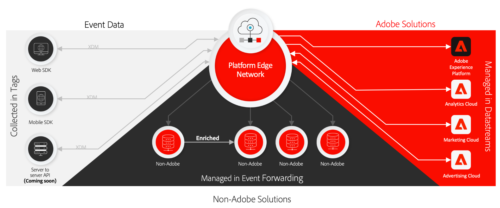

# データ収集の概要

Adobe Experience Platform は、クライアントサイドのソースから顧客体験データを収集して Adobe Experience Platform Edge Network に送信し、そのデータを強化および変換して、アドビやアドビ以外の宛先に数秒で配信できるようにするテクノロジースイートを提供します。

データ収集は、次のクライアントサイドソースに対してサポートされています。

* Web ベースのアプリケーション
* ネイティブモバイルアプリケーション
* オーバーザトップ（OTT）アプリケーション

Experience Platform が提供するデータ収集テクノロジーは、取り込まれたデータセットの検出性とアクセス性に重点を置いています。これらのテクノロジーには、以下が含まれます。

* [Adobe Experience Platform Edge Network](https://experienceleague.adobe.com/docs/web-sdk-learn/tutorials/introduction-to-web-sdk-and-edge-network.html?lang=ja)
* [タグ](../tags/home.md)
* [データストリーム](../edge/fundamentals/datastreams.md)
* [イベントの転送](../tags/ui/event-forwarding/overview.md)
* [Adobe Experience Platform Web SDK](../edge/home.md)
* [Adobe Experience Platform モバイル SDK](https://aep-sdks.gitbook.io/docs/)
* [Adobe Experience Platform デバッガー](https://chrome.google.com/webstore/detail/adobe-experience-platform/bfnnokhpnncpkdmbokanobigaccjkpob?hl=ja)
* [エクスペリエンスデータモデル（XDM）](../xdm/home.md)
* [Adobe Experience Platform ID サービス](../identity-service/home.md)

このガイドでは、データ収集フレームワークの概要と、Platform Edge Network を通じてAdobe Experience Cloud製品やAdobe以外のアプリケーションにデータを送信する方法について説明します。

## タグ、Web SDK、モバイル SDK

Platform Web SDK および Platform Mobile SDK は、すべてのAdobe製品ライブラリを折りたたみ、圧縮して、Web およびモバイルプラットフォーム用の単一の開発キットにします。 これらは、生のコードを使用して、または [タグ](../tags/home.md) データ収集 UI を使用します。

これらのライブラリを圧縮すると、データ収集が高速化され、操作がクライアント側のデバイスから Platform Edge ネットワークへと 1 つのストリームに統合されます。

## Platform Edge ネットワークとデータストリーム {#edge}

Platform Edge Network は、データを大規模に受信および処理できる、世界中に分散した高速で信頼性の高いサーバーのネットワークです。タグを使用すると、Adobe Target、Adobe Audience Manager、Adobe Analytics などの製品に対して[データストリーム](../edge/fundamentals/datastreams.md)を設定できます。これにより、クライアントサイドのコードを変更せずに、サーバサイドでこれらの製品をアクティブ化できます。

>[!NOTE]
>
>Platform Edge ネットワークの詳細な説明については、次の [インタラクティブ製品ツアー](https://adobe-ideacloud.forgedx.com/adobe-adobe-edge-collection/adobe-experience-edge/public/mx?SUID=hgb1a48ICSCpbM6MzBYHbxnsh9DgjUy1) を参照してください。

## イベントの転送

[イベント転送](../tags/ui/event-forwarding/overview.md) は、任意のExperience Platformデータストリームをタップして、非Adobeの宛先に対して、極めて低い待ち時間で、サードパーティのコードをクライアントデバイスに追加することなく、データを変換、エンリッチメントおよび送信できます。

## 次の手順

このドキュメントでは、収集した顧客体験データをAdobe製品やサードパーティの宛先に送信するプロセスを自動化するための、Platform のデータ収集テクノロジーの仕組みに関する概要を説明しました。

Edge ネットワークを介したイベントデータの送信に関する一般的なワークフローについて詳しくは、 [データ収集のエンドツーエンドの概要](./e2e.md).
