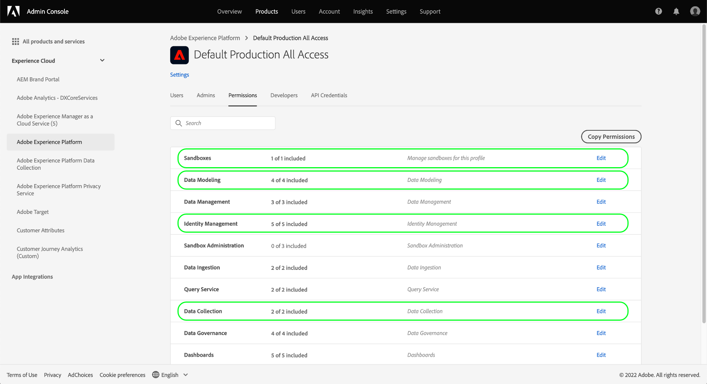

# Experience Platformでのデータ収集の権限管理

[Adobe Experience Platformでのデータ収集](./home.md) は、データの収集と転送をおこなうために連携して動作する、複数の異なるテクノロジーで構成されています。 これらのテクノロジーへのアクセスは、役割に基づく詳細な権限 (Adobe Admin Console) によって制御されます。

このガイドでは、データ収集機能の権限を管理する方法について説明します。

## はじめに

データ収集用にアクセス制御を設定するには、Adobe Experience Platformデータ収集との統合を持つ組織の管理者権限が必要です。 権限を付与または取り消す最小の役割は、**製品プロファイル管理者**&#x200B;です。権限を管理できる他の管理者の役割は、**製品管理者**（製品内のすべてのプロファイルを管理）と&#x200B;**システム管理者**（制限なし）です。詳しくは、『Adobe エンタープライズ管理ガイド』の[管理者の役割](https://helpx.adobe.com/jp/enterprise/using/admin-roles.html)に関する記事を参照してください。

このガイドは、製品プロファイルなどの基本的な Admin Console の概念と、製品の権限を個々のユーザーやグループに付与する方法について理解していることを前提としています。詳しくは、[Admin Console ユーザーガイド](https://helpx.adobe.com/jp/enterprise/using/admin-console.html)を参照してください。

## 使用可能な権限

データ収集に関連する権限は、Admin Consoleでの 2 つの製品指定を通じて提供されます。 **Adobe Experience Platform** および **Adobe Experience Platform Data Collection**. 以下の節では、各製品に対して提供される権限の概要と、アクセス権を付与する特定の機能について説明します。

### Adobe Experience Platform権限

Adobe Experience Platformの権限には、データストリーム、ID、スキーマ、サンドボックスへのアクセスが含まれます。 Adobe Experience Platform権限の設定手順については、 [アクセス制御ユーザーガイド](../access-control/ui/overview.md).

| カテゴリ | 権限 | 説明 |
| --- | --- | --- |
| サンドボックス | （N/A） | に応じて [サンドボックス](../sandboxes/home.md) 組織の下に作成されたので、「Admin Console」のこの権限カテゴリを使用して、各組織へのアクセスを制御できます。 |
| データモデリング | スキーマの管理 | 表示、作成および編集の機能を付与します [エクスペリエンスデータモデル (XDM) スキーマ](../xdm/home.md). |
| データモデリング | スキーマの表示 | スキーマへの読み取り専用アクセスを許可します。 |
| Identity Management | ID 名前空間の管理 | 表示、作成および編集の機能を付与します [ID 名前空間](../identity-service/namespaces.md). |
| Identity Management | ID 名前空間の表示 | ID 名前空間への読み取り専用アクセスを許可します。 |
| データ収集 | データストリームの管理 | 表示、作成および編集の機能を付与します [datastreams](../edge/datastreams/overview.md). |
| データ収集 | データストリームの表示 | データストリームへの読み取り専用アクセスを許可します。 |

{style="table-layout:auto"}

<!-- (Feature not yet available?)
| Dashboards | Manage Custom Dashboards | |
| Dashboards | View Custom Dashboards | |
-->

### Adobe Experience Platformのデータ収集権限

Adobe Experience Platformデータ収集の権限は、タグとイベント転送機能（プロパティ、拡張機能、環境など）へのアクセスを制御します。 Adobe Experience Platformのデータ収集権限の設定手順については、 [以下の節](#manage).

| カテゴリ | 権限 | 説明 |
| --- | --- | --- |
| Platform | Web | へのアクセスを許可 [web プロパティ](../tags/ui/administration/companies-and-properties.md) を他のプロパティ権限と組み合わせた場合。 |
| Platform | Mobile | へのアクセスを許可 [モバイルプロパティ](../tags/ui/administration/companies-and-properties.md) を他のプロパティ権限と組み合わせた場合。 |
| Platform | Edge | へのアクセスを許可 [イベント転送の Edge プロパティ](../tags/ui/event-forwarding/getting-started.md) を他のプロパティ権限と組み合わせた場合。 |
| プロパティ | （N/A） | 組織で作成されたプロパティに応じて、「Admin Console」のこの権限カテゴリを使用して、各プロパティへのアクセスを制御できます。  ユーザーに割り当てられたプロパティ権限は、この権限カテゴリを通じてアクセス権を付与されたプロパティにのみ適用されます。 |
| プロパティ権限 | 承認 | の一部としてライブラリビルドを承認する機能を付与します [公開フロー](../tags/ui/publishing/publishing-flow.md). |
| プロパティ権限 | 開発 | の一部としてライブラリビルドを開発する機能を付与します [公開フロー](../tags/ui/publishing/publishing-flow.md). |
| プロパティ権限 | プロパティの編集 | ユーザーがアクセスできるプロパティの基本設定を編集する機能を付与します。 |
| プロパティ権限 | 環境の管理 | を管理する機能を付与します [環境](../tags/ui/publishing/environments.md) ユーザーがアクセスできるプロパティの場合。 |
| プロパティ権限 | 拡張機能の管理 | を管理する機能を付与します [拡張機能](../tags/ui/managing-resources/extensions/overview.md) ユーザーがアクセスできるプロパティの場合。 |
| プロパティ権限 | 公開 | ライブラリビルドを [公開フロー](../tags/ui/publishing/publishing-flow.md). |
| 会社権限 | 拡張機能の開発 | 非公開リリースや公開リリースのリクエストなど、組織が所有する拡張機能パッケージを作成および変更する機能を付与します。 |
| 会社権限 | 拡張機能の管理 | この権限は、モバイルアプリ内メッセージおよびプッシュメッセージへのアクセスを許可するAdobe Journey Optimizerまたは他のソリューションのライセンスをお持ちの場合にのみ適用できます。 これにより、Adobe Experience Cloudが把握しているアプリと、Firebase Cloud Messaging サービスおよびAppleプッシュ通知サービスとの通信に必要なプッシュ資格情報を管理できます。 |

{style="table-layout:auto"}

>[!NOTE]
>
>これらの権限がタグの機能に与える影響について詳しくは、一般的なシナリオの管理戦略を含め、 [ユーザー権限](../tags/ui/administration/user-permissions.md).

## 権限の管理 {#manage}

前の節で説明したように、データ収集の権限は、Admin Consoleの 2 つの製品指定を通じて管理されます。 **Adobe Experience Platform** および **Adobe Experience Platform Data Collection**.

これらの権限を管理するには、にログインします。 [Admin Console](https://adminconsole.adobe.com/) を選択し、 **[!UICONTROL 製品]** 上部ナビゲーションから。 ここから、設定する権限の製品カードを選択します。 Admin Consoleの各製品で関連する権限を管理する手順については、以下のサブセクションを参照してください。

* [Adobe Experience Platform権限](#manage-platform)
* [Adobe Experience Platformのデータ収集権限](#manage-collection)

### Adobe Experience Platformでの権限の管理 {#manage-platform}

次の **[!UICONTROL 製品]** 「表示」Admin Consoleで、「 **[!UICONTROL Adobe Experience Platform Data Collection]**. 権限を編集する製品プロファイルを選択し、 **[!UICONTROL 権限]** タブをクリックします。

データ収集機能にアクセスするには、 **[!UICONTROL サンドボックス]**, **[!UICONTROL データモデリング]**, **[!UICONTROL Identity Management]**、および **[!UICONTROL データ収集]** カテゴリ。

詳しくは、 [アクセス制御 UI ガイド](../access-control/ui/overview.md) を参照してください。

>[!NOTE]
>
>組織がアクセスできる製品 SKU によっては、利用できるすべての Platform 権限がない場合があります。

### Adobe Experience Platform Data Collection での権限の管理 {#manage-collection}

次の **[!UICONTROL 製品]** 「表示」Admin Consoleで、「 **[!UICONTROL Adobe Experience Platform Data Collection]**.

#### 製品プロファイルの選択または作成

次の画面には、組織でデータ収集に使用可能な製品プロファイル（デフォルトのプロファイルはです）のリストが表示されます **[!DNL Default Data Collection All Access]**. 必要に応じて、デフォルトの製品プロファイルを編集することも、 **[!UICONTROL 新しいプロファイル]** をクリックして、1 つを作成します。 組織内に異なるレベルのアクセスを必要とする複数の役割またはユーザーグループがある場合は、それぞれに個別の製品プロファイルを作成する必要があります。

製品プロファイルを選択または作成した後、 **[!UICONTROL 編集]** 開始するアイコン [権限の編集](#edit-permissions) プロファイルの場合は、 **[!UICONTROL ユーザー]** タブを開始 [ユーザーの割り当て](#assign-users) をプロファイルに追加します。

#### 製品プロファイルの権限の編集 {#edit-permissions}

プロファイルの権限を編集する場合、使用可能な権限が左側の列にリストされ、プロファイルに含まれている権限が右側の列にリストされます。リストされた権限を選択して、いずれかの列間で移動します。

権限はカテゴリに分類されています。カテゴリを切り替えるには、左のナビゲーションから目的のカテゴリを選択します。

権限の設定が完了したら、「**[!UICONTROL 保存]**」を選択します。

追加された権限が反映された製品プロファイルビューが再表示されます。

#### 製品プロファイルへのユーザーの割り当て {#assign-users}

ユーザーを製品プロファイルに割り当て（およびプロファイルで設定された権限を付与）するには、「**[!UICONTROL ユーザー]**」タブに続いて「**[!UICONTROL ユーザーを追加]**」を選択します。

製品プロファイル用のユーザー管理について詳しくは、[Admin Console のドキュメント](https://helpx.adobe.com/jp/enterprise/using/manage-product-profiles.html)を参照してください。

## 次の手順

このガイドでは、データ収集に使用できる権限と、Admin Consoleを通じた管理方法について説明しました。 その他の Adobe Experience Platform 機能に関する権限の管理について詳しくは、[アクセス制御のドキュメント](../access-control/home.md)を参照してください。
