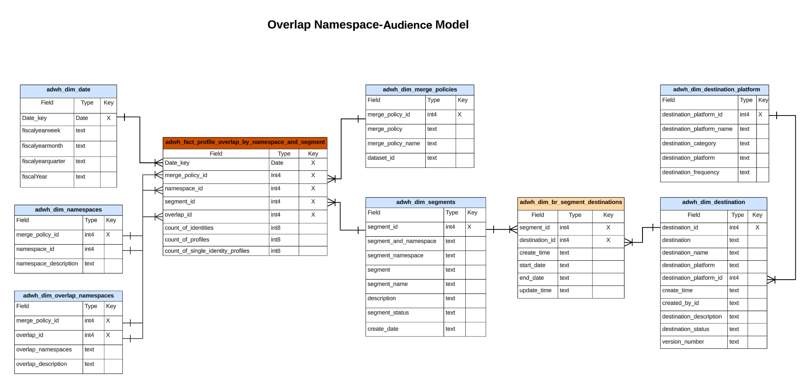

# Real-time Customer Data Platform インサイトデータモデル

Real-time Customer Data Platformインサイトデータモデル機能では、様々なプロファイル、宛先、セグメント化ウィジェットに関するインサイトを強化するデータモデルと SQL が表示されます。 これらの SQL クエリテンプレートをカスタマイズして、マーケティングおよび主要業績評価指標 (KPI) の使用例に関するReal-Time CDPレポートを作成できます。 ユーザー定義のダッシュボードのカスタムウィジェットとして、これらのインサイトを使用できます。 詳しくは、 Query Accelerated Store reporting Insights のドキュメントを参照してください [クエリサービスを通じてレポートインサイトデータモデルを構築し、高速ストアデータとユーザー定義ダッシュボードで使用する方法](../query-service/data-distiller/customizable-insights/reporting-insights-data-model.md).

>[!NOTE]
>
>「セグメント」という用語は、Adobe Experience Platformシステム全体で「オーディエンス」に更新されました。 セグメントへの参照の一部は、ファイルパスとデータセット命名規則で引き続き使用されます。

## 前提条件

このガイドでは、 [ユーザー定義ダッシュボード機能](./user-defined-dashboards.md). このガイドを続行する前に、ドキュメントをお読みください。

## Real-Time CDP Insight レポートと使用例

Real-Time CDPレポートは、プロファイルデータと、そのオーディエンスおよび宛先との関係に関するインサイトを提供します。 様々なスタースキーマモデルが開発され、様々な一般的なマーケティングの使用例に回答しました。また、各データモデルは複数の使用例をサポートできます。

>[!IMPORTANT]
>
>Real-Time CDPのレポートに使用されるデータは、選択した結合ポリシーに対して、また最新の毎日のスナップショットに対して正確です。

### プロファイルモデル {#profile-model}

プロファイルモデルは、次の 3 つのデータセットで構成されます。

- `adwh_dim_date`
- `adwh_fact_profile`
- `adwh_dim_merge_policies`

次の画像には、各データセットの関連するデータフィールドが含まれています。


#### プロファイル数の使用例 {#profile-count}

に使用されるロジック [!UICONTROL プロファイル数] ウィジェットは、スナップショットが作成された時点でのプロファイルストア内の結合済みプロファイルの合計数を返します。 詳しくは、 [[!UICONTROL プロファイル数] widget ドキュメント](./guides/profiles.md#profile-count) を参照してください。

を生成する SQL [!UICONTROL プロファイル数] ウィジェットは、下の折りたたみ可能なセクションに表示されます。

+++SQL クエリ

```sql
SELECT qsaccel.profile_agg.adwh_dim_merge_policies.merge_policy_name,
       sum(qsaccel.profile_agg.adwh_fact_profile.count_of_profiles) CNT
  FROM qsaccel.profile_agg.adwh_fact_profile
  LEFT OUTER JOIN qsaccel.profile_agg.adwh_dim_merge_policies ON qsaccel.profile_agg.adwh_dim_merge_policies.merge_policy_id=adwh_fact_profile.merge_policy_id
  WHERE qsaccel.profile_agg.adwh_fact_profile.date_key='2024-01-10'
    AND qsaccel.profile_agg.adwh_fact_profile.merge_policy_id = 2027892989
  GROUP BY qsaccel.profile_agg.adwh_dim_merge_policies.merge_policy_name;
```

+++

#### 単一の ID プロファイルの使用例 {#single-identity-profiles}

に使用されるロジック [!UICONTROL 単一の ID プロファイル] ウィジェットは、id を作成する 1 つのタイプの ID のみを持つ組織のプロファイルの数を提供します。 詳しくは、[[!UICONTROL 単一の ID プロファイル] widget ドキュメント](./guides/profiles.md#single-identity-profiles) を参照してください。

を生成する SQL [!UICONTROL 単一の ID プロファイル] ウィジェットは、下の折りたたみ可能なセクションに表示されます。

+++SQL クエリ

```sql
SELECT qsaccel.profile_agg.adwh_dim_merge_policies.merge_policy_name,
       sum(qsaccel.profile_agg.adwh_fact_profile.count_of_Single_Identity_profiles) CNT
  FROM qsaccel.profile_agg.adwh_fact_profile
  LEFT OUTER JOIN qsaccel.profile_agg.adwh_dim_merge_policies ON qsaccel.profile_agg.adwh_dim_merge_policies.merge_policy_id=adwh_fact_profile.merge_policy_id
  WHERE qsaccel.profile_agg.adwh_fact_profile.date_key='2024-01-10'
    AND qsaccel.profile_agg.adwh_fact_profile.merge_policy_id = 2027892989
  GROUP BY qsaccel.profile_agg.adwh_dim_merge_policies.merge_policy_name;
```

+++

### 名前空間モデル {#namespace-model}

名前空間モデルは、次のデータセットで構成されます。

- `adwh_dim_date`
- `adwh_fact_profile_by_namespace`
- `adwh_dim_merge_policies`
- `adwh_dim_namespaces`

次の画像には、各データセットの関連するデータフィールドが含まれています。


#### ID 別プロファイルのユースケース {#profiles-by-identity}

[!UICONTROL ID 別プロファイル]ウィジェットは、プロファイルストアにあるすべての結合済みプロファイルで ID の分類を表示します。 詳しくは、 [[!UICONTROL ID 別プロファイル] widget ドキュメント](./guides/profiles.md#profiles-by-identity) を参照してください。

を生成する SQL [!UICONTROL ID 別プロファイル] ウィジェットは、下の折りたたみ可能なセクションに表示されます。

+++SQL クエリ

```sql
SELECT qsaccel.profile_agg.adwh_dim_namespaces.namespace_description,
        sum(qsaccel.profile_agg.adwh_fact_profile_by_namespace_trendlines.count_of_profiles) count_of_profiles
  FROM qsaccel.profile_agg.adwh_fact_profile_by_namespace_trendlines
  LEFT OUTER JOIN qsaccel.profile_agg.adwh_dim_namespaces ON qsaccel.profile_agg.adwh_fact_profile_by_namespace_trendlines.namespace_id = qsaccel.profile_agg.adwh_dim_namespaces.namespace_id
  AND qsaccel.profile_agg.adwh_fact_profile_by_namespace_trendlines.merge_policy_id = qsaccel.profile_agg.adwh_dim_namespaces.merge_policy_id
  WHERE qsaccel.profile_agg.adwh_fact_profile_by_namespace_trendlines.merge_policy_id = 2027892989
    AND qsaccel.profile_agg.adwh_fact_profile_by_namespace_trendlines.date_key = '2024-01-10'
  GROUP BY qsaccel.profile_agg.adwh_fact_profile_by_namespace_trendlines.date_key,
          qsaccel.profile_agg.adwh_fact_profile_by_namespace_trendlines.merge_policy_id,
          qsaccel.profile_agg.adwh_dim_namespaces.namespace_description
  ORDER BY count_of_profiles DESC;
```

+++

#### ID 使用例別の単一の ID プロファイル {#single-identity-profiles-by-identity}

に使用されるロジック [!UICONTROL ID 別の単一の ID プロファイル] ウィジェットは、1 つの一意の識別子のみで識別されたプロファイルの合計数を示します。 詳しくは、 [ID ウィジェットドキュメントによる単一の ID プロファイル](./guides/profiles.md#single-identity-profiles-by-identity) を参照してください。

を生成する SQL [!UICONTROL ID 別の単一の ID プロファイル] ウィジェットは、下の折りたたみ可能なセクションに表示されます。

+++SQL クエリ

```sql
SELECT qsaccel.profile_agg.adwh_dim_namespaces.namespace_description,
        sum(qsaccel.profile_agg.adwh_fact_profile_by_namespace_trendlines.count_of_Single_Identity_profiles) count_of_Single_Identity_profiles
  FROM qsaccel.profile_agg.adwh_fact_profile_by_namespace_trendlines
  LEFT OUTER JOIN qsaccel.profile_agg.adwh_dim_namespaces ON qsaccel.profile_agg.adwh_fact_profile_by_namespace_trendlines.namespace_id = qsaccel.profile_agg.adwh_dim_namespaces.namespace_id
  AND qsaccel.profile_agg.adwh_fact_profile_by_namespace_trendlines.merge_policy_id = qsaccel.profile_agg.adwh_dim_namespaces.merge_policy_id
  WHERE qsaccel.profile_agg.adwh_fact_profile_by_namespace_trendlines.merge_policy_id = 2027892989
    AND qsaccel.profile_agg.adwh_fact_profile_by_namespace_trendlines.date_key = '2024-01-10'
  GROUP BY qsaccel.profile_agg.adwh_fact_profile_by_namespace_trendlines.date_key,
          qsaccel.profile_agg.adwh_fact_profile_by_namespace_trendlines.merge_policy_id,
          qsaccel.profile_agg.adwh_dim_namespaces.namespace_description;
```

+++

### オーディエンスモデル {#audience-model}

オーディエンスモデルは、次のデータセットで構成されます。

- `adwh_dim_date`
- `adwh_fact_profile_by_segment`
- `adwh_dim_merge_policies`
- `adwh_dim_segments`
- `adwh_dim_br_segment_destinations`
- `adwh_dim_destination`
- `adwh_dim_destination_platform`

次の画像には、各データセットの関連するデータフィールドが含まれています。


#### オーディエンスサイズの使用例 {#audience-size}

に使用されるロジック [!UICONTROL オーディエンスサイズ] ウィジェットは、最新のスナップショットの時点での、選択したオーディエンス内の結合されたプロファイルの合計数を返します。 詳しくは、 [[!UICONTROL オーディエンスサイズ] widget ドキュメント](./guides/audiences.md#audience-size) を参照してください。

を生成する SQL [!UICONTROL オーディエンスサイズ] ウィジェットは、下の折りたたみ可能なセクションに表示されます。

+++SQL クエリ

```sql
SELECT
  sum(
    qsaccel.profile_agg.adwh_fact_profile_by_segment_trendlines.count_of_profiles
  ) count_of_profiles
FROM
  qsaccel.profile_agg.adwh_fact_profile_by_segment_trendlines
  LEFT OUTER JOIN qsaccel.profile_agg.adwh_dim_segments ON qsaccel.profile_agg.adwh_fact_profile_by_segment_trendlines.segment_id = qsaccel.profile_agg.adwh_dim_segments.segment_id
WHERE
  qsaccel.profile_agg.adwh_fact_profile_by_segment_trendlines.segment_id = -1323307941
  AND qsaccel.profile_agg.adwh_fact_profile_by_segment_trendlines.merge_policy_id = 1914917902
  AND qsaccel.profile_agg.adwh_fact_profile_by_segment_trendlines.date_key = '2024-01-12';
```

+++

#### オーディエンスサイズの変更のトレンドの使用例 {#audience-size-change-trend}

に使用されるロジック [!UICONTROL オーディエンスサイズの変更の傾向] widget は、最新の日別スナップショット間の特定のオーディエンスについて認定されたプロファイルの合計数の違いを示す線グラフを提供します。 詳しくは、 [[!UICONTROL オーディエンスサイズの変更の傾向] widget ドキュメント](./guides/audiences.md#audience-size-change-trend) を参照してください。

を生成する SQL [!UICONTROL オーディエンスサイズの変更の傾向] ウィジェットは、下の折りたたみ可能なセクションに表示されます。

+++SQL クエリ

```sql
SELECT date_key,
      Profiles_added
  FROM
    (SELECT rn_num,
            date_key,
            (count_of_profiles-lag(count_of_profiles, 1, 0) over(
                                                                ORDER BY date_key))Profiles_added
    FROM
      (SELECT date_key,
              sum(x.count_of_profiles)count_of_profiles,
              row_number() OVER (
                                  ORDER BY date_key) rn_num
        FROM qsaccel.profile_agg.adwh_fact_profile_by_segment_trendlines x
        INNER JOIN
          (SELECT MAX(process_date) last_process_date,
                  merge_policy_id
          FROM qsaccel.profile_agg.adwh_lkup_process_delta_log
          WHERE process_name = 'FACT_TABLES_PROCESSING'
            AND process_status = 'SUCCESSFUL'
          GROUP BY merge_policy_id) y ON x.merge_policy_id = y.merge_policy_id
        WHERE segment_id = 1333234510
          AND x.date_key >= dateadd(DAY, -30 -1, y.last_process_date)
        GROUP BY x.date_key) a)b
  WHERE rn_num > 1;
```

+++

#### 最も使用されている宛先の使用例 {#most-used-destinations}

で使用されるロジック [!UICONTROL 最も使用されている宛先] ウィジェットには、マッピングされているオーディエンスの数に応じて、組織で最も使用されている宛先が表示されます。 このランキングは、どの宛先が利用されているかに関するインサイトを提供すると共に、利用率が低い可能性のある宛先も示します。 詳しくは、 [[!UICONTROL 最も使用されている宛先] widget](./guides/destinations.md#most-used-destinations) を参照してください。

を生成する SQL [!UICONTROL 最も使用されている宛先] ウィジェットは、下の折りたたみ可能なセクションに表示されます。

+++SQL クエリ

```sql
SELECT qsaccel.profile_agg.adwh_dim_destination.destination_name,
       qsaccel.profile_agg.adwh_dim_destination.destination_id,
       qsaccel.profile_agg.adwh_dim_destination.destination,
       count(DISTINCT qsaccel.profile_agg.adwh_dim_br_segment_destinations.segment_id) segment_count
  FROM qsaccel.profile_agg.adwh_dim_destination
  JOIN qsaccel.profile_agg.adwh_dim_br_segment_destinations ON qsaccel.profile_agg.adwh_dim_destination.destination_id = qsaccel.profile_agg.adwh_dim_br_segment_destinations.destination_id
  WHERE qsaccel.profile_agg.adwh_dim_destination.destination_name IS NOT NULL
  GROUP BY qsaccel.profile_agg.adwh_dim_destination.destination_name,
           qsaccel.profile_agg.adwh_dim_destination.destination,
           qsaccel.profile_agg.adwh_dim_destination.destination_id
  ORDER BY segment_count DESC
  LIMIT 20;
```

+++

#### 最近アクティブ化されたオーディエンスの使用例 {#recently-activated-audiences}

のロジック [!UICONTROL 最近アクティブ化されたオーディエンス] ウィジェットは、宛先に最も最近マッピングされたオーディエンスのリストを提供します。 このリストには、システムでアクティブに使用されているオーディエンスと宛先のスナップショットが表示され、誤ったマッピングのトラブルシューティングに役立ちます。 詳しくは、 [[!UICONTROL 最近アクティブ化されたオーディエンス] widget ドキュメント](./guides/destinations.md#recently-activated-audiences) を参照してください。

を生成する SQL [!UICONTROL 最近アクティブ化されたオーディエンス] ウィジェットは、下の折りたたみ可能なセクションに表示されます。

+++SQL クエリ

```sql
SELECT
  segment_name,
  segment,
  destination_name,
  a.create_time create_time
FROM
  qsaccel.profile_agg.adwh_dim_br_segment_destinations a
  INNER JOIN qsaccel.profile_agg.adwh_dim_segments b ON a.segment_id = b.segment_id
  INNER JOIN qsaccel.profile_agg.adwh_dim_destination c ON a.destination_id = c.destination_id
ORDER BY
  create_time DESC,
  segment
LIMIT
  20;
```

+++

### 名前空間 — オーディエンスモデル {#namespace-audience-model}

namespace-audience モデルは、次のデータセットで構成されます。

- `adwh_dim_date`
- `adwh_dim_namespaces`
- `adwh_fact_profile_by_segment_and_namespace`
- `adwh_dim_merge_policies`
- `adwh_dim_segments`
- `adwh_dim_br_segment_destinations`
- `adwh_dim_destination`
- `adwh_dim_destination_platform`

次の画像には、各データセットの関連するデータフィールドが含まれています。


#### オーディエンスの使用例の ID 別プロファイル {#audience-profiles-by-identity}

で使用されるロジック [!UICONTROL ID 別プロファイル] ウィジェットは、特定のオーディエンスに対して、プロファイルストア内のすべての結合プロファイルで id を分類します。 詳しくは、 [[!UICONTROL ID 別プロファイル] widget ドキュメント](./guides/audiences.md#profiles-by-identity) を参照してください。

を生成する SQL [!UICONTROL ID 別プロファイル] ウィジェットは、下の折りたたみ可能なセクションに表示されます。

+++SQL クエリ

```sql
SELECT qsaccel.profile_agg.adwh_dim_namespaces.namespace_description,
        sum(qsaccel.profile_agg.adwh_fact_profile_by_segment_and_namespace_trendlines.count_of_profiles) count_of_profiles
  FROM qsaccel.profile_agg.adwh_fact_profile_by_segment_and_namespace_trendlines
  LEFT OUTER JOIN qsaccel.profile_agg.adwh_dim_namespaces ON qsaccel.profile_agg.adwh_fact_profile_by_segment_and_namespace_trendlines.namespace_id = qsaccel.profile_agg.adwh_dim_namespaces.namespace_id
  AND qsaccel.profile_agg.adwh_fact_profile_by_segment_and_namespace_trendlines.merge_policy_id = qsaccel.profile_agg.adwh_dim_namespaces.merge_policy_id
  WHERE qsaccel.profile_agg.adwh_fact_profile_by_segment_and_namespace_trendlines.segment_id = 1333234510
    AND qsaccel.profile_agg.adwh_fact_profile_by_segment_and_namespace_trendlines.merge_policy_id = 1709997014
    AND qsaccel.profile_agg.adwh_fact_profile_by_segment_and_namespace_trendlines.date_key = '2024-01-10'
  GROUP BY qsaccel.profile_agg.adwh_dim_namespaces.namespace_description
  ORDER BY count_of_profiles DESC;
```

+++

### 名前空間モデルの重複

重複名前空間モデルは、次のデータセットで構成されます。

- `adwh_dim_date`
- `adwh_dim_overlap_namespaces`
- `adwh_fact_profile_overlap_of_namespace`
- `adwh_dim_merge_policies`

次の画像には、各データセットの関連するデータフィールドが含まれています。


#### ID の重複（プロファイル）の使用例 {#profiles-identity-overlap}

で使用されるロジック [!UICONTROL ID の重複] ウィジェットは、 **プロファイルストア** 選択した 2 つの id を含む 詳しくは、 [[!UICONTROL ID の重複] ウィジェットセクション [!UICONTROL プロファイル] ダッシュボードドキュメント](./guides/profiles.md#identity-overlap).

を生成する SQL [!UICONTROL ID の重複] ウィジェットは、下の折りたたみ可能なセクションに表示されます。

+++SQL クエリ

```sql
SELECT Sum(overlap_col1) overlap_col1,
        Sum(overlap_col2) overlap_col2,
        coalesce(Sum(overlap_count), 0) overlap_count
  FROM
    (SELECT 0 overlap_col1,
            0 overlap_col2,
            Sum(count_of_profiles) overlap_count
    FROM qsaccel.profile_agg.adwh_fact_profile_overlap_of_namespace
    WHERE qsaccel.profile_agg.adwh_fact_profile_overlap_of_namespace.merge_policy_id = 2027892989
      AND qsaccel.profile_agg.adwh_fact_profile_overlap_of_namespace.date_key = '2024-01-10'
      AND qsaccel.profile_agg.adwh_fact_profile_overlap_of_namespace.overlap_id IN
        (SELECT a.overlap_id
          FROM
            (SELECT qsaccel.profile_agg.adwh_dim_overlap_namespaces.overlap_id overlap_id,
                    count(*) cnt_num
            FROM qsaccel.profile_agg.adwh_dim_overlap_namespaces
            WHERE qsaccel.profile_agg.adwh_dim_overlap_namespaces.merge_policy_id = 2027892989
              AND qsaccel.profile_agg.adwh_dim_overlap_namespaces.overlap_namespaces in ('avid',
                                                                                          'crmid')
            GROUP BY qsaccel.profile_agg.adwh_dim_overlap_namespaces.overlap_id)a
          WHERE a.cnt_num>1 )
    UNION ALL SELECT count_of_profiles overlap_col1,
                      0 overlap_col2,
                      0 overlap_count
    FROM qsaccel.profile_agg.adwh_fact_profile_by_namespace_trendlines
    JOIN qsaccel.profile_agg.adwh_dim_namespaces ON qsaccel.profile_agg.adwh_fact_profile_by_namespace_trendlines.namespace_id = qsaccel.profile_agg.adwh_dim_namespaces.namespace_id
    AND qsaccel.profile_agg.adwh_fact_profile_by_namespace_trendlines.merge_policy_id = qsaccel.profile_agg.adwh_dim_namespaces.merge_policy_id
    WHERE qsaccel.profile_agg.adwh_fact_profile_by_namespace_trendlines.merge_policy_id = 2027892989
      AND qsaccel.profile_agg.adwh_fact_profile_by_namespace_trendlines.date_key = '2024-01-10'
      AND qsaccel.profile_agg.adwh_dim_namespaces.namespace_description = 'avid'
    UNION ALL SELECT 0 overlap_col1,
                      count_of_profiles overlap_col2,
                      0 Overlap_count
    FROM qsaccel.profile_agg.adwh_fact_profile_by_namespace_trendlines
    JOIN qsaccel.profile_agg.adwh_dim_namespaces ON qsaccel.profile_agg.adwh_fact_profile_by_namespace_trendlines.namespace_id = qsaccel.profile_agg.adwh_dim_namespaces.namespace_id
    AND qsaccel.profile_agg.adwh_fact_profile_by_namespace_trendlines.merge_policy_id = qsaccel.profile_agg.adwh_dim_namespaces.merge_policy_id
    WHERE qsaccel.profile_agg.adwh_fact_profile_by_namespace_trendlines.merge_policy_id = 2027892989
      AND qsaccel.profile_agg.adwh_fact_profile_by_namespace_trendlines.date_key = '2024-01-10'
      AND qsaccel.profile_agg.adwh_dim_namespaces.namespace_description = 'crmid' )a;
```

+++

### オーディエンスモデル別の重複名前空間 {#overlap-namespace-by-audience-model}

オーディエンスモデル別の重複名前空間は、次のデータセットで構成されます。

- `adwh_dim_date`
- `adwh_dim_overlap_namespaces`
- `adwh_fact_profile_overlap_of_namespace_by_segment`
- `adwh_dim_merge_policies`
- `adwh_dim_segments`
- `adwh_dim_br_segment_destinations`
- `adwh_dim_destination`
- `adwh_dim_destination_platform`

次の画像には、各データセットの関連するデータフィールドが含まれています。


#### ID の重複（オーディエンス）の使用例 {#audiences-identity-overlap}

で使用されるロジック [!UICONTROL オーディエンス] dashboard [!UICONTROL ID の重複] ウィジェットは、特定のオーディエンスに対して選択された 2 つの ID を含むプロファイルの重複を示します。 詳しくは、 [[!UICONTROL ID の重複] ウィジェットセクション [!UICONTROL オーディエンス] ダッシュボードドキュメント](./guides/audiences.md#identity-overlap).

を生成する SQL [!UICONTROL ID の重複] ウィジェットは、下の折りたたみ可能なセクションに表示されます。

+++SQL クエリ

```sql
SELECT Sum(overlap_col1) overlap_col1,
        Sum(overlap_col2) overlap_col2,
        Sum(overlap_count) Overlap_count
  FROM
    (SELECT 0 overlap_col1,
            0 overlap_col2,
            Sum(count_of_profiles) Overlap_count
    FROM qsaccel.profile_agg.adwh_fact_profile_overlap_of_namespace_by_segment
    WHERE qsaccel.profile_agg.adwh_fact_profile_overlap_of_namespace_by_segment.segment_id = 1333234510
      AND qsaccel.profile_agg.adwh_fact_profile_overlap_of_namespace_by_segment.merge_policy_id = 1709997014
      AND qsaccel.profile_agg.adwh_fact_profile_overlap_of_namespace_by_segment.date_key = '2024-01-10'
      AND qsaccel.profile_agg.adwh_fact_profile_overlap_of_namespace_by_segment.overlap_id IN
        (SELECT a.overlap_id
          FROM
            (SELECT qsaccel.profile_agg.adwh_dim_overlap_namespaces.overlap_id overlap_id,
                    count(*) cnt_num
            FROM qsaccel.profile_agg.adwh_dim_overlap_namespaces
            WHERE qsaccel.profile_agg.adwh_dim_overlap_namespaces.merge_policy_id = 1709997014
              AND qsaccel.profile_agg.adwh_dim_overlap_namespaces.overlap_namespaces in ('crmid',
                                                                                          'email')
            GROUP BY qsaccel.profile_agg.adwh_dim_overlap_namespaces.overlap_id)a
          WHERE a.cnt_num>1 )
    UNION ALL SELECT count_of_profiles overlap_col1,
                      0 overlap_col2,
                      0 Overlap_count
    FROM qsaccel.profile_agg.adwh_fact_profile_by_segment_and_namespace_trendlines
    LEFT OUTER JOIN qsaccel.profile_agg.adwh_dim_namespaces ON qsaccel.profile_agg.adwh_fact_profile_by_segment_and_namespace_trendlines.namespace_id = qsaccel.profile_agg.adwh_dim_namespaces.namespace_id
    AND qsaccel.profile_agg.adwh_fact_profile_by_segment_and_namespace_trendlines.merge_policy_id = qsaccel.profile_agg.adwh_dim_namespaces.merge_policy_id
    WHERE qsaccel.profile_agg.adwh_dim_namespaces.namespace_description = 'crmid'
      AND qsaccel.profile_agg.adwh_fact_profile_by_segment_and_namespace_trendlines.segment_id = 1333234510
      AND qsaccel.profile_agg.adwh_fact_profile_by_segment_and_namespace_trendlines.merge_policy_id = 1709997014
      AND qsaccel.profile_agg.adwh_fact_profile_by_segment_and_namespace_trendlines.date_key = '2024-01-10'
    UNION ALL SELECT 0 overlap_col1,
                      count_of_profiles overlap_col2,
                      0 Overlap_count
    FROM qsaccel.profile_agg.adwh_fact_profile_by_segment_and_namespace_trendlines
    LEFT OUTER JOIN qsaccel.profile_agg.adwh_dim_namespaces ON qsaccel.profile_agg.adwh_fact_profile_by_segment_and_namespace_trendlines.namespace_id = qsaccel.profile_agg.adwh_dim_namespaces.namespace_id
    AND qsaccel.profile_agg.adwh_fact_profile_by_segment_and_namespace_trendlines.merge_policy_id = qsaccel.profile_agg.adwh_dim_namespaces.merge_policy_id
    WHERE qsaccel.profile_agg.adwh_dim_namespaces.namespace_description = 'email'
      AND qsaccel.profile_agg.adwh_fact_profile_by_segment_and_namespace_trendlines.segment_id = 1333234510
      AND qsaccel.profile_agg.adwh_fact_profile_by_segment_and_namespace_trendlines.merge_policy_id = 1709997014
      AND qsaccel.profile_agg.adwh_fact_profile_by_segment_and_namespace_trendlines.date_key = '2024-01-10' ) a;
```

+++

<!-- Commented out as Anil wanted to add something but did not provide information yet:
### Overlap Namespace-Audience model {#overlap-namespace-audience-model}

The overlap namespace-audience model is comprised of the following datasets: 

- `adwh_fact_profile_overlap_by_namespace_and_segment`
- `adwh_dim_date`
- `adwh_dim_namespace`
- `adwh_dim_overlap_namespaces`
- `adwh_dim_merge_policies`
- `adwh_dim_segments`
- `adwh_dim_br_segment_destinations`
- `adwh_dim_destination`
- `adwh_dim_destination_platform`

 -->

<!-- What insights are gathered from this particular data model? -->

<!-- Commented out as Anil wanted to add something but did not provide information yet:
### AI model {#ai-model}

The AI model is comprised of the following datasets: 

- `adwh_fact_profile_ai_models`
- `adwh_dim_date`
- `adwh_dim_merge_policies`
- `adwh_dim_ai_models`

 -->

<!-- What insights are gathered from this particular data model? -->

