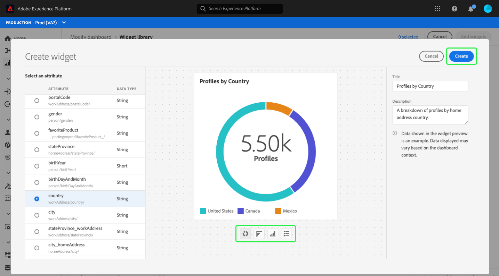

# ダッシュボードのカスタムウィジェットの作成

Adobe Experience Platformでは、複数のダッシュボードを使用して、組織のデータを表示し、操作できます。 また、ダッシュボードビューに新しいウィジェットを追加することで、特定のダッシュボードを更新することもできます。 Adobeが提供する標準ウィジェットに加えて、カスタムウィジェットを作成して組織全体で共有することもできます。

このガイドでは、Platform UIの[!UICONTROL Profiles]、[!UICONTROL Segments]、[!UICONTROL Destinations]ダッシュボードにカスタムウィジェットを作成して追加する手順を順を追って説明します。

標準ウィジェットの詳細については、[ダッシュボードへの標準ウィジェットの追加](standard-widgets.md)のガイドを参照してください。

>[!NOTE]
>
>[!UICONTROL ライセンスの使用]ダッシュボードに表示されるウィジェットはカスタマイズできません。 この一意のダッシュボードの詳細については、[ライセンス使用状況ダッシュボードのドキュメント](../guides/license-usage.md)を参照してください。

## ウィジェットライブラリ {#widget-library}

このガイドでは、Experience Platform内で[!UICONTROL Widgetライブラリ]にアクセスする必要があります。 ウィジェットライブラリの詳細とUI内でのアクセス方法については、まず[ウィジェットライブラリの概要](widget-library.md)を読んでください。

## カスタムウィジェットの概要

ウィジェットライブラリ内の「**[!UICONTROL カスタム]**」タブでは、ウィジェットを作成し、組織内の他のユーザーと共有して、ダッシュボードの外観をカスタマイズできます。

>[!IMPORTANT]
>
>組織はウィジェットライブラリに最大20個のカスタムウィジェットを作成できます。

「**[!UICONTROL カスタム]**」タブを選択してカスタムウィジェットの作成を開始するか、組織が既に作成したカスタムウィジェットを表示します。

## カスタムウィジェットの作成

カスタムウィジェットを作成するには、ウィジェットライブラリの右上隅にある「**[!UICONTROL ウィジェットを作成]**」を選択します。組織で最初のカスタムウィジェットの場合は、ウィジェットライブラリの中央から「**[!UICONTROL 作成]**」を選択します。

**[!UICONTROL ウィジェット]**&#x200B;を作成ダイアログで、新しいウィジェットのタイトルと説明を入力し、ウィジェットに表示する属性を選択します。

>[!NOTE]
>
>使用可能な属性のリストは、組織に対して設定されているスキーマによって異なります。 属性の選択とスキーマの設定について詳しくは、[カスタムウィジェットを作成するためのスキーマの編集](edit-schema.md)に関するガイドを参照してください。

属性を選択するには、追加する属性の横にあるラジオボタンを選択します。

>[!NOTE]
>
>ウィジェットごとに1つの属性のみを選択でき、属性ごとに1つのウィジェットのみを作成できます。 属性に対してウィジェットが既に作成されている場合は、その属性が灰色表示に表示されます。

## ビジュアライゼーションの選択

属性を選択すると、新しいウィジェットのプレビューがダイアログに表示されます。 人工知能は、属性データに最適なビジュアライゼーションを自動的に選択し、手動で選択できる追加のビジュアライゼーションオプションを提供するために使用されます。

属性に応じて、AIでは様々なビジュアライゼーションオプションを推奨しています。 ビジュアライゼーションの完全なリストには、次のものが含まれます。

* 横棒グラフ：横線は値を表します。
* 縦棒グラフ：縦線は値を表します。
* ドーナツグラフ：円グラフと同様に、値は全体の一部または一部として表示されます。
* 散布図：横軸と縦軸を使用して値を示します。
* 折れ線グラフ：値は、一定期間の変化を示すために1行で表示されます。
* 番号カード：単一のキー値を表す数値の概要を表示します。
* データテーブル：値はテーブルに行として表示されます。

>[!NOTE]
>
>現在、すべての属性でサポートされている指標はプロファイル数のみです。
>
>サンプルウィジェットに表示されるデータは説明用です。 プレビューには、組織の実際のデータは表示されません。

新しいウィジェットを保存し、「[!UICONTROL カスタム]」タブに戻るには、「**[!UICONTROL 作成]**」を選択します。

これで、ライブラリからウィジェットを選択し、「**[!UICONTROL ウィジェットを追加]**」を選択して、新しいウィジェットをダッシュボードに追加できます。

## カスタムウィジェットの非表示

ウィジェットをライブラリに追加した後、ウィジェットカードの省略記号(`...`)を選択し、「**[!UICONTROL ウィジェットを非表示]**」を選択して、ウィジェットを非表示にすることができます。 同じドロップダウンからウィジェットをプレビューして編集することもできます。

非表示になっているウィジェットを表示するには、ウィジェットライブラリの右上隅にある「**[!UICONTROL 非表示のウィジェットを表示]**」を選択します。

>[!WARNING]
>
>ライブラリでウィジェットを非表示にしても、個々のユーザーのダッシュボードからはウィジェットが削除されません。 ウィジェットを組織で使用しなくなった場合は、すべてのPlatformユーザーがダッシュボードからウィジェットを削除する必要があるので、必ず直接この情報を伝えてください。

## カスタムウィジェットの編集

ウィジェットカードの省略記号(`...`)を選択し、ドロップダウンメニューから「**[!UICONTROL 編集]**」を選択すると、ウィジェットライブラリでカスタムウィジェットを編集できます。

**[!UICONTROL 編集ウィジェット]**&#x200B;ダイアログで、ウィジェットのタイトルと説明を編集し、様々なビジュアライゼーションをプレビューして選択できます。 編集が完了したら、「**[!UICONTROL 保存]**」を選択して変更を保存し、「カスタムウィジェット」タブに戻ります。

>[!WARNING]
>
>ライブラリでウィジェットを編集しても、個々のユーザーのウィジェットは更新されません。 ウィジェットが更新された場合は、古いウィジェットをダッシュボードから削除し、更新されたウィジェットをウィジェットライブラリから選択して追加する必要があるので、必ずPlatformのすべてのユーザーに直接伝えてください。

## 次の手順

このドキュメントを読んだ後、ウィジェットライブラリにアクセスし、それを使用して組織のカスタムウィジェットを作成し、追加することができます。 ダッシュボードに表示されるウィジェットのサイズと場所を変更するには、[変更ダッシュボードガイド](modify.md)を参照してください。
