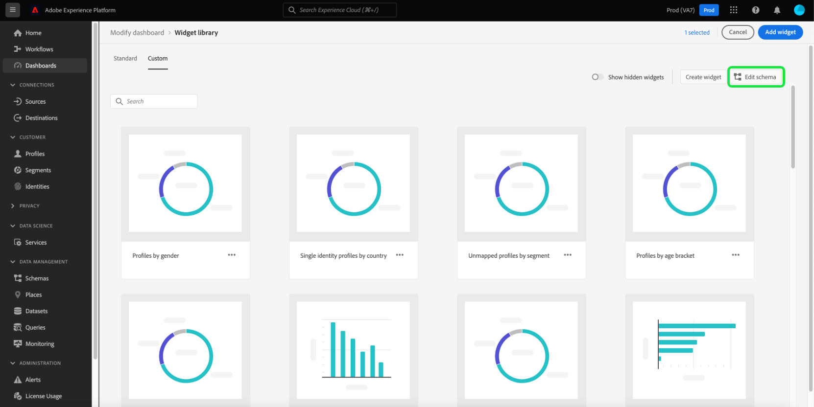

# スキーマを編集してカスタムウィジェットを作成する

Adobe Experience Platformダッシュボードのカスタムウィジェットを作成するには、まずウィジェットのベースとなるリアルタイム顧客プロファイル属性を特定する必要があります。

このガイドでは、カスタムダッシュボードウィジェットを作成するために属性を選択して組織のスキーマを編集する手順を順を追って説明します。

属性を選択し、スキーマを設定したら、[ダッシュボードのカスタムウィジェット](custom-widgets.md)の作成手順に進むことができます。

>[!NOTE]
>
>スキーマを編集するには、ユーザーに「標準ダッシュボードの管理」権限が付与されている必要があります。 ダッシュボードのアクセス権限の付与手順については、[ダッシュボード権限のガイド](../permissions.md)を参照してください。

## ウィジェットライブラリ {#widget-library}

このガイドでは、Experience Platform内で[!UICONTROL Widgetライブラリ]にアクセスする必要があります。 ウィジェットライブラリの詳細とUI内でのアクセス方法については、まず[ウィジェットライブラリの概要](widget-library.md)を読んでください。

## スキーマの編集

ウィジェットライブラリ内の「**[!UICONTROL カスタム]**」タブでは、ウィジェットを作成し、組織内の他のユーザーと共有して、ダッシュボードの外観をカスタマイズできます。

カスタムウィジェットを作成する前に、リアルタイム顧客プロファイル属性を選択して、データが日別スナップショットの一部として含まれるようにする必要があります。

>[!IMPORTANT]
>
>組織は、最大20個の属性を選択できます。

組織でプロファイル属性を選択していない場合は、まずウィジェットライブラリの右上隅にある「**[!UICONTROL スキーマを編集]**」を選択します。

1つ以上のカスタム属性が作成されたら、「**[!UICONTROL スキーマを編集]**」を選択して、選択した属性を表示し、さらに追加します。

## 属性の選択

**[!UICONTROL 和集合スキーマフィールド]**&#x200B;を選択ダイアログで属性を選択するには、和集合スキーマの属性に移動し（または検索を使用）、属性の横にあるチェックボックスを選択します。 チェックボックスを選択すると、ダイアログの右側にある「**[!UICONTROL 選択した属性]**」リストに属性も追加されます。

>[!NOTE]
>
>属性を選択用に表示するには、次のいずれかにする必要があります。文字列、日付、日付 — 時刻、ブール値、短い、長い、整数、バイトのいずれかです。 MapおよびDoubleデータ型はサポートされておらず、選択できないようにグレー表示されます。

追加する属性を選択したら、「**[!UICONTROL 保存]**」を選択して属性を保存し、「カスタムウィジェット」タブに戻ります。

>[!WARNING]
>新しく選択した属性は、データが更新される次の日次スナップショットの後に使用可能になります。

## 次の手順

このガイドを読んだ後、ウィジェットライブラリに移動し、リアルタイム顧客プロファイル属性を選択してスキーマを設定できます。 プロファイル属性を選択した状態で、[ダッシュボードのカスタムウィジェット](custom-widgets.md)の作成を開始できます。